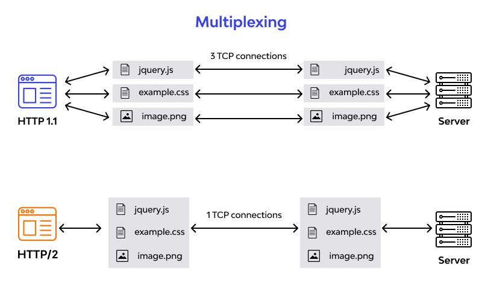
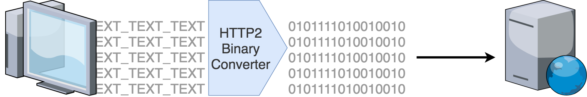
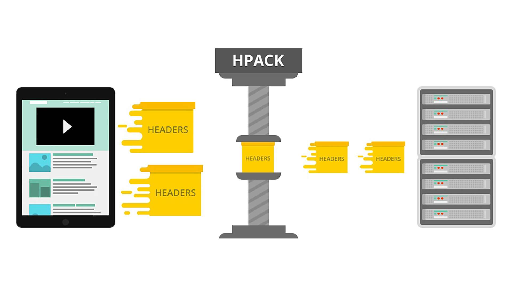
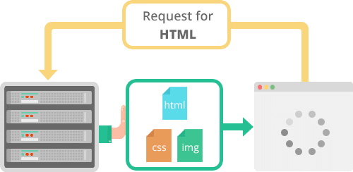

# <center><font face="黑体" font color=SeaGreen >HTTP学习笔记</font></center>
<center><font face="楷体" size =5 >Jaren</font></center> 

## 一、HTTP/HTTPS 简介
HTTP 协议是 Hyper Text Transfer Protocol（超文本传输协议）的缩写，是用于从万维网（ WWW:World Wide Web ）服务器传输超文本到本地浏览器的传送协议。

HTTP 是一个基于 TCP/IP 通信协议来传递数据（HTML 文件、图片文件、查询结果等）。

HTTPS 协议是 HyperText Transfer Protocol Secure（超文本传输安全协议）的缩写，是一种通过计算机网络进行安全通信的传输协议。

HTTPS 经由 HTTP 进行通信，但利用 SSL/TLS 来加密数据包，HTTPS 开发的主要目的，是提供对网站服务器的身份认证，保护交换资料的隐私与完整性。

HTTP 的 URL 是由 `http://` 起始与默认使用端口 **80**，而 HTTPS 的 URL 则是由 `https://` 起始与默认使用端口 **443**。


### HTTP 工作原理
HTTP 协议工作于客户端-服务端架构上。

浏览器作为 HTTP 客户端通过 URL 向 HTTP 服务端即 WEB 服务器发送所有请求。

Web 服务器有：Apache 服务器，IIS 服务器（Internet Information Services）等。

Web 服务器根据接收到的请求后，向客户端发送响应信息。

HTTP 默认端口号为 80，但是你也可以改为 8080 或者其他端口。
#### HTTP 三点注意事项：
- **HTTP 是无连接的**：无连接的含义是限制每次连接只处理一个请求，服务器处理完客户的请求，并收到客户的应答后，即断开连接，采用这种方式可以节省传输时间。

- **HTTP 是媒体独立的**：这意味着，只要客户端和服务器知道如何处理的数据内容，任何类型的数据都可以通过HTTP发送，客户端以及服务器指定使用适合的 MIME-type 内容类型。

- **HTTP 是无状态的**：HTTP 协议是无状态协议，无状态是指协议对于事务处理没有记忆能力，缺少状态意味着如果后续处理需要前面的信息，则它必须重传，这样可能导致每次连接传送的数据量增大，另一方面，在服务器不需要先前信息时它的应答就较快。

以下图表展示了 HTTP 协议通信流程：


### HTTPS 作用
HTTPS 的主要作用是在不安全的网络上创建一个安全信道，并可在使用适当的加密包和服务器证书可被验证且可被信任时，对窃听和中间人攻击提供合理的防护。

HTTPS 的信任基于预先安装在操作系统中的证书颁发机构（CA）。

因此，与一个网站之间的 HTTPS 连线仅在这些情况下可被信任：

- 浏览器正确地实现了 HTTPS 且操作系统中安装了正确且受信任的证书颁发机构；
- 证书颁发机构仅信任合法的网站；
- 被访问的网站提供了一个有效的证书，也就是说它是一个由操作系统信任的证书颁发机构签发的（大部分浏览器会对无效的证书发出警告）；
- 该证书正确地验证了被访问的网站（例如，访问 `https://www.baidu.com` 时收到了签发给 `www.baidu.com` 而不是其它域名的证书）；
- 此协议的加密层（SSL/TLS）能够有效地提供认证和高强度的加密。

## 二、HTTP 消息结构
HTTP是基于客户端/服务端（C/S）的架构模型，通过一个可靠的链接来交换信息，是一个无状态的请求/响应协议。

一个HTTP"客户端"是一个应用程序（Web浏览器或其他任何客户端），通过连接到服务器达到向服务器发送一个或多个HTTP的请求的目的。

一个HTTP"服务器"同样也是一个应用程序（通常是一个Web服务，如Apache Web服务器或IIS服务器等），通过接收客户端的请求并向客户端发送HTTP响应数据。

HTTP使用统一资源标识符（Uniform Resource Identifiers, URI）来传输数据和建立连接。

一旦建立连接后，数据消息就通过类似Internet邮件所使用的格式[RFC5322]和多用途Internet邮件扩展（MIME）[RFC2045]来传送。

### 客户端请求消息
客户端发送一个HTTP请求到服务器的请求消息包括以下格式：请求行（request line）、请求头部（header）、空行和请求数据四个部分组成，下图给出了请求报文的一般格式。


### 服务器响应消息
HTTP响应也由四个部分组成，分别是：状态行、消息报头、空行和响应正文。


下面实例是一点典型的使用GET来传递数据的实例：

客户端请求：
```
GET /hello.txt HTTP/1.1
User-Agent: curl/7.16.3 libcurl/7.16.3 OpenSSL/0.9.7l zlib/1.2.3
Host: www.example.com
Accept-Language: en, mi

```
服务端响应:
```
HTTP/1.1 200 OK
Date: Mon, 27 Jul 2009 12:28:53 GMT
Server: Apache
Last-Modified: Wed, 22 Jul 2009 19:15:56 GMT
ETag: "34aa387-d-1568eb00"
Accept-Ranges: bytes
Content-Length: 51
Vary: Accept-Encoding
Content-Type: text/plai
```
输出结果：
`Hello World! My payload includes a trailing CRLF.`

## 三、HTTP 请求方法
根据 HTTP 标准，HTTP 请求可以使用多种请求方法。
|方法|	描述|
|:-|:-|
|GET|	请求指定的页面信息，并返回实体主体。|
|HEAD|	类似于 GET 请求，只不过返回的响应中没有具体的内容，用于获取报头|
|POST|	向指定资源提交数据进行处理请求（例如提交表单或者上传文件）。数据被包含在请求体中。POST 请求可能会导致新的资源的建立和/或已有资源的修改。|
|PUT|	从客户端向服务器传送的数据取代指定的文档的内容。|
|DELETE|	请求服务器删除指定的页面。|
|CONNECT|	HTTP/1.1 协议中预留给能够将连接改为管道方式的代理服务器。|
|OPTIONS|	允许客户端查看服务器的性能。|
|TRACE|	回显服务器收到的请求，主要用于测试或诊断。|
|PATCH|	是对 PUT 方法的补充，用来对已知资源进行局部更新 。|

## 四、HTTP 响应头信息
HTTP请求头提供了关于请求，响应或者其他的发送实体的信息。
|应答头|	说明|
|:-|:-|
|Allow	|服务器支持哪些请求方法（如GET、POST等）。|
|Content-Encoding	|文档的编码（Encode）方法。只有在解码之后才可以得到Content-Type头指定的内容类型。利用gzip压缩文档能够显著地减少HTML文档的下载时间。Java的GZIPOutputStream可以很方便地进行gzip压缩，但只有Unix上的Netscape和Windows上的IE 4、IE 5才支持它。因此，Servlet应该通过查看Accept-Encoding头（即request.getHeader("Accept-Encoding")）检查浏览器是否支持gzip，为支持gzip的浏览器返回经gzip压缩的HTML页面，为其他浏览器返回普通页面。|
|Content-Length	|表示内容长度。只有当浏览器使用持久HTTP连接时才需要这个数据。如果你想要利用持久连接的优势，可以把输出文档写入 ByteArrayOutputStream，完成后查看其大小，然后把该值放入Content-Length头，最后通过byteArrayStream.writeTo(response.getOutputStream())发送内容。|
|Content-Type|	表示后面的文档属于什么MIME类型。Servlet默认为text/plain，但通常需要显式地指定为text/html。由于经常要设置Content-Type，因此HttpServletResponse提供了一个专用的方法setContentType。|
|Date|	当前的GMT时间。你可以用setDateHeader来设置这个头以避免转换时间格式的麻烦。|
|Expires|	应该在什么时候认为文档已经过期，从而不再缓存它？|
|Last-Modified|	文档的最后改动时间。客户可以通过If-Modified-Since请求头提供一个日期，该请求将被视为一个条件GET，只有改动时间迟于指定时间的文档才会返回，否则返回一个304（Not Modified）状态。Last-Modified也可用setDateHeader方法来设置。|
|Location|	表示客户应当到哪里去提取文档。Location通常不是直接设置的，而是通过HttpServletResponse的sendRedirect方法，该方法同时设置状态代码为302。|
|Refresh|	表示浏览器应该在多少时间之后刷新文档，以秒计。除了刷新当前文档之外，你还可以通过`setHeader("Refresh", "5; URL=http://host/path")`让浏览器读取指定的页面。注意这种功能通常是通过设置HTML页面HEAD区的`＜META HTTP-EQUIV="Refresh" CONTENT="5;URL=http://host/path"＞`实现，这是因为，自动刷新或重定向对于那些不能使用CGI或Servlet的HTML编写者十分重要。但是，对于Servlet来说，直接设置Refresh头更加方便。注意Refresh的意义是"N秒之后刷新本页面或访问指定页面"，而不是"每隔N秒刷新本页面或访问指定页面"。因此，连续刷新要求每次都发送一个Refresh头，而发送204状态代码则可以阻止浏览器继续刷新，不管是使用Refresh头还是＜META HTTP-EQUIV="Refresh" ...＞。注意Refresh头不属于HTTP 1.1正式规范的一部分，而是一个扩展，但Netscape和IE都支持它。|
|Server	|服务器名字。Servlet一般不设置这个值，而是由Web服务器自己设置。|
|Set-Cookie	|设置和页面关联的Cookie。Servlet不应使用response.setHeader("Set-Cookie", ...)，而是应使用HttpServletResponse提供的专用方法addCookie。|
|WWW-Authenticate|	客户应该在Authorization头中提供什么类型的授权信息？在包含401（Unauthorized）状态行的应答中这个头是必需的。例如，response.setHeader("WWW-Authenticate", "BASIC realm=＼"executives＼"")。注意：Servlet一般不进行这方面的处理，而是让Web服务器的专门机制来控制受密码保护页面的访问（例如.htaccess）。|

## 五、HTTP 状态码
当浏览者访问一个网页时，浏览者的浏览器会向网页所在服务器发出请求。当浏览器接收并显示网页前，此网页所在的服务器会返回一个包含 HTTP 状态码的信息头（server header）用以响应浏览器的请求。

HTTP 状态码的英文为 **HTTP Status Code**。
下面是常见的 HTTP 状态码：

- 200 - 请求成功
- 301 - 资源（网页等）被永久转移到其它URL
- 404 - 请求的资源（网页等）不存在
- 500 - 内部服务器错误

### HTTP 状态码分类
HTTP 状态码由三个十进制数字组成，第一个十进制数字定义了状态码的类型。响应分为五类：
1. 信息响应(100–199)
2. 成功响应(200–299)
3. 重定向(300–399)
4. 客户端错误(400–499)
5. 服务器错误 (500–599)

|分类|	分类描述|
|:-|:-|
|1**|	信息，服务器收到请求，需要请求者继续执行操作|
|2**|	成功，操作被成功接收并处理|
|3**|	重定向，需要进一步的操作以完成请求|
|4**|	客户端错误，请求包含语法错误或无法完成请求|
|5**|	服务器错误，服务器在处理请求的过程中发生了错误|

HTTP状态码列表:
|状态码|	状态码英文名称|	中文描述|
|:-|:-|:-|
|100|	Continue|	继续。客户端应继续其请求|
|101|	Switching Protocols|	切换协议。服务器根据客户端的请求切换协议。只能切换到更高级的协议，例如，切换到HTTP的新版本协议|
|200|	OK|	请求成功。一般用于GET与POST请求|
|201|	Created|	已创建。成功请求并创建了新的资源|
|202|	Accepted|	已接受。已经接受请求，但未处理完成|
|203|	Non-Authoritative Information|	非授权信息。请求成功。但返回的meta信息不在原始的服务器，而是一个副本|
|204|	No Content|	无内容。服务器成功处理，但未返回内容。在未更新网页的情况下，可确保浏览器继续显示当前文档|
|205|	Reset Content|	重置内容。服务器处理成功，用户终端（例如：浏览器）应重置文档视图。可通过此返回码清除浏览器的表单域|
|206|	Partial Content|	部分内容。服务器成功处理了部分GET请求|
|300	|Multiple Choices	|多种选择。请求的资源可包括多个位置，相应可返回一个资源特征与地址的列表用于用户终端（例如：浏览器）选择|
|301	|Moved Permanently	|永久移动。请求的资源已被永久的移动到新URI，返回信息会包括新的URI，浏览器会自动定向到新URI。今后任何新的请求都应使用新的URI代替|
|302|	Found|	临时移动。与301类似。但资源只是临时被移动。客户端应继续使用原有URI|
|303|	See Other|	查看其它地址。与301类似。使用GET和POST请求查看|
|304|	Not Modified|	未修改。所请求的资源未修改，服务器返回此状态码时，不会返回任何资源。客户端通常会缓存访问过的资源，通过提供一个头信息指出客户端希望只返回在指定日期之后修改的资源|
|305	|Use Proxy|	使用代理。所请求的资源必须通过代理访问|
|306|	Unused|	已经被废弃的HTTP状态码|
|307|	Temporary Redirect|	临时重定向。与302类似。使用GET请求重定向|
|400|	Bad Request|	客户端请求的语法错误，服务器无法理解|
|401|	Unauthorized|	请求要求用户的身份认证|
|402|	Payment Required|	保留，将来使用|
|403|	Forbidden|	服务器理解请求客户端的请求，但是拒绝执行此请求|
|404|	Not Found|	服务器无法根据客户端的请求找到资源（网页）。通过此代码，网站设计人员可设置"您所请求的资源无法找到"的个性页面|
|405|	Method Not Allowed|	客户端请求中的方法被禁止|
|406|	Not Acceptable|	服务器无法根据客户端请求的内容特性完成请求|
|407|	Proxy Authentication Required|	请求要求代理的身份认证，与401类似，但请求者应当使用代理进行授权|
|408|	Request Time-out|	服务器等待客户端发送的请求时间过长，超时|
|409|	Conflict|	服务器完成客户端的 PUT 请求时可能返回此代码，服务器处理请求时发生了冲突|
|410|	Gone|	客户端请求的资源已经不存在。410不同于404，如果资源以前有现在被永久删除了可使用410代码，网站设计人员可通过301代码指定资源的新位置|
|411|	Length Required	|服务器无法处理客户端发送的不带Content-Length的请求信息|
|412|	Precondition Failed|	客户端请求信息的先决条件错误|
|413|	Request Entity Too Large|	由于请求的实体过大，服务器无法处理，因此拒绝请求。为防止客户端的连续请求，服务器可能会关闭连接。如果只是服务器暂时无法处理，则会包含一个Retry-After的响应信息|
|414|	Request-URI Too Large|	请求的URI过长（URI通常为网址），服务器无法处理|
|415|	Unsupported Media Type|	服务器无法处理请求附带的媒体格式|
|416|	Requested range not satisfiable|	客户端请求的范围无效|
|417|	Expectation Failed|	服务器无法满足Expect的请求头信息|
|500|	Internal Server Error|	服务器内部错误，无法完成请求|
|501|	Not Implemented|	服务器不支持请求的功能，无法完成请求|
|502|	Bad Gateway	|作为网关或者代理工作的服务器尝试执行请求时，从远程服务器接收到了一个无效的响应|
|503|	Service Unavailable|	由于超载或系统维护，服务器暂时的无法处理客户端的请求。延时的长度可包含在服务器的Retry-After头信息中|
|504|	Gateway Time-out|	充当网关或代理的服务器，未及时从远端服务器获取请求|
|505|	HTTP Version not supported|	服务器不支持请求的HTTP协议的版本，无法完成处理|

## 六、HTTP content-type
Content-Type（内容类型），一般是指网页中存在的 Content-Type，用于定义网络文件的类型和网页的编码，决定浏览器将以什么形式、什么编码读取这个文件，这就是经常看到一些 PHP 网页点击的结果却是下载一个文件或一张图片的原因。

Content-Type 标头告诉客户端实际返回的内容的内容类型。
语法格式：
```
Content-Type: text/html; charset=utf-8
Content-Type: multipart/form-data; boundary=something
```
实例：

常见的媒体格式类型如下：
- text/html ： HTML格式
- text/plain ：纯文本格式
- text/xml ： XML格式
- image/gif ：gif图片格式
- image/jpeg ：jpg图片格式
- image/png：png图片格式

以application开头的媒体格式类型：
- application/xhtml+xml ：XHTML格式
- application/xml： XML数据格式
- application/atom+xml ：Atom XML聚合格式
- application/json： JSON数据格式
- application/pdf：pdf格式
- application/msword ： Word文档格式
- application/octet-stream ： 二进制流数据（如常见的文件下载）
- application/x-www-form-urlencoded ： `<form encType=””>`中默认的encType，form表单数据被编码为key/value格式发送到服务器（表单默认的提交数据的格式）

另外一种常见的媒体格式是上传文件之时使用的：

- multipart/form-data ： 需要在表单中进行文件上传时，就需要使用该格式

### HTTP content-type 对照表


## 七、MIME 类型
MIME (Multipurpose Internet Mail Extensions) 是描述消息内容类型的标准，用来表示文档、文件或字节流的性质和格式。

MIME 消息能包含文本、图像、音频、视频以及其他应用程序专用的数据。

浏览器通常使用 MIME 类型（而不是文件扩展名）来确定如何处理URL，因此 We b服务器在响应头中添加正确的 MIME 类型非常重要。如果配置不正确，浏览器可能会无法解析文件内容，网站将无法正常工作，并且下载的文件也会被错误处理。
语法
MIME 类型通用结构：
`type/subtype`
MIME 的组成结构非常简单，由类型与子类型两个字符串中间用 `/` 分隔而组成，不允许有空格。type 表示可以被分多个子类的独立类别，subtype 表示细分后的每个类型。
MIME类型对大小写不敏感，但是传统写法都是小写。
两种主要的 MIME 类型在默认类型中扮演了重要的角色：
- `text/plain` 表示文本文件的默认值。
- `application/octet-stream` 表示所有其他情况的默认值。

### 常见的 MIME 类型
- 超文本标记语言文本 .html、.html：`text/html`
- 普通文本 .txt： `text/plain`
- RTF 文本 .rtf： `application/rtf`
- GIF 图形 .gif： `image/gif`
- JPEG 图形 .jpeg、.jpg： `image/jpeg`
- au 声音文件 .au： `audio/basic`
- MIDI 音乐文件 mid、.midi： `audio/midi`、`audio/x-midi`
- RealAudio 音乐文件 .ra、.ram： `audio/x-pn-realaudio`
- MPEG 文件 .mpg、.mpeg： `video/mpeg`
- AVI 文件 .avi： `video/x-msvideo`
- GZIP 文件 .gz： `application/x-gzip`
- TAR 文件 .tar： `application/x-tar`

|类型|	描述|	典型示例|
|:-|:-|:-|
|text|	表明文件是普通文本，理论上是人类可读|	text/plain, text/html, text/css, text/javascript|
|image|	表明是某种图像。不包括视频，但是动态图（比如动态gif）也使用image类型|	image/gif, image/png, image/jpeg, image/bmp, image/webp, image/x-icon, image/vnd.microsoft.icon|
|audio|	表明是某种音频文件|	audio/midi, audio/mpeg, audio/webm, audio/ogg, audio/wav|
|video|	表明是某种视频文件|	video/webm, video/ogg|
|application|	表明是某种二进制数据|	application/octet-stream, application/pkcs12, application/vnd.mspowerpoint, application/xhtml+xml, application/xml,  application/pdf|

## 八、HTTP2
HTTP/2（超文本传输协议第2版，最初命名为HTTP 2.0），简称为h2（基于TLS/1.2或以上版本的加密连接）或h2c（非加密连接）， HTTP/2 是 HTTP 协议的第二个主要版本，用于在 Web 服务器和客户端之间传输数据。

HTTP/2 是 HTTP 协议自 1999 年 HTTP 1.1 的改进版 RFC 发布后的首个更新，主要基于 SPDY 协议。

多数主流浏览器已经在 2015 年底支持了该协议。

HTTP/2是一种网络协议，是HTTP/1.1的升级版，由IETF在2015年发布。HTTP/2旨在提高Web性能，减少延迟，增加安全性，使Web应用更加快速、高效和可靠。

### HTTP/2 特点
下面是 HTTP/2 的一些特点和改进之处：

- 多路复用：HTTP/2 允许同时发送多个请求和响应，而不是像 HTTP/1.1 一样只能一个一个地处理。这样可以减少延迟，提高效率，提高网络吞吐量。

- 二进制传输：HTTP/2 使用二进制协议，与 HTTP/1.1 使用的文本协议不同。二进制协议可以更快地解析，更有效地传输数据，减少了传输过程中的开销和延迟。

- 头部压缩：HTTP/2 使用 HPACK 算法对 HTTP 头部进行压缩，减少了头部传输的数据量，从而减少了网络延迟。

- 服务器推送：HTTP/2 支持服务器推送，允许服务器在客户端请求之前推送资源，以提高性能。

- 改进的安全性：HTTP/2 默认使用 TLS（Transport Layer Security）加密传输数据，提高了安全性。

- 兼容 HTTP/1.1：HTTP/2 可以与 HTTP/1.1 共存，服务器可以同时支持 HTTP/1.1 和 HTTP/2。如果客户端不支持 HTTP/2，服务器可以回退到 HTTP/1.1。

总的来说，HTTP/2在性能、安全性和可用性方面都有显著的改进，可以使 Web 应用更加快速、高效和可靠。

对数据传输采用多路复用，让多个请求合并在同一 TCP 连接内，如下图所示：

HTTP/2 减少网络延迟，提高浏览器的页面加载速度：

HTTP/2 使用二进制格式来传输数据，而不是像 HTTP/1.1 一样使用文本格式。这提高了效率并降低了数据传输的延迟。

HTTP/2 使用头部压缩来减少传输数据的大小。这有助于减少网络带宽的使用量，并提高页面加载速度。

HTTP/2 允许服务器在不被请求的情况下主动向客户端发送数据。这有助于减少请求延迟，并提高页面加载速度。



