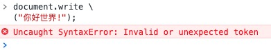

# <center><font face="黑体" font color=SeaGreen >JavaScript学习笔记</font></center>
<center><font face="楷体" size =5 >Jaren</font></center> 

[JavaScript 保留关键字](https://www.runoob.com/js/js-reserved.html)<br>
[JavaScript 代码规范](https://www.runoob.com/js/js-conventions.html)<br>
## 一、JavaScript 用法
HTML 中的 Javascript 脚本代码必须位于 `<script>` 与 `</script>` 标签之间。

Javascript 脚本代码可被放置在 HTML 页面的 `<body>` 和 `<head>` 部分中。

### `<script>` 标签
如需在 HTML 页面中插入 JavaScript，请使用 `<script>` 标签。

`<script>` 和 `</script>` 会告诉 JavaScript 在何处开始和结束。

`<script>` 和 `</script>` 之间的代码行包含了 JavaScript

```
<script>
alert("我的第一个 JavaScript");
</script>
```

>  那些老旧的实例可能会在   `<script>` 标签中使用 `type="text/javascript" ` 。现在已经不必这样做了。JavaScript 是所有现代浏览器以及 HTML5 中的默认脚本语言。

### 外部的 JavaScript
也可以把脚本保存到外部文件中。外部文件通常包含被多个网页使用的代码。

外部 JavaScript 文件的文件扩展名是 .js。
如需使用外部文件，请在 `<script>` 标签的 `"src"` 属性中设置该 .js 文件：
```
<!DOCTYPE html>
<html>
<body>
<script src="myScript.js"></script>
</body>
</html>
```
- 你可以将脚本放置于 `<head>` 或者 `<body>`中，放在 `<script>` 标签中的脚本与外部引用的脚本运行效果完全一致。

- 外部脚本不能包含 `<script>` 标签。

### Chrome 浏览器中执行 JavaScript
https://www.runoob.com/js/js-chrome.html

## 二、JavaScript 输出
JavaScript 没有任何打印或者输出的函数。
### JavaScript 显示数据
JavaScript 可以通过不同的方式来输出数据：

- 使用 window.alert() 弹出警告框。
- 使用 document.write() 方法将内容写到 HTML 文档中。
- 使用 innerHTML 写入到 HTML 元素。
- 使用 console.log() 写入到浏览器的控制台。

### 使用 window.alert()
你可以弹出警告框来显示数据：
```
<!DOCTYPE html>
<html>
<body>
<h1>我的第一个页面</h1><p>我的第一个段落。</p>
	
<script>window.alert(5 + 6);
</script>

</body>
</html>
```


### 操作 HTML 元素
如需从 JavaScript 访问某个 HTML 元素，您可以使用 `document.getElementById(id)` 方法。

请使用 "id" 属性来标识 HTML 元素，并 innerHTML 来获取或插入元素内容：
```
<!DOCTYPE html><html>
<body>

<h1>我的第一个 Web 页面</h1>

	<p id="demo">我的第一个段落</p>

<script>
	document.getElementById("demo").innerHTML = "段落已修改。";
</script>

</body>
</html>
```
以上 JavaScript 语句（在 `<script>` 标签中）可以在 web 浏览器中执行：

`document.getElementById("demo")` 是使用 id 属性来查找 HTML 元素的 JavaScript 代码 。

`innerHTML = "段落已修改。" `是用于修改元素的 HTML 内容(innerHTML)的 JavaScript 代码。


### 写到 HTML 文档
出于测试目的，您可以将JavaScript直接写在HTML 文档中：
```
<!DOCTYPE html><html>
<body><h1>我的第一个 Web 页面</h1>
	<p>我的第一个段落。</p>
	<script>document.write(Date());
</script>

</body>
</html>
```

	
使用 document.write() 可以向文档写入内容。

如果在文档已完成加载后执行 document.write，整个 HTML 页面将被覆盖。
```
<!DOCTYPE html>
<html>
<body>
<h1>我的第一个 Web 页面</h1>
<p>我的第一个段落。</p>
<button onclick="myFunction()">点我</button>
<script>
function myFunction() {
   	document.write(Date());
}
</script>
</body>
</html>
```
实例：

点击后：


### 写到控制台
如果您的浏览器支持调试，你可以使用 console.log() 方法在浏览器中显示 JavaScript 值。

浏览器中使用 F12 来启用调试模式， 在调试窗口中点击 "Console" 菜单。

```
<!DOCTYPE html>
<html>
<body>
<h1>我的第一个 Web 页面</h1>
<script>
a = 5;
b = 6;
c = a + b;
console.log(c);
</script>

</body>
</html>
```


## 三、JavaScript 语法
JavaScript 是一个程序语言。语法规则定义了语言结构。
### JavaScript 语法
JavaScript 是一个脚本语言。

它是一个轻量级，但功能强大的编程语言。
### JavaScript 字面量
在编程语言中，一般固定值称为字面量，如 3.14。

**数字（Number）字面量** 可以是整数或者是小数，或者是科学计数(e)。
```
3.14
1001
123e5
```

**字符串（String）字面量** 可以使用单引号或双引号:
```
"John Doe"
'John Doe'
```

**表达式字面量** 用于计算：
```
5 + 6
5 * 10
```

**数组（Array）字面量** 定义一个数组：
`[40, 100, 1, 5, 25, 10]`


**对象（Object）字面量** 定义一个对象：
`{firstName:"John", lastName:"Doe", age:50, eyeColor:"blue"}`

**函数（Function）字面量** 定义一个函数：
`function myFunction(a, b) { return a * b;}`

### JavaScript 变量
在编程语言中，变量用于存储数据值。

JavaScript 使用关键字 `var` 来定义变量， 使用等号来为变量赋值：
```
var x, lengthx = 5
length = 6
```
- 变量可以通过变量名访问。在指令式语言中，变量通常是可变的。字面量是一个恒定的值。

- 变量是一个名称。字面量是一个值。

### JavaScript 操作符
JavaScript使用 **算术运算符** 来计算值
`(5 + 6) * 10`

JavaScript使用 **赋值运算符** 给变量赋值：
```
x = 5
y = 6
z = (x + y) * 10
```
JavaScript语言有多种类型的运算符：
|类型	|实例	|描述|
|:-|:-|:-|
|赋值，算术和位运算符|	=  +  -  *  /	|在 JS 运算符中描述|
|条件，比较及逻辑运算符|	==  != <  > 	|在 JS 比较运算符中描述|

### JavaScript 语句
在 HTML 中，JavaScript 语句用于向浏览器发出命令。

语句是用分号分隔：
```
x = 5 + 6;
y = x * 10;
```

### JavaScript 关键字
JavaScript 关键字用于标识要执行的操作。

和其他任何编程语言一样，JavaScript 保留了一些关键字为自己所用。

var 关键字告诉浏览器创建一个新的变量：
```
var x = 5 + 6;
var y = x * 10;
```
JavaScript 同样保留了一些关键字，这些关键字在当前的语言版本中并没有使用，但在以后 JavaScript 扩展中会用到。

以下是 JavaScript 中最​​重要的保留关键字（按字母顺序）：


### JavaScript 注释
不是所有的 JavaScript 语句都是"命令"。双斜杠 // 后的内容将会被浏览器忽略：
`// 我不会执行`
多行注释以 `/*` 开始，以 `*/` 结尾。

### JavaScript 数据类型
JavaScript 有多种数据类型：数字，字符串，数组，对象等等：
```
var length = 16;                                  // Number 通过数字字面量赋值 
var points = x * 10;                              // Number 通过表达式字面量赋值
var lastName = "Johnson";                         // String 通过字符串字面量赋值
var cars = ["Saab", "Volvo", "BMW"];              // Array  通过数组字面量赋值
var person = {firstName:"John", lastName:"Doe"};  // Object 通过对象字面量赋值
```

### JavaScript 函数
JavaScript 语句可以写在函数内，函数可以重复引用：

**引用一个函数** = 调用函数(执行函数内的语句)。
```
function myFunction(a, b) {
    return a * b;                                // 返回 a 乘以 b 的结果
}
```

### JavaScript 字母大小写
JavaScript 对大小写是敏感的。

当编写 JavaScript 语句时，请留意是否关闭大小写切换键。

函数 `getElementById` 与 `getElementbyID` 是不同的。

同样，变量 `myVariable` 与 `MyVariable` 也是不同的。

- JavaScript 中，常见的是驼峰法的命名规则，如 lastName (而不是lastname)。

### JavaScript 字符集
JavaScript 使用 Unicode 字符集。

Unicode 覆盖了所有的字符，包含标点等字符。
[Unicode 参考手册](https://www.runoob.com/charsets/ref-html-utf8.html)

## 四、JavaScript 语句
JavaScript 语句向浏览器发出的命令。语句的作用是告诉浏览器该做什么。
### JavaScript 语句
JavaScript 语句是发给浏览器的命令。

这些命令的作用是告诉浏览器要做的事情。

下面的 JavaScript 语句向 id="demo" 的 HTML 元素输出文本 "你好 Dolly" ：
`document.getElementById("demo").innerHTML = "你好 Dolly";`

### 分号 ;
分号用于分隔 JavaScript 语句。

通常我们在每条可执行的语句结尾添加分号。

使用分号的另一用处是在一行中编写多条语句。
```
a = 5;
b = 6;
c = a + b;
```

### JavaScript 代码
JavaScript 代码是 JavaScript 语句的序列。

浏览器按照编写顺序依次执行每条语句。

本例向网页输出一个标题和两个段落：


### JavaScript 代码块
JavaScript 可以分批地组合起来。

代码块以左花括号开始，以右花括号结束。

代码块的作用是一并地执行语句序列。
```
function myFunction()
{
    document.getElementById("demo").innerHTML="你好Dolly";
    document.getElementById("myDIV").innerHTML="你最近怎么样?";
}
```
### JavaScript 语句标识符
JavaScript 语句通常以一个 语句标识符 为开始，并执行该语句。

语句标识符是保留关键字不能作为变量名使用。

下表列出了 JavaScript 语句标识符 (关键字) ：


### 空格
JavaScript 会忽略多余的空格。您可以向脚本添加空格，来提高其可读性。

### 对代码行进行折行
您可以在**文本字符串**中使用反斜杠对代码行进行换行。下面的例子会正确地显示：
```
document.write("你好 \
世界!");
```
不过，不能像这样执行：
```
document.write \ 
("你好世界!");
```


- JavaScript 是脚本语言，浏览器会在读取代码时，逐行地执行脚本代码。而对于传统编程来说，会在执行前对所有代码进行编译。

## 五、JavaScript 变量
变量是用于存储信息的"容器"。

### JavaScript 变量
与代数一样，JavaScript 变量可用于存放值（比如 x=5）和表达式（比如 z=x+y）。

变量可以使用短名称（比如 x 和 y），也可以使用描述性更好的名称（比如 age, sum, totalvolume）。

变量必须以字母开头
变量也能以 $ 和 _ 符号开头（不过我们不推荐这么做）
变量名称对大小写敏感（y 和 Y 是不同的变量）
```
var x=5;
var y=6;
var z=x+y;
```

### JavaScript 数据类型
JavaScript 变量还能保存其他数据类型，比如文本值 (name="Bill Gates")。

在 JavaScript 中，类似 "Bill Gates" 这样一条文本被称为字符串。

JavaScript 变量有很多种类型，但是现在，我们只关注数字和字符串。

当您向变量分配文本值时，应该用双引号或单引号包围这个值。

当您向变量赋的值是数值时，不要使用引号。如果您用引号包围数值，该值会被作为文本来处理。
```
var pi=3.14;  
// 如果你熟悉 ES6，pi 可以使用 const 关键字，表示一个常量
// const pi = 3.14;
var person="John Doe";
var answer='Yes I am!';
```
### 声明（创建） JavaScript 变量
在 JavaScript 中创建变量通常称为"声明"变量。

我们使用 var 关键词来声明变量：
`var carname;`
变量声明之后，该变量是空的（它没有值）。

如需向变量赋值，请使用等号：
`carname="Volvo";`

不过，您也可以在声明变量时对其赋值：
`var carname="Volvo";`

### 一条语句，多个变量
您可以在一条语句中声明很多变量。该语句以 var 开头，并使用逗号分隔变量即可：
```
var lastname="Doe", age=30, job="carpenter";
```

声明也可横跨多行：
```
var lastname="Doe",
age=30,
job="carpenter";
```

一条语句中声明的多个变量不可以同时赋同一个值:
```
var x,y,z=1;
//x,y 为 undefined， z 为 1。
```
### Value = undefined
在计算机程序中，经常会声明无值的变量。未使用值来声明的变量，其值实际上是 undefined。

在执行过以下语句后，变量 carname 的值将是 undefined：
`var carname;`

### 重新声明 JavaScript 变量
如果重新声明 JavaScript 变量，该变量的值不会丢失：

在以下两条语句执行后，变量 carname 的值依然是 "Volvo"：
```
var carname="Volvo";
var carname;
```

## 六、JavaScript 数据类型
- **值类型(基本类型)：** 字符串（String）、数字(Number)、布尔(Boolean)、空（Null）、未定义（Undefined）、Symbol。
(Symbol 是 ES6 引入了一种新的原始数据类型，表示独一无二的值。)

- **引用数据类型（对象类型）：** 对象(Object)、数组(Array)、函数(Function)，还有两个特殊的对象：正则（RegExp）和日期（Date）。

### JavaScript 拥有动态类型
JavaScript 拥有动态类型。这意味着相同的变量可用作不同的类型：
```
var x;               // x 为 undefined
var x = 5;           // 现在 x 为数字
var x = "John";      // 现在 x 为字符串
```
变量的数据类型可以使用 `typeof` 操作符来查看：
```
typeof "John"                // 返回 string
typeof 3.14                  // 返回 number
typeof false                 // 返回 boolean
typeof [1,2,3,4]             // 返回 object
typeof {name:'John', age:34} // 返回 object
```

### JavaScript 字符串
字符串是存储字符（比如 "Bill Gates"）的变量。

字符串可以是引号中的任意文本。您可以使用单引号或双引号：
```
var carname="Volvo XC60";
var carname='Volvo XC60';
```
您可以在字符串中使用引号，只要不匹配包围字符串的引号即可：
```
var answer="It's alright";
var answer="He is called 'Johnny'";
var answer='He is called "Johnny"';
```
### JavaScript 数字
JavaScript 只有一种数字类型。数字可以带小数点，也可以不带：
```
var x1=34.00;      //使用小数点来写
var x2=34;             //不使用小数点来写
```
极大或极小的数字可以通过科学（指数）计数法来书写：
```
var y=123e5;      // 12300000
var z=123e-5;     // 0.00123
```

### JavaScript 布尔
布尔（逻辑）只能有两个值：true 或 false。
```
var x=true;
var y=false;
```

### JavaScript 对象
对象由花括号分隔。在括号内部，对象的属性以名称和值对的形式 (name : value) 来定义。属性由逗号分隔：
`var person={firstname:"John", lastname:"Doe", id:5566};`
上面例子中的对象 (person) 有三个属性：firstname、lastname 以及 id。

空格和折行无关紧要。声明可横跨多行：
```
var person={
firstname : "John",
lastname  : "Doe",
id        :  5566
};
```

对象属性有两种寻址方式：
```
name=person.lastname;
name=person["lastname"];
```

### Undefined 和 Null
Undefined 这个值表示变量不含有值。

可以通过将变量的值设置为 null 来清空变量。
```
cars=null;
person=null;
```
### 声明变量类型
当您声明新变量时，可以使用关键词 "new" 来声明其类型：
```
var carname=new String;
var x=      new Number;
var y=      new Boolean;
var cars=   new Array;
var person= new Object;
```

JavaScript 变量均为对象。当您声明一个变量时，就创建了一个新的对象。
## 七、JavaScript 对象
JavaScript 对象是拥有属性和方法的数据。
JavaScript 对象是变量的容器。‘

对象也是一个变量，但对象可以包含多个值（多个变量），每个值以 `name:value` 对呈现。
`var car = {name:"Fiat", model:500, color:"white"};`
在以上实例中，3 个值 ("Fiat", 500, "white") 赋予变量 car。
### 对象定义
你可以使用字符来定义和创建 JavaScript 对象,定义 JavaScript 对象可以跨越多行，空格跟换行不是必须的：
```
var person = {
    firstName:"John",
    lastName:"Doe",
    age:50,
    eyeColor:"blue"
};
```
### 对象属性
可以说 "JavaScript 对象是变量的容器"。

但是，我们通常认为 "JavaScript 对象是键值对的容器"。

键值对通常写法为 name : value (键与值以冒号分割)。

键值对在 JavaScript 对象通常称为 对象属性。

对象键值对的写法类似于：

- PHP 中的关联数组
- Python 中的字典
- C 语言中的哈希表
- Java 中的哈希映射
- Ruby 和 Perl 中的哈希表

### 访问对象属性
你可以通过两种方式访问对象属性:
`person.lastName;`

`person["lastName"];`

### 对象方法
对象的方法定义了一个函数，并作为对象的属性存储。
对象方法通过添加 () 调用 (作为一个函数)。
该实例访问了 person 对象的 fullName() 方法:
`name = person.fullName();`
如果你要访问 person 对象的 fullName 属性，它将作为一个定义函数的字符串返回：
`name = person.fullName;`

### 访问对象方法
你可以使用以下语法创建对象方法：
```
methodName : function() {
    // 代码 
}
```
你可以使用以下语法访问对象方法：
`objectName.methodName()`
通常 fullName() 是作为 person 对象的一个方法， fullName 是作为一个属性。
如果使用 fullName 属性，不添加 (), 它会返回函数的定义：
`objectName.methodName`


有多种方式可以创建，使用和修改 JavaScript 对象。同样也有多种方式用来创建，使用和修改属性和方法。

## 八、JavaScript 函数
函数是由事件驱动的或者当它被调用时执行的可重复使用的代码块。
### JavaScript 函数语法
函数就是包裹在花括号中的代码块，前面使用了关键词 function：
```
function functionname()
{
    // 执行代码
}
```
当调用该函数时，会执行函数内的代码。
可以在某事件发生时直接调用函数（比如当用户点击按钮时），并且可由 JavaScript 在任何位置进行调用。
- **JavaScript 对大小写敏感**。关键词 function 必须是小写的，并且必须以与函数名称相同的大小写来调用函数。

### 调用带参数的函数
在调用函数时，您可以向其传递值，这些值被称为参数。
这些参数可以在函数中使用。
您可以发送任意多的参数，由逗号 (,) 分隔：
`myFunction(argument1,argument2)`
当您声明函数时，请把参数作为变量来声明：
```
function myFunction(var1,var2)
{
代码
}
```
变量和参数必须以一致的顺序出现。第一个变量就是第一个被传递的参数的给定的值，以此类推。
```
<!DOCTYPE html>
<html>	
<head> 
<meta charset="utf-8"> 
<title>菜鸟教程(runoob.com)</title> 
</head>
<body>

<p>点击这个按钮，来调用带参数的函数。</p>
<button onclick="myFunction('Harry Potter','Wizard')">点击这里</button>
<script>
function myFunction(name,job){
	alert("Welcome " + name + ", the " + job);
}
</script>

</body>
</html>
```
上面的函数在按钮被点击时会提示 "Welcome Harry Potter, the Wizard"。

函数很灵活，您可以使用不同的参数来调用该函数，这样就会给出不同的消息：
### 带有返回值的函数
有时，我们会希望函数将值返回调用它的地方。
通过使用 return 语句就可以实现。
在使用 return 语句时，函数会停止执行，并返回指定的值。

语法
```
function myFunction()
{
    var x=5;
    return x;
}
```
上面的函数会返回值 5。

- 注意： 整个 JavaScript 并不会停止执行，仅仅是函数。JavaScript 将继续执行代码，从调用函数的地方。

函数调用将被返回值取代：
`var myVar=myFunction();`
myVar 变量的值是 5，也就是函数 "myFunction()" 所返回的值。
即使不把它保存为变量，您也可以使用返回值：
```
document.getElementById("demo").innerHTML=myFunction();
"demo" 元素的 innerHTML 将成为 5，也就是函数 "myFunction()" 所返回的值。
```
您可以使返回值基于传递到函数中的参数：
```
计算两个数字的乘积，并返回结果：

function myFunction(a,b)
{
    return a*b;
}
 
document.getElementById("demo").innerHTML=myFunction(4,3);
```
"demo" 元素的 innerHTML 将是：12
```
在您仅仅希望退出函数时 ，也可使用 return 语句。返回值是可选的：

function myFunction(a,b)
{
    if (a>b)
    {
        return;
    }
    x=a+b
}
```
如果 a 大于 b，则上面的代码将退出函数，并不会计算 a 和 b 的总和。
### 局部 JavaScript 变量
在 JavaScript 函数内部声明的变量（使用 var）是局部变量，所以只能在函数内部访问它。（该变量的作用域是局部的）。

您可以在不同的函数中使用名称相同的局部变量，因为只有声明过该变量的函数才能识别出该变量。

只要函数运行完毕，本地变量就会被删除
### 全局 JavaScript 变量
在函数外声明的变量是全局变量，网页上的所有脚本和函数都能访问它。
### JavaScript 变量的生存期
JavaScript 变量的生命期从它们被声明的时间开始。
局部变量会在函数运行以后被删除。
全局变量会在页面关闭后被删除。
### 向未声明的 JavaScript 变量分配值
如果您把值赋给尚未声明的变量，该变量将被自动作为 window 的一个属性。
这条语句：
`carname="Volvo";`
将声明 window 的一个属性 carname。
非严格模式下给未声明变量赋值创建的全局变量，是全局对象的可配置属性，可以删除。
```
var var1 = 1; // 不可配置全局属性
var2 = 2; // 没有使用 var 声明，可配置全局属性

console.log(this.var1); // 1
console.log(window.var1); // 1
console.log(window.var2); // 2

delete var1; // false 无法删除
console.log(var1); //1

delete var2; 
console.log(delete var2); // true
console.log(var2); // 已经删除 报错变量未定义
```
## 九、JavaScript 作用域
作用域是可访问变量的集合。
### JavaScript 作用域
在 JavaScript 中, 对象和函数同样也是变量。
**在 JavaScript 中, 作用域为可访问变量，对象，函数的集合。**
JavaScript 函数作用域: 作用域在函数内修改。
### JavaScript 局部作用域
变量在函数内声明，变量为局部变量，具有局部作用域。

局部变量：只能在函数内部访问.

因为局部变量只作用于函数内，所以不同的函数可以使用相同名称的变量。

局部变量在函数开始执行时创建，函数执行完后局部变量会自动销毁。

### JavaScript 全局变量
变量在函数外定义，即为全局变量。

全局变量有 **全局作用域**: 网页中所有脚本和函数均可使用。 

如果变量在函数内没有声明（没有使用 var 关键字），该变量为全局变量。

以下实例中 carName 在函数内，但是为全局变量。
```
// 此处可调用 carName 变量
 
function myFunction() {
    carName = "Volvo";
    // 此处可调用 carName 变量
}
```
### JavaScript 变量生命周期
JavaScript 变量生命周期在它声明时初始化。
局部变量在函数执行完毕后销毁。
全局变量在页面关闭后销毁。

### 函数参数
函数参数只在函数内起作用，是局部变量。

### HTML 中的全局变量
在 HTML 中, 全局变量是 window 对象，所以window 对象可以调用函数内的局部变量。

- 注意：所有数据变量都属于 window 对象。
```
//此处可使用 window.carName
 
function myFunction() {
    carName = "Volvo";
}
```
- 你的全局变量，或者函数，可以覆盖 window 对象的变量或者函数。
局部变量，包括 window 对象可以覆盖全局变量和函数。

## 十、JavaScript 事件
HTML 事件是发生在 HTML 元素上的事情。
当在 HTML 页面中使用 JavaScript 时， JavaScript 可以触发这些事件。
### HTML 事件
HTML 事件可以是浏览器行为，也可以是用户行为。

以下是 HTML 事件的实例：

- HTML 页面完成加载
- HTML input 字段改变时
- HTML 按钮被点击
通常，当事件发生时，你可以做些事情。
在事件触发时 JavaScript 可以执行一些代码。
HTML 元素中可以添加事件属性，使用 JavaScript 代码来添加 HTML 元素。

单引号:
`<some-HTML-element some-event='JavaScript 代码'>`
双引号:
`<some-HTML-element some-event="JavaScript 代码">`
在以下实例中，按钮元素中添加了 onclick 属性 (并加上代码):
`<button onclick="getElementById('demo').innerHTML=Date()">现在的时间是?</button>`
[text](<../JavaScript practice/js事件.html>)
以上实例中，JavaScript 代码将修改 id="demo" 元素的内容。

在下一个实例中，代码将修改自身元素的内容 (使用 this.innerHTML):
`<button onclick="this.innerHTML=Date()">现在的时间是?</button>`
[text](<../JavaScript practice/js事件（修改自身）.html>)

### 常见的HTML事件
下面是一些常见的HTML事件的列表:


### JavaScript 可以做什么?
事件可以用于处理表单验证，用户输入，用户行为及浏览器动作:
- 页面加载时触发事件
- 页面关闭时触发事件
- 用户点击按钮执行动作
- 验证用户输入内容的合法性
- 等等 ...

可以使用多种方法来执行 JavaScript 事件代码：
- HTML 事件属性可以直接执行 JavaScript 代码
- HTML 事件属性可以调用 JavaScript 函数
- 你可以为 HTML 元素指定自己的事件处理程序
- 你可以阻止事件的发生。
- 等等 ...

## 十一、JavaScript 字符串
JavaScript 字符串用于存储和处理文本。
### JavaScript 字符串
字符串可以存储一系列字符，如 "John Doe"。

字符串可以是插入到引号中的任何字符。你可以使用单引号或双引号：
```
var carname = "Volvo XC60";
var carname = 'Volvo XC60';
```
你可以使用索引位置来访问字符串中的每个字符：
`var character = carname[7];`
字符串的索引从 0 开始，这意味着第一个字符索引值为 `[0]`，第二个为 `[1]`，以此类推。
 
你可以在字符串中使用引号，字符串中的引号不要与字符串的引号相同:
```
var answer = "It's alright";
var answer = "He is called 'Johnny'";
var answer = 'He is called "Johnny"';
```
你也可以在字符串添加转义字符来使用引号：
```
var x = 'It\'s alright';
var y = "He is called \"Johnny\"";
```

### 字符串长度
可以使用内置属性` length `来计算字符串的长度：'
```
var txt = "ABCDEFGHIJKLMNOPQRSTUVWXYZ";var sln = txt.length;
```

### 特殊字符
在 JavaScript 中，字符串写在单引号或双引号中。

因为这样，以下实例 JavaScript 无法解析：
 `"We are the so-called "Vikings" from the north."`
字符串 `"We are the so-called "` 被截断。

如何解决以上的问题呢？可以使用反斜杠 (`\`) 来转义 "Vikings" 字符串中的双引号，如下:

 `"We are the so-called \"Vikings\" from the north."`
 反斜杠是一个**转义字符**。 转义字符将特殊字符转换为字符串字符：

转义字符 (`\`) 可以用于转义**撇号，换行，引号，等其他特殊字符**。

下表中列举了在字符串中可以使用转义字符转义的特殊字符：


### 字符串可以是对象
通常， JavaScript 字符串是原始值，可以使用字符创建：`var firstName = "John"`

但我们也可以使用 new 关键字将字符串定义为一个对象：` var firstName = new String("John")`
```
var x = "John";
var y = new String("John");
typeof x //  返回 String
typeof y // 返回 Object
```
- 不要创建 String 对象。它会拖慢执行速度，并可能产生其他副作用
```
var x = "John";              
var y = new String("John");
(x === y) // 结果为 false，因为 x 是字符串，y 是对象
```
`===` 为绝对相等，即数据类型与值都必须相等。

### 字符串属性
|属性|	描述|
|:-|:-|
|constructor|	返回创建字符串属性的函数|
|length|	返回字符串的长度|
|prototype|	允许您向对象添加属性和方法|

### 字符串方法
更多方法实例可以参见：[JavaScript String 对象](https://www.runoob.com/jsref/jsref-obj-string.html)


## 十二、JavaScript 模板字符串
JavaScript 中的模板字符串是一种方便的字符串语法，允许你在字符串中嵌入表达式和变量。

模板字符串使用反引号 `` 作为字符串的定界符分隔的字面量。

模板字面量是用反引号（`）分隔的字面量，允许多行字符串、带嵌入表达式的字符串插值和一种叫带标签的模板的特殊结构。

语法
```
`string text`

`string text line 1
 string text line 2`

`string text ${expression} string text`

tagFunction`string text ${expression} string text`
```

参数
**string text**：将成为模板字面量的一部分的字符串文本。几乎允许所有字符，包括换行符和其他空白字符。但是，除非使用了标签函数，否则无效的转义序列将导致语法错误。

**expression**：要插入当前位置的表达式，其值被转换为字符串或传递给 tagFunction。

**tagFunction**：如果指定，将使用模板字符串数组和替换表达式调用它，返回值将成为模板字面量的值。


模板字符串中可以同时使用单引号和双引号：
`let text = `He's often called "Runoob"`;`
模板字符串还支持多行文本，而无需使用特殊的转义字符：
```
const multiLineText = `
  This is
  a multi-line
  text.
`;
```
若要转义模板字面量中的反引号（`），需在反引号之前加一个反斜杠（\）。
```
`\`` === "`"; // true
```
模板字面量用反引号（`）括起来，而不是双引号（"）或单引号（'）。

除了普通字符串外，模板字面量还可以包含占位符——一种由美元符号和大括号分隔的嵌入式表达式：`${expression}`。

字符串和占位符被传递给一个函数（要么是默认函数，要么是自定义函数）。默认函数（当未提供自定义函数时）只执行字符串插值来替换占位符，然后将这些部分拼接到一个字符串中。

模板字符串中允许我们使用变量：
```
const name = 'Runoob';
const age = 30;
const message = `My name is ${name} and I'm ${age} years old.`;
```
以上实例中，`${name}` 和 `${age}` 是模板字符串的表达式部分，它们被包含在 ${} 内部，并在运行时求值。

模板字符串允许你在字符串中引用变量、执行函数调用和进行任意的JavaScript表达式。

模板字符串中允许我们使用表达式：
```
let price = 10;
let VAT = 0.25;

let total = `Total: ${(price * (1 + VAT)).toFixed(2)}`;
```
模板字符串当作 HTML 模板使用：
```
let header = "";
let tags = ["RUNOOB", "GOOGLE", "TAOBAO"];

let html = `<h2>${header}</h2><ul>`;
for (const x of tags) {
  html += `<li>${x}</li>`;
}

html += `</ul>`;
```

## 十三、JavaScript 运算符
**运算符 `=` 用于赋值。
运算符 `+` 用于加值。**
### JavaScript 算术运算符
与/或值之间的算术运算。
y=5，下面的表格解释了这些算术运算符：

### JavaScript 赋值运算符
赋值运算符用于给 JavaScript 变量赋值。
给定 x=10 和 y=5，下面的表格解释了赋值运算符：


### 用于字符串的 + 运算符
`+` 运算符用于把文本值或字符串变量加起来（连接起来）。

如需把两个或多个字符串变量连接起来，请使用 `+` 运算符。
```
txt1="What a very";
txt2="nice day";
txt3=txt1+txt2;
```
txt3 运算结果如下:
`What a verynice day`

要想在两个字符串之间增加空格，需要把空格插入一个字符串之中：
```
txt1="What a very ";
txt2="nice day";
txt3=txt1+txt2;
```
在以上语句执行后，变量 txt3包含的值是：
`What a very nice day`

或者把空格插入表达式中：
```
txt1="What a very";
txt2="nice day";
txt3=txt1+" "+txt2;
```
在以上语句执行后，变量txt3 包含的值是：
`What a very nice day`

### 对字符串和数字进行加法运算
两个数字相加，返回数字相加的和，如果数字与字符串相加，返回字符串，如下实例：


## 十四、JavaScript 比较 和 逻辑运算符
比较和逻辑运算符用于测试 true 或者 false。
### 比较运算符
比较运算符在逻辑语句中使用，以测定变量或值是否相等。

x=5，下面的表格解释了比较运算符：


### 逻辑运算符
逻辑运算符用于测定变量或值之间的逻辑。

给定 x=6 以及 y=3，下表解释了逻辑运算符：


### 条件运算符
JavaScript 还包含了基于某些条件对变量进行赋值的条件运算符。
语法
`variablename=(condition)?value1:value2 `

## 十五、JavaScript 条件语句
条件语句用于基于不同的条件来执行不同的动作。
### 条件语句
通常在写代码时，您总是需要为不同的决定来执行不同的动作。您可以在代码中使用条件语句来完成该任务。

在 JavaScript 中，我们可使用以下条件语句：

- if 语句 - 只有当指定条件为 true 时，使用该语句来执行代码
- if...else 语句 - 当条件为 true 时执行代码，当条件为 false 时执行其他代码
- if...else if....else 语句- 使用该语句来选择多个代码块之一来执行
- switch 语句 - 使用该语句来选择多个代码块之一来执行

### if 语句
只有当指定条件为 true 时，该语句才会执行代码。

语法
```
if (condition)
{
    当条件为 true 时执行的代码
}
```
请使用小写的 if。使用大写字母（IF）会生成 JavaScript 错误！

### if...else 语句
请使用 if....else 语句在条件为 true 时执行代码，在条件为 false 时执行其他代码。
语法
```
if (condition)
{
    当条件为 true 时执行的代码
}
else
{
    当条件不为 true 时执行的代码
}
```

### if...else if...else 语句
使用 if....else if...else 语句来选择多个代码块之一来执行。

语法
```
if (condition1)
{
    当条件 1 为 true 时执行的代码
}
else if (condition2)
{
    当条件 2 为 true 时执行的代码
}
else
{
  当条件 1 和 条件 2 都不为 true 时执行的代码
}
```

### JavaScript switch 语句
switch 语句用于基于不同的条件来执行不同的动作。
语法
```
switch(n)
{
    case 1:
        执行代码块 1
        break;
    case 2:
        执行代码块 2
        break;
    default:
        与 case 1 和 case 2 不同时执行的代码
}
```
工作原理：首先设置表达式 n（通常是一个变量）。随后表达式的值会与结构中的每个 case 的值做比较。如果存在匹配，则与该 case 关联的代码块会被执行。请使用 break 来阻止代码自动地向下一个 case 运行。

#### default 关键词
请使用 default 关键词来规定匹配不存在时做的事情

## 十六、JavaScript 循环
循环可以将代码块执行指定的次数。

JavaScript 支持不同类型的循环：

- for - 循环代码块一定的次数
- for/in - 循环遍历对象的属性
- while - 当指定的条件为 true 时循环指定的代码块
- do/while - 同样当指定的条件为 true 时循环指定的代码块

### For 循环
for 循环是您在希望创建循环时常会用到的工具。

下面是 for 循环的语法：
```
for (语句 1; 语句 2; 语句 3)
{
    被执行的代码块
}
```
- 语句 1  （代码块）开始前执行
- 语句 2  定义运行循环（代码块）的条件
- 语句 3  在循环（代码块）已被执行之后执行
```
for (var i=0; i<5; i++)
{
      x=x + "该数字为 " + i + "<br>";
}
```
从上面的例子中，您可以看到：

Statement 1 在循环开始之前设置变量 (var i=0)。
Statement 2 定义循环运行的条件（i 必须小于 5）。
Statement 3 在每次代码块已被执行后增加一个值 (i++)。

### For/In 循环
JavaScript for/in 语句循环遍历对象的**属性**：
```
var person={fname:"Bill",lname:"Gates",age:56}; 
 
for (x in person)  // x 为属性名
{
    txt=txt + person[x];
}
```

### While 循环
只要指定条件为 true，循环就可以一直执行代码块。
语法
```
while (条件)
{
    需要执行的代码
}
```

### do/while 循环
do/while 循环是 while 循环的变体。该循环会在检查条件是否为真之前执行一次代码块，然后如果条件为真的话，就会重复这个循环。即使条件为 false 它也会执行一次，因为代码块会在条件被测试前执行。
语法
```
do
{
    需要执行的代码
}
while (条件);
```

## 十七、JavaScript break 和 continue 语句
break 语句用于跳出循环。
continue 用于跳过循环中的一个迭代。

### break 语句
break 语句可用于跳出循环。
break 语句跳出循环后，会继续执行该循环之后的代码（如果有的话）

### continue 语句
continue 语句中断当前的循环中的迭代，然后继续循环下一个迭代。

### JavaScript 标签
如需标记 JavaScript 语句，请在语句之前加上冒号：
```
label:
statements
```
break 和 continue 语句仅仅是能够跳出代码块的语句。
```
break labelname; 
continue labelname;
```
**continue** 语句（**带有或不带标签引用**）只能用在循环中。
**break** 语句（**不带标签引用**），只能用在循环或 switch 中。
通过标签引用，break 语句可用于跳出任何 JavaScript 代码块：
```
cars=["BMW","Volvo","Saab","Ford"];
list: 
{
    document.write(cars[0] + "<br>"); 
    document.write(cars[1] + "<br>"); 
    document.write(cars[2] + "<br>"); 
    break list;
    document.write(cars[3] + "<br>"); 
    document.write(cars[4] + "<br>"); 
    document.write(cars[5] + "<br>"); 
}
```

## 十八、JavaScript typeof, null, 和 undefined
### typeof 操作符
你可以使用 typeof 操作符来检测变量的数据类型。
```
typeof "John"                // 返回 string 
typeof 3.14                  // 返回 number
typeof false                 // 返回 boolean
typeof [1,2,3,4]             // 返回 object
typeof {name:'John', age:34} // 返回 object
```
在JavaScript中，数组是一种特殊的对象类型。 因此 `typeof [1,2,3,4]` 返回 object。 

### null
在 JavaScript 中 null 表示 "什么都没有"。
null是一个只有一个值的特殊类型。表示一个空对象引用。
用 typeof 检测 null 返回是object。
你可以设置为 null 来清空对象。
`var person = null;           // 值为 null(空), 但类型为对象`

### undefined
在 JavaScript 中, undefined 是一个没有设置值的变量。
typeof 一个没有值的变量会返回 undefined。
`var person;                  // 值为 undefined(空), 类型是undefined`
任何变量都可以通过设置值为 undefined 来清空。 类型为 undefined.
`person = undefined;          // 值为 undefined, 类型是undefined`

### undefined 和 null 的区别
null 和 undefined 的值相等，但类型不等：
```
typeof undefined             // undefined
typeof null                  // object
null === undefined           // false
null == undefined            // true
```

## 十九、JavaScript 类型转换
Number() 转换为数字， String() 转换为字符串， Boolean() 转换为布尔值。
### JavaScript 数据类型
在 JavaScript 中有 6 种不同的数据类型：
- string
- number
- boolean
- object
- function
- symbol
  
3 种对象类型：
- Object
- Date
- Array
  
2 个不包含任何值的数据类型：
- null
- undefined

### typeof 操作符
你可以使用 typeof 操作符来查看 JavaScript 变量的数据类型。
```
typeof "John"                 // 返回 string
typeof 3.14                   // 返回 number
typeof NaN                    // 返回 number
typeof false                  // 返回 boolean
typeof [1,2,3,4]              // 返回 object
typeof {name:'John', age:34}  // 返回 object
typeof new Date()             // 返回 object
typeof function () {}         // 返回 function
typeof myCar                  // 返回 undefined (如果 myCar 没有声明)
typeof null                   // 返回 object
```
请注意：
- NaN 的数据类型是 number
- 数组(Array)的数据类型是 object
- 日期(Date)的数据类型为 object
- null 的数据类型是 object
- 未定义变量的数据类型为 undefined
- 如果对象是 JavaScript Array 或 JavaScript Date ，我们就无法通过 typeof 来判断他们的类型，因为都是 返回 object。

### constructor 属性
constructor 属性返回所有 JavaScript 变量的构造函数。
```
"John".constructor                 
// 返回函数 String()  { [native code] }
(3.14).constructor                 
// 返回函数 Number()  { [native code] }
false.constructor                 
// 返回函数 Boolean() { [native code] }
[1,2,3,4].constructor             
// 返回函数 Array()   { [native code] }
{name:'John', age:34}.constructor 
// 返回函数 Object()  { [native code] }
	new Date().constructor            
// 返回函数 Date()    { [native code] }
function () {}.constructor        
// 返回函数 Function(){ [native code] }
```
可以使用 constructor 属性来查看对象是否为数组 (包含字符串 "Array"):
```
function isArray(myArray) {
    return myArray.constructor.toString().indexOf("Array") > -1;
}
```

可以使用 constructor 属性来查看对象是否为日期 (包含字符串 "Date"):
```
function isDate(myDate) {
    return myDate.constructor.toString().indexOf("Date") > -1;
}
```


### JavaScript 类型转换
JavaScript 变量可以转换为新变量或其他数据类型：

- 通过使用 JavaScript 函数
- 通过 JavaScript 自身自动转换

#### 转换为字符串
##### 将数字转换为字符串
全局方法 `String()` 可以将数字转换为字符串。

该方法可用于任何类型的数字，字母，变量，表达式：
```
String(x)         // 将变量 x 转换为字符串并返回
String(123)       // 将数字 123 转换为字符串并返回
String(100 + 23)  // 将数字表达式转换为字符串并返回
```
Number 方法 `toString()` 也是有同样的效果。
```
x.toString()(123).toString()(100 + 23).toString()
```
|方法|	描述|
|:-|:-|
|toExponential()|	把对象的值转换为指数计数法。|
|toFixed()|	把数字转换为字符串，结果的小数点后有指定位数的数字。|
|toPrecision()|	把数字格式化为指定的长度。|

##### 将布尔值转换为字符串
全局方法 String() 可以将布尔值转换为字符串。
```
String(false)        // 返回 "false"
String(true)         // 返回 "true"
```
Boolean 方法 toString() 也有相同的效果。
```
false.toString()     // 返回 "false"
true.toString()      // 返回 "true"
```

##### 将日期转换为字符串
Date() 返回字符串。
`Date()      // 返回 Thu Jul 17 2014 15:38:19 GMT+0200 (W. Europe Daylight Time)`

全局方法 String() 可以将日期对象转换为字符串。
`String(new Date())      // 返回 Thu Jul 17 2014 15:38:19 GMT+0200 (W. Europe Daylight Time)`

Date 方法 toString() 也有相同的效果。
```
obj = new Date()
obj.toString()   // 返回 Thu Jul 17 2014 15:38:19 GMT+0200 (W. Europe Daylight Time)
```
|方法|	描述|
|:-|:-|
|getDate()|	从 Date 对象返回一个月中的某一天 (1 ~ 31)。|
|getDay()|	从 Date 对象返回一周中的某一天 (0 ~ 6)。|
|getFullYear()|	从 Date 对象以四位数字返回年份。|
|getHours()|	返回 Date 对象的小时 (0 ~ 23)。|
|getMilliseconds()|	返回 Date 对象的毫秒(0 ~ 999)。|
|getMinutes()|	返回 Date 对象的分钟 (0 ~ 59)。|
|getMonth()|	从 Date 对象返回月份 (0 ~ 11)。|
|getSeconds()|	返回 Date 对象的秒数 (0 ~ 59)。|
|getTime()|	返回 1970 年 1 月 1 日至今的毫秒数。|

#### 转换为数字
##### 将字符串转换为数字
全局方法 Number() 可以将字符串转换为数字。
字符串包含数字(如 "3.14") 转换为数字 (如 3.14).
空字符串转换为 0。
其他的字符串会转换为 NaN (不是个数字)。
```
Number("3.14")    // 返回 3.14
Number(" ")       // 返回 0 
Number("")        	// 返回 0
Number("99 88")   // 返回 NaN
```
|方法	|描述|
|:-|:-|
|parseFloat()|	解析一个字符串，并返回一个浮点数。|
|parseInt()|	解析一个字符串，并返回一个整数。|

##### 一元运算符 +
Operator + 可用于将变量转换为数字：
```
var y = "5";     // y 是一个字符串
var x = + y;     // x 是一个数字
```
如果变量不能转换，它仍然会是一个数字，但值为 NaN (不是一个数字):
```
var y = "John";   // y 是一个字符串
var x = + y;      // x 是一个数字 (NaN)
```

##### 将布尔值转换为数字
全局方法 Number() 可将布尔值转换为数字。
```
Number(false)     // 返回 0
Number(true)      // 返回 1
```

##### 将日期转换为数字
全局方法 Number() 可将日期转换为数字。
```
d = new Date();
Number(d)          // 返回 1404568027739
```
日期方法 getTime() 也有相同的效果。
```
d = new Date();
d.getTime()        // 返回 1404568027739
```

### 自动转换类型
当 JavaScript 尝试操作一个 "错误" 的数据类型时，会自动转换为 "正确" 的数据类型。

以下输出结果不是你所期望的：
```
5 + null    // 返回 5         null 转换为 0
"5" + null  // 返回"5null"   null 转换为 "null"
"5" + 1     // 返回 "51"      1 转换为 "1" 
"5" - 1     // 返回 4         "5" 转换为 5
```

### 自动转换为字符串
当你尝试输出一个对象或一个变量时 JavaScript 会自动调用变量的 toString() 方法：
```
document.getElementById("demo").innerHTML = myVar;

myVar = {name:"Fjohn"}  // toString 转换为 "[object Object]"
myVar = [1,2,3,4]       // toString 转换为 "1,2,3,4"
myVar = new Date()      // toString 转换为 "Fri Jul 18 2014 09:08:55 GMT+0200"
```
数字和布尔值也经常相互转换：
```
myVar = 123             // toString 转换为 "123"
myVar = true            // toString 转换为 "true"
myVar = false           // toString 转换为 "false"
```
下表展示了使用不同的数值转换为数字(Number), 字符串(String), 布尔值(Boolean):


## 二十、JavaScript 正则表达式
正则表达式（英语：Regular Expression，在代码中常简写为regex、regexp或RE）使用单个字符串来描述、匹配一系列符合某个句法规则的字符串搜索模式。

搜索模式可用于文本搜索和文本替换。

正则表达式是由一个字符序列形成的搜索模式。

当你在文本中搜索数据时，你可以用搜索模式来描述你要查询的内容。

正则表达式可以是一个简单的字符，或一个更复杂的模式。

正则表达式可用于所有文本搜索和文本替换的操作。

### 语法
```
/正则表达式主体/修饰符(可选)
```
其中修饰符是可选的。
实例：
```
var patt = /abcd/i
实例解析：
```
`/abcd/i `是一个正则表达式。

`abcd`  是一个正则表达式主体 (用于检索)。

`i`  是一个修饰符 (搜索不区分大小写)。

### 使用字符串方法
在 JavaScript 中，正则表达式通常用于两个字符串方法 : `search()` 和 `replace()`。

`search()` 方法用于检索字符串中指定的子字符串，或检索与正则表达式相匹配的子字符串，并返回子串的起始位置。

`replace()` 方法用于在字符串中用一些字符串替换另一些字符串，或替换一个与正则表达式匹配的子串。

#### search() 方法使用正则表达式

使用正则表达式搜索 "Runoob" 字符串，且不区分大小写：
```
var str = "Visit Runoob!"; 
var n = str.search(/Runoob/i);
```
输出结果为：6

##### search() 方法使用字符串
search 方法可使用字符串作为参数。字符串参数会转换为正则表达式：
检索字符串中 "Runoob" 的子串：
```
var str = "Visit Runoob!"; 
var n = str.search("Runoob");
```

#### replace() 方法使用正则表达式
使用正则表达式且不区分大小写将字符串中的 Microsoft 替换为 Runoob :
```
var str = document.getElementById("demo").innerHTML; 
var txt = str.replace(/microsoft/i,"Runoob");
```
结果输出为:  Visit Runoob!

##### eplace() 方法使用字符串
replace() 方法将接收字符串作为参数：
```
var str = document.getElementById("demo").innerHTML; 
var txt = str.replace("Microsoft","Runoob");
```

### 正则表达式修饰符
修饰符 可以在全局搜索中不区分大小写:
|修饰符|	描述|
|:-|:-|
|i|	执行对大小写不敏感的匹配|
|g|	执行全局匹配（查找所有匹配而非在找到第一个匹配后停止）|
|m|	执行多行匹配|

### 正则表达式模式
方括号用于查找某个范围内的字符：
|表达式|	描述|
|:-|:-|
|[abc]|	查找方括号之间的任何字符。|
|[0-9]|	查找任何从 0 至 9 的数字。|
|(x|y)|	查找任何以 | 分隔的选项。|

元字符是拥有特殊含义的字符：
|元字符|	描述|
|:-|:-|
|\d|	查找数字|
|\s|	查找空白字符|
|\b|	匹配单词边界|
|\uxxxx|	查找以十六进制数 xxxx 规定的 Unicode 字符|

量词:
|量词|	描述|
|:-|:-|
|n+|	匹配任何包含至少一个 n 的字符串。|
|n*|	匹配任何包含零个或多个 n 的字符串。|
|n?|	匹配任何包含零个或一个 n 的字符串。|

### 使用 RegExp 对象
在 JavaScript 中，RegExp 对象是一个预定义了属性和方法的正则表达式对象。
#### 使用 test()
test() 方法是一个正则表达式方法。

test() 方法用于检测一个字符串是否匹配某个模式，如果字符串中含有匹配的文本，则返回 true，否则返回 false。

以下实例用于搜索字符串中的字符 "e"：
```
var patt = /e/;
patt.test("The best things in life are free!");
```
字符串中含有 "e"，所以该实例输出为：**true**

可以不用设置正则表达式的变量，以上两行代码可以合并为一行：
`/e/.test("The best things in life are free!")`

#### 使用 exec()
exec() 方法是一个正则表达式方法。

exec() 方法用于检索字符串中的正则表达式的匹配。

该函数返回一个数组，其中存放匹配的结果。如果未找到匹配，则返回值为 null。

以下实例用于搜索字符串中的字母 "e":
`/e/.exec("The best things in life are free!");`
字符串中含有 "e"，所以该实例输出为:  **e**

[完整的 RegExp 参考手册](https://www.runoob.com/jsref/jsref-obj-regexp.html)

## 二十一、JavaScript 错误 - throw、try 和 catch
try 语句测试代码块的错误。
catch 语句处理错误。
throw 语句创建自定义错误。
finally 语句在 try 和 catch 语句之后，无论是否有触发异常，该语句都会执行。

### JavaScript 错误
当 JavaScript 引擎执行 JavaScript 代码时，会发生各种错误。

可能是语法错误，通常是程序员造成的编码错误或错别字。

可能是拼写错误或语言中缺少的功能（可能由于浏览器差异）。

可能是由于来自服务器或用户的错误输出而导致的错误。

当然，也可能是由于许多其他不可预知的因素。

### JavaScript 抛出（throw）错误
当错误发生时，当事情出问题时，JavaScript 引擎通常会停止，并生成一个错误消息。

描述这种情况的技术术语是：JavaScript 将抛出一个错误。

### JavaScript try 和 catch
try 语句允许我们定义在执行时进行错误测试的代码块。

catch 语句允许我们定义当 try 代码块发生错误时，所执行的代码块。

JavaScript 语句 try 和 catch 是成对出现的。
```
try {
    ...    //异常的抛出
} catch(e) {
    ...    //异常的捕获与处理
} finally {
    ...    //结束处理
}
```
实例
在下面的例子中，我们故意在 try 块的代码中写了一个错字。
catch 块会捕捉到 try 块中的错误，并执行代码来处理它。
```
var txt=""; 
function message() 
{ 
    try { 
        adddlert("Welcome guest!"); 
    } catch(err) { 
        txt="本页有一个错误。\n\n"; 
        txt+="错误描述：" + err.message + "\n\n"; 
        txt+="点击确定继续。\n\n"; 
        alert(txt); 
    } 
}
```


### finally 语句
finally 语句不论之前的 try 和 catch 中是否产生异常都会执行该代码块。

### Throw 语句
throw 语句允许我们创建自定义错误。

正确的技术术语是：创建或抛出异常（exception）。

如果把 throw 与 try 和 catch 一起使用，那么您能够控制程序流，并生成自定义的错误消息。 

语法
`throw exception`
异常可以是 JavaScript 字符串、数字、逻辑值或对象。

实例
本例检测输入变量的值。如果值是错误的，会抛出一个异常（错误）。catch 会捕捉到这个错误，并显示一段自定义的错误消息：

```
function myFunction() {
  var message, x;
  message = document.getElementById("p01");
  message.innerHTML = "";
  x = document.getElementById("demo").value;
  try { 
    if(x == "") throw "值是空的";
    if(isNaN(x)) throw "值不是一个数字";
    x = Number(x);
    if(x > 10) throw "太大";
    if(x < 5) throw "太小";
  }
  catch(err) {
    message.innerHTML = "错误: " + err + ".";
  }
  finally {
    document.getElementById("demo").value = "";
  }
}
```


请注意，如果 getElementById 函数出错，上面的例子也会抛出一个错误。

## 二十二、JavaScript 调试
可以设置断点 (代码停止执行的位置), 且可以在代码执行时检测变量。

浏览器启用调试工具一般是按下 F12 键，并在调试菜单中选择 "Console" 。

### console.log() 方法
如果浏览器支持调试，你可以使用 console.log() 方法在调试窗口上打印 JavaScript 值：
```
a = 5;
b = 6;
c = a + b;
console.log(c);
```

### 设置断点
在调试窗口中，你可以设置 JavaScript 代码的断点。

在每个断点上，都会停止执行 JavaScript 代码，以便于我们检查 JavaScript 变量的值。

在检查完毕后，可以重新执行代码（如播放按钮）。

### debugger 关键字
debugger 关键字用于停止执行 JavaScript，并调用调试函数。

这个关键字与在调试工具中设置断点的效果是一样的。

如果没有调试可用，debugger 语句将无法工作。

开启 debugger ，代码在第三行前停止执行。
```
var x = 15 * 5;
debugger;
document.getElementbyId("demo").innerHTML = x;
```

## 二十三、JavaScript 声明提升
JavaScript 中，函数及变量的声明都将被提升到函数的最顶部。

JavaScript 中，变量可以在使用后声明，也就是变量可以先使用再声明。

以下两个实例将获得相同的结果：

实例 1
```
x = 5; // 变量 x 设置为 5

elem = document.getElementById("demo"); // 查找元素
elem.innerHTML = x;                     // 在元素中显示 x

var x; // 声明 x
```

实例 2
```
var x; // 声明 x
x = 5; // 变量 x 设置为 5

elem = document.getElementById("demo"); // 查找元素
elem.innerHTML = x;                     // 在元素中显示 x
```
要理解以上实例就需要理解 "hoisting(声明提升)"。

声明提升：函数声明和变量声明总是会被解释器悄悄地被"提升"到方法体的最顶部。

### JavaScript 初始化不会提升
JavaScript 只有声明的变量会提升，初始化的不会。

以下两个实例结果结果不相同：

实例 1
```
var x = 5; // 初始化 x
var y = 7; // 初始化 y

elem = document.getElementById("demo"); // 查找元素
elem.innerHTML = x + " " + y;           // 显示 x 和 y
```

实例 2
```
var x = 5; // 初始化 x

elem = document.getElementById("demo"); // 查找元素
elem.innerHTML = x + " " + y;           // 显示 x 和 y

var y = 7; // 初始化 y
```
实例 2 的 y 输出了 undefined，这是因为变量声明 (var y) 提升了，但是初始化(y = 7) 并不会提升，所以 y 变量是一个未定义的变量。

## 二十四、JavaScript 严格模式(use strict)
JavaScript 严格模式（strict mode）即在严格的条件下运行。
### 使用 "use strict" 指令
"use strict" 指令在 JavaScript 1.8.5 (ECMAScript5) 中新增。

它不是一条语句，但是是一个字面量表达式，在 JavaScript 旧版本中会被忽略。

"use strict" 的目的是指定代码在严格条件下执行。

严格模式下你不能使用未声明的变量。

[JavaScript 严格模式(use strict)](https://www.runoob.com/js/js-strict.html)

## 二十五、JavaScript 表单
### JavaScript 表单验证
HTML 表单验证可以通过 JavaScript 来完成。

以下实例代码用于判断表单字段(fname)值是否存在， 如果不存在，就弹出信息，阻止表单提交：
```
function validateForm() {
    var x = document.forms["myForm"]["fname"].value;
    if (x == null || x == "") {
        alert("需要输入名字。");
        return false;
    }
}
```
以上 JavaScript 代码可以通过 HTML 代码来调用：
```
<form name="myForm" action="demo_form.php" onsubmit="return validateForm()" method="post">
名字: <input type="text" name="fname">
<input type="submit" value="提交">
</form>
```
### JavaScript 验证输入的数字
JavaScript 常用于对输入数字的验证：


### HTML 表单自动验证
HTML 表单验证也可以通过浏览器来自动完成。

如果表单字段 (fname) 的值为空, `required` 属性会阻止表单提交：
```
<form action="demo_form.php" method="post">
  <input type="text" name="fname" required="required">
  <input type="submit" value="提交">
</form>
```
### 数据验证
数据验证用于确保用户输入的数据是有效的。

典型的数据验证有：

- 必需字段是否有输入?
- 用户是否输入了合法的数据?
- 在数字字段是否输入了文本?
大多数情况下，数据验证用于确保用户正确输入数据。

数据验证可以使用不同方法来定义，并通过多种方式来调用。

**服务端数据验证**是在数据提交到服务器上后再验证。

**客户端数据验证**是在数据发送到服务器前，在浏览器上完成验证。

### HTML 约束验证
HTML5 新增了 HTML 表单的验证方式：约束验证（constraint validation）。

约束验证是表单被提交时浏览器用来实现验证的一种算法。

HTML 约束验证基于：
- HTML 输入属性
- CSS 伪类选择器
- DOM 属性和方法

#### 约束验证 HTML 输入属性
|属性	|描述|
|:-|:-|
|disabled|	规定输入的元素不可用|
|max|	规定输入元素的最大值|
|min|	规定输入元素的最小值|
|pattern|	规定输入元素值的模式|
|required|	规定输入元素字段是必需的|
|type| 	规定输入元素的类型|

[HTML 输入属性](https://www.runoob.com/html/html5-form-attributes.html)

#### 约束验证 CSS 伪类选择器
|选择器|	描述|
|:-|:-|
|:disabled|	选取属性为 "disabled" 属性的 input 元素|
|:invalid|	选取无效的 input 元素|
|:optional|	选择没有"optional"属性的input 元素| 
|:required|	选择有"required"属性的 input 元素|
|:valid|	选取有效值的 input 元素|

[CSS 伪类](https://www.runoob.com/css/css-pseudo-classes.html)

## 二十六、JavaScript 表单验证
JavaScript 可用来在数据被送往服务器前对 HTML 表单中的这些输入数据进行验证。

表单数据经常需要使用 JavaScript 来验证其正确性：

- 验证表单数据是否为空？
- 验证输入是否是一个正确的email地址？
- 验证日期是否输入正确？
- 验证表单输入内容是否为数字型？

### 必填（或必选）项目
下面的函数用来检查用户是否已填写表单中的必填（或必选）项目。假如必填或必选项为空，那么警告框会弹出，并且函数的返回值为 false，否则函数的返回值则为 true（意味着数据没有问题）：
```
function validateForm()
{
  var x=document.forms["myForm"]["fname"].value;
  if (x==null || x=="")
  {
    alert("姓必须填写");
    return false;
  }
}
```

### E-mail 验证
下面的函数检查输入的数据是否符合电子邮件地址的基本语法。

意思就是说，输入的数据必须包含 @ 符号和点号(.)。同时，@ 不可以是邮件地址的首字符，并且 @ 之后需有至少一个点号：
```
function validateForm(){
  var x=document.forms["myForm"]["email"].value;
  var atpos=x.indexOf("@");
  var dotpos=x.lastIndexOf(".");
  if (atpos<1 || dotpos<atpos+2 || dotpos+2>=x.length){
    alert("不是一个有效的 e-mail 地址");
    return false;
  }
}
```

## 二十七、JavaScript 验证 API
### 约束验证 DOM 方法

以下实例如果输入信息不合法，则返回错误信息：
```
<input id="id1" type="number" min="100" max="300" required>
<button onclick="myFunction()">验证</button>
 
<p id="demo"></p>
 
<script>function myFunction() {
    var inpObj = document.getElementById("id1");
    if (inpObj.checkValidity() == false) {
        document.getElementById("demo").innerHTML = inpObj.validationMessage;
    }
}</script>
```
### 约束验证 DOM 属性
|属性|	描述|
|:-|:-|
|validity	|布尔属性值，返回input输入值是否合法|
|validationMessage	|浏览器错误提示信息|
|willValidate	|指定input是否需要验证|

### Validity 属性
input 元素的 validity 属性包含一系列关于 validity 数据属性:
|属性|	描述|
|:-|:-|
|customError|	设置为 true, 如果设置了自定义的 validity 信息。|
|patternMismatch|	设置为 true, 如果元素的值不匹配它的模式属性。|
|rangeOverflow|	设置为 true, 如果元素的值大于设置的最大值。|
|rangeUnderflow|	设置为 true, 如果元素的值小于它的最小值。|
|stepMismatch|	设置为 true, 如果元素的值不是按照规定的 step 属性设置。|
|tooLong|	设置为 true, 如果元素的值超过了 maxLength 属性设置的长度。|
|typeMismatch|	设置为 true, 如果元素的值不是预期相匹配的类型。|
|valueMissing|	设置为 true，如果元素 (required 属性) 没有值。|
|valid|	设置为 true，如果元素的值是合法的。|

实例
如果输入的值大于 100，显示一个信息：
```
<input id="id1" type="number" max="100">
<button onclick="myFunction()">验证</button>
 
<p id="demo"></p>
 
<script>function myFunction() {
    var txt = "";
    if (document.getElementById("id1").validity.rangeOverflow) {
       txt = "输入的值太大了";
    }
    document.getElementById("demo").innerHTML = txt;
}</script>
```
如果输入的值小于 100，显示一个信息：
```
<input id="id1" type="number" min="100" required>
<button onclick="myFunction()">OK</button>
 
<p id="demo"></p>
 
<script>function myFunction() {
    var txt = "";
    var inpObj = document.getElementById("id1");
    if(!isNumeric(inpObj.value)) {
        txt = "你输入的不是数字";
    } else if (inpObj.validity.rangeUnderflow) {
        txt = "输入的值太小了";
    } else {
        txt = "输入正确";
    }
    document.getElementById("demo").innerHTML = txt;
}
 
// 判断输入是否为数字
function isNumeric(n) {
    return !isNaN(parseFloat(n)) && isFinite(n);
}</script>
```

## 二十八、JavaScript this 关键字
面向对象语言中 this 表示当前对象的一个引用。

但在 JavaScript 中 this 不是固定不变的，它会随着执行环境的改变而改变。
- 在方法中，this 表示该方法所属的对象。
- 如果单独使用，this 表示全局对象。
- 在函数中，this 表示全局对象。
- 在函数中，在严格模式下，this 是未定义的(undefined)。
- 在事件中，this 表示接收事件的元素。
- 类似 call() 和 apply() 方法可以将 this 引用到任何对象。

实例
```
var person = {
  firstName: "John",
  lastName : "Doe",
  id       : 5566,
  fullName : function() {
    return this.firstName + " " + this.lastName;
  }
};
```


### 方法中的 this
在对象方法中， this 指向调用它所在方法的对象。

在上面一个实例中，this 表示 person 对象。

fullName 方法所属的对象就是 person。

```
fullName : function() {
  return this.firstName + " " + this.lastName;
}
```
### 单独使用 this
单独使用 this，则它指向全局(Global)对象。

在浏览器中，window 就是该全局对象为 [object Window]:
`var x = this;`
严格模式下，如果单独使用，this 也是指向全局(Global)对象。

### 函数中使用 this（默认）
在函数中，函数的所属者默认绑定到 this 上。

在浏览器中，window 就是该全局对象为 [object Window]:
```
function myFunction() {
  return this;
}
```

### 函数中使用 this（严格模式）
严格模式下函数是没有绑定到 this 上，这时候 this 是 undefined。

### 事件中的 this
在 HTML 事件句柄中，this 指向了接收事件的 HTML 元素：
```
<button onclick="this.style.display='none'">
点我后我就消失了
</button>
```

### 对象方法中绑定
下面实例中，this 是 person 对象，person 对象是函数的所有者：
```
var person = {
  firstName  : "John",
  lastName   : "Doe",
  id         : 5566,
  myFunction : function() {
    return this;
  }
};
```
```
var person = {
  firstName: "John",
  lastName : "Doe",
  id       : 5566,
  fullName : function() {
    return this.firstName + " " + this.lastName;
  }
};
```
说明: this.firstName 表示 this (person) 对象的 firstName 属性。

### 显式函数绑定
在 JavaScript 中函数也是对象，对象则有方法，apply 和 call 就是函数对象的方法。这两个方法异常强大，他们允许切换函数执行的上下文环境（context），即 this 绑定的对象。

在下面实例中，当我们使用 person2 作为参数来调用 person1.fullName 方法时, this 将指向 person2, 即便它是 person1 的方法：
```
var person1 = {
  fullName: function() {
    return this.firstName + " " + this.lastName;
  }
}
var person2 = {
  firstName:"John",
  lastName: "Doe",
}
person1.fullName.call(person2);  // 返回 "John Doe"
```


## 二十九、JavaScript let 和 const
### ECMAScript 2015(ECMAScript 6)
ES2015(ES6) 新增加了两个重要的 JavaScript 关键字: `let` 和 `const`。

let 声明的变量只在 let 命令所在的代码块内有效。

const 声明一个只读的常量，一旦声明，常量的值就不能改变。

在 ES6 之前，JavaScript 只有两种作用域： 全局变量 与 函数内的局部变量。

### JavaScript 块级作用域(Block Scope)
使用 var 关键字声明的变量不具备块级作用域的特性，它在 {} 外依然能被访问到。
```
{ 
    var x = 2; 
}
// 这里可以使用 x 变量
```
在 ES6 之前，是没有块级作用域的概念的。

ES6 可以使用 let 关键字来实现块级作用域。

let 声明的变量只在 let 命令所在的代码块 {} 内有效，在 {} 之外不能访问。
```
{ 
    let x = 2;
}
// 这里不能使用 x 变量
```
### 重新定义变量
使用 var 关键字重新声明变量可能会带来问题。

在块中重新声明变量也会重新声明块外的变量：
```
var x = 10;
// 这里输出 x 为 10
{ 
    var x = 2;
    // 这里输出 x 为 2
}
// 这里输出 x 为 2
```
let 关键字就可以解决这个问题，因为它只在 let 命令所在的代码块 {} 内有效。
```
var x = 10;
// 这里输出 x 为 10
{ 
    let x = 2;
    // 这里输出 x 为 2
}
// 这里输出 x 为 10
```

### 循环作用域
使用 var 关键字：
```
var i = 5;
for (var i = 0; i < 10; i++) {
    // 一些代码...
}
// 这里输出 i 为 10
```
使用 let 关键字：
```
var i = 5;
for (let i = 0; i < 10; i++) {
    // 一些代码...
}
// 这里输出 i 为 5
```
在第一个实例中，使用了 var 关键字，它声明的变量是全局的，包括循环体内与循环体外。

在第二个实例中，使用 let 关键字， 它声明的变量作用域只在循环体内，循环体外的变量不受影响。

### 局部变量
在函数体内使用 var 和 let 关键字声明的变量有点类似。

它们的作用域都是 局部的:
```
// 使用 var
function myFunction() {
    var carName = "Volvo";   // 局部作用域
}

// 使用 let
function myFunction() {
    let carName = "Volvo";   //  局部作用域
}
```
### 全局变量
在函数体外或代码块外使用 var 和 let 关键字声明的变量也有点类似。

它们的作用域都是 全局的:
```
// 使用 var
var x = 2;       // 全局作用域

// 使用 let
let x = 2;       // 全局作用域
```
### HTML 代码中使用全局变量
在 JavaScript 中, 全局作用域是针对 JavaScript 环境。

在 HTML 中, 全局作用域是针对 window 对象。

使用 var 关键字声明的全局作用域变量属于 window 对象:
```
var carName = "Volvo";
// 可以使用 window.carName 访问变量
```
使用 let 关键字声明的全局作用域变量不属于 window 对象:
```
let carName = "Volvo";
// 不能使用 window.carName 访问变量
```
#### 重置变量
使用 var 关键字声明的变量在任何地方都可以修改：
```
var x = 2;
 
// x 为 2
 
var x = 3;
 
// 现在 x 为 3
```
在相同的作用域或块级作用域中，不能使用 let 关键字来重置 var 关键字声明的变量:
```
var x = 2;       // 合法
let x = 3;       // 不合法

{
    var x = 4;   // 合法
    let x = 5   // 不合法
}
```
在相同的作用域或块级作用域中，不能使用 let 关键字来重置 let 关键字声明的变量:
```
let x = 2;       // 合法
let x = 3;       // 不合法

{
    let x = 4;   // 合法
    let x = 5;   // 不合法
}
```
在相同的作用域或块级作用域中，不能使用 var 关键字来重置 let 关键字声明的变量:
```
let x = 2;       // 合法
var x = 3;       // 不合法

{
    let x = 4;   // 合法
    var x = 5;   // 不合法
}
```
let 关键字在不同作用域，或不同块级作用域中是可以重新声明赋值的:
```
let x = 2;       // 合法

{
    let x = 3;   // 合法
}

{
    let x = 4;   // 合法
}
```

### 变量提升
JavaScript 中，var 关键字定义的变量可以在使用后声明，也就是变量可以先使用再声明

let 关键字定义的变量则不可以在使用后声明，也就是变量需要先声明再使用。
```
// 在这里不可以使用 carName 变量

let carName;
```

### const 关键字
const 用于声明一个或多个常量，声明时必须进行初始化，且初始化后值不可再修改：
```
const PI = 3.141592653589793;
PI = 3.14;      // 报错
PI = PI + 10;   // 报错
```

const定义常量与使用let 定义的变量相似：

- 二者都是块级作用域
- 都不能和它所在作用域内的其他变量或函数拥有相同的名称

两者还有以下两点区别：

- const声明的常量必须初始化，而let声明的变量不用
- const 定义常量的值不能通过再赋值修改，也不能再次声明。而 let 定义的变量值可以修改。

```
var x = 10;
// 这里输出 x 为 10
{ 
    const x = 2;
    // 这里输出 x 为 2
}
// 这里输出 x 为 10
```
const 声明的常量必须初始化：
```
// 错误写法
const PI;
PI = 3.14159265359;

// 正确写法
const PI = 3.14159265359;
```
#### 并非真正的常量
const 的本质: const 定义的变量并非常量，并非不可变，它定义了一个常量引用一个值。使用 const 定义的对象或者数组，其实是可变的。下面的代码并不会报错：
```
// 创建常量对象
const car = {type:"Fiat", model:"500", color:"white"};
 
// 修改属性:
car.color = "red";
 
// 添加属性
car.owner = "Johnson";
```
但是我们不能对常量对象重新赋值：
```
const car = {type:"Fiat", model:"500", color:"white"};
car = {type:"Volvo", model:"EX60", color:"red"};    // 错误
```
以下实例修改常量数组：
```
// 创建常量数组
const cars = ["Saab", "Volvo", "BMW"];
 
// 修改元素
cars[0] = "Toyota";
 
// 添加元素
cars.push("Audi");
```
但是我们不能对常量数组重新赋值：
```
const cars = ["Saab", "Volvo", "BMW"];
cars = ["Toyota", "Volvo", "Audi"];    // 错误
```
#### 重置变量
在相同的作用域或块级作用域中，不能使用 const 关键字来重置 var 和 let关键字声明的变量:
```
var x = 2;         // 合法
const x = 2;       // 不合法
{
    let x = 2;     // 合法
    const x = 2;   // 不合法
}
```
在相同的作用域或块级作用域中，不能使用 const 关键字来重置 const 关键字声明的变量:
```
const x = 2;       // 合法
const x = 3;       // 不合法
x = 3;             // 不合法
var x = 3;         // 不合法
let x = 3;         // 不合法

{
    const x = 2;   // 合法
    const x = 3;   // 不合法
    x = 3;         // 不合法
    var x = 3;     // 不合法
    let x = 3;     // 不合法
}
```
const 关键字在不同作用域，或不同块级作用域中是可以重新声明赋值的:
```
const x = 2;       // 合法

{
    const x = 3;   // 合法
}

{
    const x = 4;   // 合法
}
```

#### 变量提升
var 关键字定义的变量可以在使用后声明，也就是变量可以先使用再声明

const 关键字定义的变量则不可以在使用后声明，也就是变量需要先声明再使用。

## 三十、JavaScript JSON
JSON 是用于存储和传输数据的格式。

JSON 通常用于服务端向网页传递数据 。
### 什么是 JSON?
- JSON 英文全称 JavaScript Object Notation
- JSON 是一种轻量级的数据交换格式。
- JSON是独立的语言 *
- JSON 易于理解。
- JSON 使用 JavaScript 语法，但是 JSON 格式仅仅是一个文本。文本可以被任何编程语言读取及作为数据格式传递。

### JSON 格式化后为 JavaScript 对象
JSON 格式在语法上与创建 JavaScript 对象代码是相同的。

由于它们很相似，所以 JavaScript 程序可以很容易的将 JSON 数据转换为 JavaScript 对象。

### JSON 语法规则
- 数据为 键/值 对。
- 数据由逗号分隔。
- 大括号保存对象
- 方括号保存数组

### JSON 数据 - 一个名称对应一个值
JSON 数据格式为 键/值 对，就像 JavaScript 对象属性。
键/值对包括字段名称（在双引号中），后面一个冒号，然后是值：
`"name":"Runoob"`

### JSON 对象
JSON 对象保存在大括号内。

就像在 JavaScript 中, 对象可以保存多个 键/值 对：
`{"name":"Runoob", "url":"www.runoob.com"}`

### JSON 数组
JSON 数组保存在中括号内。
就像在 JavaScript 中, 数组可以包含对象：
```
"sites":[
    {"name":"Runoob", "url":"www.runoob.com"}, 
    {"name":"Google", "url":"www.google.com"},
    {"name":"Taobao", "url":"www.taobao.com"}
]
```
在以上实例中，对象 "sites" 是一个数组，包含了三个对象。

每个对象为站点的信息（网站名和网站地址）。

###  JSON 字符串转换为 JavaScript 对象
通常我们从服务器中读取 JSON 数据，并在网页中显示数据。

简单起见，我们网页中直接设置 JSON 字符串 (你还可以阅读我们的 JSON 教程):

首先，创建 JavaScript 字符串，字符串为 JSON 格式的数据：
```
var text = '{ "sites" : [' +
'{ "name":"Runoob" , "url":"www.runoob.com" },' +
'{ "name":"Google" , "url":"www.google.com" },' +
'{ "name":"Taobao" , "url":"www.taobao.com" } ]}';
```
然后，使用 JavaScript 内置函数 JSON.parse() 将字符串转换为 JavaScript 对象:
`var obj = JSON.parse(text);`

最后，在你的页面中使用新的 JavaScript 对象：
```
var text = '{ "sites" : [' +
    '{ "name":"Runoob" , "url":"www.runoob.com" },' +
    '{ "name":"Google" , "url":"www.google.com" },' +
    '{ "name":"Taobao" , "url":"www.taobao.com" } ]}';
    
obj = JSON.parse(text);
document.getElementById("demo").innerHTML = obj.sites[1].name + " " + obj.sites[1].url;
```

### 相关函数
|函数|	描述|
|:-|:-|
|JSON.parse()|	用于将一个 JSON 字符串转换为 JavaScript 对象。|
|JSON.stringify()|	用于将 JavaScript 值转换为 JSON 字符串。|

[JSON教程](https://www.runoob.com/json/json-tutorial.html)

## 三十一、javascript:void(0) 含义
我们经常会使用到 `javascript:void(0)` 这样的代码，那么在 JavaScript 中 `javascript:void(0)` 代表的是什么意思呢？

`javascript:void(0)` 中最关键的是 void 关键字， void 是 JavaScript 中非常重要的关键字，该操作符指定要计算一个表达式但是不返回值。

语法格式如下：
```
void func()
javascript:void func()
```
或者
```
void(func())
javascript:void(func())
```
下面的代码创建了一个超级链接，当用户点击以后不会发生任何事。
`<a href="javascript:void(0)">单击此处什么也不会发生</a>`
当用户链接时，void(0) 计算为 0，但 Javascript 上没有任何效果。

以下实例中，在用户点击链接后显示警告信息：
```
<p>点击以下链接查看结果：</p>
<a href="javascript:void(alert('Warning!!!'))">点我!</a>
```
以下实例中参数 a 将返回 undefined :
```
function getValue(){
   var a,b,c;
   a = void ( b = 5, c = 7 );
   document.write('a = ' + a + ' b = ' + b +' c = ' + c );
}
```
### href="#"与href="javascript:void(0)"的区别
`#` 包含了一个位置信息，默认的锚是`#top `也就是网页的上端。

而`javascript:void(0)`, 仅仅表示一个死链接。

在页面很长的时候会使用 # 来定位页面的具体位置，格式为：`# + id`

如果你要定义一个死链接请使用 `javascript:void(0)` 

实例：
```
<a href="javascript:void(0);">点我没有反应的!</a>
<a href="#pos">点我定位到指定位置!</a>
<br>
...
<br>
<p id="pos">尾部定位点</p>
```
## 三十二、JavaScript 异步编程
### 异步的概念
异步（Asynchronous, async）是与同步（Synchronous, sync）相对的概念。

在我们学习的传统单线程编程中，程序的运行是同步的（同步不意味着所有步骤同时运行，而是指步骤在一个控制流序列中按顺序执行）。而异步的概念则是不保证同步的概念，也就是说，一个异步过程的执行将不再与原有的序列有顺序关系。

简单来理解就是：同步按你的代码顺序执行，异步不按照代码顺序执行，异步的执行效率更高。

以上是关于异步的概念的解释，接下来我们通俗地解释一下异步：异步就是从主线程发射一个子线程来完成任务。


### 什么时候用异步编程
在前端编程中（甚至后端有时也是这样），我们在处理一些简短、快速的操作时，例如计算 1 + 1 的结果，往往在主线程中就可以完成。主线程作为一个线程，不能够同时接受多方面的请求。所以，当一个事件没有结束时，界面将无法处理其他请求。

现在有一个按钮，如果我们设置它的 onclick 事件为一个死循环，那么当这个按钮按下，整个网页将失去响应。

为了避免这种情况的发生，我们常常用子线程来完成一些可能消耗时间足够长以至于被用户察觉的事情，比如读取一个大文件或者发出一个网络请求。因为子线程独立于主线程，所以即使出现阻塞也不会影响主线程的运行。但是子线程有一个局限：一旦发射了以后就会与主线程失去同步，我们无法确定它的结束，如果结束之后需要处理一些事情，比如处理来自服务器的信息，我们是无法将它合并到主线程中去的。

为了解决这个问题，JavaScript 中的异步操作函数往往通过回调函数来实现异步任务的结果处理。

### 回调函数
回调函数就是一个函数，它是在我们启动一个异步任务的时候就告诉它：等你完成了这个任务之后要干什么。这样一来主线程几乎不用关心异步任务的状态了，他自己会善始善终。

```
function print() {
    document.getElementById("demo").innerHTML="RUNOOB!";
}
setTimeout(print, 3000);
```
这段程序中的 setTimeout 就是一个消耗时间较长（3 秒）的过程，它的第一个参数是个回调函数，第二个参数是毫秒数，这个函数执行之后会产生一个子线程，子线程会等待 3 秒，然后执行回调函数 "print"，在命令行输出 "RUNOOB!"。

当然，JavaScript 语法十分友好，我们不必单独定义一个函数 print ，我们常常将上面的程序写成：
```
setTimeout(function () {
    document.getElementById("demo").innerHTML="RUNOOB!";
}, 3000);
```
注意：既然 setTimeout 会在子线程中等待 3 秒，在 setTimeout 函数执行之后主线程并没有停止，所以：
```
setTimeout(function () {
    document.getElementById("demo1").innerHTML="RUNOOB-1!";  // 三秒后子线程执行
}, 3000);
document.getElementById("demo2").innerHTML="RUNOOB-2!";      // 主线程先执行
```
这段程序的执行结果是：
```
RUNOOB-1!    // 三秒后子线程执行
RUNOOB-2!    // 主线程先执行
```
### 异步 AJAX
除了 setTimeout 函数以外，异步回调广泛应用于 AJAX 编程。有关于 AJAX 详细请参见：https://www.runoob.com/ajax/ajax-tutorial.html
XMLHttpRequest 常常用于请求来自远程服务器上的 XML 或 JSON 数据。一个标准的 XMLHttpRequest 对象往往包含多个回调：
```
var xhr = new XMLHttpRequest();
 
xhr.onload = function () {
    // 输出接收到的文字数据
    document.getElementById("demo").innerHTML=xhr.responseText;
}
 
xhr.onerror = function () {
    document.getElementById("demo").innerHTML="请求出错";
}
 
// 发送异步 GET 请求
xhr.open("GET", "https://www.runoob.com/try/ajax/ajax_info.txt", true);
xhr.send();
```
XMLHttpRequest 的 onload 和 onerror 属性都是函数，分别在它请求成功和请求失败时被调用。如果你使用完整的 jQuery 库，也可以更加优雅的使用异步 AJAX：
```
$.get("https://www.runoob.com/try/ajax/demo_test.php",function(data,status){
    alert("数据: " + data + "\n状态: " + status);
});
```

## 三十三、JavaScript Promise
Promise 是一个 ECMAScript 6 提供的类，目的是更加优雅地书写复杂的异步任务。
### 构造 Promise
现在我们新建一个 Promise 对象：
```
new Promise(function (resolve, reject) {
    // 要做的事情...
});
```
通过新建一个 Promise 对象好像并没有看出它怎样 "更加优雅地书写复杂的异步任务"。我们之前遇到的异步任务都是一次异步，如果需要多次调用异步函数呢？例如，如果我想分三次输出字符串，第一次间隔 1 秒，第二次间隔 4 秒，第三次间隔 3 秒：
```
setTimeout(function () {
    console.log("First");
    setTimeout(function () {
        console.log("Second");
        setTimeout(function () {
            console.log("Third");
        }, 3000);
    }, 4000);
}, 1000);
```
这段程序实现了这个功能，但是它是用 "函数瀑布" 来实现的。可想而知，在一个复杂的程序当中，用 "函数瀑布" 实现的程序无论是维护还是异常处理都是一件特别繁琐的事情，而且会让缩进格式变得非常冗赘。

现在我们用 Promise 来实现同样的功能：
```
new Promise(function (resolve, reject) {
    setTimeout(function () {
        console.log("First");
        resolve();
    }, 1000);
}).then(function () {
    return new Promise(function (resolve, reject) {
        setTimeout(function () {
            console.log("Second");
            resolve();
        }, 4000);
    });
}).then(function () {
    setTimeout(function () {
        console.log("Third");
    }, 3000);
});
```
这段代码较长，所以还不需要完全理解它，我想引起注意的是 Promise 将嵌套格式的代码变成了顺序格式的代码。
### Promise 的构造函数
Promise 构造函数是 JavaScript 中用于创建 Promise 对象的内置构造函数。

Promise 构造函数接受一个函数作为参数，该函数是同步的并且会被立即执行，所以我们称之为起始函数。起始函数包含两个参数 resolve 和 reject，分别表示 Promise 成功和失败的状态。

起始函数执行成功时，它应该调用 resolve 函数并传递成功的结果。当起始函数执行失败时，它应该调用 reject 函数并传递失败的原因。

Promise 构造函数返回一个 Promise 对象，该对象具有以下几个方法：

- then：用于处理 Promise 成功状态的回调函数。
- catch：用于处理 Promise 失败状态的回调函数。
- finally：无论 Promise 是成功还是失败，都会执行的回调函数。

下面是一个使用 Promise 构造函数创建 Promise 对象的例子：

当 Promise 被构造时，起始函数会被同步执行：
```
const promise = new Promise((resolve, reject) => {
  // 异步操作
  setTimeout(() => {
    if (Math.random() < 0.5) {
      resolve('success');
    } else {
      reject('error');
    }
  }, 1000);
});
 
promise.then(result => {
  console.log(result);
}).catch(error => {
  console.log(error);
});
```
在上面的例子中，我们使用 Promise 构造函数创建了一个 Promise 对象，并使用 setTimeout 模拟了一个异步操作。如果异步操作成功，则调用 resolve 函数并传递成功的结果；如果异步操作失败，则调用 reject 函数并传递失败的原因。然后我们使用 then 方法处理 Promise 成功状态的回调函数，使用 catch 方法处理 Promise 失败状态的回调函数。

这段程序会直接输出 `error` 或 `success`。

resolve 和 reject 都是函数，其中调用 resolve 代表一切正常，reject 是出现异常时所调用的：
```
new Promise(function (resolve, reject) {
    var a = 0;
    var b = 1;
    if (b == 0) reject("Divide zero");
    else resolve(a / b);
}).then(function (value) {
    console.log("a / b = " + value);
}).catch(function (err) {
    console.log(err);
}).finally(function () {
    console.log("End");
});
```
这段程序执行结果是:
```
a / b = 0
End
```
Promise 类有 .then() .catch() 和 .finally() 三个方法，这三个方法的参数都是一个函数，.then() 可以将参数中的函数添加到当前 Promise 的正常执行序列，.catch() 则是设定 Promise 的异常处理序列，.finally() 是在 Promise 执行的最后一定会执行的序列。 .then() 传入的函数会按顺序依次执行，有任何异常都会直接跳到 catch 序列：
```
new Promise(function (resolve, reject) {
    console.log(1111);
    resolve(2222);
}).then(function (value) {
    console.log(value);
    return 3333;
}).then(function (value) {
    console.log(value);
    throw "An error";
}).catch(function (err) {
    console.log(err);
});
```
执行结果：
```
1111
2222
3333
An error
```
resolve() 中可以放置一个参数用于向下一个 then 传递一个值，then 中的函数也可以返回一个值传递给 then。但是，如果 then 中返回的是一个 Promise 对象，那么下一个 then 将相当于对这个返回的 Promise 进行操作，这一点从刚才的计时器的例子中可以看出来。

reject() 参数中一般会传递一个异常给之后的 catch 函数用于处理异常。

但是请注意以下两点：

- resolve 和 reject 的作用域只有起始函数，不包括 then 以及其他序列；
- resolve 和 reject 并不能够使起始函数停止运行，别忘了 return。

### Promise 函数
上述的 "计时器" 程序看上去比函数瀑布还要长，所以我们可以将它的核心部分写成一个 Promise 函数：

实例
```
function print(delay, message) {
    return new Promise(function (resolve, reject) {
        setTimeout(function () {
            console.log(message);
            resolve();
        }, delay);
    });
}
```
然后我们就可以放心大胆的实现程序功能了：
```
print(1000, "First").then(function () {
    return print(4000, "Second");
}).then(function () {
    print(3000, "Third");
});
```
这种返回值为一个 Promise 对象的函数称作 Promise 函数，它常常用于开发基于异步操作的库。

### 异步函数
异步函数（async function）是 ECMAScript 2017 (ECMA-262) 标准的规范，几乎被所有浏览器所支持，除了 Internet Explorer。

在 Promise 中我们编写过一个 Promise 函数：
```
function print(delay, message) {
    return new Promise(function (resolve, reject) {
        setTimeout(function () {
            console.log(message);
            resolve();
        }, delay);
    });
}
```
然后用不同的时间间隔输出了三行文本：
```
print(1000, "First").then(function () {
    return print(4000, "Second");
}).then(function () {
    print(3000, "Third");
});
```

我们可以将这段代码变得更好看：
```
async function asyncFunc() {
    await print(1000, "First");
    await print(4000, "Second");
    await print(3000, "Third");
}
asyncFunc();
```
哈！这岂不是将异步操作变得像同步操作一样容易了吗！

这次的回答是肯定的，异步函数 async function 中可以使用 await 指令，await 指令后必须跟着一个 Promise，异步函数会在这个 Promise 运行中暂停，直到其运行结束再继续运行。

异步函数实际上原理与 Promise 原生 API 的机制是一模一样的，只不过更便于程序员阅读。

处理异常的机制将用 try-catch 块实现：
```
async function asyncFunc() {
    try {
        await new Promise(function (resolve, reject) {
            throw "Some error"; // 或者 reject("Some error")
        });
    } catch (err) {
        console.log(err);
        // 会输出 Some error
    }
}
asyncFunc();
```
如果 Promise 有一个正常的返回值，await 语句也会返回它：
```
async function asyncFunc() {
    let value = await new Promise(
        function (resolve, reject) {
            resolve("Return value");
        }
    );
    console.log(value);
}
asyncFunc();
```
程序会输出:
```
Return value
```
##### 附：


[JavaScript Promise 对象](https://www.runoob.com/w3cnote/javascript-promise-object.html)
