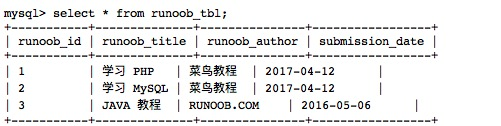
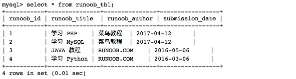
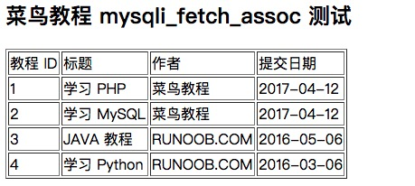
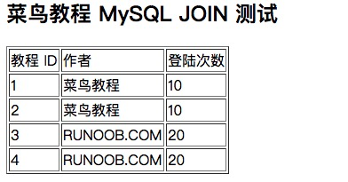

# <center><font face="黑体" font color=SeaGreen >MySQL学习笔记</font></center>
<center><font face="楷体" size =5 >Jaren</font></center>

## 一、前言
### 什么是数据库？
数据库（Database）是按照数据结构来组织、存储和管理数据的仓库。

每个数据库都有一个或多个不同的 API 用于创建，访问，管理，搜索和复制所保存的数据。

我们也可以将数据存储在文件中，但是在文件中读写数据速度相对较慢。

所以，现在我们使用关系型数据库管理系统（RDBMS）来存储和管理大数据量。所谓的关系型数据库，是建立在关系模型基础上的数据库，借助于集合代数等数学概念和方法来处理数据库中的数据。

RDBMS 即关系数据库管理系统(Relational Database Management System)的特点：
1. 数据以表格的形式出现
2. 每行为各种记录名称
3. 每列为记录名称所对应的数据域
4. 许多的行和列组成一张表单
5. 若干的表单组成database

### RDBMS 术语
在我们开始学习MySQL 数据库前，让我们先了解下RDBMS的一些术语：

- **数据库**: 数据库是一些关联表的集合。
- **数据表**: 表是数据的矩阵。在一个数据库中的表看起来像一个简单的电子表格。
- **列**: 一列(数据元素) 包含了相同类型的数据, 例如邮政编码的数据。
- **行**：一行（元组，或记录）是一组相关的数据，例如一条用户订阅的数据。
- **冗余**：存储两倍数据，冗余降低了性能，但提高了数据的安全性。
- **主键**：主键是唯一的。一个数据表中只能包含一个主键。你可以使用主键来查询数据。
- **外键**：外键用于关联两个表。
- **复合键**：复合键（组合键）将多个列作为一个索引键，一般用于复合索引。
- **索引**：使用索引可快速访问数据库表中的特定信息。索引是对数据库表中一列或多列的值进行排序的一种结构。类似于书籍的目录。
- **参照完整性**: 参照的完整性要求关系中不允许引用不存在的实体。与实体完整性是关系模型必须满足的完整性约束条件，目的是保证数据的一致性。

MySQL 为关系型数据库(Relational Database Management System), 这种所谓的"关系型"可以理解为"表格"的概念, 一个关系型数据库由一个或数个表格组成, 如图所示的一个表格:


- **表头(header)**: 每一列的名称;
- **列(col)**: 具有相同数据类型的数据的集合;
- **行(row)**: 每一行用来描述某条记录的具体信息;
- **值(value)**: 行的具体信息, 每个值必须与该列的数据类型相同;
- **键(key)**: 键的值在当前列中具有唯一性。

### MySQL数据库
MySQL 是一种关联数据库管理系统，关联数据库将数据保存在不同的表中，而不是将所有数据放在一个大仓库内，这样就增加了速度并提高了灵活性。

- MySQL 支持大型的数据库。可以处理拥有上千万条记录的大型数据库。
- MySQL 使用标准的 SQL 数据语言形式。
- MySQL 可以运行于多个系统上，并且支持多种语言。这些编程语言包括 C、C++、Python、Java、Perl、PHP、Eiffel、Ruby 和 Tcl 等。
- MySQL 对 PHP 有很好的支持，PHP 是很适合用于 Web 程序开发。
- MySQL 支持大型数据库，支持 5000 万条记录的数据仓库，32 位系统表文件最大可支持 4GB，64 位系统支持最大的表文件为8TB。
- MySQL 是可以定制的，采用了 GPL 协议，你可以修改源码来开发自己的 MySQL 系统。

### 安装 MySQL
MySQL官网最新下载地址：https://dev.mysql.com/downloads/windows/installer/

保姆级Windows安装MySQL教学视频：https://www.bilibili.com/video/BV12q4y1477i
### 登录 MySQL
当 MySQL 服务已经运行时, 我们可以通过 MySQL 自带的客户端工具登录到 MySQL 数据库中, 首先打开命令提示符, 输入以下格式的命名:
`mysql -h 主机名 -u 用户名 -p`
参数说明：
- **-h** : 指定客户端所要登录的 MySQL 主机名, 登录本机(localhost 或 127.0.0.1)该参数可以省略;
- **-u** : 登录的用户名;
- **-p** : 告诉服务器将会使用一个密码来登录, 如果所要登录的用户名密码为空, 可以忽略此选项。

如果我们要登录本机的 MySQL 数据库，只需要输入以下命令即可：
`mysql -u root -p`
按回车确认, 如果安装正确且 MySQL 正在运行, 会得到以下响应:
`Enter password:`
若密码存在, 输入密码登录, 不存在则直接按回车登录。登录成功后你将会看到 `Welcome to the MySQL monitor... `的提示语。

然后命令提示符会一直以 `mysql>` 加一个闪烁的光标等待命令的输入, 输入 `exit` 或 `quit` 退出登录。

### 开启或关闭MySQL服务
#### 方法一：通过命令行开启\关闭服务
 
1. 第一步点击开始菜单，找到cmd,以管理员身份运行。
2. 第二步在命令行里面输入`“net stop mysql`”,按回车键，就停止了mysql服务，如下图所示：

3. 第三步在命令行输入“net start mysql”,接着按回车键，开启mysql服务，如下图所示：

#### 方法二：通过电脑服务开启/关闭
1. 第一步最开始右键此电脑，选择“管理”，如下图所示：

2. 第二步进去管理之后，选择服务和应用程序->服务，然后在右边找到mysql

3. 第三步点击mysql，右键就可以启动或者关闭，如下图所示：
 
### 其他
目前笔者使用PHP较多，因此在后续笔记中PHP写法会特别关注，其中大部分实例源文件在MySQL practice文件夹中可以找到。除了PHP脚本写法以外，也包含使用 mysqladmin 和从命令提示窗口中操控 MySQL 数据库，其实例多来自菜鸟教程。
## 二、MySQL 管理
### 启动及关闭 MySQL 服务器
#### Windows 系统下
在 Windows 系统下，打开命令窗口(cmd)，进入 MySQL 安装目录的 bin 目录。
启动：
```
cd c:/mysql/bin
mysqld --console
```
关闭：
```
cd c:/mysql/bin
mysqladmin -uroot shutdown
```

#### Linux 系统下
首先，我们需要通过以下命令来检查MySQL服务器是否启动：
`ps -ef | grep mysqld`
如果MySql已经启动，以上命令将输出mysql进程列表， 如果mysql未启动，你可以使用以下命令来启动mysql服务器:
```
root@host# cd /usr/bin
./mysqld_safe &
```
如果你想关闭目前运行的 MySQL 服务器, 你可以执行以下命令:
```
root@host# cd /usr/bin
./mysqladmin -u root -p shutdown
Enter password: ******
```
### MySQL 用户设置
如果你需要添加 MySQL 用户，你只需要在 mysql 数据库中的 user 表添加新用户即可。

以下为添加用户的实例，用户名为guest，密码为guest123，并授权用户可进行 SELECT, INSERT 和 UPDATE操作权限：
```
root@host# mysql -u root -p
Enter password:*******
mysql> use mysql;
Database changed

mysql> INSERT INTO user 
          (host, user, password, 
           select_priv, insert_priv, update_priv) 
           VALUES ('localhost', 'guest', 
           PASSWORD('guest123'), 'Y', 'Y', 'Y');
Query OK, 1 row affected (0.20 sec)

mysql> FLUSH PRIVILEGES;
Query OK, 1 row affected (0.01 sec)

mysql> SELECT host, user, password FROM user WHERE user = 'guest';
+-----------+---------+------------------+
| host      | user    | password         |
+-----------+---------+------------------+
| localhost | guest | 6f8c114b58f2ce9e |
+-----------+---------+------------------+
1 row in set (0.00 sec)

```
在添加用户时，请注意使用MySQL提供的 PASSWORD() 函数来对密码进行加密。 你可以在以上实例看到用户密码加密后为： 6f8c114b58f2ce9e.

**注意：**
- 在 MySQL5.7 中 user 表的 password 已换成了**authentication_string**。
- password() 加密函数已经在 8.0.11 中移除了，可以使用 MD5() 函数代替。
- 在注意需要执行 **FLUSH PRIVILEGES** 语句。 这个命令执行后会重新载入授权表。

如果你不使用该命令，你就无法使用新创建的用户来连接mysql服务器，除非你重启mysql服务器。

你可以在创建用户时，为用户指定权限，在对应的权限列中，在插入语句中设置为 'Y' 即可，用户权限列表如下：

- Select_priv
- Insert_priv
- Update_priv
- Delete_priv
- Create_priv
- Drop_priv
- Reload_priv
- Shutdown_priv
- Process_priv
- File_priv
- Grant_priv
- References_priv
- Index_priv
- Alter_priv

另外一种添加用户的方法为通过SQL的 GRANT 命令，以下命令会给指定数据库TUTORIALS添加用户 zara ，密码为 zara123 。
```
root@host# mysql -u root -p
Enter password:*******
mysql> use mysql;
Database changed

mysql> GRANT SELECT,INSERT,UPDATE,DELETE,CREATE,DROP
    -> ON TUTORIALS.*
    -> TO 'zara'@'localhost'
    -> IDENTIFIED BY 'zara123';

```
以上命令会在mysql数据库中的user表创建一条用户信息记录。

注意: MySQL 的SQL语句以分号 (`;`) 作为结束标识。

### /etc/my.cnf 文件配置
一般情况下，你不需要修改该配置文件，该文件默认配置如下：
```
[mysqld]
datadir=/var/lib/mysql
socket=/var/lib/mysql/mysql.sock

[mysql.server]
user=mysql
basedir=/var/lib

[safe_mysqld]
err-log=/var/log/mysqld.log
pid-file=/var/run/mysqld/mysqld.pid
```
在配置文件中，你可以指定不同的错误日志文件存放的目录，一般你不需要改动这些配置。

### 管理MySQL的命令
以下列出了使用Mysql数据库过程中常用的命令：
- USE 数据库名
- SHOW DATABASES
- SHOW TABLES
- SHOW COLUMNS FROM
- SHOW INDEX FROM 数据表
- SHOW TABLE STATUS [FROM db_name] [LIKE 'pattern'] \G

#### USE 数据库名 :
选择要操作的Mysql数据库，使用该命令后所有Mysql命令都只针对该数据库。
```
mysql> use RUNOOB;
Database changed
```
#### SHOW DATABASES:
列出 MySQL 数据库管理系统的数据库列表。
```
mysql> SHOW DATABASES;
+--------------------+
| Database           |
+--------------------+
| information_schema |
| RUNOOB             |
| cdcol              |
| mysql              |
| onethink           |
| performance_schema |
| phpmyadmin         |
| test               |
| wecenter           |
| wordpress          |
+--------------------+
10 rows in set (0.02 sec)
```
#### SHOW TABLES:
显示指定数据库的所有表，使用该命令前需要使用 use 命令来选择要操作的数据库。
```
mysql> use RUNOOB;
Database changed
mysql> SHOW TABLES;
+------------------+
| Tables_in_runoob |
+------------------+
| employee_tbl     |
| runoob_tbl       |
| tcount_tbl       |
+------------------+
3 rows in set (0.00 sec)
```
#### SHOW COLUMNS FROM 数据表:
显示数据表的属性，属性类型，主键信息 ，是否为 NULL，默认值等其他信息。
```
mysql> SHOW COLUMNS FROM runoob_tbl;
+-----------------+--------------+------+-----+---------+-------+
| Field           | Type         | Null | Key | Default | Extra |
+-----------------+--------------+------+-----+---------+-------+
| runoob_id       | int(11)      | NO   | PRI | NULL    |       |
| runoob_title    | varchar(255) | YES  |     | NULL    |       |
| runoob_author   | varchar(255) | YES  |     | NULL    |       |
| submission_date | date         | YES  |     | NULL    |       |
+-----------------+--------------+------+-----+---------+-------+
4 rows in set (0.01 sec)
```
#### SHOW INDEX FROM 数据表:
显示数据表的详细索引信息，包括PRIMARY KEY（主键）。
<small>(下面的代码要拉好长好长来看doge)</small>
```
mysql> SHOW INDEX FROM runoob_tbl;
+------------+------------+----------+--------------+-------------+-----------+-------------+----------+--------+------+------------+---------+---------------+
| Table      | Non_unique | Key_name | Seq_in_index | Column_name | Collation | Cardinality | Sub_part | Packed | Null | Index_type | Comment | Index_comment |
+------------+------------+----------+--------------+-------------+-----------+-------------+----------+--------+------+------------+---------+---------------+
| runoob_tbl |          0 | PRIMARY  |            1 | runoob_id   | A         |           2 |     NULL | NULL   |      | BTREE      |         |               |
+------------+------------+----------+--------------+-------------+-----------+-------------+----------+--------+------+------------+---------+---------------+
1 row in set (0.00 sec)
```

#### SHOW TABLE STATUS [FROM db_name] [LIKE 'pattern'] \G:
该命令将输出Mysql数据库管理系统的性能及统计信息。
```
mysql> SHOW TABLE STATUS  FROM RUNOOB;   # 显示数据库 RUNOOB 中所有表的信息

mysql> SHOW TABLE STATUS from RUNOOB LIKE 'runoob%';     # 表名以runoob开头的表的信息
mysql> SHOW TABLE STATUS from RUNOOB LIKE 'runoob%'\G;   # 加上 \G，查询结果按列打印
```


## 三、MySQL PHP 语法
### 使用 mysqli 扩展连接 MySQL 数据库
以下是使用 mysqli 进行连接的基本步骤：

PHP MySQL 函数格式如下：
`mysqli_function(value,value,...);`
以上格式中 function 部分描述了 mysql 函数的功能，如：
```
mysqli_connect($connect);
mysqli_query($connect,"SQL 语句");
mysqli_fetch_array()
mysqli_close()
```
以下实例展示了 PHP 如何连接 MySQL：
```<?php
$servername = "localhost";
$username = "your_username";
$password = "your_password";
$database = "your_database";
 
// 创建连接
$conn = mysqli_connect($servername, $username, $password, $database);
 
// 检测连接
if (!$conn) {
    die("连接失败: " . mysqli_connect_error());
} 
echo "连接成功";
?>
```
请替换 `$servername`、`$username`、`$password`和 `$database` 的值为你的实际数据库连接信息。

连接成功后，你可以执行 SQL 查询并处理结果：
```
$sql = "SELECT id, name, email FROM users";
$result = mysqli_query($conn, $sql);

if (mysqli_num_rows($result) > 0) {
    // 输出数据
    while($row = mysqli_fetch_assoc($result)) {
        echo "ID: " . $row["id"]. " - Name: " . $row["name"]. " - Email: " . $row["email"]. "<br>";
    }
} else {
    echo "0 结果";
}

// 关闭连接
mysqli_close($conn);
?>
```
## 四、MySQL 连接
### 使用 MySQL 二进制方式连接
可以使用 MySQL 二进制方式进入到 mysql 命令提示符下来连接 MySQL 数据库，格式如下：
`mysql -u your_username -p`
**参数说明**：
- -u 参数用于指定用户名。
- -p 参数表示需要输入密码。

以下是从命令行中连接 mysql 服务器的简单实例：
```
[root@host]# mysql -u root -p
Enter password:******
```
按照提示输入密码，并按下 Enter 键。

在登录成功后会出现 `mysql>` 命令提示窗口，你可以在上面执行任何 SQL 语句。

以上命令执行后，登录成功输出结果如下:
```
Welcome to the MySQL monitor.  Commands end with ; or \g.
Your MySQL connection id is 2854760 to server version: 5.0.9

Type 'help;' or '\h' for help. Type '\c' to clear the buffer.
```
在以上实例中，使用了 root 用户登录到 MySQL 服务器，当然也可以使用其他 MySQL 用户登录。

如果用户权限足够，任何用户都可以在 MySQL 的命令提示窗口中进行 SQL 操作。

成功连接到 MySQL 后，可以在命令行中直接执行 SQL 查询。

- 列出所有可用的数据库：
`SHOW DATABASES;`
- 选择要使用的数据库：
`USE your_database;`
- 列出所选数据库中的所有表：
`SHOW TABLES;`
- 退出 `mysql>` 命令提示窗口可以使用 `exit` 命令
`mysql> EXIT;`
`Bye`
或者使用：
`mysql> QUIT;`
或者按下 `Ctrl + D`（在 Unix/Linux 系统中）。

### 使用 PHP 脚本连接 MySQL
PHP 提供了 `mysqli_connect()` 函数来连接数据库。
该函数有**6 个参数**，在成功链接到 MySQL 后返回连接标识，失败返回 FALSE。

语法:
`mysqli_connect(host, username, password, dbname,port, socket);`

参数说明：
|参数|	描述|
|:-|:-|
|host	|可选。规定主机名或 IP 地址。|
|username|	可选。规定 MySQL 用户名。|
|password|	可选。规定 MySQL 密码。|
|dbname|	可选。规定默认使用的数据库。|
|port|	可选。规定尝试连接到 MySQL 服务器的端口号。|
|socket|	可选。规定 socket 或要使用的已命名 pipe。|

你可以使用 PHP 的 `mysqli_close()` 函数来断开与 MySQL 数据库的链接。
该函数只有一个参数为 `mysqli_connect()` 函数创建连接成功后返回的 MySQL 连接标识符。
语法
`bool mysqli_close ( mysqli $link )`
本函数关闭指定的连接标识所关联的到 MySQL 服务器的非持久连接。如果没有指定 `link_identifier`，则关闭上一个打开的连接。

- 提示：通常不需要使用 `mysqli_close()`，因为已打开的非持久连接会在脚本执行完毕后自动关闭。

可以尝试以下实例来连接到 MySQL 服务器:
```
<?php
$dbhost = 'localhost';  // mysql服务器主机地址
$dbuser = 'root';            // mysql用户名
$dbpass = '123456';          // mysql用户名密码
$conn = mysqli_connect($dbhost, $dbuser, $dbpass);
if(! $conn )
{
    die('Could not connect: ' . mysqli_error());
}
echo '数据库连接成功！';
mysqli_close($conn);
?>
```
## 五、MySQL 创建数据库
我们可以在登陆 MySQL 服务后，使用 create 命令创建数据库，语法如下:
`CREATE DATABASE 数据库名;`
以下命令简单的演示了创建数据库的过程，数据名为 BM:
```
[root@host]# mysql -u root -p   
Enter password:******  # 登录后进入终端

mysql> create DATABASE BM;
```
建数据库的基本语法如下：
```
CREATE DATABASE [IF NOT EXISTS] database_name
  [CHARACTER SET charset_name]
  [COLLATE collation_name];
```
如果你希望在创建数据库时指定一些选项，可以使用 CREATE DATABASE 语句的其他参数，例如，你可以指定字符集和排序规则：
```
CREATE DATABASE mydatabase
  CHARACTER SET utf8mb4
  COLLATE utf8mb4_general_ci;
```
如果数据库已经存在，执行 CREATE DATABASE 将导致错误。

为了避免这种情况，你可以在 CREATE DATABASE 语句中添加 IF NOT EXISTS 子句：
`CREATE DATABASE IF NOT EXISTS mydatabase;`
#### 使用 mysqladmin 创建数据库
mysqladmin 是 MySQL 提供的一个用于执行管理任务的命令行工具。

通过 mysqladmin，你可以执行各种数据库管理操作，包括创建数据库。

以下是使用 mysqladmin 创建数据库的基本语法：
`mysqladmin -u your_username -p create your_database`
- -u 参数用于指定 MySQL 用户名。
- -p 参数表示需要输入密码。
- create 是执行的操作，表示创建数据库。
- your_database 是要创建的数据库的名称。

使用普通用户，你可能需要特定的权限来创建或者删除 MySQL 数据库。

我们这边使用 root 用户登录，root 用户拥有最高权限，可以使用 mysql `mysqladmin` 命令来创建数据库。

执行上述命令后，系统会提示你输入密码，输入密码后按 Enter 键即可。

以下命令简单的演示了创建数据库的过程，数据名为 BABYMONSTER:
```
[root@host]# mysqladmin -u root -p create RUNOOB
Enter password:******
```
以上命令执行成功后会创建 MySQL 数据库 BABYMONSTER。

如果你希望在创建数据库时指定字符集和排序规则，可以使用 `-default-character-set` 和 `-default-collation` 参数：
```
mysqladmin -u your_username -p create your_database \
  --default-character-set=utf8mb4 \
  --default-collation=utf8mb4_general_ci
```
以上代码创建一个使用 utf8mb4 字符集和 utf8mb4_general_ci 排序规则的数据库。

请注意，在执行这些命令时，请确保 MySQL 服务器正在运行，并且你有足够的权限执行这些操作。

如果你希望使用 mysqladmin 连接到 MySQL 服务器执行其他管理任务，例如查看服务器状态、重启服务器等，可以使用以下形式的命令：
`mysqladmin -u your_username -p your_command`
在这里，your_command 是你希望执行的具体管理命令。例如，要查看 MySQL 服务器的状态，可以使用：
`mysqladmin -u your_username -p status`
这将要求你输入密码，并显示有关服务器状态的信息。
### 使用 PHP脚本 创建数据库
PHP 使用 `mysqli_query` 函数来**创建**或者删除 MySQL 数据库。
**其中`CREATE DATABASE`语句用于创建**
该函数有两个参数，在执行成功时返回 TRUE，否则返回 FALSE。
语法
`mysqli_query(connection,query,resultmode);`
|参数|	描述|
|:-|:-|
|connection	|必需。规定要使用的 MySQL 连接|
|query	|必需，规定查询字符串|
|resultmode	|可选。一个常量。可以是下列值中的任意一个： `MYSQLI_USE_RESULT`（如果需要检索大量数据，请使用这个）`MYSQLI_STORE_RESULT`（默认）|

以下实例演示了使用 PHP 来创建一个数据库：
```
<?php
$dbhost = 'localhost';  // mysql服务器主机地址
$dbuser = 'root';            // mysql用户名
$dbpass = '****';          // mysql用户名密码
$conn = mysqli_connect($dbhost, $dbuser, $dbpass);
if(! $conn )
{
  die('连接错误: ' . mysqli_error($conn));
}
echo '连接成功<br />';
$sql = 'CREATE DATABASE BM';
$retval = mysqli_query($conn,$sql );
if(! $retval )
{
    die('创建数据库失败: ' . mysqli_error($conn));
}
echo "数据库 BM 创建成功\n";
mysqli_close($conn);
?>
```
执行成功后，返回如下结果：
```
连接成功
数据库BM创建成功
```
如果数据库已存在，执行后，返回如下结果：
```
连接成功
创建数据库失败：Can't create database 'BM';database exists
```
## 六、MySQL 删除数据库
使用普通用户登陆 MySQL 服务器，你可能需要特定的权限来创建或者删除 MySQL 数据库，所以我们这边使用 root 用户登录，root 用户拥有最高权限。
在删除数据库过程中，务必要十分谨慎，因为在执行删除命令后，所有数据将会消失。
### drop 命令删除数据库
drop 命令格式：
```
DROP DATABASE <database_name>;        -- 直接删除数据库，不检查是否存在
或
DROP DATABASE [IF EXISTS] <database_name>;
```
参数说明：
- IF EXISTS 是一个可选的子句，表示如果数据库存在才执行删除操作，避免因为数据库不存在而引发错误。
- database_name 是你要删除的数据库的名称

例如删除名为 BM 的数据库：
```
-- 直接删除数据库，不检查是否存在
mysql> DROP DATABASE BM;

-- 删除数据库，如果存在的话
DROP DATABASE IF EXISTS BM;
```
### 使用 mysqladmin 删除数据库
你也可以使用 MySQL `mysqladmin` 命令在终端来执行删除命令。
以下是使用 `mysqladmin` 删除数据库的命令：
`mysqladmin -u your_username -p drop your_database`
**your_username** 是 MySQL 用户名，**your_database**是要删除的数据库的名称。

执行此命令后，系统会提示输入密码，输入密码后按 Enter 键即可删除数据库。

以下实例删除数据库 BM：
```
[root@host]# mysqladmin -u root -p drop BM
Enter password:******
```
执行以上删除数据库命令后，会出现一个提示框，来确认是否真的删除数据库：
```
Dropping the database is potentially a very bad thing to do.
Any data stored in the database will be destroyed.

Do you really want to drop the 'BM' database [y/N] y
Database "BM" dropped
```
### 使用 PHP 脚本删除数据库
PHP使用 `mysqli_query` 函数来创建或者**删除** MySQL 数据库。
**其中`DROP DATABASE`语句用于删除**
该函数有两个参数，在执行成功时返回 TRUE，否则返回 FALSE。
语法
`mysqli_query(connection,query,resultmode);`
|参数|	描述|
|:-|:-|
|connection	|必需。规定要使用的 MySQL 连接|
|query	|必需，规定查询字符串|
|resultmode	|可选。一个常量。可以是下列值中的任意一个： `MYSQLI_USE_RESULT`（如果需要检索大量数据，请使用这个）`MYSQLI_STORE_RESULT`（默认）|

以下实例演示了使用PHP mysqli_query函数来删除数据库：
```
<?php
$dbhost = 'localhost';  // mysql服务器主机地址
$dbuser = 'root';            // mysql用户名
$dbpass = '****';          // mysql用户名密码
$conn = mysqli_connect($dbhost, $dbuser, $dbpass);
if(! $conn )
{
    die('连接失败: ' . mysqli_error($conn));
}
echo '连接成功<br />';
$sql = 'DROP DATABASE BM';
$retval = mysqli_query( $conn, $sql );
if(! $retval )
{
    die('删除数据库失败: ' . mysqli_error($conn));
}
echo "数据库 BM 删除成功\n";
mysqli_close($conn);
?>
```
执行成功后，数结果为：
```
连接成功
数据库BM删除成功
```
- <small>注意： 在使用PHP脚本删除数据库时，不会出现确认是否删除信息，会直接删除指定数据库，所以你在删除数据库时要特别小心。</small>

## 七、MySQL 选择数据库
在你连接到 MySQL 数据库后，可能有多个可以操作的数据库，所以你需要选择你要操作的数据库。
### 从命令提示窗口中选择 MySQL 数据库
在 `mysql>` 提示窗口中可以很简单的选择特定的数据库。

在 MySQL 中，要选择要使用的数据库，可以使用 USE 语句，以下是基本的语法：
`USE database_name;`
参数说明：
- **database_name** 是你要选择的数据库的名称。

选择来数据库后，你的后续 SQL 查询和操作在指定的数据库 `database_name` 上执行。
以下实例选取了数据库 BM:
```
[root@host]# mysql -u root -p
Enter password:******
mysql> use BM;
Database changed
mysql>
```
执行以上命令后，你就已经成功选择了 BM 数据库，在后续的操作中都会在 BM 数据库中执行。

在命令行中，你可以通过以下方式选择数据库：
`mysql -u your_username -p -D your_database`

- `-D` 参数用于指定要选择的数据库。
例如：
`mysql -u root -p -D BM`
在输入密码后，你将进入 MySQL 提示符，并且任何后续的查询和操作都将在BM数据库上执行。

请确保选择的数据库存在，否则你将收到错误消息。你可以使用 `SHOW DATABASES`; 查询可用的数据库，确保你要选择的数据库在列表中。

### 使用 PHP 脚本选择 MySQL 数据库
PHP 提供了函数 `mysqli_select_db` 来选取一个数据库。函数在执行成功后返回 TRUE ，否则返回 FALSE 。
语法
`mysqli_select_db(connection,dbname);`
|参数	|描述|
|:-|:-|
|connection	|必需。规定要使用的 MySQL 连接。|
|dbname	|必需，规定要使用的默认数据库。|

以下实例展示了如何使用 mysqli_select_db 函数来选取一个数据库：
```
<?php
$dbhost = 'localhost';  // mysql服务器主机地址
$dbuser = 'root';            // mysql用户名
$dbpass = '****';          // mysql用户名密码
$conn = mysqli_connect($dbhost, $dbuser, $dbpass);
if(! $conn )
{
    die('连接失败: ' . mysqli_error($conn));
}
echo '连接成功';
mysqli_select_db($conn, 'BM' );
mysqli_close($conn);
?>
```
## 八、MySQL 数据类型*
MySQL 中定义数据字段的类型对你数据库的优化是非常重要的。

MySQL 支持多种类型，大致可以分为三类：**数值、日期/时间和字符串(字符)类型**。
### 数值类型
MySQL 支持所有标准 SQL 数值数据类型。

这些类型包括严格数值数据类型(INTEGER、SMALLINT、DECIMAL 和 NUMERIC)，以及近似数值数据类型(FLOAT、REAL 和 DOUBLE PRECISION)。

关键字INT是INTEGER的同义词，关键字DEC是DECIMAL的同义词。

BIT数据类型保存位字段值，并且支持 MyISAM、MEMORY、InnoDB 和 BDB表。

作为 SQL 标准的扩展，MySQL 也支持整数类型 TINYINT、MEDIUMINT 和 BIGINT。下面的表显示了需要的每个整数类型的存储和范围。
|类型|	大小|	范围（有符号）|	范围（无符号）|	用途|
|:-|:-|:-|:-|:-|
|TINYINT|	1 Bytes|	(-128，127)	|(0，255)|	小整数值|
|SMALLINT|	2 Bytes|	(-32 768，32 767)|	(0，65 535)	|大整数值|
|MEDIUMINT|	3 Bytes|	(-8 388 608，8 388 607)|	(0，16 777 215)|	大整数值|
|**INT或INTEGER**|	4 Bytes|	(-2 147 483 648，2 147 483 647)|	(0，4 294 967 295)|	大整数值|
|BIGINT|	8 Bytes|	(-9,223,372,036,854,775,808，9 223 372 036 854 775 807)|	(0，18 446 744 073 709 551 615)|	极大整数值|
|**FLOAT**|	4 Bytes|	(-3.402 823 466 E+38，-1.175 494 351 E-38)，0，(1.175 494 351 E-38，3.402 823 466 351 E+38)|	0，(1.175 494 351 E-38，3.402 823 466 E+38)	|单精度浮点数值|
|**DOUBLE**|	8 Bytes|	(-1.797 693 134 862 315 7 E+308，-2.225 073 858 507 201 4 E-308)，0，(2.225 073 858 507 201 4 E-308，1.797 693 134 862 315 7 E+308)	|0，(2.225 073 858 507 201 4 E-308，1.797 693 134 862 315 7 E+308)	|双精度浮点数值|
|DECIMAL|	对DECIMAL(M,D) ，如果M>D，为M+2否则为D+2|	依赖于M和D的值|	依赖于M和D的值	|小数值|
### 日期和时间类型
表示时间值的日期和时间类型为DATETIME、DATE、TIMESTAMP、TIME和YEAR。

每个时间类型有一个有效值范围和一个"零"值，当指定不合法的MySQL不能表示的值时使用"零"值。

TIMESTAMP类型有专有的自动更新特性，将在后面描述。
|类型|	大小( bytes)|	范围	|格式	|用途|
|:-|:-|:-|:-|:-|
|**DATE**|	3|	1000-01-01/9999-12-31|	YYYY-MM-DD|日期值|
|**TIME**|	3|	'-838:59:59'/'838:59:59'|HH:MM:SS|	时间值或持续时间|
|**YEAR**|	1	|1901/2155|	YYYY|	年份值|
|**DATETIME**|	8	|'1000-01-01 00:00:00' 到 '9999-12-31 23:59:59'|	YYYY-MM-DD hh:mm:ss	|混合日期和时间值|
|TIMESTAMP|	4	|'1970-01-01 00:00:01' UTC 到 '2038-01-19 03:14:07' UTC结束时间是第 2147483647 秒，北京时间 2038-1-19 11:14:07，格林尼治时间 2038年1月19日 凌晨 03:14:07|YYYY-MM-DD hh:mm:ss	|混合日期和时间值，时间戳|

### 字符串类型
字符串类型指CHAR、VARCHAR、BINARY、VARBINARY、BLOB、TEXT、ENUM和SET。该节描述了这些类型如何工作以及如何在查询中使用这些类型。
|类型|	大小|	用途|
|:-|:-|:-|
|**CHAR**|	0-255 bytes|	定长字符串|
|**VARCHAR**|	0-65535 bytes|	变长字符串|
|TINYBLOB|	0-255 bytes|	不超过 255 个字符的二进制字符串|
|TINYTEXT|	0-255 bytes	|短文本字符串|
|BLOB|	0-65 535 bytes|	二进制形式的长文本数据|
|**TEXT**	|0-65 535 bytes	|长文本数据|
|MEDIUMBLOB	|0-16 777 215 bytes	|二进制形式的中等长度文本数据|
|MEDIUMTEXT	|0-16 777 215 bytes|	中等长度文本数据|
|LONGBLOB	|0-4 294 967 295 bytes|	二进制形式的极大文本数据|
|LONGTEXT	|0-4 294 967 295 bytes|	极大文本数据|

<small>
- 注意：`char(n)` 和 `varchar(n)` 中括号中 n 代表字符的个数，并不代表字节个数，比如 CHAR(30) 就可以存储 30 个字符。

CHAR 和 VARCHAR 类型类似，但它们保存和检索的方式不同。它们的最大长度和是否尾部空格被保留等方面也不同。在存储或检索过程中不进行大小写转换。

BINARY 和 VARBINARY 类似于 CHAR 和 VARCHAR，不同的是它们包含二进制字符串而不要非二进制字符串。也就是说，它们包含字节字符串而不是字符字符串。这说明它们没有字符集，并且排序和比较基于列值字节的数值值。

BLOB 是一个二进制大对象，可以容纳可变数量的数据。有 4 种 BLOB 类型：TINYBLOB、BLOB、MEDIUMBLOB 和 LONGBLOB。它们区别在于可容纳存储范围不同。

有 4 种 TEXT 类型：TINYTEXT、TEXT、MEDIUMTEXT 和 LONGTEXT。对应的这 4 种 BLOB 类型，可存储的最大长度不同，可根据实际情况选择。
</small>
### 枚举与集合类型（Enumeration and Set Types）
- **ENUM**: 枚举类型，用于存储单一值，可以选择一个预定义的集合。
- **SET**: 集合类型，用于存储多个值，可以选择多个预定义的集合。

### 空间数据类型（Spatial Data Types）
GEOMETRY, POINT, LINESTRING, POLYGON, MULTIPOINT, MULTILINESTRING, MULTIPOLYGON, GEOMETRYCOLLECTION: 用于存储空间数据（地理信息、几何图形等）。

## 九、MySQL 创建数据表
创建 MySQL 数据表需要以下信息：
- 表名
- 表字段名
- 定义每个表字段的数据类型

语法
以下为创建 MySQL 数据表的 SQL 通用语法：
```
CREATE TABLE table_name (
    column1 datatype,
    column2 datatype,
    ...
);
```
参数说明：

- `table_name` 是你要创建的表的名称。
- `column1, column2, ...` 是表中的列名。
- `datatype` 是每个列的数据类型。

以下是一个具体的实例，创建一个用户表**users**：
```
CREATE TABLE users (
    id INT AUTO_INCREMENT PRIMARY KEY,
    username VARCHAR(50) NOT NULL,
    email VARCHAR(100) NOT NULL,
    birthdate DATE,
    is_active BOOLEAN DEFAULT TRUE
);
```
实例解析：

- id: 用户 id，整数类型，**自增长**，**作为主键**。
- username: 用户名，变长字符串，不允许为空(`NOT NULL`)。
- email: 用户邮箱，变长字符串，不允许为空。
- birthdate: 用户的生日，日期类型。
- is_active: 用户是否已经激活，布尔类型，默认值为 true。

以上只是一个简单的实例，用到了一些常见的数据类型包括 INT, VARCHAR, DATE, BOOLEAN。**`AUTO_INCREMENT` 关键字用于创建一个自增长的列，`PRIMARY KEY` 用于定义主键**。

注意：**MySQL使用语句创建表将一个字段属性设置主键时，该字段的类型只能是int类型的，varchar类型的会报错。所以主键id如果要设置为自增长，最好还是使用int类型**

如果希望在创建表时指定数据引擎，字符集和排序规则等，可以使用 CHARACTER SET 和 COLLATE 子句：
```
CREATE TABLE mytable (
    id INT PRIMARY KEY,
    name VARCHAR(50)
) CHARACTER SET utf8mb4 COLLATE utf8mb4_general_ci;
```
以上代码创建一个使用 utf8mb4 字符集和 utf8mb4_general_ci 排序规则的表。

以下例子中我们将在 RUNOOB 数据库中创建数据表 runoob_tbl：
```
CREATE TABLE IF NOT EXISTS `runoob_tbl`(
   `runoob_id` INT UNSIGNED AUTO_INCREMENT,
   `runoob_title` VARCHAR(100) NOT NULL,
   `runoob_author` VARCHAR(40) NOT NULL,
   `submission_date` DATE,
   PRIMARY KEY ( `runoob_id` )
)ENGINE=InnoDB DEFAULT CHARSET=utf8;
```
实例解析：
- 如果你`不想字段为空`可以设置字段的属性为 `NOT NULL`，如上实例中的 runoob_title 与 runoob_author 字段， 在操作数据库时如果输入该字段的数据为空，就会报错。
- `AUTO_INCREMENT` 定义列为自增的属性，一般用于主键，数值会自动加 1。
- `PRIMARY KEY` 关键字用于定义列为主键。 您可以使用多列来定义主键，列间以逗号 `,`分隔。
- `ENGINE` 设置存储引擎，`CHARSET` 设置编码。

### 通过命令提示符创建表
通过 `mysql>` 命令窗口可以很简单的创建 MySQL 数据表。

你可以使用 SQL 语句 **CREATE TABLE** 来创建数据表。
以下为创建数据表 runoob_tbl 实例:
```
root@host# mysql -u root -p
Enter password:*******
mysql> USE RUNOOB;
DATABASE changed
mysql> CREATE TABLE runoob_tbl(
   -> runoob_id INT NOT NULL AUTO_INCREMENT,
   -> runoob_title VARCHAR(100) NOT NULL,
   -> runoob_author VARCHAR(40) NOT NULL,
   -> submission_date DATE,
   -> PRIMARY KEY ( runoob_id )
   -> )ENGINE=InnoDB DEFAULT CHARSET=utf8;
Query OK, 0 ROWS affected (0.16 sec)
mysql>
```
<small>
注意：
MySQL 命令终止符为分号 `;` 。
`->` 是换行符标识(不要复制)。
</small>

### 使用 PHP 脚本创建数据表
你可以使用 PHP 的 `mysqli_query()` 函数来创建已存在数据库的数据表。
该函数有两个参数，在执行成功时返回 TRUE，否则返回 FALSE。
语法
`mysqli_query(connection,query,resultmode);`
|参数|	描述|
|:-|:-|
|connection	|必需。规定要使用的 MySQL 连接|
|query	|必需，规定查询字符串|
|resultmode	|可选。一个常量。可以是下列值中的任意一个： `MYSQLI_USE_RESULT`（如果需要检索大量数据，请使用这个）`MYSQLI_STORE_RESULT`（默认）|

以下实例使用了PHP脚本来创建数据表：
```
<?php
$dbhost = 'localhost';  // mysql服务器主机地址
$dbuser = 'root';            // mysql用户名
$dbpass = '****';          // mysql用户名密码
$conn = mysqli_connect($dbhost, $dbuser, $dbpass);
if(! $conn )
{
    die('连接失败: ' . mysqli_error($conn));
}
echo '连接成功<br />';
$sql = "CREATE TABLE runoob_tbl( ".
        "runoob_id INT NOT NULL AUTO_INCREMENT, ".
        "runoob_title VARCHAR(100) NOT NULL, ".
        "runoob_author VARCHAR(40) NOT NULL, ".
        "submission_date DATE, ".
        "PRIMARY KEY ( runoob_id ))ENGINE=InnoDB DEFAULT CHARSET=utf8; ";
mysqli_select_db( $conn, 'RUNOOB' );
$retval = mysqli_query( $conn, $sql );
if(! $retval )
{
    die('数据表创建失败: ' . mysqli_error($conn));
}
echo "数据表创建成功\n";
mysqli_close($conn);
?>
```
执行成功后，就可以通过命令行查看表结构：


## 十、MySQL 删除数据表
MySQL中删除数据表是非常容易操作的，但是你在进行删除表操作时要非常小心，因为执行删除命令后所有数据都会消失。
语法
以下为删除 MySQL 数据表的通用语法：
```
DROP TABLE table_name ;    -- 直接删除表，不检查是否存在
或
DROP TABLE [IF EXISTS] table_name;
```
参数说明：

- table_name 是要删除的表的名称。
- IF EXISTS 是一个可选的子句，表示如果表存在才执行删除操作，避免因为表不存在而引发错误。
```
-- 删除表，如果存在的话
DROP TABLE IF EXISTS mytable;

-- 直接删除表，不检查是否存在
DROP TABLE mytable;
(请替换 mytable 为你要删除的表的名称)
```
在命令行中，你也可以使用 mysqladmin 工具来删除表。
以下是使用 mysqladmin 删除表的命令：
`mysqladmin -u your_username -p drop your_table`
- `your_username` 是 MySQL 用户名。
- `your_table` 是要删除的表的名称。

执行此命令后，系统会提示输入密码，输入密码后按 Enter 键即可删除表。
<small>
注意：执行此命令后，系统会提示输入密码，输入密码后按 Enter 键即可删除表。
</small>

以下实例删除了数据表 runoob_tbl:
```
root@host# mysql -u root -p
Enter password:*******
mysql> USE RUNOOB;
DATABASE changed
mysql> DROP TABLE runoob_tbl;
Query OK, 0 ROWS affected (0.8 sec)
mysql>
```

### 使用 PHP 脚本删除数据表
PHP 使用 `mysqli_query` 函数来删除 MySQL 数据表。
该函数有两个参数，在执行成功时返回 TRUE，否则返回 FALSE。
|参数|	描述|
|:-|:-|
|connection	|必需。规定要使用的 MySQL 连接|
|query	|必需，规定查询字符串|
|resultmode	|可选。一个常量。可以是下列值中的任意一个： `MYSQLI_USE_RESULT`（如果需要检索大量数据，请使用这个）`MYSQLI_STORE_RESULT`（默认）|

以下实例使用了 PHP 脚本删除数据表 runoob_tbl:
```
<?php
$dbhost = 'localhost';  // mysql服务器主机地址
$dbuser = 'root';            // mysql用户名
$dbpass = '****';          // mysql用户名密码
$conn = mysqli_connect($dbhost, $dbuser, $dbpass);
if(! $conn )
{
  die('连接失败: ' . mysqli_error($conn));
}
echo '连接成功<br />';
$sql = "DROP TABLE runoob_tbl";
mysqli_select_db( $conn, 'RUNOOB' );
$retval = mysqli_query( $conn, $sql );
if(! $retval )
{
  die('数据表删除失败: ' . mysqli_error($conn));
}
echo "数据表删除成功\n";
mysqli_close($conn);
?>
```
执行成功后，使用以下命令，就看不到 runoob_tbl 表了：
```
mysql> show tables;
Empty set (0.01 sec)
```
## 十一、MySQL 插入数据
MySQL 表中使用 `INSERT INTO` 语句来插入数据。
语法
以下为向MySQL数据表插入数据通用的 **INSERT INTO** SQL语法：
```
INSERT INTO table_name (column1, column2, column3, ...)
VALUES (value1, value2, value3, ...);
```
参数说明：
- `table_name` 是你要插入数据的表的名称。
- `column1, column2, column3, ...` 是表中的列名。
- `value1, value2, value3, ... `是要插入的具体数值。

如果数据是字符型，必须使用单引号`'`或者双引号`"`，如： `'value1', "value1"`。

一个简单的实例，插入了一行数据到名为 users 的表中：
```
INSERT INTO users (username, email, birthdate, is_active)
VALUES ('test', 'test@runoob.com', '1990-01-01', true);
```
- username: 用户名，字符串类型。
- email: 邮箱地址，字符串类型。
- birthdate: 用户生日， 日期类型。
- is_active: 是否已激活，布尔类型。

如果你要插入所有列的数据，可以省略列名：
```
INSERT INTO users
VALUES (NULL,'test', 'test@runoob.com', '1990-01-01', true);
```
这里，`NULL` 是用于自增长列的占位符，表示系统将为 **id** 列生成一个唯一的值。

如果你要插入**多行数据**，可以在 VALUES 子句中指定多组数值：
```
INSERT INTO users (username, email, birthdate, is_active)
VALUES
    ('test1', 'test1@runoob.com', '1985-07-10', true),
    ('test2', 'test2@runoob.com', '1988-11-25', false),
    ('test3', 'test3@runoob.com', '1993-05-03', true);
```
以上代码将在 users 表中插入三行数据。
### 通过命令提示窗口插入数据
以下我们将使用 `INSERT INTO` 语句向 MySQL 数据表 runoob_tbl 插入数据
以下实例中我们将向 runoob_tbl 表插入三条数据:
```
root@host# mysql -u root -p password;
Enter password:*******
mysql> USE RUNOOB;
DATABASE changed
mysql> INSERT INTO runoob_tbl 
    -> (runoob_title, runoob_author, submission_date)
    -> VALUES
    -> ("学习 PHP", "菜鸟教程", NOW());
Query OK, 1 ROWS affected, 1 warnings (0.01 sec)
mysql> INSERT INTO runoob_tbl
    -> (runoob_title, runoob_author, submission_date)
    -> VALUES
    -> ("学习 MySQL", "菜鸟教程", NOW());
Query OK, 1 ROWS affected, 1 warnings (0.01 sec)
mysql> INSERT INTO runoob_tbl
    -> (runoob_title, runoob_author, submission_date)
    -> VALUES
    -> ("JAVA 教程", "RUNOOB.COM", '2016-05-06');
Query OK, 1 ROWS affected (0.00 sec)
mysql>
```
<small>
注意： 使用箭头标记 `->` 不是 SQL 语句的一部分，它仅仅表示一个新行，如果一条 SQL 语句太长，我们可以通过回车键来创建一个新行来编写 SQL 语句，SQL 语句的命令结束符为分号 `;`。
</small>
在以上实例中，我们并没有提供 **runoob_id** 的数据，因为该字段我们在创建表的时候已经设置它为 **AUTO_INCREMENT**(自动增加) 属性。 所以，该字段会自动递增而不需要我们去设置。实例中 **NOW()** 是一个 MySQL 函数，该函数返回日期和时间。
接下来我们可以通过以下语句查看数据表数据：

`select * from runoob_tbl;`
输出结果：

### 使用 PHP 脚本插入数据
你可以使用 PHP 的 mysqli_query() 函数来执行 `INSERT INTO`命令来插入数据。

该函数有两个参数，在执行成功时返回 TRUE，否则返回 FALSE。
|参数|	描述|
|:-|:-|
|connection	|必需。规定要使用的 MySQL 连接|
|query	|必需，规定查询字符串|
|resultmode	|可选。一个常量。可以是下列值中的任意一个： `MYSQLI_USE_RESULT`（如果需要检索大量数据，请使用这个）`MYSQLI_STORE_RESULT`（默认）|

以下实例中程序接收用户输入的三个字段数据，并插入数据表中：
```
<?php
$dbhost = 'localhost';  // mysql服务器主机地址
$dbuser = 'root';            // mysql用户名
$dbpass = '123456';          // mysql用户名密码
$conn = mysqli_connect($dbhost, $dbuser, $dbpass);
if(! $conn )
{
  die('连接失败: ' . mysqli_error($conn));
}
echo '连接成功<br />';
// 设置编码，防止中文乱码
mysqli_query($conn , "set names utf8");
 
$runoob_title = '学习 Python';
$runoob_author = 'RUNOOB.COM';
$submission_date = '2016-03-06';
 
$sql = "INSERT INTO runoob_tbl ".
        "(runoob_title,runoob_author, submission_date) ".
        "VALUES ".
        "('$runoob_title','$runoob_author','$submission_date')";
 
 
 
mysqli_select_db( $conn, 'RUNOOB' );
$retval = mysqli_query( $conn, $sql );
if(! $retval )
{
  die('无法插入数据: ' . mysqli_error($conn));
}
echo "数据插入成功\n";
mysqli_close($conn);
?>
```
**对于含有中文的数据插入，需要添加 `mysqli_query($conn , "set names utf8");` 语句。**

接下来我们可以通过以下语句查看数据表数据：
`select * from runoob_tbl;`


## 十二、MySQL 查询数据
MySQL 数据库使用 `SELECT` 语句来查询数据。
你可以通过 mysql> 命令提示窗口中在数据库中查询数据，或者通过 PHP 脚本来查询数据。

语法
以下为在 MySQL 数据库中查询数据通用的 SELECT 语法：
```
SELECT column1, column2, ...
FROM table_name
[WHERE condition]
[ORDER BY column_name [ASC | DESC]]
[LIMIT number];
```
参数说明：

- `column1, column2, ...` 是你想要选择的列的名称，如果使用 * 表示选择所有列。
- `table_name` 是你要从中查询数据的表的名称。
- `WHERE condition` 是一个可选的子句，用于指定过滤条件，只返回符合条件的行。
- `ORDER BY column_name [ASC | DESC]` 是一个可选的子句，用于指定结果集的排序顺序，默认是升序（ASC）。
- `LIMIT number` 是一个可选的子句，用于限制返回的行数。
MySQL SELECT 语句简单的应用实例：
```
-- 选择所有列的所有行
SELECT * FROM users;

-- 选择特定列的所有行
SELECT username, email FROM users;

-- 添加 WHERE 子句，选择满足条件的行
SELECT * FROM users WHERE is_active = TRUE;

-- 添加 ORDER BY 子句，按照某列的升序排序
SELECT * FROM users ORDER BY birthdate;

-- 添加 ORDER BY 子句，按照某列的降序排序
SELECT * FROM users ORDER BY birthdate DESC;

-- 添加 LIMIT 子句，限制返回的行数
SELECT * FROM users LIMIT 10;
```
SELECT 语句可以是灵活的，我们可以根据实际需求组合和使用这些子句，比如同时使用 `WHERE` 和 `ORDER BY` 子句，或者使用 `LIMIT` 控制返回的行数。

在 `WHERE` 子句中，你可以使用各种条件运算符（如 =, <, >, <=, >=, !=），逻辑运算符（如 AND, OR, NOT），以及通配符（如 %）等。
以下是一些进阶的 SELECT 语句实例：
```
-- 使用 AND 运算符和通配符
SELECT * FROM users WHERE username LIKE 'j%' AND is_active = TRUE;

-- 使用 OR 运算符
SELECT * FROM users WHERE is_active = TRUE OR birthdate < '1990-01-01';

-- 使用 IN 子句
SELECT * FROM users WHERE birthdate IN ('1990-01-01', '1992-03-15', '1993-05-03');
```
### 通过命令提示符获取数据
以下实例我们将通过 SQL SELECT 命令来获取 MySQL 数据表 runoob_tbl 的数据：

实例
以下实例将返回数据表 runoob_tbl 的所有记录:
`select * from runoob_tbl;`
输出结果：


### 使用 PHP 脚本来获取数据
使用 PHP 函数的 `mysqli_query()` 及 `SQL SELECT` 命令来获取数据。

该函数用于执行 SQL 命令，然后通过 PHP 函数 `mysqli_fetch_array()` 来使用或输出所有查询的数据。

`mysqli_fetch_array()` 函数从结果集中取得一行作为关联数组，或数字数组，或二者兼有 返回根据从结果集取得的行生成的数组，如果没有更多行则返回 false。

以下实例为从数据表 runoob_tbl 中读取所有记录。
```
<?php
$dbhost = 'localhost';  // mysql服务器主机地址
$dbuser = 'root';            // mysql用户名
$dbpass = '123456';          // mysql用户名密码
$conn = mysqli_connect($dbhost, $dbuser, $dbpass);
if(! $conn )
{
    die('连接失败: ' . mysqli_error($conn));
}
// 设置编码，防止中文乱码
mysqli_query($conn , "set names utf8");
 
$sql = 'SELECT runoob_id, runoob_title, 
        runoob_author, submission_date
        FROM runoob_tbl';
 
mysqli_select_db( $conn, 'RUNOOB' );
$retval = mysqli_query( $conn, $sql );
if(! $retval )
{
    die('无法读取数据: ' . mysqli_error($conn));
}
echo '<h2>菜鸟教程 mysqli_fetch_array 测试</h2>';
echo '<table border="1"><tr><td>教程 ID</td><td>标题</td><td>作者</td><td>提交日期</td></tr>';
while($row = mysqli_fetch_array($retval, MYSQLI_ASSOC))
{
    echo "<tr><td> {$row['runoob_id']}</td> ".
         "<td>{$row['runoob_title']} </td> ".
         "<td>{$row['runoob_author']} </td> ".
         "<td>{$row['submission_date']} </td> ".
         "</tr>";
}
echo '</table>';
mysqli_close($conn);
?>
```

以上实例中，读取的每行记录赋值给变量 `$row`，然后再打印出每个值。
注意：记住如果你需要在字符串中使用变量，请将变量置于花括号。

在上面的例子中，PHP `mysqli_fetch_array()` 函数第二个参数为 `MYSQLI_ASSOC`， 设置该参数查询结果返回关联数组，你可以使用字段名称来作为数组的索引。

PHP 提供了另外一个函数 `mysqli_fetch_assoc()`, 该函数从结果集中取得一行作为关联数组。 返回根据从结果集取得的行生成的关联数组，如果没有更多行，则返回 false。
以下实例使用了 `mysqli_fetch_assoc()` 函数来输出数据表 runoob_tbl 的所有记录：
```
<?php
$dbhost = 'localhost:3306';  // mysql服务器主机地址
$dbuser = 'root';            // mysql用户名
$dbpass = '123456';          // mysql用户名密码
$conn = mysqli_connect($dbhost, $dbuser, $dbpass);
if(! $conn )
{
    die('连接失败: ' . mysqli_error($conn));
}
// 设置编码，防止中文乱码
mysqli_query($conn , "set names utf8");
 
$sql = 'SELECT runoob_id, runoob_title, 
        runoob_author, submission_date
        FROM runoob_tbl';
 
mysqli_select_db( $conn, 'RUNOOB' );
$retval = mysqli_query( $conn, $sql );
if(! $retval )
{
    die('无法读取数据: ' . mysqli_error($conn));
}
echo '<h2>菜鸟教程 mysqli_fetch_assoc 测试</h2>';
echo '<table border="1"><tr><td>教程 ID</td><td>标题</td><td>作者</td><td>提交日期</td></tr>';
while($row = mysqli_fetch_assoc($retval))
{
    echo "<tr><td> {$row['runoob_id']}</td> ".
         "<td>{$row['runoob_title']} </td> ".
         "<td>{$row['runoob_author']} </td> ".
         "<td>{$row['submission_date']} </td> ".
         "</tr>";
}
echo '</table>';
mysqli_close($conn);
?>
```
输出结果：


你也可以使用常量 MYSQLI_NUM 作为 PHP mysqli_fetch_array() 函数的第二个参数，返回数字数组。
以下实例使用 MYSQLI_NUM 参数显示数据表 runoob_tbl 的所有记录:
```
<?php
$dbhost = 'localhost:3306';  // mysql服务器主机地址
$dbuser = 'root';            // mysql用户名
$dbpass = '123456';          // mysql用户名密码
$conn = mysqli_connect($dbhost, $dbuser, $dbpass);
if(! $conn )
{
    die('连接失败: ' . mysqli_error($conn));
}
// 设置编码，防止中文乱码
mysqli_query($conn , "set names utf8");
 
$sql = 'SELECT runoob_id, runoob_title, 
        runoob_author, submission_date
        FROM runoob_tbl';
 
mysqli_select_db( $conn, 'RUNOOB' );
$retval = mysqli_query( $conn, $sql );
if(! $retval )
{
    die('无法读取数据: ' . mysqli_error($conn));
}
echo '<h2>菜鸟教程 mysqli_fetch_array 测试</h2>';
echo '<table border="1"><tr><td>教程 ID</td><td>标题</td><td>作者</td><td>提交日期</td></tr>';
while($row = mysqli_fetch_array($retval, MYSQLI_NUM))
{
    echo "<tr><td> {$row[0]}</td> ".
         "<td>{$row[1]} </td> ".
         "<td>{$row[2]} </td> ".
         "<td>{$row[3]} </td> ".
         "</tr>";
}
echo '</table>';
mysqli_close($conn);
?>
```

以上三个实例输出结果都一样。

### 内存释放
在我们执行完 SELECT 语句后，释放游标内存是一个很好的习惯。

可以通过 PHP 函数 `mysqli_free_result()` 来实现内存的释放。

以下实例演示了该函数的使用方法。
```
<?php
//前半部分与上面的实例一样，省略
// 释放内存
mysqli_free_result($retval);
mysqli_close($conn);
?>
```
## 十三、MySQL WHERE 子句
我们知道从 MySQL 表中使用 `SELECT` 语句来读取数据。

如需有条件地从表中选取数据，可将 WHERE 子句添加到 `SELECT` 语句中。

WHERE 子句用于在 MySQL 中过滤查询结果，只返回满足特定条件的行。
语法
以下是 SQL SELECT 语句使用 WHERE 子句从数据表中读取数据的通用语法：
```
SELECT column1, column2, ...
FROM table_name
WHERE condition;
```
参数说明：
- `column1, column2, ...` 是你要选择的列的名称，如果使用` * `表示选择所有列。
- `table_name` 是你要从中查询数据的表的名称。
- `WHERE condition` 是用于指定过滤条件的子句。

更多说明：

- **查询语句中你可以使用一个或者多个表，表之间使用逗号`,` 分割**，并使用`WHERE`语句来设定查询条件。
- 你可以在 `WHERE` 子句中指定任何条件。
- 你可以使用 `AND` 或者 `OR` 指定一个或多个条件。
- `WHERE` 子句也可以运用于 SQL 的 `DELETE` 或者 `UPDATE` 命令。
- `WHERE` 子句类似于程序语言中的 if 条件，根据 MySQL 表中的字段值来读取指定的数据。

以下为操作符列表，可用于 WHERE 子句中。

下表中实例假定 A 为 10, B 为 20

|操作符|	描述|	实例|
|:-|:-|:-|
|=|	等号，检测两个值是否相等，如果相等返回true	|(A = B) 返回false。|
|<>, !=|	不等于，检测两个值是否相等，如果不相等返回true	|(A != B) 返回 true。|
|>|	大于号，检测左边的值是否大于右边的值, 如果左边的值大于右边的值返回true|	(A > B) 返回false。|
|<	|小于号，检测左边的值是否小于右边的值, 如果左边的值小于右边的值返回true|	(A < B) 返回 true。|
|>=	|大于等于号，检测左边的值是否大于或等于右边的值, 如果左边的值大于或等于右边的值返回true|	(A >= B) 返回false。|
|<=	|小于等于号，检测左边的值是否小于或等于右边的值, 如果左边的值小于或等于右边的值返回true	|(A <= B) 返回 true。|

### 简单实例

1. 等于条件：
`SELECT * FROM users WHERE username = 'test';`

2. 不等于条件：
`SELECT * FROM users WHERE username != 'runoob';`
3. 大于条件:
`SELECT * FROM products WHERE price > 50.00;`
4. 小于条件:
`SELECT * FROM orders WHERE order_date < '2023-01-01';`
5. 大于等于条件:
`SELECT * FROM employees WHERE salary >= 50000;`
6. 小于等于条件:
`SELECT * FROM students WHERE age <= 21;`
7. 组合条件（AND、OR）:
`SELECT * FROM products WHERE category = 'Electronics' AND price > 100.00;`
`SELECT * FROM orders WHERE order_date >= '2023-01-01' OR total_amount > 1000.00;`
8. 模糊匹配条件（LIKE）:
`SELECT * FROM customers WHERE first_name LIKE 'J%';`
9. IN 条件:
`SELECT * FROM countries WHERE country_code IN ('US', 'CA', 'MX');`
10. NOT 条件:
`SELECT * FROM products WHERE NOT category = 'Clothing';`
11. BETWEEN 条件:
`SELECT * FROM orders WHERE order_date BETWEEN '2023-01-01' AND '2023-12-31';`
12. IS NULL 条件
`SELECT * FROM employees WHERE department IS NULL;`
13. IS NOT NULL 条件:
`SELECT * FROM customers WHERE email IS NOT NULL;`

如果我们想在 MySQL 数据表中读取指定的数据，WHERE 子句是非常有用的。

使用**主键**来作为 WHERE 子句的条件查询是非常快速的。

如果给定的条件在表中没有任何匹配的记录，那么查询不会返回任何数据。

### 从命令提示符中读取数据
我们将在` SELECT `语句使用 WHERE 子句来读取 MySQL 数据表 runoob_tbl 中的数据。

以下实例将读取 runoob_tbl 表中 runoob_author 字段值为 Sanjay 的所有记录：
`SELECT * from runoob_tbl WHERE runoob_author='菜鸟教程';`

MySQL 的 WHERE 子句的字符串比较是不区分大小写的。 你可以使用 BINARY 关键字来设定 WHERE 子句的字符串比较是区分大小写的。如下实例:
```
mysql> SELECT * from runoob_tbl WHERE BINARY runoob_author='runoob.com';
Empty set (0.01 sec)
 
mysql> SELECT * from runoob_tbl WHERE BINARY runoob_author='RUNOOB.COM';
+-----------+---------------+---------------+-----------------+
| runoob_id | runoob_title  | runoob_author | submission_date |
+-----------+---------------+---------------+-----------------+
| 3         | JAVA 教程   | RUNOOB.COM    | 2016-05-06      |
| 4         | 学习 Python | RUNOOB.COM    | 2016-03-06      |
+-----------+---------------+---------------+-----------------+
2 rows in set (0.01 sec)
```
实例中使用了 `BINARY` 关键字，是区分大小写的，所以 `runoob_author='runoob.com'` 的查询条件是没有数据的。

### 使用 PHP 脚本读取数据
你可以使用 PHP 函数的 `mysqli_query()` 及相同的 SQL `SELECT` 带上 `WHERE` 子句的命令来获取数据。

该函数用于执行 SQL 命令，然后通过 PHP 函数 `mysqli_fetch_array()` 来输出所有查询的数据。

以下实例将从 member 表中返回使用 nationality 字段值为 Japan 的记录([数据库BABYMONSTER文件](<../MySQL practice/BABYMONSTER.php>))：
```
<?php
$dbhost = 'localhost';  // mysql服务器主机地址
$dbuser = 'root';            // mysql用户名
$dbpass = 'root';          // mysql用户名密码
$conn = mysqli_connect($dbhost, $dbuser, $dbpass);
if(! $conn )
{
    die('连接失败: ' );
}
// 设置编码，防止中文乱码
mysqli_query($conn , "set names utf8");
 
// 读取 nationality 为 Japan 的数据
$sql = 'SELECT *
        FROM member
        WHERE nationality="Japan"';
 
mysqli_select_db( $conn, 'BABYMONSTER' );
$retval = mysqli_query( $conn, $sql );
if(! $retval )
{
    die('无法读取数据: ' . mysqli_error($conn));
}
echo '<h2> MySQL WHERE 子句测试<h2>';
echo '<table border="1"><tr><td>名字</td><td>年龄</td><td>队内担当</td><td>国籍</td>';
while($row = mysqli_fetch_array($retval, MYSQLI_ASSOC))
{
    echo "<tr><td>{$row['name']}</td>". 
         "<td>{$row['age']}</td>". 
         "<td>{$row['role']}</td>". 
         "<td>{$row['nationality']}</td>". 
         "</tr>";
}
echo '</table>';
// 释放内存
mysqli_free_result($retval);
mysqli_close($conn);
?>
```
输出结果：


## 十四、MySQL UPDATE 更新
如果我们需要修改或更新 MySQL 中的数据，我们可以使用 `UPDATE` 命令来操作。
语法
以下是 `UPDATE` 命令修改 MySQL 数据表数据的通用 SQL 语法：
```
UPDATE table_name
SET column1 = value1, column2 = value2, ...
WHERE condition;
```
参数说明：
- `table_name` 是你要更新数据的表的名称。
- `column1, column2, ...` 是你要更新的列的名称。
- `value1, value2, ...` 是新的值，用于替换旧的值。
- `WHERE condition` 是一个可选的子句，用于指定更新的行。如果省略 `WHERE` 子句，将更新表中的所有行。

更多说明：
- 你可以同时更新一个或多个字段。
- 你可以在 WHERE 子句中指定任何条件。
- 你可以在一个单独表中同时更新数据。
- 当你需要更新数据表中指定行的数据时 WHERE 子句是非常有用的。

### 简单实例
1. 更新单个列的值：
    ```
    UPDATE employees
    SET salary = 60000
    WHERE employee_id = 101;
    ```
2. 更新多个列的值：
    ```
    UPDATE orders
    SET status = 'Shipped', ship_date = '2023-03-01'
    WHERE order_id = 1001;
    ```
3. 使用表达式更新值：
    ```
    UPDATE products
    SET price = price * 1.1
    WHERE category = 'Electronics';
    以上 SQL 语句将每个属于 'Electronics' 类别的产品的价格都增加了 10%。
    ```
4. 更新符合条件的所有行：
    ```
    UPDATE students
    SET status = 'Graduated';
    以上 SQL 语句将所有学生的状态更新为 'Graduated'。
    ```
5. 更新使用子查询的值：
    ```
    UPDATE customers
    SET total_purchases = (
        SELECT SUM(amount)
        FROM orders
        WHERE orders.customer_id = customers.customer_id
    )
    WHERE customer_type = 'Premium';
    以上 SQL 语句通过子查询计算每个 'Premium' 类型客户的总购买金额，并将该值更新到 total_purchases 列中。
    ```

- 注意： 在使用 UPDATE 语句时，请确保你提供了足够的条件来确保只有你想要更新的行被修改。如果不提供 WHERE 子句，将更新表中的所有行，可能导致不可预测的结果。

### 通过命令提示符更新数据
以下我们将在 UPDATE 命令使用 WHERE 子句来更新 runoob_tbl 表中指定的数据。

以下实例将更新数据表中 runoob_id 为 3 的 runoob_title 字段值：
```
mysql> UPDATE runoob_tbl SET runoob_title='学习 C++' WHERE runoob_id=3;
Query OK, 1 rows affected (0.01 sec)
 
mysql> SELECT * from runoob_tbl WHERE runoob_id=3;
+-----------+--------------+---------------+-----------------+
| runoob_id | runoob_title | runoob_author | submission_date |
+-----------+--------------+---------------+-----------------+
| 3         | 学习 C++   | RUNOOB.COM    | 2016-05-06      |
+-----------+--------------+---------------+-----------------+
1 rows in set (0.01 sec)
```

### 使用PHP脚本更新数据
PHP 中使用函数 `mysqli_query()` 来执行 SQL 语句，你可以在 SQL `UPDATE` 语句中使用或者不使用 `WHERE` 子句。

- **注意：不使用 WHERE 子句将数据表的全部数据进行更新，所以要慎重。**

该函数与在 `mysql>` 命令提示符中执行 SQL 语句的效果是一样的。
以下实例将更新  name 为 RORA 的 role 字段的数据。
```<?php
$dbhost = 'localhost';  // mysql服务器主机地址
$dbuser = 'root';            // mysql用户名
$dbpass = 'root';          // mysql用户名密码
$conn = mysqli_connect($dbhost, $dbuser, $dbpass);
echo '<h1>BABYMONSTER</h1>';
if(! $conn )
{
    die('连接失败: ');
}
// 设置编码，防止中文乱码
mysqli_query($conn , "set names utf8");
 
$sql = 'UPDATE member
        SET role="vocal"
        WHERE name="RORA"';
 
mysqli_select_db( $conn, 'BABYMONSTER' );
$retval = mysqli_query( $conn, $sql );
if(! $retval )
{
    die('无法更新数据: ' . mysqli_error($conn));
}
echo '数据更新成功！';
mysqli_close($conn);
?>
```
## 十五、MySQL DELETE 语句
你可以使用 `DELETE FROM` 命令来删除 MySQL 数据表中的记录。

你可以在 `mysql>` 命令提示符或 PHP 脚本中执行该命令。

以下是 `DELETE` 语句从 MySQL 数据表中删除数据的通用语法：
```
DELETE FROM table_name
WHERE condition;
```
参数说明：
- `table_name` 是你要删除数据的表的名称。
- `WHERE condition` 是一个可选的子句，用于指定删除的行。如果省略 `WHERE` 子句，将删除表中的所有行。

更多说明：
- 如果没有指定 `WHERE` 子句，MySQL 表中的所有记录将被删除。
- 你可以在 `WHERE` 子句中指定任何条件
- 您可以在单个表中一次性删除记录。
- 当你想删除数据表中指定的记录时 WHERE 子句是非常有用的。

### 简单示例
以下实例演示了如何使用 `DELETE` 语句。
1. 删除符合条件的行：
    ```
    DELETE FROM students
    WHERE graduation_year = 2021;
    以上 SQL 语句删除了 students 表中所有 graduation_year 为 2021 的学生的记录。
    ```
2. 删除所有行：
    ```
    DELETE FROM orders;
    以上 SQL 语句删除了 orders 表中的所有记录，但表结构保持不变。
    ```
3. 使用子查询删除符合条件的行：
    ```
    DELETE FROM customers
    WHERE customer_id IN (
        SELECT customer_id
        FROM orders
        WHERE order_date < '2023-01-01'
    );
    以上 SQL 语句通过子查询删除了 orders 表中在 '2023-01-01' 之前下的订单对应的客户。
    ```

- 注意： 在使用 `DELETE` 语句时，请确保你提供了足够的条件来确保只有你想要删除的行被删除。如果不提供 `WHERE` 子句，将删除表中的所有行，可能导致不可预测的结果。

### 从命令行中删除数据
这里我们将在 `DELETE` 命令中使用` WHERE `子句来删除 MySQL 数据表 `runoob_tbl` 所选的数据。
```
mysql> use RUNOOB;
Database changed
mysql> DELETE FROM runoob_tbl WHERE runoob_id=3;
Query OK, 1 row affected (0.23 sec)
```
### 使用 PHP 脚本删除数据
PHP 使用 `mysqli_query()` 函数来执行SQL语句， 你可以在 `DELETE` 命令中使用或不使用 `WHERE` 子句。

该函数与 `mysql>` 命令符执行SQL命令的效果是一样的。

以下PHP实例将删除 member 表中 age 为 17 的记录:
```
<?php
$dbhost = 'localhost';  // mysql服务器主机地址
$dbuser = 'root';            // mysql用户名
$dbpass = 'root';          // mysql用户名密码
$conn = mysqli_connect($dbhost, $dbuser, $dbpass);
if(! $conn )
{
    die('连接失败: ' );
}
// 设置编码，防止中文乱码
mysqli_query($conn , "set names utf8");
 
$sql = 'DELETE FROM member
        WHERE age=17';
 
mysqli_select_db( $conn, 'BABYMONSTER' );
$retval = mysqli_query( $conn, $sql );
if(! $retval )
{
    die('无法删除数据: ' . mysqli_error($conn));
}
echo '数据删除成功！';
mysqli_close($conn);
?>
```
## 十六、MySQL LIKE 子句
我们知道在 MySQL 中使用 `SELECT` 命令来读取数据， 同时我们可以在 `SELECT` 语句中使用 `WHERE` 子句来获取指定的记录。

`WHERE` 子句中可以使用等号` = `来设定获取数据的条件，如 `"name = 'ASA'"`。

但是有时候我们需要获取 name 字段含有 "COM" 字符的所有记录，这时我们就需要在 `WHERE` 子句中使用 `LIKE` 子句。

`LIKE` 子句是在 MySQL 中用于在 WHERE 子句中进行**模糊匹配**的关键字。它通常与通配符一起使用，**用于搜索符合某种模式的字符串**。
`LIKE` 子句中使用百分号 `%`字符来表示任意字符，类似于UNIX或正则表达式中的星号 `*`。

**如果没有使用百分号 `%`, LIKE 子句与等号` = `的效果是一样的。**

以下是 SQL `SELECT` 语句使用 `LIKE` 子句从数据表中读取数据的通用语法：
```
SELECT column1, column2, ...
FROM table_name
WHERE column_name LIKE pattern;
```
参数说明：
- `column1, column2, ...` 是你要选择的列的名称，如果使用 `*` 表示选择所有列。
- `table_name` 是你要从中查询数据的表的名称。
- `column_name` 是你要应用 `LIKE` 子句的列的名称。
- `pattern` 是用于匹配的模式，可以包含通配符。

更多说明：
- 可以在 `WHERE` 子句中指定任何条件。
- 可以在 `WHERE` 子句中使用`LIKE`子句。
- 可以使用`LIKE`子句代替等号 `=`。
- `LIKE` 通常与 `%` 一同使用，类似于一个元字符的搜索。
- 可以使用 `AND` 或者 `OR` 指定一个或多个条件。
- 可以在 `DELETE`或 `UPDATE` 命令中使用 `WHERE...LIKE` 子句来指定条件。

### 简单示例
1. 百分号通配符 `%`：
`%` 通配符表示零个或多个字符。例如，`'a%'` 匹配以字母 'a' 开头的任何字符串。
`SELECT * FROM customers WHERE last_name LIKE 'S%';`
以上 SQL 语句将选择所有姓氏以 'S' 开头的客户。

2. 下划线通配符 `_`：
`_` 通配符表示一个字符。例如，`'_r%'` 匹配第二个字母为 'r' 的任何字符串。
`SELECT * FROM products WHERE product_name LIKE '_a%';`
以上 SQL 语句将选择产品名称的第二个字符为 'a' 的所有产品。

3. **组合使用 `%` 和 `_`**：
`SELECT * FROM users WHERE username LIKE 'a%o_';`
以上 SQL 语句将匹配以字母 'a' 开头，然后是零个或多个字符，接着是 'o'，最后是一个任意字符的字符串，如 'aaron'、'apolo'。

4. 不区分大小写的匹配：
`SELECT * FROM employees WHERE last_name LIKE 'smi%' COLLATE utf8mb4_general_ci;`
以上 SQL 语句将选择姓氏以 'smi' 开头的所有员工，不区分大小写。

`LIKE` 子句提供了强大的模糊搜索能力，可以根据不同的模式和需求进行定制。在使用时，请确保理解通配符的含义，并根据实际情况进行匹配。
### 在命令提示符中使用 LIKE 子句
以下我们将在 SELECT 命令中使用 `WHERE...LIKE` 子句来从 MySQL 数据表 runoob_tbl 中读取数据。
以下是我们将 runoob_tbl 表中获取 runoob_author 字段中以 COM 为结尾的的所有记录：
```
mysql> use RUNOOB;
Database changed
mysql> SELECT * from runoob_tbl  WHERE runoob_author LIKE '%COM';
+-----------+---------------+---------------+-----------------+
| runoob_id | runoob_title  | runoob_author | submission_date |
+-----------+---------------+---------------+-----------------+
| 3         | 学习 Java   | RUNOOB.COM    | 2015-05-01      |
| 4         | 学习 Python | RUNOOB.COM    | 2016-03-06      |
+-----------+---------------+---------------+-----------------+
2 rows in set (0.01 sec)
```

### 在 PHP 脚本中使用 LIKE 子句
你可以使用 PHP 函数的 `mysqli_query()` 及相同的 `SELECT` 带上 `WHERE...LIKE` 子句的命令来获取数据。

该函数用于执行 SQL 命令，然后通过 PHP 函数 `mysqli_fetch_array()` 来输出所有查询的数据。

但是如果是 `DELETE` 或者 `UPDATE` 中使用 `WHERE...LIKE` 子句的SQL 语句，则无需使用 `mysqli_fetch_array()` 函数。

以下是我们使用PHP脚本在 member 表中读取 name 字段中以 R 为开头的的所有记录：
```
<?php
$dbhost = 'localhost';  // mysql服务器主机地址
$dbuser = 'root';            // mysql用户名
$dbpass = 'root';          // mysql用户名密码
$conn = mysqli_connect($dbhost, $dbuser, $dbpass);
if(! $conn )
{
    die('连接失败: ');
}
// 设置编码，防止中文乱码
mysqli_query($conn , "set names utf8");
 
$sql = 'SELECT *
        FROM member
        WHERE name LIKE "R%"';
 
mysqli_select_db( $conn, 'BABYMONSTER' );
$retval = mysqli_query( $conn, $sql );
if(! $retval )
{
    die('无法读取数据: ' . mysqli_error($conn));
}
echo '<h1>BABYMONSTER</h1>';
echo '<table border="1"><tr><td>名字</td><td>年龄</td><td>队内担当</td><td>国籍</td>';
while($row = mysqli_fetch_array($retval))
{
    echo "<tr><td>{$row['name']}</td>". 
    "<td>{$row['age']}</td>". 
    "<td>{$row['role']}</td>". 
    "<td>{$row['nationality']}</td>". 
    "</tr>";
}
echo '</table>';
mysqli_close($conn);
?>
```
输出结果如下图所示：


## 十七、MySQL UNION 操作符
MySQL UNION 操作符用于连接两个以上的 `SELECT` 语句的结果组合到一个结果集合，并去除重复的行。

UNION 操作符必须由两个或多个 `SELECT` 语句组成，每个 `SELECT` 语句的列数和对应位置的数据类型必须相同。

MySQL UNION 操作符语法格式：
```
SELECT column1, column2, ...
FROM table1
WHERE condition1
UNION
SELECT column1, column2, ...
FROM table2
WHERE condition2
[ORDER BY column1, column2, ...];
```

参数说明：
- `column1, column2, ...` 是你要选择的列的名称，如果使用 `*` 表示选择所有列。
- `table1, table2, ...` 是你要从中查询数据的表的名称。
- `condition1, condition2, ...` 是每个 `SELECT` 语句的过滤条件，是可选的。
- `ORDER BY` 子句是一个可选的子句，用于指定合并后的结果集的排序顺序。

### 简单实例
1. 基本的 UNION 操作：
    ```
    SELECT city FROM customers
    UNION
    SELECT city FROM suppliers
    ORDER BY city;
    以上 SQL 语句将选择客户表和供应商表中所有城市的唯一值，并按城市名称升序排序。
    ```
2. 使用过滤条件的 UNION：
    ```
    SELECT product_name FROM products WHERE category = 'Electronics'
    UNION
    SELECT product_name FROM products WHERE category = 'Clothing'
    ORDER BY product_name;
    以上 SQL 语句将选择电子产品和服装类别的产品名称，并按产品名称升序排序。
    ```
3. **UNION 操作中的列数和数据类型必须相同：**
    ```
    SELECT first_name, last_name FROM employees
    UNION
    SELECT department_name, NULL FROM departments
    ORDER BY first_name;
    以上 SQL 语句中，departments 表中的 department_name 列被映射到了 employees 表中的 last_name 列，但是列数和数据类型必须相同。
    ```
4. **使用 UNION ALL 不去除重复行：**
    ```
    SELECT city FROM customers
    UNION ALL
    SELECT city FROM suppliers
    ORDER BY city;
    以上 SQL 语句使用 UNION ALL 将客户表和供应商表中的所有城市合并在一起，不去除重复行。
    ```

### 演示数据库
<small>
接下来的笔记中使用了笔者创建的数据库YG（没错，俺是YG family）(队内定位什么的都是个人向...不喜勿喷...在这里专注学习内容哦)
</small>

下面是两个数据表的数据：


接下来的内容源代码都可以在MySQL prctice文件夹中找到


### SQL UNION 实例
下面的 SQL 语句从 "babymonster" 和 "blackpink" 表中选取**所有不同的**nationality（只有不同的值）：
```
SELECT nationality FROM babymonster
UNION
SELECT nationality FROM blackpink
ORDER BY nationality ;
```
执行以上 SQL 输出结果如下：


- 注释：`UNION` 不能用于列出两个表中所有的nationality。如果一些idol来自同一个国家，每个国家只会列出一次。`UNION` 只会选取不同的值。请使用 `UNION ALL` 来选取重复的值！

### SQL UNION ALL 实例
下面的 SQL 语句从 "babymonster" 和 "blackpink" 表中选取**所有的**nationality（也有重复的值）：
```
SELECT nationality FROM babymonster
UNION ALL
SELECT nationality FROM blackpink
ORDER BY nationality ;
```
执行以上 SQL 输出结果如下：


### 带有 WHERE 的 SQL UNION ALL
下面的 SQL 语句使用 `UNION ALL` 从 "babymonster" 和 "blackpink" 表中选取所有的Korea的数据（也有重复的值）,并按照年龄排序输出总表：
```
SELECT * FROM babymonster
WHERE nationality = 'Korea'
UNION ALL
SELECT * FROM blackpink
WHERE nationality = 'Korea'
ORDER BY age ;
```

执行以上 SQL 输出结果如下：
通过命令提示符获取的数据：


使用php脚本处理后的结果：


## 十八、MySQL ORDER BY(排序) 语句
如果需要对读取的数据进行排序，可以使用 MySQL 的 · 子句来设定你想按哪个字段哪种方式来进行排序，再返回搜索结果。

**MySQL ORDER BY(排序)** 语句可以按照一个或多个列的值进行升序（`ASC`）或降序（`DESC`）排序。

以下是 `SELECT` 语句使用` ORDER BY `子句将查询数据排序后再返回数据：
```
SELECT column1, column2, ...
FROM table_name
ORDER BY column1 [ASC | DESC], column2 [ASC | DESC], ...;
```
参数说明：
- `column1, column2, ...` 是你要选择的列的名称，如果使用 * 表示选择所有列。
- `table_name` 是你要从中查询数据的表的名称。
- `ORDER BY column1 [ASC | DESC], column2 [ASC | DESC], ... `是用于指定排序顺序的子句。`ASC` 表示升序（默认），`DESC` 表示降序。

更多说明：
- 可以使用任何字段来作为排序的条件，从而返回排序后的查询结果。
- 可以设定多个字段来排序。
- 可以使用 `ASC` 或 `DESC` 关键字来设置查询结果是按升序或降序排列。 **默认情况下，它是按升序排列。**
- 可以添加 `WHERE...LIKE` 子句来设置条件。

### 简单实例
1. 单列排序：
    ```
    SELECT * FROM products
    ORDER BY product_name ASC;
    以上 SQL 语句将选择产品表 products 中的所有产品，并按产品名称升序 ASC 排序。
    ```
2. 多列排序：
    ```
    SELECT * FROM employees
    ORDER BY department_id ASC, hire_date DESC;
    以上 SQL 语句将选择员工表 employees 中的所有员工，并先按部门 ID 升序 ASC 排序，然后在相同部门中按雇佣日期降序 DESC 排序。
    ```
3. 使用数字表示列的位置：
    ```
    SELECT first_name, last_name, salary
    FROM employees
    ORDER BY 3 DESC, 1 ASC;
    以上 SQL 语句将选择员工表 employees 中的名字和工资列，并按第三列（salary）降序 DESC 排序，然后按第一列（first_name）升序 ASC 排序。
    ```
4. 使用表达式排序：
    ```
    SELECT product_name, price * discount_rate AS discounted_price
    FROM products
    ORDER BY discounted_price DESC;
    以上 SQL 语句将选择产品表 products 中的产品名称和根据折扣率计算的折扣后价格，并按折扣后价格降序 DESC 排序。
    ```
5. 使用 NULLS FIRST 或 NULLS LAST 处理 NULL 值：
    ```
    SELECT product_name, price
    FROM products
    ORDER BY price DESC NULLS LAST;
    以上 SQL 语句将选择产品表 products 中的产品名称和价格，并按价格降序 DESC 排序，将 NULL 值排在最后。
    ```

`ORDER BY` 子句是一个强大的工具，可以根据不同的业务需求对查询结果进行排序。在实际应用中，注意选择适当的列和排序顺序，以获得符合期望的排序效果。

### 在命令提示符中使用 ORDER BY 子句
以下将在 `SELECT` 语句中使用 `ORDER BY` 子句来读取 MySQL 数据表 babymonster 中的所有数据,并按照升序和降序分别排列：
```
mysql> use YG
Database changed
mysql> select * from babymonster order by age asc;
+----+----------+-----+------------+-------------+
| id | name     | age | role       | nationality |
+----+----------+-----+------------+-------------+
|  7 | CHIQUITA |  15 | dance      | Tailand     |
|  6 | RORA     |  16 | face,vocal | Korea       |
|  4 | AHYEON   |  17 | ace        | Korea       |
|  5 | RAMI     |  17 | vocal      | Korea       |
|  3 | ASA      |  18 | rap,dance  | Japan       |
|  2 | PHARITA  |  19 | vocal      | Tailand     |
|  1 | RUKA     |  22 | rap,dance  | Japan       |
+----+----------+-----+------------+-------------+
7 rows in set (0.00 sec)

mysql> select * from babymonster order by age desc;
+----+----------+-----+------------+-------------+
| id | name     | age | role       | nationality |
+----+----------+-----+------------+-------------+
|  1 | RUKA     |  22 | rap,dance  | Japan       |
|  2 | PHARITA  |  19 | vocal      | Tailand     |
|  3 | ASA      |  18 | rap,dance  | Japan       |
|  4 | AHYEON   |  17 | ace        | Korea       |
|  5 | RAMI     |  17 | vocal      | Korea       |
|  6 | RORA     |  16 | face,vocal | Korea       |
|  7 | CHIQUITA |  15 | dance      | Tailand     |
+----+----------+-----+------------+-------------+
7 rows in set (0.00 sec)
```
### 在 PHP 脚本中使用 ORDER BY 子句
可以使用 PHP 函数的 `mysqli_query()` 及相同的 `SELECT` 带上 `ORDER BY` 子句的命令来获取数据。

该函数用于执行 SQL 命令，然后通过 PHP 函数 `mysqli_fetch_array()` 来输出所有查询的数据。
下面的实例将在 `SELECT` 语句中使用 `ORDER BY` 子句来读取 MySQL 数据表 babymonster 中的所有数据,并按照先国籍升序再国籍降序进行排列：
```
<?php
$dbhost = 'localhost';  // mysql服务器主机地址
$dbuser = 'root';            // mysql用户名
$dbpass = 'root';          // mysql用户名密码
$conn = mysqli_connect($dbhost, $dbuser, $dbpass);
if(! $conn )
{
    die('连接失败: ');
}
// 设置编码，防止中文乱码
mysqli_query($conn , "set names utf8");
 
$sql = 'SELECT *
        FROM babymonster
        ORDER BY  nationality ASC , age DESC';
 
mysqli_select_db( $conn, 'YG' );
$rsel_bm = mysqli_query( $conn, $sql );
if(! $rsel_bm)
{
    die('无法读取数据: ' . mysqli_error($conn));
}
echo '<table border="1"><tr><td>名字</td><td>年龄</td><td>队内担当</td><td>国籍</td>';
while($row_bm=mysqli_fetch_assoc($rsel_bm)){
    echo "<tr><td>{$row_bm['name']}</td>". 
         "<td>{$row_bm['age']}</td>". 
         "<td>{$row_bm['role']}</td>". 
         "<td>{$row_bm['nationality']}</td>". 
         "</tr>";
}
echo '</table>';
mysqli_close($conn);
?>
```
输出结果如下图所示：


## 十九、MySQL GROUP BY 语句
`GROUP BY` 语句根据一个或多个列对结果集进行分组。

在分组的列上我们可以使用 `COUNT`, `SUM`, `AVG`等函数。

`GROUP BY` 语句是 SQL 查询中用于**汇总和分析数据**的重要工具，尤其在处理大量数据时，它能够提供有用的汇总信息。

GROUP BY 语法
```
SELECT column1, aggregate_function(column2)
FROM table_name
WHERE condition
GROUP BY column1;
```
- `column1`：指定分组的列。
- `aggregate_function(column2)`：对分组后的每个组执行的聚合函数。
- `table_name`：要查询的表名。
- `condition`：可选，用于筛选结果的条件。

假设有一个名为 orders 的表，包含以下列：order_id、customer_id、order_date 和 order_amount。

我们想要按照 customer_id 进行分组，并计算每个客户的订单总金额，SQL 语句如下：
```
SELECT customer_id, SUM(order_amount) AS total_amount
FROM orders
GROUP BY customer_id;
```
以上实例中，我们使用 `GROUP BY `customer_id 将结果按 customer_id 列分组，然后使用 `SUM(order_amount)` 计算每个组中 order_amount 列的总和。

`AS total_amount `是为了给计算结果取一个别名，使查询结果更易读。

注意事项：
- `GROUP BY` 子句通常与聚合函数一起使用，因为分组后需要对每个组进行聚合操作。
- `SELECT` 子句中的列通常要么是分组列，要么是聚合函数的参数。
- 可以使用多个列进行分组，只需在 `GROUP BY` 子句中用**逗号**分隔列名即可。

实例：
```
SELECT column1, column2, aggregate_function(column3)
FROM TABLE_NAME
WHERE condition
GROUP BY column1, column2;
```

### 实例演示
本章节实例使用到了以下表结构及数据
```
-- ----------------------------
--  Table structure for `employee_tbl`
-- ----------------------------
DROP TABLE IF EXISTS `employee_tbl`;
CREATE TABLE employee_tbl (
  id INT(11) NOT NULL,
  name CHAR(10) NOT NULL DEFAULT '',
  date DATETIME NOT NULL,
  signin TINYINT NOT NULL DEFAULT '0' COMMENT 'login count',
  PRIMARY KEY (id)
) ENGINE=InnoDB ;

-- ----------------------------
--  Records of `employee_tbl`
-- ----------------------------
BEGIN;
INSERT INTO `employee_tbl` VALUES ('1', 'donk', '2024-04-22 15:25:33', '1'), ('2', 'niko', '2024-04-20 15:25:47', '3'), ('3', 'danking', '2024-04-19 15:26:02', '2'), ('4', 'niko', '2024-04-07 15:26:14', '4'), ('5', 'donk', '2024-04-11 15:26:40', '4'), ('6', 'donk', '2024-04-04 15:26:54', '2');
COMMIT;

SET FOREIGN_KEY_CHECKS = 1;
```
导入成功后，执行以下 SQL 语句：
```
SELECT * FROM employee_tbl;
```

接下来我们使用 GROUP BY 语句 将数据表按名字进行分组，并统计每个人有多少条记录：
`SELECT name, COUNT(*) FROM   employee_tbl GROUP BY name;`


#### 使用 WITH ROLLUP
`WITH ROLLUP` 可以实现在分组统计数据基础上再进行相同的统计（`SUM`,`AVG`,`COUNT`...）。

例如我们将以上的数据表按名字进行分组，再统计每个人登录的次数：
`SELECT name, SUM(signin) as signin_count FROM  employee_tbl GROUP BY name WITH ROLLUP;`
其中记录 NULL 表示所有人的登录次数。


我们可以使用 `coalesce` 来设置一个可以取代 NUll 的名称，`coalesce` 语法：
`select coalesce(a,b,c);`
参数说明：
- 如果 a==null，则选择 b；
- 如果 b==null,则选择 c；
- 如果 a!=null,则选择 a；
- 如果 a b c 都为 null ，则返回为 null（没意义）。

以下实例中如果名字为空我们使用总数代替：
`SELECT coalesce(name, '总数'), SUM(signin) as signin_count FROM  employee_tbl GROUP BY name WITH ROLLUP;`


## 二十、MySQL 连接的使用
MySQL 的 `JOIN` 可以在两个或多个表中查询数据。
可以在 `SELECT`, `UPDATE` 和 `DELETE` 语句中使用 MySQL 的 `JOIN` 来联合多表查询。

### JOIN三类功能
`JOIN` 按照功能大致分为如下三类：
- `INNER JOIN`（内连接,或等值连接）：获取两个表中字段匹配关系的记录。
- `LEFT JOIN`（左连接）：获取左表所有记录，即使右表没有对应匹配的记录。
- `RIGHT JOIN`（右连接）： 与 `LEFT JOIN` 相反，用于获取右表所有记录，即使左表没有对应匹配的记录。

[本章节使用的数据库结构及数据(来自菜鸟教程)：](<../MySQL practice/runoob-mysql-join-test.sql>)

#### INNER JOIN
`INNER JOIN `返回两个表中满足连接条件的匹配行，以下是` INNER JOIN `语句的基本语法：
```
SELECT column1, column2, ...
FROM table1
INNER JOIN table2 ON table1.column_name = table2.column_name;
```
参数说明：
- `column1, column2, ...` 是你要选择的列的名称，如果使用 * 表示选择所有列。
- `table1, table2` 是要连接的两个表的名称。
- `table1.column_name = table2.column_name` 是连接条件，指定了两个表中用于匹配的列。

1. 简单的 `INNER JOIN`：
    ```
    SELECT orders.order_id, customers.customer_name
    FROM orders
    INNER JOIN customers ON orders.customer_id = customers.customer_id;
    以上 SQL 语句将选择 orders 表和 customers 表中满足连接条件的订单 ID 和客户名称。
    ```
2. 使用表别名：
    ```
    SELECT o.order_id, c.customer_name
    FROM orders AS o
    INNER JOIN customers AS c ON o.customer_id = c.customer_id;
    以上 SQL 语句使用表别名 o 和 c 作为 orders 和 customers 表的别名。
    ```
3. 多表 `INNER JOIN`：
    ```
    SELECT orders.order_id, customers.customer_name, products.product_name
    FROM orders
    INNER JOIN customers ON orders.customer_id = customers.customer_id
    INNER JOIN order_items ON orders.order_id = order_items.order_id
    INNER JOIN products ON order_items.product_id = products.product_id;
    以上 SQL 语句涉及了 orders、customers、order_items 和 products 四个表的连接。它选择了订单 ID、客户名称和产品名称，连接了这些表的关联列。
    ```
4. 使用` WHERE `子句进行过滤：
    ```
    SELECT orders.order_id, customers.customer_name
    FROM orders
    INNER JOIN customers ON orders.customer_id = customers.customer_id
    WHERE orders.order_date >= '2023-01-01';
    以上 SQL 语句在 INNER JOIN 后使用 WHERE 子句，过滤了订单日期在 '2023-01-01' 及以后的订单。
    ```

#### LEFT JOIN
`LEFT JOIN` 返回左表的所有行，并包括右表中匹配的行，如果右表中没有匹配的行，将返回 NULL 值，以下是 `LEFT JOIN` 语句的基本语法：
```
SELECT column1, column2, ...
FROM table1
LEFT JOIN table2 ON table1.column_name = table2.column_name;
```
1. 简单的 `LEFT JOIN`：
    ```
    SELECT customers.customer_id, customers.customer_name, orders.order_id
    FROM customers
    LEFT JOIN orders ON customers.customer_id = orders.customer_id;
    以上 SQL 语句将选择客户表中的客户 ID 和客户名称，并包括左表 customers 中的所有行，以及匹配的订单 ID（如果有的话）。
    ```
2. 使用表别名：
    ```
    SELECT c.customer_id, c.customer_name, o.order_id
    FROM customers AS c
    LEFT JOIN orders AS o ON c.customer_id = o.customer_id;
    以上 SQL 语句使用表别名 c 和 o 分别代替 customers 和 orders 表的名称。
    ```
3. 多表` LEFT JOIN`：
    ```
    SELECT customers.customer_id, customers.customer_name, orders.order_id, products.product_name
    FROM customers
    LEFT JOIN orders ON customers.customer_id = orders.customer_id
    LEFT JOIN order_items ON orders.order_id = order_items.order_id
    LEFT JOIN products ON order_items.product_id = products.product_id;
    以上 SQL 语句连接了 customers、orders、order_items 和 products 四个表，并选择了客户 ID、客户名称、订单 ID 和产品名称。左连接保证了即使在 order_items 或 products 中没有匹配的行，仍然会返回客户和订单的信息。
    ```
4. 使用` WHERE` 子句进行过滤：
    ```
    SELECT customers.customer_id, customers.customer_name, orders.order_id
    FROM customers
    LEFT JOIN orders ON customers.customer_id = orders.customer_id
    WHERE orders.order_date >= '2023-01-01' OR orders.order_id IS NULL;
    以上 SQL 语句在 LEFT JOIN 后使用 WHERE 子句，过滤了订单日期在 '2023-01-01' 及以后的订单，以及没有匹配订单的客户。
    ```
`LEFT JOIN` 是一种常用的连接类型，尤其在需要返回左表中所有行的情况下。当右表中没有匹配的行时，相关列将显示为 NULL。在使用 `LEFT JOIN` 时，请确保理解连接条件并根据需求过滤结果。

#### RIGHT JOIN
`RIGHT JOIN` 返回右表的所有行，并包括左表中匹配的行，如果左表中没有匹配的行，将返回 NULL 值，以下是 `RIGHT JOIN` 语句的基本语法：：
```
SELECT column1, column2, ...
FROM table1
RIGHT JOIN table2 ON table1.column_name = table2.column_name;
```
以下是一个简单的 `RIGHT JOIN` 实例：
```
SELECT customers.customer_id, orders.order_id
FROM customers
RIGHT JOIN orders ON customers.customer_id = orders.customer_id;
以上 SQL 语句将选择右表 orders 中的所有订单 ID，并包括左表 customers 中匹配的客户 ID。如果在 customers 表中没有匹配的客户 ID，相关列将显示为 NULL。
```
在开发过程中中，`RIGHT JOIN` 并不经常使用，因为它可以用 `LEFT JOIN` 和表的顺序交换来实现相同的效果。例如，上面的查询可以通过使用 `LEFT JOIN` 改写为：
```
SELECT customers.customer_id, orders.order_id
FROM orders
LEFT JOIN customers ON orders.customer_id = customers.customer_id;
```
以上 SQL 语句返回相同的结果，因为 LEFT JOIN 与 RIGHT JOIN 是对称的。在实际使用中，你可以根据个人偏好或组织规范选择使用哪种形式。

### 在命令提示符中使用JOIN
#### INNER JOIN
`INNER JOIN` 可以根据指定的连接条件将多个表连接在一起，因此你可以在查询中获取相关联的数据。

在使用 `INNER JOIN` 时，请确保连接条件是准确的，并理解连接的表之间的关系。

我们在 RUNOOB 数据库中有两张表 tcount_tbl 和 runoob_tbl。
尝试以下实例：
```
mysql> use RUNOOB;
Database changed
mysql> SELECT * FROM tcount_tbl;
+---------------+--------------+
| runoob_author | runoob_count |
+---------------+--------------+
| 菜鸟教程  | 10           |
| RUNOOB.COM    | 20           |
| Google        | 22           |
+---------------+--------------+
3 rows in set (0.01 sec)
 
mysql> SELECT * from runoob_tbl;
+-----------+---------------+---------------+-----------------+
| runoob_id | runoob_title  | runoob_author | submission_date |
+-----------+---------------+---------------+-----------------+
| 1         | 学习 PHP    | 菜鸟教程  | 2017-04-12      |
| 2         | 学习 MySQL  | 菜鸟教程  | 2017-04-12      |
| 3         | 学习 Java   | RUNOOB.COM    | 2015-05-01      |
| 4         | 学习 Python | RUNOOB.COM    | 2016-03-06      |
| 5         | 学习 C      | FK            | 2017-04-05      |
+-----------+---------------+---------------+-----------------+
5 rows in set (0.01 sec)
```
接下来我们就使用MySQL的**INNER JOIN(也可以省略 INNER 使用 JOIN，效果一样)**来连接以上两张表来读取runoob_tbl表中所有runoob_author字段在tcount_tbl表对应的runoob_count字段值：
```
mysql> SELECT a.runoob_id, a.runoob_author, b.runoob_count FROM runoob_tbl a INNER JOIN tcount_tbl b ON a.runoob_author = b.runoob_author;
+-------------+-----------------+----------------+
| a.runoob_id | a.runoob_author | b.runoob_count |
+-------------+-----------------+----------------+
| 1           | 菜鸟教程    | 10             |
| 2           | 菜鸟教程    | 10             |
| 3           | RUNOOB.COM      | 20             |
| 4           | RUNOOB.COM      | 20             |
+-------------+-----------------+----------------+
4 rows in set (0.00 sec)
```
以上 SQL 语句等价于：
```
mysql> SELECT a.runoob_id, a.runoob_author, b.runoob_count FROM runoob_tbl a, tcount_tbl b WHERE a.runoob_author = b.runoob_author;
+-------------+-----------------+----------------+
| a.runoob_id | a.runoob_author | b.runoob_count |
+-------------+-----------------+----------------+
| 1           | 菜鸟教程    | 10             |
| 2           | 菜鸟教程    | 10             |
| 3           | RUNOOB.COM      | 20             |
| 4           | RUNOOB.COM      | 20             |
+-------------+-----------------+----------------+
4 rows in set (0.01 sec)
```


#### LEFT JOIN
LEFT JOIN 是一种常用的连接类型，尤其在需要返回左表中所有行的情况下。

当右表中没有匹配的行时，相关列将显示为 NULL。

在使用 LEFT JOIN 时，请确保理解连接条件并根据需求过滤结果。

MySQL left join 与 join 有所不同，LEFT JOIN 会读取左边数据表的全部数据，即使右边表无对应数据。

尝试以下实例，以 runoob_tbl 为左表，tcount_tbl 为右表，理解 MySQL LEFT JOIN 的应用：
```
mysql> SELECT a.runoob_id, a.runoob_author, b.runoob_count FROM runoob_tbl a LEFT JOIN tcount_tbl b ON a.runoob_author = b.runoob_author;
+-------------+-----------------+----------------+
| a.runoob_id | a.runoob_author | b.runoob_count |
+-------------+-----------------+----------------+
| 1           | 菜鸟教程    | 10             |
| 2           | 菜鸟教程    | 10             |
| 3           | RUNOOB.COM      | 20             |
| 4           | RUNOOB.COM      | 20             |
| 5           | FK              | NULL           |
+-------------+-----------------+----------------+
5 rows in set (0.01 sec)
```
以上实例中使用了 LEFT JOIN，该语句会读取左边的数据表 runoob_tbl 的所有选取的字段数据，即使在右侧表 tcount_tbl中 没有对应的 runoob_author 字段值。


### MySQL RIGHT JOIN
MySQL RIGHT JOIN 会读取右边数据表的全部数据，即使左边边表无对应数据。

在实际开发过程中，RIGHT JOIN 并不经常使用，因为它可以用 LEFT JOIN 和表的顺序交换来实现相同的效果。

尝试以下实例，以 runoob_tbl 为左表，tcount_tbl 为右表，理解MySQL RIGHT JOIN的应用：
```
mysql> SELECT a.runoob_id, a.runoob_author, b.runoob_count FROM runoob_tbl a RIGHT JOIN tcount_tbl b ON a.runoob_author = b.runoob_author;
+-------------+-----------------+----------------+
| a.runoob_id | a.runoob_author | b.runoob_count |
+-------------+-----------------+----------------+
| 1           | 菜鸟教程    | 10             |
| 2           | 菜鸟教程    | 10             |
| 3           | RUNOOB.COM      | 20             |
| 4           | RUNOOB.COM      | 20             |
| NULL        | NULL            | 22             |
+-------------+-----------------+----------------+
5 rows in set (0.01 sec)
```
以上实例中使用了 RIGHT JOIN，该语句会读取右边的数据表 tcount_tbl 的所有选取的字段数据，即使在左侧表 runoob_tbl 中没有对应的runoob_author 字段值。


### 在 PHP 脚本中使用 JOIN
PHP 中使用 `mysqli_query()` 函数来执行 SQL 语句，你可以使用以上的相同的 SQL 语句作为`mysqli_query()` 函数的参数。
```
<?php
$dbhost = 'localhost';  // mysql服务器主机地址
$dbuser = 'root';            // mysql用户名
$dbpass = '123456';          // mysql用户名密码
$conn = mysqli_connect($dbhost, $dbuser, $dbpass);
if(! $conn )
{
    die('连接失败: ' . mysqli_error($conn));
}
// 设置编码，防止中文乱码
mysqli_query($conn , "set names utf8");
 
$sql = 'SELECT a.runoob_id, a.runoob_author, b.runoob_count FROM runoob_tbl a INNER JOIN tcount_tbl b ON a.runoob_author = b.runoob_author';
 
mysqli_select_db( $conn, 'RUNOOB' );
$retval = mysqli_query( $conn, $sql );
if(! $retval )
{
    die('无法读取数据: ' . mysqli_error($conn));
}
echo '<h2>菜鸟教程 MySQL JOIN 测试<h2>';
echo '<table border="1"><tr><td>教程 ID</td><td>作者</td><td>登陆次数</td></tr>';
while($row = mysqli_fetch_array($retval, MYSQLI_ASSOC))
{
    echo "<tr><td> {$row['runoob_id']}</td> ".
         "<td>{$row['runoob_author']} </td> ".
         "<td>{$row['runoob_count']} </td> ".
         "</tr>";
}
echo '</table>';
mysqli_close($conn);
?>
```
输出结果如下图所示：



## 二十一、MySQL NULL 值处理
MySQL 可以使用 `SELECT` 命令及 `WHERE` 子句来读取数据表中的数据，但是当提供的查询条件字段为 NULL 时，该命令可能就无法正常工作。

在 MySQL 中，NULL 用于表示缺失的或未知的数据，处理 NULL 值需要特别小心，因为在数据库中它可能会导致不同于预期的结果。
为了处理这种情况，MySQL提供了三大运算符:
- `IS NULL`: 当列的值是 NULL,此运算符返回 true。
- `IS NOT NULL`: 当列的值不为 NULL, 运算符返回 true。
- `<=>`: 比较操作符（不同于 `=`运算符），当比较的的两个值相等或者都为 NULL 时返回 true。

关于 NULL 的条件比较运算是比较特殊的。你不能使用 `= NULL` 或 `!= NULL` 在列中查找 NULL 值 。

在 MySQL 中，**NULL 值与任何其它值的比较（即使是 NULL）永远返回 NULL**，即 NULL = NULL 返回 NULL 。

MySQL 中处理 NULL 使用 IS NULL 和 IS NOT NULL 运算符

### MySQL 中处理 NULL 值的常见注意事项和技巧
1. 检查是否为 NULL：

    要检查某列是否为 NULL，可以使用 `IS NULL` 或 `IS NOT NULL` 条件。
    ```
    SELECT * FROM employees WHERE department_id IS NULL;
    SELECT * FROM employees WHERE department_id IS NOT NULL;
    ```
2. 使用 `COALESCE` 函数处理 NULL：

    `COALESCE` 函数可以用于替换为 NULL 的值，它接受多个参数，返回参数列表中的第一个非 NULL 值：
    ```
    SELECT product_name, COALESCE(stock_quantity, 0) AS actual_quantity
    FROM products;
    ```
    以上 SQL 语句中，如果 `stock_quantity` 列为 NULL，则 `COALESCE` 将返回 0。

3. 使用 `IFNULL` 函数处理 NULL：

    `IFNULL` 函数是 `COALESCE` 的 MySQL 特定版本，它接受两个参数，如果第一个参数为 NULL，则返回第二个参数。
    ```
    SELECT product_name, IFNULL(stock_quantity, 0) AS actual_quantity
    FROM products;
    ```
4. NULL 排序：

    在使用 `ORDER BY` 子句进行排序时，NULL 值默认会被放在排序的最后。如果希望将 NULL 值放在最前面，可以使用 `ORDER BY column_name ASC NULLS FIRST`，反之使用 `ORDER BY column_name DESC NULLS LAST`。
    ```
    SELECT product_name, price
    FROM products
    ORDER BY price ASC NULLS FIRST;
    ```
5. 使用` <=> `操作符进行 NULL 比较：

    `<=>` 操作符是 MySQL 中用于比较两个表达式是否相等的特殊操作符，对于 NULL 值的比较也会返回 TRUE。它可以用于处理 NULL 值的等值比较。
    `SELECT * FROM employees WHERE commission <=> NULL;`
6. 注意聚合函数对 NULL 的处理：

    在使用聚合函数（如 `COUNT`, `SUM`, `AVG`）时，它们会忽略 NULL 值，因此可能会得到不同于预期的结果。如果希望将 NULL 视为 0，可以使用 `COALESCE` 或 `IFNULL`。

    `SELECT AVG(COALESCE(salary, 0)) AS avg_salary FROM employees;`
    这样即使 salary 为 NULL，聚合函数也会将其视为 0。

处理 NULL 值时，要特别小心确保查询和操作的语义符合预期。在设计表结构时，也需要考虑 NULL 值的使用场景和合理性。

### 在命令提示符中使用 NULL 值
以下实例中假设数据库 RUNOOB 中的表 runoob_test_tbl 含有两列 runoob_author 和 runoob_count, runoob_count 中设置插入NULL值。
```
root@host# mysql -u root -p password;
Enter password:*******
mysql> use RUNOOB;
Database changed
mysql> create table runoob_test_tbl
    -> (
    -> runoob_author varchar(40) NOT NULL,
    -> runoob_count  INT
    -> );
Query OK, 0 rows affected (0.05 sec)
mysql> INSERT INTO runoob_test_tbl (runoob_author, runoob_count) values ('RUNOOB', 20);
mysql> INSERT INTO runoob_test_tbl (runoob_author, runoob_count) values ('菜鸟教程', NULL);
mysql> INSERT INTO runoob_test_tbl (runoob_author, runoob_count) values ('Google', NULL);
mysql> INSERT INTO runoob_test_tbl (runoob_author, runoob_count) values ('FK', 20);
 
mysql> SELECT * from runoob_test_tbl;
+---------------+--------------+
| runoob_author | runoob_count |
+---------------+--------------+
| RUNOOB        | 20           |
| 菜鸟教程  | NULL         |
| Google        | NULL         |
| FK            | 20           |
+---------------+--------------+
4 rows in set (0.01 sec)
```
以下实例中你可以看到 `=` 和 `!=` 运算符是不起作用的：
```
mysql> SELECT * FROM runoob_test_tbl WHERE runoob_count = NULL;
Empty set (0.00 sec)
mysql> SELECT * FROM runoob_test_tbl WHERE runoob_count != NULL;
Empty set (0.01 sec)
```
查找数据表中 runoob_test_tbl 列是否为 NULL，必须使用 **IS NULL** 和 **IS NOT NULL**，如下实例：
```
mysql> SELECT * FROM runoob_test_tbl WHERE runoob_count IS NULL;
+---------------+--------------+
| runoob_author | runoob_count |
+---------------+--------------+
| 菜鸟教程  | NULL         |
| Google        | NULL         |
+---------------+--------------+
2 rows in set (0.01 sec)
 
mysql> SELECT * from runoob_test_tbl WHERE runoob_count IS NOT NULL;
+---------------+--------------+
| runoob_author | runoob_count |
+---------------+--------------+
| RUNOOB        | 20           |
| FK            | 20           |
+---------------+--------------+
2 rows in set (0.01 sec)
```

### 使用 PHP 脚本处理 NULL 值
PHP 脚本中你可以在 `if...else` 语句来处理变量是否为空，并生成相应的条件语句。

以下实例中 PHP 设置了 $runoob_count 变量，然后使用该变量与数据表中的 runoob_count 字段进行比较：

```
<?php
$dbhost = 'localhost';  // mysql服务器主机地址
$dbuser = 'root';            // mysql用户名
$dbpass = '123456';          // mysql用户名密码
$conn = mysqli_connect($dbhost, $dbuser, $dbpass);
if(! $conn )
{
    die('连接失败: ' . mysqli_error($conn));
}
// 设置编码，防止中文乱码
mysqli_query($conn , "set names utf8");
 
if( isset($runoob_count ))
{
   $sql = "SELECT runoob_author, runoob_count
           FROM  runoob_test_tbl
           WHERE runoob_count = $runoob_count";
}
else
{
   $sql = "SELECT runoob_author, runoob_count
           FROM  runoob_test_tbl
           WHERE runoob_count IS NULL";
}
mysqli_select_db( $conn, 'RUNOOB' );
$retval = mysqli_query( $conn, $sql );
if(! $retval )
{
    die('无法读取数据: ' . mysqli_error($conn));
}
echo '<h2>菜鸟教程 IS NULL 测试<h2>';
echo '<table border="1"><tr><td>作者</td><td>登陆次数</td></tr>';
while($row = mysqli_fetch_array($retval, MYSQL_ASSOC))
{
    echo "<tr>".
         "<td>{$row['runoob_author']} </td> ".
         "<td>{$row['runoob_count']} </td> ".
         "</tr>";
}
echo '</table>';
mysqli_close($conn);
?>
```
输出结果如下图所示：


## 二十二、MySQL 正则表达式
 MySQL 可以通过` LIKE ...% `来进行模糊匹配。
MySQL 同样也支持其他正则表达式的匹配， MySQL 中使用 `REGEXP` 和 `RLIKE`操作符来进行正则表达式匹配。
下表中的正则模式可应用于 REGEXP 操作符中。


正则表达式匹配的字符类
- `.`：匹配任意单个字符。
- `^`：匹配字符串的开始。
- `$`：匹配字符串的结束。
- `*`：匹配零个或多个前面的元素。
- `+`：匹配一个或多个前面的元素。
- `?`：匹配零个或一个前面的元素。
- `[abc]`：匹配字符集中的任意一个字符。
- `[^abc]`：匹配除了字符集中的任意一个字符以外的字符。
- `[a-z]`：匹配范围内的任意一个小写字母。
- `\d`：匹配一个数字字符。
- `\w`：匹配一个字母数字字符（包括下划线）。
- `\s`：匹配一个空白字符。

### 使用 REGEXP 进行模式匹配
REGEXP 是用于进行正则表达式匹配的运算符。

REGEXP 用于检查一个字符串是否匹配指定的正则表达式模式，以下是 REGEXP 运算符的基本语法：
```
SELECT column1, column2, ...
FROM table_name
WHERE column_name REGEXP 'pattern';
```
参数说明：

- `column1, column2, ...` 是你要选择的列的名称，如果使用 * 表示选择所有列。
- `table_name `是你要从中查询数据的表的名称。
- `column_name` 是你要进行正则表达式匹配的列的名称。
- `'pattern'` 是一个正则表达式模式。

#### 简单实例
查找 name 字段中以 'st' 为开头的所有数据：
`mysql> SELECT name FROM person_tbl WHERE name REGEXP '^st';`

查找 name 字段中以 'ok' 为结尾的所有数据：
`mysql> SELECT name FROM person_tbl WHERE name REGEXP 'ok$';`

查找 name 字段中包含 'mar' 字符串的所有数据：
`mysql> SELECT name FROM person_tbl WHERE name REGEXP 'mar';`

查找 name 字段中以元音字符开头或以 'ok' 字符串结尾的所有数据：
`mysql> SELECT name FROM person_tbl WHERE name REGEXP '^[aeiou]|ok$';`

选择订单表中描述中包含 "item" 后跟一个或多个数字的记录。
`SELECT * FROM orders WHERE order_description REGEXP 'item[0-9]+';`

使用 BINARY 关键字，使得匹配区分大小写：
`SELECT * FROM products WHERE product_name REGEXP BINARY 'apple';`

使用 OR 进行多个匹配条件，以下将选择姓氏为 "Smith" 或 "Johnson" 的员工记录：
`SELECT * FROM employees WHERE last_name REGEXP 'Smith|Johnson';`

### 使用 RLIKE 进行模式匹配
`RLIKE` 是 MySQL 中用于进行正则表达式匹配的运算符，与 `REGEXP` 是一样的，**`RLIKE` 和 `REGEXP` 可以互换使用，没有区别。**

以下是使用 RLIKE 进行正则表达式匹配的基本语法：
```
SELECT column1, column2, ...
FROM table_name
WHERE column_name RLIKE 'pattern';
```
参数说明：
- `column1, column2, ...` 是你要选择的列的名称，如果使用 * 表示选择所有列。
- `table_name` 是你要从中查询数据的表的名称。
- `column_name` 是你要进行正则表达式匹配的列的名称。
- `'pattern'` 是一个正则表达式模式。

`SELECT * FROM products WHERE product_name RLIKE '^[0-9]';`
以上 SQL 语句选择产品名称以数字开头的所有产品。

## 二十三、MySQL 事务
MySQL 事务主要用于处理操作量大，复杂度高的数据。比如说，在人员管理系统中，你删除一个人员，你既需要删除人员的基本资料，也要删除和该人员相关的信息，如信箱，文章等等，这样，这些数据库操作语句就构成一个事务！

在 MySQL 中，事务是一组SQL语句的执行，它们被视为一个单独的工作单元。

**在 MySQL 中只有使用了 `Innodb` 数据库引擎的数据库或表才支持事务。**
事务处理可以用来维护数据库的完整性，保证成批的 SQL 语句要么全部执行，要么全部不执行。
事务用来管理 `insert`、`update`、`delete` 语句

一般来说，事务是必须满足4个条件（**ACID**）：原子性（**A**tomicity，或称不可分割性）、一致性（**C**onsistency）、隔离性（**I**solation，又称独立性）、持久性（**D**urability）。

- **原子性**：一个事务（transaction）中的所有操作，要么全部完成，要么全部不完成，不会结束在中间某个环节。事务在执行过程中发生错误，会被回滚（Rollback）到事务开始前的状态，就像这个事务从来没有执行过一样。

- **一致性**：在事务开始之前和事务结束以后，数据库的完整性没有被破坏。这表示写入的资料必须完全符合所有的预设规则，这包含资料的精确度、串联性以及后续数据库可以自发性地完成预定的工作。

- **隔离性**：数据库允许多个并发事务同时对其数据进行读写和修改的能力，隔离性可以防止多个事务并发执行时由于交叉执行而导致数据的不一致。事务隔离分为不同级别，包括读未提交（Read uncommitted）、读提交（read committed）、可重复读（repeatable read）和串行化（Serializable）。

- **持久性**：事务处理结束后，对数据的修改就是永久的，即便系统故障也不会丢失。

<small>在 MySQL 命令行的默认设置下，事务都是自动提交的，即执行 SQL 语句后就会马上执行 COMMIT 操作。因此要显式地开启一个事务务须使用命令 BEGIN 或 START TRANSACTION，或者执行命令 SET AUTOCOMMIT=0，用来禁止使用当前会话的自动提交。</small>

### 事务控制语句
- `BEGIN` 或 `START TRANSACTION `显式地开启一个事务；

- `COMMIT` 也可以使用 `COMMIT WORK`，不过二者是等价的。`COMMIT` 会提交事务，并使已对数据库进行的所有修改成为永久性的；

- `ROLLBACK `也可以使用 `ROLLBACK WORK`，不过二者是等价的。回滚会结束用户的事务，并撤销正在进行的所有未提交的修改；

- `SAVEPOINT identifier`，`SAVEPOINT` 允许在事务中创建一个保存点，一个事务中可以有多个 SAVEPOINT；

- `RELEASE SAVEPOINT identifier` 删除一个事务的保存点，当没有指定的保存点时，执行该语句会抛出一个异常；

- `ROLLBACK TO identifier` 把事务回滚到标记点；

- `SET TRANSACTION` 用来设置事务的隔离级别。InnoDB 存储引擎提供事务的隔离级别有`READ UNCOMMITTED`、`READ COMMITTED`、`REPEATABLE READ` 和 `SERIALIZABLE`。


#### MYSQL 事务处理主要有两种方法：
1. 用 `BEGIN`,` ROLLBACK`, `COMMIT` 来实现

   - `BEGIN` 或 `START TRANSACTION`：开用于开始一个事务。
   - `ROLLBACK` :事务回滚，取消之前的更改。
   - `COMMIT`：事务确认，提交事务，使更改永久生效。

2. 直接用 `SET` 来改变 MySQL 的自动提交模式:
   - `SET AUTOCOMMIT=0` 禁止自动提交
   - `SET AUTOCOMMIT=1` 开启自动提交

- `BEGIN` 或 `START TRANSACTION` -- 用于开始一个事务：
`BEGIN; -- 或者使用 START TRANSACTION;`
- `COMMIT` -- 用于提交事务，将所有的修改永久保存到数据库：
`COMMIT;`
- `ROLLBACK` -- 用于回滚事务，撤销自上次提交以来所做的所有更改：
`ROLLBACK;`
- `SAVEPOINT` -- 用于在事务中设置保存点，以便稍后能够回滚到该点：
`SAVEPOINT savepoint_name;`
- `ROLLBACK TO SAVEPOINT` -- 用于回滚到之前设置的保存点：
`ROLLBACK TO SAVEPOINT savepoint_name;`

下面是一个简单的 MySQL 事务的例子：
```
-- 开始事务
START TRANSACTION;

-- 执行一些SQL语句
UPDATE accounts SET balance = balance - 100 WHERE user_id = 1;
UPDATE accounts SET balance = balance + 100 WHERE user_id = 2;

-- 判断是否要提交还是回滚
IF (条件) THEN
    COMMIT; -- 提交事务
ELSE
    ROLLBACK; -- 回滚事务
END IF;
```

### 在命令提示符中使用事务
```
mysql> use RUNOOB;
Database changed
mysql> CREATE TABLE runoob_transaction_test( id int(5)) engine=innodb;  # 创建数据表
Query OK, 0 rows affected (0.04 sec)
 
mysql> select * from runoob_transaction_test;
Empty set (0.01 sec)
 
mysql> begin;  # 开始事务
Query OK, 0 rows affected (0.00 sec)
 
mysql> insert into runoob_transaction_test value(5);
Query OK, 1 rows affected (0.01 sec)
 
mysql> insert into runoob_transaction_test value(6);
Query OK, 1 rows affected (0.00 sec)
 
mysql> commit; # 提交事务
Query OK, 0 rows affected (0.01 sec)
 
mysql>  select * from runoob_transaction_test;
+------+
| id   |
+------+
| 5    |
| 6    |
+------+
2 rows in set (0.01 sec)
 
mysql> begin;    # 开始事务
Query OK, 0 rows affected (0.00 sec)
 
mysql>  insert into runoob_transaction_test values(7);
Query OK, 1 rows affected (0.00 sec)
 
mysql> rollback;   # 回滚
Query OK, 0 rows affected (0.00 sec)
 
mysql>   select * from runoob_transaction_test;   # 因为回滚所以数据没有插入
+------+
| id   |
+------+
| 5    |
| 6    |
+------+
2 rows in set (0.01 sec)
```

### PHP中使用事务
```
<?php
$dbhost = 'localhost';  // mysql服务器主机地址
$dbuser = 'root';            // mysql用户名
$dbpass = '123456';          // mysql用户名密码
$conn = mysqli_connect($dbhost, $dbuser, $dbpass);
if(! $conn )
{
    die('连接失败: ' . mysqli_error($conn));
}
// 设置编码，防止中文乱码
mysqli_query($conn, "set names utf8");
mysqli_select_db( $conn, 'RUNOOB' );
mysqli_query($conn, "SET AUTOCOMMIT=0"); // 设置为不自动提交，因为MYSQL默认立即执行
mysqli_begin_transaction($conn);            // 开始事务定义
 
if(!mysqli_query($conn, "insert into runoob_transaction_test (id) values(8)"))
{
    mysqli_query($conn, "ROLLBACK");     // 判断当执行失败时回滚
}
 
if(!mysqli_query($conn, "insert into runoob_transaction_test (id) values(9)"))
{
    mysqli_query($conn, "ROLLBACK");      // 判断执行失败时回滚
}
mysqli_commit($conn);            //执行事务
mysqli_close($conn);
?>
```

## 二十四、MySQL ALTER 命令
MySQL 的 `ALTER` 命令用于修改数据库、表和索引等对象的结构。

`ALTER` 命令允许你添加、修改或删除数据库对象，并且可以用于更改表的列定义、添加约束、创建和删除索引等操作。

`ALTER` 命令非常强大，可以在数据库结构发生变化时进行灵活的修改和调整。

### ALTER命令用法
以下是` ALTER `命令的常见用法和实例：

#### 1. 添加列
```
ALTER TABLE table_name
ADD COLUMN new_column_name datatype;
```
以下 SQL 语句在 employees 表中添加了一个名为 birth_date 的日期列：
```
ALTER TABLE employees
ADD COLUMN birth_date DATE;
```

#### 2. 修改列的数据类型
```
ALTER TABLE TABLE_NAME
MODIFY COLUMN column_name new_datatype;
```
以下 SQL 语句将 employees 表中的 salary 列的数据类型修改为 DECIMAL(10,2)：
```
ALTER TABLE employees
MODIFY COLUMN salary DECIMAL(10,2);
```

#### 3. 修改列名
```
ALTER TABLE table_name
CHANGE COLUMN old_column_name new_column_name datatype;
```
以下 SQL 语句将 employees 表中的某个列的名字由 old_column_name 修改为 new_column_name，并且可以同时修改数据类型：
```
ALTER TABLE employees
CHANGE COLUMN old_column_name new_column_name VARCHAR(255);
```

#### 4. 删除列
```
ALTER TABLE table_name
DROP COLUMN column_name;
```
以下 SQL 语句将 employees 表中的 birth_date 列删除：
```
ALTER TABLE employees
DROP COLUMN birth_date;
```

#### 5. 添加 PRIMARY KEY
```
ALTER TABLE table_name
ADD PRIMARY KEY (column_name);
```
以下 SQL 语句在 employees 表中添加了一个主键：
```
ALTER TABLE employees
ADD PRIMARY KEY (employee_id);
```

#### 6. 添加 FOREIGN KEY
```
ALTER TABLE child_table
ADD CONSTRAINT fk_name
FOREIGN KEY (column_name)
REFERENCES parent_table (column_name);
```
以下 SQL 语句在 orders 表中添加了一个外键，关联到 customers 表的 customer_id 列：
```
ALTER TABLE orders
ADD CONSTRAINT fk_customer
FOREIGN KEY (customer_id)
REFERENCES customers (customer_id);
```

#### 7. 修改表名
```
ALTER TABLE old_table_name
RENAME TO new_table_name;
```
以下 SQL 语句将表名由 employees 修改为 staff：
```
ALTER TABLE employees
RENAME TO staff;
```
<small>
注意：

但在使用 `ALTER` 命令时要格外小心，因为一些操作可能需要重建表或索引，这可能会影响数据库的性能和运行时间。

在进行重要的结构修改时，建议先备份数据，并在生产环境中谨慎操作。
</small>

### 简单实例
先创建一张表，表名为：testalter。

#### 删除、添加或修改表字段
##### 删除
如下命令使用了 ALTER 命令及 DROP 子句来删除以上创建表的 i 字段：
`ALTER TABLE aaa  DROP i;`


如果数据表中只剩余一个字段则无法使用DROP来删除字段。

##### 添加
MySQL 中使用 ADD 子句来向数据表中添加列，如下实例在表 aaa 中添加 t 字段，并定义数据类型:
`ALTER TABLE aaa ADD t INT;`

执行以上命令后，t 字段会自动添加到数据表字段的末尾。


如果你需要指定新增字段的位置，可以使用MySQL提供的关键字 `FIRST` (设定位第一列)， `AFTER` 字段名（设定位于某个字段之后）。
```
ALTER TABLE aaa ADD f INT FIRST;
ALTER TABLE aaa ADD e INT FIRST;
ALTER TABLE aaa DROP c;
ALTER TABLE aaa ADD z INT FIRST;
ALTER TABLE aaa DROP f;
ALTER TABLE aaa ADD i INT AFTER e;
```
上述命令执行后效果如下：


##### 修改
`FIRST` 和 `AFTER` 关键字可用于 `ADD` 与 `MODIFY` 子句，所以如果你想重置数据表字段的位置就需要先使用 `DROP` 删除字段然后使用 `ADD` 来添加字段并设置位置。

#### 修改字段类型及名称
如果需要修改字段类型及名称, 你可以在ALTER命令中使用 `MODIFY` 或 `CHANGE` 子句 。
例如，把字段 c 的类型从 CHAR(1) 改为 CHAR(10)，可以执行以下命令:
` ALTER TABLE aaa MODIFY c CHAR(10);`
使用 CHANGE 子句, 语法有很大的不同。 在 CHANGE 关键字之后，紧跟着的是你要修改的字段名，然后指定新字段名及类型。尝试如下实例：
` ALTER TABLE aaa CHANGE i j BIGINT;`

#### ALTER TABLE 对 Null 值和默认值的影响
当你修改字段时，你可以指定是否包含值或者是否设置默认值。

以下实例，指定字段 j 为 NOT NULL 且默认值为 100。
```
mysql> ALTER aaa 
    -> MODIFY j BIGINT NOT NULL DEFAULT 100;
```
如果你不设置默认值，MySQL会自动设置该字段默认为 NULL。

#### 修改字段默认值
你可以使用 ALTER 来修改字段的默认值，尝试以下实例：
`ALTER TABLE aaa ALTER i SET DEFAULT 1000;`


你也可以使用 ALTER 命令及 DROP子句来删除字段的默认值，如下实例：
`ALTER TABLE aaa ALTER i DROP DEFAULT;`

修改数据表类型，可以使用 `ALTER` 命令及 `TYPE` 子句来完成。尝试以下实例，我们将表aaa的类型修改为 `MYISAM` ：


注意：查看数据表类型可以使用 SHOW TABLE STATUS 语句。

#### 修改表名
如果需要修改数据表的名称，可以在 `ALTER TABLE` 语句中使用 `RENAME` 子句来实现。

尝试以下实例将数据表 aaa 重命名为 abc：
`ALTER TABLE aaa RENAME TO abc;`

## 二十五、MySQL 索引*
MySQL 索引是一种数据结构，用于加快数据库查询的速度和性能。
MySQL 索引的建立对于 MySQL 的高效运行是很重要的，索引可以大大提高 MySQL 的检索速度。
MySQL 索引类似于书籍的索引，通过存储指向数据行的指针，可以快速定位和访问表中的特定数据。

索引分单列索引和组合索引：
- 单列索引，即一个索引只包含单个列，一个表可以有多个单列索引。
- 组合索引，即一个索引包含多个列。

创建索引时，你需要确保该索引是应用在 SQL 查询语句的条件(一般作为 WHERE 子句的条件)。

实际上，索引也是一张表，该表保存了主键与索引字段，并指向实体表的记录。

索引虽然能够提高查询性能，但也需要注意以下几点：
- 索引需要占用额外的存储空间。
- 对表进行插入、更新和删除操作时，索引需要维护，可能会影响性能。
- 过多或不合理的索引可能会导致性能下降，因此需要谨慎选择和规划索引。

### 普通索引
索引能够显著提高查询的速度，尤其是在大型表中进行搜索时。通过使用索引，MySQL 可以直接定位到满足查询条件的数据行，而无需逐行扫描整个表。

#### 创建索引
使用 `CREATE INDEX` 语句可以创建普通索引。

普通索引是最常见的索引类型，用于加速对表中数据的查询。

```
CREATE INDEX index_name
ON table_name (column1 [ASC|DESC], column2 [ASC|DESC], ...);
```
- `CREATE INDEX`: 用于创建普通索引的关键字。
- `index_name`: 指定要创建的索引的名称。索引名称在表中必须是唯一的。
- `table_name`: 指定要在哪个表上创建索引。
- `(column1, column2, ...)`: 指定要索引的表列名。你可以指定一个或多个列作为索引的组合。这些列的数据类型通常是数值、文本或日期。
- `ASC`和`DESC`（可选）: 用于指定索引的排序顺序。默认情况下，索引以升序（`ASC`）排序。

以下实例假设我们有一个名为 students 的表，包含 id、name 和 age 列，我们将在 name 列上创建一个普通索引。
`CREATE INDEX idx_name ON students (name);`

上述语句将在 students 表的 name 列上创建一个名为 idx_name 的普通索引，这将有助于提高通过姓名进行搜索的查询性能。

需要注意的是，如果表中的数据量较大，索引的创建可能会花费一些时间，但一旦创建完成，查询性能将会显著提高。

#### 修改表结构(添加索引)
我们可以使用 `ALTER TABLE` 命令可以在已有的表中创建索引。

`ALTER TABLE` 允许你修改表的结构，包括添加、修改或删除索引。

`ALTER TABLE` 创建索引的语法：
```
ALTER TABLE table_name
ADD INDEX index_name (column1 [ASC|DESC], column2 [ASC|DESC], ...);
```
- `ALTER TABLE`: 用于修改表结构的关键字。
- `table_name`: 指定要修改的表的名称。
- `ADD INDEX`: 添加索引的子句。`ADD INDEX`用于创建普通索引。
- `index_name`: 指定要创建的索引的名称。索引名称在表中必须是唯一的。
- `(column1, column2, ...)`: 指定要索引的表列名。你可以指定一个或多个列作为索引的组合。这些列的数据类型通常是数值、文本或日期。
- `ASC`和`DESC`（可选）: 用于指定索引的排序顺序。默认情况下，索引以升序（`ASC`）排序。

下面是一个实例，我们将在已存在的名为 employees 的表上创建一个普通索引:
```
ALTER TABLE employees
ADD INDEX idx_age (age);
```
上述语句将在 employees 表的 age 列上创建一个名为 idx_age 的普通索引。

#### 创建表的时候直接指定
我们可以在创建表的时候，你可以在 `CREATE TABLE` 语句中直接指定索引，以创建表和索引的组合。
```
CREATE TABLE table_name (
  column1 data_type,
  column2 data_type,
  ...,
  INDEX index_name (column1 [ASC|DESC], column2 [ASC|DESC], ...)
);
```
下面是一个实例，我们要创建一个名为 students 的表，并在 age 列上创建一个普通索引。
```
CREATE TABLE students (
  id INT PRIMARY KEY,
  name VARCHAR(50),
  age INT,
  INDEX idx_age (age)
);
```
在上述实例中，我们在 students 表的 age 列上创建了一个名为 idx_age 的普通索引。

#### 删除索引的语法
我们可以使用 `DROP INDEX` 语句来删除索引。
DROP INDEX 的语法：
`DROP INDEX index_name ON table_name;`
- `DROP INDEX`: 用于删除索引的关键字。
- `index_name`: 指定要删除的索引的名称。
- `ON table_name`: 指定要在哪个表上删除索引。

使用 `ALTER TABLE` 语句删除索引的语法如下：
```
ALTER TABLE table_name
DROP INDEX index_name;
```
- `ALTER TABLE`: 用于修改表结构的关键字。
- `table_name`: 指定要修改的表的名称。
- `DROP INDEX`: 用于删除索引的子句。
- `index_name`: 指定要删除的索引的名称。

以下实例假设我们有一个名为 employees 的表，并在 age 列上有一个名为 idx_age 的索引，现在我们要删除这个索引：
`DROP INDEX idx_age ON employees;`

或使用 `ALTER TABLE` 语句：
```
ALTER TABLE employees
DROP INDEX idx_age;
```
这两个命令都会从 employees 表中删除名为 idx_age 的索引。

如果该索引不存在，执行命令时会产生错误。因此，在删除索引之前最好确认该索引是否存在，或者使用错误处理机制来处理可能的错误情况。

### 唯一索引
在 MySQL 中，你可以使用 `CREATE UNIQUE `INDEX 语句来创建唯一索引。

唯一索引确保索引中的值是唯一的，不允许有重复值。

#### 创建索引
```
CREATE UNIQUE INDEX index_name
ON table_name (column1 [ASC|DESC], column2 [ASC|DESC], ...);
```
- `CREATE UNIQUE INDEX`: 用于创建唯一索引的关键字组合。
- `index_name`: 指定要创建的唯一索引的名称。索引名称在表中必须是唯一的。
- `table_name`: 指定要在哪个表上创建唯一索引。
- `(column1, column2, ...)`: 指定要索引的表列名。你可以指定一个或多个列作为索引的组合。这些列的数据类型通常是数值、文本或日期。
- `ASC`和`DESC`（可选）: 用于指定索引的排序顺序。默认情况下，索引以升序（`ASC`）排序。


以下是一个创建唯一索引的实例： 假设我们有一个名为 employees的 表，包含 id 和 email 列，现在我们想在email列上创建一个唯一索引，以确保每个员工的电子邮件地址都是唯一的。
`CREATE UNIQUE INDEX idx_email ON employees (email);`
以上实例将在 employees 表的 email 列上创建一个名为 idx_email 的唯一索引。

#### 修改表结构添加索引
我们可以使用 `ALTER TABLE` 命令来创建唯一索引。

`ALTER TABLE`命令允许你修改已经存在的表结构，包括添加新的索引。
```
ALTER table mytable 
ADD CONSTRAINT unique_constraint_name UNIQUE (column1, column2, ...);
```
- `ALTER TABLE`: 用于修改表结构的关键字。
- `table_name`: 指定要修改的表的名称。
- `ADD CONSTRAINT`: 这是用于添加约束（包括唯一索引）的关键字。
- `unique_constraint_name` : 指定要创建的唯一索引的名称，约束名称在表中必须是唯一的。
- `UNIQUE (column1, column2, ...)`: 指定要索引的表列名。你可以指定一个或多个列作为索引的组合。这些列的数据类型通常是数值、文本或日期。

以下是一个使用 `ALTER TABLE` 命令创建唯一索引的实例：假设我们有一个名为 employees 的表，包含 id 和 email 列，现在我们想在 email 列上创建一个唯一索引，以确保每个员工的电子邮件地址都是唯一的。
```
ALTER TABLE employees
ADD CONSTRAINT idx_email UNIQUE (email);
```
以上实例将在 employees 表的 email 列上创建一个名为 idx_email 的唯一索引。

请注意，如果表中已经有重复的 email 值，那么添加唯一索引将会失败。在创建唯一索引之前，你可能需要确保表中的 email 列没有重复的值。

#### 创建表的时候直接指定
我们也可以在创建表的同时，你可以在 `CREATE TABLE `语句中使用 `UNIQUE` 关键字来创建唯一索引。

这将在表创建时同时定义唯一索引约束。

`CREATE TABLE` 语句中创建唯一索引的语法：
```
CREATE TABLE table_name (
  column1 data_type,
  column2 data_type,
  ...,
  CONSTRAINT index_name UNIQUE (column1 [ASC|DESC], column2 [ASC|DESC], ...)
);
```
- `CREATE TABLE`: 用于创建新表的关键字。
- `table_name`: 指定要创建的表的名称。
- `(column1, column2, ...)`: 定义表的列名和数据类型。你可以指定一个或多个列作为索引的组合。这些列的数据类型通常是数值、文本或日期。
- `CONSTRAINT`: 用于添加约束的关键字。
- `index_name`: 指定要创建的唯一索引的名称。约束名称在表中必须是唯一的。
- `UNIQUE (column1, column2, ...)`: 指定要索引的表列名。

以下是一个在创建表时创建唯一索引的实例：假设我们要创建一个名为 employees 的表，其中包含 id、name 和 email 列，我们希望 email 列的值是唯一的，因此我们要在创建表时定义唯一索引。
```
CREATE TABLE employees (
  id INT PRIMARY KEY,
  name VARCHAR(50),
  email VARCHAR(100) UNIQUE
);
```
在这个例子中，email 列被定义为唯一索引，因为在它的后面加上了 `UNIQUE` 关键字。

注意，使用 `UNIQUE` 关键字后，索引名称将自动生成，你也可以根据需要指定索引名称。

### 使用ALTER 命令添加和删除索引
有四种方式来添加数据表的索引：
- **`ALTER TABLE tbl_name ADD PRIMARY KEY (column_list)`**: 该语句添加一个主键，这意味着索引值必须是唯一的，且不能为NULL。
- **`ALTER TABLE tbl_name ADD UNIQUE index_name (column_list)`**: 这条语句创建索引的值必须是唯一的（除了NULL外，NULL可能会出现多次）。
- **`ALTER TABLE tbl_name ADD INDEX index_name (column_list)`**: 添加普通索引，索引值可出现多次。
- **`ALTER TABLE tbl_name ADD FULLTEXT index_name (column_list)`**:该语句指定了索引为 FULLTEXT ，用于全文索引。

以下实例为在表中添加索引。
`mysql> ALTER TABLE testalter_tbl ADD INDEX (c);`
你还可以在 ALTER 命令中使用 `DROP` 子句来删除索引。尝试以下实例删除索引:
`mysql> ALTER TABLE testalter_tbl DROP INDEX c;`

### 使用 ALTER 命令添加和删除主键
主键作用于列上（可以一个列或多个列联合主键），添加主键索引时，你需要确保该主键默认不为空（NOT NULL）。实例如下：
```
mysql> ALTER TABLE testalter_tbl MODIFY i INT NOT NULL;
mysql> ALTER TABLE testalter_tbl ADD PRIMARY KEY (i);
```
你也可以使用 ALTER 命令删除主键：
`mysql> ALTER TABLE testalter_tbl DROP PRIMARY KEY;`
删除主键时只需指定PRIMARY KEY，但在删除索引时，你必须知道索引名。
### 显示索引信息
你可以使用 `SHOW INDEX` 命令来列出表中的相关的索引信息。

可以通过添加 `\G` 来格式化输出信息。
`SHOW INDEX` 语句：
`mysql> SHOW INDEX FROM table_name\G`

- `SHOW INDEX`: 用于显示索引信息的关键字。
- `FROM table_name`: 指定要查看索引信息的表的名称。
- `\G`: 格式化输出信息。

执行上述命令后，将会显示指定表中所有索引的详细信息，包括索引名称（Key_name）、索引列（Column_name）、是否是唯一索引（Non_unique）、排序方式（Collation）、索引的基数（Cardinality）等。

## 二十六、MySQL 临时表
MySQL 临时表在我们需要保存一些临时数据时是非常有用的。

临时表只在当前连接可见，当关闭连接时，MySQL 会自动删除表并释放所有空间。

在 MySQL 中，临时表是一种在当前会话中存在的表，它在会话结束时会自动被销毁。

MySQL 临时表只在当前连接可见，如果你使用PHP脚本来创建 MySQL 临时表，那每当 PHP 脚本执行完成后，该临时表也会自动销毁。

如果你使用了其他 MySQL 客户端程序连接 MySQL 数据库服务器来创建临时表，那么只有在关闭客户端程序时才会销毁临时表，当然你也可以手动销毁。

### 创建临时表
```
CREATE TEMPORARY TABLE temp_table_name (
  column1 datatype,
  column2 datatype,
  ...
);
```
或者简写为：
```
CREATE TEMPORARY TABLE temp_table_name AS
SELECT column1, column2, ...
FROM source_table
WHERE condition;
```
### 插入数据到临时表
```
INSERT INTO temp_table_name (column1, column2, ...)
VALUES (value1, value2, ...);
```
### 查询临时表
`SELECT * FROM temp_table_name;`
### 修改临时表
临时表的修改操作与普通表类似，可以使用 `ALTER TABLE` 命令。
```
ALTER TABLE temp_table_name
ADD COLUMN new_column datatype;
```
### 删除临时表
临时表在会话结束时会自动被销毁，但你也可以使用 `DROP TABLE` 明确删除它。
```
DROP TEMPORARY TABLE IF EXISTS temp_table_name;
```

### 简单实例
```
-- 创建临时表
CREATE TEMPORARY TABLE temp_orders AS
SELECT * FROM orders WHERE order_date >= '2023-01-01';

-- 查询临时表
SELECT * FROM temp_orders;

-- 插入数据到临时表
INSERT INTO temp_orders (order_id, customer_id, order_date)
VALUES (1001, 1, '2023-01-05');

-- 查询临时表
SELECT * FROM temp_orders;

-- 删除临时表
DROP TEMPORARY TABLE IF EXISTS temp_orders;
```
临时表对于需要在某个会话中存储中间结果集或进行复杂查询时非常有用。

临时表的作用范围仅限于创建它的会话。其他会话无法直接访问或引用该临时表。**在多个会话之间共享数据时，可以考虑使用普通表而不是临时表。**

请注意，临时表在会话结束时会被自动删除，但也可以使用 DROP TEMPORARY TABLE 明确删除它，这样可以更早地释放资源。

## 二十七、MySQL 复制表
如果我们需要完全的复制 MySQL 的数据表，包括表的结构，索引，默认值等。
如果仅仅使用` CREATE TABLE ... SELECT `命令，是无法实现的。

完整的复制 MySQL 数据表，步骤如下：
- 使用 `SHOW CREATE TABLE` 命令获取创建数据表(`CREATE TABLE`) 语句，该语句包含了原数据表的结构，索引等。
- 复制命令显示的 SQL 语句，修改数据表名，并执行SQL语句，通过以上命令 将完全的复制数据表结构。
- 如果你想复制表的内容，你就可以使用 `INSERT INTO ... SELECT` 语句来实现。

### 简单实例
以下实例演示如何复制表 member。
#### 步骤一：
获取数据表的完整结构。


#### 步骤二：
修改 SQL 语句的数据表名，并执行 SQL 语句。


#### 步骤三：
执行完第二步骤后，你将在数据库中创建新的克隆表 clone。 如果你想拷贝数据表的数据你可以使用 `INSERT INTO... SELECT` 语句来实现。


执行以上步骤后，会完整的复制表的内容，包括表结构及表数据


### 使用 mysqldump 命令
mysqldump 命令可以用于备份和还原 MySQL 数据库。

如果你只想复制一张表，你可以使用 mysqldump 导出该表的结构和数据，然后再导入到新的数据库或新的表中。

以下是一个简单的实例。

备份表数据：
`mysqldump -u username -p dbname old_table > old_table_dump.sql`
这将导出名为 old_table 的表的结构和数据到一个名为 old_table_dump.sql 的 SQL 文件。

你需要提供 MySQL 用户名和密码，并替换 username、dbname 和 old_table 为实际的值。

还原到新的数据库：
`mysql -u username -p new_dbname < old_table_dump.sql`
这将在新的数据库（new_dbname）中创建一个名为 old_table 的表，并将之前导出的结构和数据导入到新表中。

## 二十八、MySQL 元数据
MySQL 元数据是关于数据库和其对象（如表、列、索引等）的信息。

元数据存储在系统表中，这些表位于 MySQL 数据库的 information_schema 数据库中，通过查询这些系统表，你可以获取关于数据库结构、对象和其他相关信息的详细信息。

在 MySQL 的命令提示符中，我们可以很容易的获取以下服务器信息，但如果使用 Perl 或 PHP 等脚本语言，你就需要调用特定的接口函数来获取
- **查询结果信息**： `SELECT`, `UPDATE` 或 `DELETE`语句影响的记录数。
- **数据库和数据表的信息**： 包含了数据库及数据表的结构信息。
- **MySQL 服务器信息**： 包含了数据库服务器的当前状态，版本号等。

### 一些常用的 MySQL 元数据查询
##### 查看所有数据库：
`SHOW DATABASES;`

##### 选择数据库：
`USE database_name;`

##### 查看数据库中的所有表：
`SHOW TABLES;`

##### 查看表的结构：
`DESC table_name;`

##### 查看表的索引：
`SHOW INDEX FROM table_name;`

##### 查看表的创建语句：
`SHOW CREATE TABLE table_name;`

##### 查看表的行数：
`SELECT COUNT(*) FROM table_name;`

##### 查看列的信息：
```
SELECT COLUMN_NAME, DATA_TYPE, IS_NULLABLE, COLUMN_KEY
FROM INFORMATION_SCHEMA.COLUMNS
WHERE TABLE_SCHEMA = 'your_database_name'
AND TABLE_NAME = 'your_table_name';
```
以上SQL 语句中的 'your_database_name' 和 'your_table_name' 分别是你的数据库名和表名。

##### 查看外键信息：
```
SELECT
    TABLE_NAME,
    COLUMN_NAME,
    CONSTRAINT_NAME,
    REFERENCED_TABLE_NAME,
    REFERENCED_COLUMN_NAME
FROM
    INFORMATION_SCHEMA.KEY_COLUMN_USAGE
WHERE
    TABLE_SCHEMA = 'your_database_name'
    AND TABLE_NAME = 'your_table_name'
    AND REFERENCED_TABLE_NAME IS NOT NULL;
```
请替换上述 SQL 语句中的 'your_database_name' 和 'your_table_name' 为实际的数据库名和表名。

### information_schema 数据库
information_schema 是 MySQL 数据库中的一个系统数据库，它包含有关数据库服务器的元数据信息，这些信息以表的形式存储在 information_schema 数据库中。
##### SCHEMATA 表
存储有关数据库的信息，如数据库名、字符集、排序规则等。
`SELECT * FROM information_schema.SCHEMATA;`
##### TABLES 表
包含有关数据库中所有表的信息，如表名、数据库名、引擎、行数等。
`SELECT * FROM information_schema.TABLES WHERE TABLE_SCHEMA = 'your_database_name';`
##### COLUMNS 表
包含有关表中列的信息，如列名、数据类型、是否允许 NULL 等。
```
SELECT * FROM information_schema.COLUMNS WHERE TABLE_SCHEMA = 'your_database_name' AND TABLE_NAME = 'your_table_name';
```
##### STATISTICS 表
提供有关表索引的统计信息，如索引名、列名、唯一性等。
```
SELECT * FROM information_schema.STATISTICS WHERE TABLE_SCHEMA = 'your_database_name' AND TABLE_NAME = 'your_table_name';
```
#####  KEY_COLUMN_USAGE 表
包含有关表中外键的信息，如外键名、列名、关联表等。
```
SELECT * FROM information_schema.KEY_COLUMN_USAGE WHERE TABLE_SCHEMA = 'your_database_name' AND TABLE_NAME = 'your_table_name';
```
##### REFERENTIAL_CONSTRAINTS 表
存储有关外键约束的信息，如约束名、关联表等。
```
SELECT * FROM information_schema.REFERENTIAL_CONSTRAINTS WHERE CONSTRAINT_SCHEMA = 'your_database_name' AND TABLE_NAME = 'your_table_name';
```


这些表提供了丰富的元数据信息，可以用于查询数据库结构、表信息、列信息、索引信息等。

请注意，你需要将查询中的 'your_database_name' 和 'your_table_name' 替换为实际的数据库名和表名。

### 获取查询语句影响的记录数
在PHP中，你可以使用 `mysqli_affected_rows( )` 函数来获取查询语句影响的记录数。
```
$result_id = mysqli_query ($conn_id, $query);
# 如果查询失败返回 
$count = ($result_id ? mysqli_affected_rows ($conn_id) : 0);
print ("$count 条数据被影响\n");
```
### 数据库和数据表列表
你可以很容易的在MySQL服务器中获取数据库和数据表列表。 如果你没有足够的权限，结果将返回 null。

你也可以使用 `SHOW TABLES` 或 `SHOW DATABASES` 语句来获取数据库和数据表列表。

#### PHP 实例
以下实例输出 MySQL 服务器上的所有数据库：
```
<?php
$dbhost = 'localhost';  // mysql服务器主机地址
$dbuser = 'root';            // mysql用户名
$dbpass = '123456';          // mysql用户名密码
$conn = mysqli_connect($dbhost, $dbuser, $dbpass);
if(! $conn )
{
    die('连接失败: ' . mysqli_error($conn));
}
// 设置编码，防止中文乱码
$db_list = mysqli_query($conn, 'SHOW DATABASES');
while ($db = mysqli_fetch_object($db_list))
{
  echo $db->Database . "<br />";
}
mysqli_close($conn);
?>
```
### 获取服务器元数据
以下命令语句可以在 MySQL 的命令提示符使用，也可以在脚本中 使用，如PHP脚本。
|命令|	描述|
|:-|:-|
|`SELECT VERSION( )`	|服务器版本信息|
|`SELECT DATABASE( )`	|当前数据库名 (或者返回空)|
|`SELECT USER( )`	|当前用户名|
|`SHOW STATUS`	|服务器状态|
|`SHOW VARIABLES`	|服务器配置变量|

## 二十九、MySQL 序列使用（AUTO_INCREMENT）
在 MySQL 中，序列是一种自增生成数字序列的对象，是一组整数 1、2、3、...，由于一张数据表只能有一个字段自增主键。

尽管 MySQL 本身并没有内建的序列类型，但可以使用 AUTO_INCREMENT 属性来模拟序列的行为，通常 `AUTO_INCREMENT` 属性用于指定表中某一列的自增性。

一个使用 AUTO_INCREMENT 创建表的例子：
```
CREATE TABLE example_table (
    id INT AUTO_INCREMENT PRIMARY KEY,
    name VARCHAR(50)
);
```
以上例子中，id 列被定义为 INT AUTO_INCREMENT，这表示每次插入一行数据时，id 列的值会自动增加。主键约束保证了 id 列的唯一性。

当你插入一行数据时，可以不指定 id 列的值，数据库会自动为其分配一个唯一的、自增的值：
`INSERT INTO example_table (name) VALUES ('John');`
你也可以使用 LAST_INSERT_ID() 函数来获取刚刚插入的行的自增值：
`SELECT LAST_INSERT_ID();`
如果你需要获取表的当前自增值，可以使用以下语句：
`SHOW TABLE STATUS LIKE 'example_table';`
在结果集中，Auto_increment 列的值即为当前表的自增值。
<small>
请注意，使用 AUTO_INCREMENT 属性的列只能是整数类型（通常是 INT 或 BIGINT）。此外，如果你删除表中的某一行，其自增值不会被重新使用，而是会继续递增。如果你希望手动设置自增值，可以使用 SET 语句，但这不是一种常规的做法，因为可能引起唯一性冲突。
</small>

### 使用 AUTO_INCREMENT
MySQL 中最简单使用序列的方法就是使用 MySQL AUTO_INCREMENT 来定义序列。

以下实例中创建了数据表 insect， insect 表中 id 无需指定值可实现自动增长。


### 获取 AUTO_INCREMENT 值
在 MySQL 的客户端中你可以使用 SQL 中的 LAST_INSERT_ID() 函数来获取最后的插入表中的自增列的值。

在 PHP 或 PERL 脚本中也提供了相应的函数来获取最后的插入表中的自增列的值。

PHP 通过 mysql_insert_id() 函数来获取执行的插入 SQL 语句中 AUTO_INCREMENT 列的值。
```
mysql_query ("INSERT INTO insect (name,date,origin)
VALUES('moth','2001-09-14','windowsill')", $conn_id);
$seq = mysql_insert_id ($conn_id);
```
### 重置序列
如果你删除了数据表中的多条记录，并希望对剩下数据的 AUTO_INCREMENT 列进行重新排列，那么你可以通过删除自增的列，然后重新添加来实现。 不过该操作要非常小心，如果在删除的同时又有新记录添加，有可能会出现数据混乱。操作如下所示：
```
mysql> ALTER TABLE insect DROP id;
mysql> ALTER TABLE insect
    -> ADD id INT UNSIGNED NOT NULL AUTO_INCREMENT FIRST,
    -> ADD PRIMARY KEY (id);
```
### 设置序列的开始值
一般情况下序列的开始值为 1，但如果你需要指定一个开始值 100，那我们可以通过以下语句来实现：
```
mysql> CREATE TABLE insect
    -> (
    -> id INT UNSIGNED NOT NULL AUTO_INCREMENT,
    -> PRIMARY KEY (id),
    -> name VARCHAR(30) NOT NULL, 
    -> date DATE NOT NULL,
    -> origin VARCHAR(30) NOT NULL
)engine=innodb auto_increment=100 charset=utf8;
```
或者你也可以在表创建成功后，通过以下语句来实现：
`mysql> ALTER TABLE t AUTO_INCREMENT = 100;`

## 三十、MySQL 处理重复数据
有些 MySQL 数据表中可能存在重复的记录，有些情况我们允许重复数据的存在，但有时候我们也需要删除这些重复的数据。
### 防止表中出现重复数据
可以在 MySQL 数据表中设置指定的字段为 **`PRIMARY KEY`（主键）** 或者 **`UNIQUE`（唯一）** 索引来保证数据的唯一性。

下表中无索引及主键，所以该表允许出现多条重复记录。
```
CREATE TABLE person_tbl
(
    first_name CHAR(20),
    last_name CHAR(20),
    sex CHAR(10)
);
```
如果想要设置表中字段 first_name，last_name 数据不能重复，可以设置双主键模式来设置数据的唯一性， 如果设置了双主键，那么那个键的默认值不能为 NULL，可设置为 NOT NULL。如下所示：
```
CREATE TABLE person_tbl
(
   first_name CHAR(20) NOT NULL,
   last_name CHAR(20) NOT NULL,
   sex CHAR(10),
   PRIMARY KEY (last_name, first_name)
);
```
如果设置了唯一索引，那么在插入重复数据时，SQL 语句将无法执行成功,并抛出错。

`INSERT IGNORE INTO` 与 `INSERT INTO` 的区别就是 `INSERT IGNORE INTO` 会忽略数据库中已经存在的数据，如果数据库没有数据，就插入新的数据，如果有数据的话就跳过这条数据。这样就可以保留数据库中已经存在数据，达到在间隙中插入数据的目的。

以下实例使用了` INSERT IGNORE INTO`，执行后不会出错，也不会向数据表中插入重复数据：
```
mysql> INSERT IGNORE INTO person_tbl (last_name, first_name)
    -> VALUES( 'Jay', 'Thomas');
Query OK, 1 row affected (0.00 sec)
mysql> INSERT IGNORE INTO person_tbl (last_name, first_name)
    -> VALUES( 'Jay', 'Thomas');
Query OK, 0 rows affected (0.00 sec)
```
`INSERT IGNORE INTO` 当插入数据时，在设置了记录的唯一性后，如果插入重复数据，将不返回错误，只以警告形式返回。 而 `REPLACE INTO` 如果存在 `primary` 或 `unique` 相同的记录，则先删除掉。再插入新记录。

另一种设置数据的唯一性方法是添加一个 `UNIQUE` 索引，如下所示：
```
CREATE TABLE person_tbl
(
   first_name CHAR(20) NOT NULL,
   last_name CHAR(20) NOT NULL,
   sex CHAR(10),
   UNIQUE (last_name, first_name)
);
```

### 统计重复数据
以下将统计表中 first_name 和 last_name的重复记录数：
```
mysql> SELECT COUNT(*) as repetitions, last_name, first_name
    -> FROM person_tbl
    -> GROUP BY last_name, first_name
    -> HAVING repetitions > 1;
```
以上查询语句将返回 person_tbl 表中重复的记录数。 一般情况下，查询重复的值，请执行以下操作：

- 确定哪一列包含的值可能会重复。
- 在列选择列表使用`COUNT(*)`列出的那些列。
- 在`GROUP BY`子句中列出的列。
`HAVING`子句设置重复数大于1。
### 过滤重复数据
如果需要读取不重复的数据可以在 `SELECT` 语句中使用` DISTINCT` 关键字来过滤重复数据。
```
mysql> SELECT DISTINCT last_name, first_name
    -> FROM person_tbl;
```
也可以使用` GROUP BY `来读取数据表中不重复的数据：
```
mysql> SELECT last_name, first_name
    -> FROM person_tbl
    -> GROUP BY (last_name, first_name);
```
### 删除重复数据
如果你想删除数据表中的重复数据，你可以使用以下的SQL语句：
```
mysql> CREATE TABLE tmp SELECT last_name, first_name, sex FROM person_tbl  GROUP BY (last_name, first_name, sex);
mysql> DROP TABLE person_tbl;
mysql> ALTER TABLE tmp RENAME TO person_tbl;
```
当然你也可以在数据表中添加 `INDEX`（索引） 和 `PRIMAY KEY`（主键）这种简单的方法来删除表中的重复记录。方法如下：
```
mysql> ALTER IGNORE TABLE person_tbl
    -> ADD PRIMARY KEY (last_name, first_name);
```
## 三十一、MySQL 及 SQL 注入
如果您通过网页获取用户输入的数据并将其插入一个 MySQL 数据库，那么就有可能发生 SQL 注入安全的问题。

**所谓 SQL 注入，就是通过把 SQL 命令插入到 Web 表单递交或输入域名或页面请求的查询字符串，最终达到欺骗服务器执行恶意的 SQL 命令。**

MySQL 注入是指攻击者通过恶意构造的输入，成功地执行恶意的 SQL 查询，这通常发生在用户输入未经适当验证或转义的情况下，攻击者试图在输入中插入 SQL 代码，以执行意外的查询或破坏数据库。

**我们永远不要信任用户的输入**，我们必须认定用户输入的数据都是不安全的，我们都需要对用户输入的数据进行过滤处理。

假设有一个登录系统，用户通过输入用户名和密码进行身份验证：
`SELECT * FROM users WHERE username = 'input_username' AND password = 'input_password';`
如果没有正确的输入验证和防范措施，攻击者可以输入类似于以下内容的用户名：
`' OR '1'='1'; --`
在这种情况下，SQL 查询会变成：
`SELECT * FROM users WHERE username = '' OR '1'='1'; --' AND password = 'input_password';`
这会使查询返回所有用户，因为 `1=1` 总是为真，注释符号 `--` 用于注释掉原始查询的其余部分，以确保语法正确。

### 防范 SQL 注入
- **使用参数化查询或预编译语句**： 使用参数化查询（Prepared Statements）可以有效防止 SQL 注入，因为它们在执行查询之前将输入数据与查询语句分离。

- **输入验证和转义**： 对用户输入进行适当的验证，并使用合适的转义函数（如`mysqli_real_escape_string`）来处理输入，以防止恶意注入。

- **最小权限原则**： 给予数据库用户最小的权限，确保它们只能执行必要的操作，以降低潜在的损害。

- **使用ORM框架**： 使用对象关系映射（ORM）框架（如Hibernate、Sequelize）可以帮助抽象 SQL 查询，从而降低 SQL 注入的风险。

- **禁用错误消息显示**： 在生产环境中，禁用显示详细的错误消息，以防止攻击者获取有关数据库结构的敏感信息。

### 应用实例
以下实例中，输入的用户名必须为字母、数字及下划线的组合，且用户名长度为 8 到 20 个字符之间：
```
IF (preg_match("/^\w{8,20}$/", $_GET['username'], $matches)){
   $result = mysqli_query($conn, "SELECT * FROM users 
                          WHERE username=$matches[0]");
}
 ELSE 
{
   echo "username 输入异常";
}
```
让我们看下在没有过滤特殊字符时，出现的SQL情况：
```
// 设定$name 中插入了我们不需要的SQL语句
$name = "Qadir'; DELETE FROM users;";
 mysqli_query($conn, "SELECT * FROM users WHERE name='{$name}'");
```
以上的注入语句中，我们没有对 `$name` 的变量进行过滤，`$name`中插入了我们不需要的SQL语句，将删除 users 表中的所有数据。

在PHP中的 `mysqli_query()` 是不允许执行多个 SQL 语句的，但是在 SQLite 和 PostgreSQL 是可以同时执行多条SQL语句的，所以我们对这些用户的数据需要进行严格的验证。

防止SQL注入，我们需要注意以下几个要点：
1. **永远不要信任用户的输入** -- 对用户的输入进行校验，可以通过正则表达式，或限制长度，对单引号和双等进行转义等。
2. **永远不要使用动态拼装 SQL**  -- **可以使用参数化的 SQL 或者直接使用存储过程进行数据查询存取。**
3. **永远不要使用管理员权限的数据库连接** -- 为每个应用使用单独的权限有限的数据库连接。
4. **不要把机密信息直接存放** -- 使用 hash 加密密码和敏感的信息。
5. **应用的异常信息应该给出尽可能少的提示** -- 最好使用自定义的错误信息对原始错误信息进行包装。
6. **SQL 注入的检测方法一般采取辅助软件或网站平台来检测** -- 使用专门的漏洞扫描工具（如 sqlmap、Acunetix、Netsparker）对应用程序进行自动化的 SQL 注入检测。

### 防止 SQL 注入
在脚本语言，如 Perl 和 PHP 你可以对用户输入的数据进行转义从而来防止 SQL 注入。

PHP 的 MySQL 扩展提供了 `mysqli_real_escape_string()` 函数来转义特殊的输入字符。
```
IF (get_magic_quotes_gpc())  {
  $name = stripslashes($name);
}
$name = mysqli_real_escape_string($conn, $name);
 mysqli_query($conn, "SELECT * FROM users WHERE name='{$name}'");
```
### like 语句中的注入
`like` 查询时，如果用户输入的值有` _ `和 `%`，则会出现这种情况：用户本来只是想查询 abcd_，查询结果中却有" abcd_"、"abcde"、"abcdf" 等等；用户要查询 "30%"（注：百分之三十）时也会出现问题。

在 PHP 脚本中我们可以使用 `addcslashes()` 函数来处理以上情况，如下实例：
```
$sub = addcslashes(mysqli_real_escape_string($conn, "%something_"), "%_");
// $sub == \%something\_
 mysqli_query($conn, "SELECT * FROM messages WHERE subject LIKE '{$sub}%'");
```

`addcslashes()` 函数在指定的字符前添加反斜杠。
语法格式:
`addcslashes(string,characters)`
|参数|	描述|
|:-|:-|
|string|	必需。规定要检查的字符串。|
|characters|	可选。规定受 `addcslashes()` 影响的字符或字符范围。|
## 三十二、附录
### MySQL 导出数据
MySQL 中你可以使用 `SELECT...INTO OUTFILE`语句来简单的导出数据到文本文件上。
#### 使用 SELECT ... INTO OUTFILE 语句导出数据
`SELECT...INTO OUTFILE` 是 MySQL 中用于将查询结果导出到文件的语法。

`SELECT...INTO OUTFILE` 允许你将查询的结果写入一个文本文件，基本的使用方法：
```
SELECT column1, column2, ...
INTO OUTFILE 'file_path'
FROM your_table
WHERE your_conditions;
```
参数说明：

- `column1, column2, ...`: 要选择的列。
- `'file_path'`: 指定输出文件的路径和名称。
- `your_table`: 要查询的表。
- `your_conditions`: 查询条件。

以下是一个简单的实例：
```
SELECT id, name, email
INTO OUTFILE '/tmp/user_data.csv'
FIELDS TERMINATED BY ','
LINES TERMINATED BY '\n'
FROM users;
```
在以上 SQL 语句中，我们从 users 表中选择了 id、name 和 email 列，并将结果写入了 /tmp/user_data.csv 文件。`FIELDS TERMINATED BY ','` 指定了列之间的分隔符（逗号），`LINES TERMINATED BY '\n'` 指定了行之间的分隔符（换行符）。

需要注意的是，执行 `SELECT...INTO OUTFILE` 需要相应的权限，并且输出文件的目录需要是 MySQL 服务器可以写入的地方。

以下实例中我们将数据表 babymonster 数据导出到 /tmp/bm.txt 文件中:
```
mysql> SELECT * FROM babymonster 
    -> INTO OUTFILE '/tmp/bm.txt';
```
你可以通过命令选项来设置数据输出的指定格式，以下实例为导出 CSV 格式：
```
mysql> SELECT * FROM babymonster INTO OUTFILE '/tmp/bm.txt'
    -> FIELDS TERMINATED BY ',' ENCLOSED BY '"'
    -> LINES TERMINATED BY '\r\n';
```
在下面的例子中，生成一个文件，各值用逗号隔开。这种格式可以被许多程序使用。
```
SELECT a,b,a+b INTO OUTFILE '/tmp/result.text'
FIELDS TERMINATED BY ',' OPTIONALLY ENCLOSED BY '"'
LINES TERMINATED BY '\n'
FROM test_table;
```

##### SELECT ... INTO OUTFILE 语句有以下属性:
<small>

- `LOAD DATA INFILE`是`SELECT ... INTO OUTFILE`的逆操作，SELECT句法。为了将一个数据库的数据写入一个文件，使用`SELECT ... INTO OUTFILE`，为了将文件读回数据库，使用`LOAD DATA INFILE`。
- `SELECT...INTO OUTFILE 'file_name'`形式的SELECT可以把被选择的行写入一个文件中。该文件被创建到服务器主机上，因此您必须拥有FILE权限，才能使用此语法。
- 输出不能是一个已存在的文件。防止文件数据被篡改。
- 你需要有一个登陆服务器的账号来检索文件。否则 `SELECT ... INTO OUTFILE` 不会起任何作用。
- 在UNIX中，该文件被创建后是可读的，权限由MySQL服务器所拥有。这意味着，虽然你就可以读取该文件，但可能无法将其删除。

</small>

#### mysqldump 导出表作为原始数据
mysqldump 是 MySQL 提供的用于备份和导出数据库的命令行工具。

mysqldump 是 mysql 用于转存储数据库的实用程序。它主要产生一个 SQL 脚本，其中包含从头重新创建数据库所必需的命令 `CREATE TABLE INSERT` 等。

使用 mysqldump 导出数据需要使用 `--tab` 选项来指定导出文件指定的目录，该目标必须是可写的。

mysqldump 基本的用法：
`mysqldump -u username -p password -h hostname database_name > output_file.sql`

参数说明：

- -u: 指定 MySQL 用户名。
- -p: 提示输入密码。
- -h: 指定 MySQL 主机名。
- database_name: 要导出的数据库名称。
- output_file.sql: 导出数据保存到的文件。

以下实例将数据表 runoob_tbl 导出到 /tmp 目录中：
```
$ mysqldump -u root -p --no-create-info \
            --tab=/tmp RUNOOB runoob_tbl
password ******
```

##### mysqldump 实例
1. 导出整个数据库
导出 mydatabase 数据库到 mydatabase_backup.sql 文件：
`mysqldump -u root -p mydatabase > mydatabase_backup.sql`
2. 导出特定表
如果你只想导出数据库中的某个表，可以使用以下命令：
`mysqldump -u username -p password -h hostname database_name table_name > output_file.sql`
或：
`mysqldump -u root -p mydatabase mytable > mytable_backup.sql`
3. 导出数据库结构
如果只想导出数据库结构而不包括数据，可以使用 `--no-data` 选项：
`mysqldump -u username -p password -h hostname --no-data database_name > output_file.sql`
4. 导出压缩文件
你可以将导出的数据进行压缩，以减小文件大小。例如，使用 gzip：
`mysqldump -u username -p password -h hostname database_name | gzip > output_file.sql.gz`

##### 导出 SQL 格式的数据
导出 SQL 格式的数据到指定文件，如下所示：
```
$ mysqldump -u root -p RUNOOB runoob_tbl > dump.txt
password ******
```
以上命令创建的文件内容如下：
```
-- MySQL dump 8.23
--
-- Host: localhost    Database: RUNOOB
---------------------------------------------------------
-- Server version       3.23.58

--
-- Table structure for table `runoob_tbl`
--

CREATE TABLE runoob_tbl (
  runoob_id int(11) NOT NULL auto_increment,
  runoob_title varchar(100) NOT NULL default '',
  runoob_author varchar(40) NOT NULL default '',
  submission_date date default NULL,
  PRIMARY KEY  (runoob_id),
  UNIQUE KEY AUTHOR_INDEX (runoob_author)
) TYPE=MyISAM;

--
-- Dumping data for table `runoob_tbl`
--

INSERT INTO runoob_tbl 
       VALUES (1,'Learn PHP','John Poul','2007-05-24');
INSERT INTO runoob_tbl 
       VALUES (2,'Learn MySQL','Abdul S','2007-05-24');
INSERT INTO runoob_tbl 
       VALUES (3,'JAVA Tutorial','Sanjay','2007-05-06');
```
如果你需要导出整个数据库的数据，可以使用以下命令：
```
$ mysqldump -u root -p RUNOOB > database_dump.txt
password ******
```
如果需要备份所有数据库，可以使用以下命令：
```
$ mysqldump -u root -p --all-databases > database_dump.txt
password ******
```
`--all-databases` 选项在 MySQL 3.23.12 及以后版本加入。
该方法可用于实现数据库的备份策略。

#### 将数据表及数据库拷贝至其他主机
如果你需要将数据拷贝至其他的 MySQL 服务器上, 你可以在 mysqldump 命令中指定数据库名及数据表。

在源主机上执行以下命令，将数据备份至 dump.txt 文件中:
```
$ mysqldump -u root -p database_name table_name > dump.txt
password *****
```
如果完整备份数据库，则无需使用特定的表名称。

如果你需要将备份的数据库导入到MySQL服务器中，可以使用以下命令，使用以下命令你需要确认数据库已经创建：
```
$ mysql -u root -p database_name < dump.txt
password *****
```
你也可以使用以下命令将导出的数据直接导入到远程的服务器上，但请确保两台服务器是相通的，是可以相互访问的：
```
$ mysqldump -u root -p database_name \
       | mysql -h other-host.com database_name
```
以上命令中使用了管道来将导出的数据导入到指定的远程主机上。

### MySQL 导入数据
#### 1、mysql 命令导入
使用 mysql 命令导入语法格式为：
`mysql -u your_username -p -h your_host -P your_port -D your_database`
your_username、your_host、your_port、your_database 分别为你的 MySQL 用户名、主机、端口和数据库。

实例：
`# mysql -uroot -p123456 < bm.sql`
以上命令将将备份的整个数据库 bm.sql 导入。

执行上述命令后，系统将要求输入 MySQL 用户的密码。输入密码并按Enter键。

这样，MySQL 将执行 SQL 文件中的语句，将数据导入到指定的数据库中。

请注意，如果 SQL 文件包含创建数据库的语句，确保在执行导入之前数据库已经存在。如果文件包含创建表的语句，确保表不存在或者是空的，以免导入数据时发生冲突。

#### 2、source 命令导入
source 命令导入数据库需要先登录到数库终端：
```
mysql> create database abc;      # 创建数据库
mysql> use abc;                  # 使用已创建的数据库 
mysql> set names utf8;           # 设置编码
mysql> source /home/abc/abc.sql  # 导入备份数据库
```
使用 source 命令的好处是，你可以在 MySQL 命令行中直接执行，而无需退出 MySQL 并使用其他命令。

#### 3、使用 LOAD DATA 导入数据
MySQL 中提供了`LOAD DATA INFILE`语句来插入数据。 以下实例中将从当前目录中读取文件 dump.txt ，将该文件中的数据插入到当前数据库的 mytbl 表中。
`mysql> LOAD DATA LOCAL INFILE 'dump.txt' INTO TABLE mytbl;`
如果指定`LOCAL`关键词，则表明从客户主机上按路径读取文件。如果没有指定，则文件在服务器上按路径读取文件。

你能明确地在`LOAD DATA`语句中指出列值的分隔符和行尾标记，但是默认标记是定位符和换行符。

两个命令的 `FIELDS` 和 `LINES `子句的语法是一样的。两个子句都是可选的，但是如果两个同时被指定，`FIELDS` 子句必须出现在 `LINES` 子句之前。

如果用户指定一个 `FIELDS` 子句，它的子句 (`TERMINATED BY`、`[OPTIONALLY] ENCLOSED BY` 和 `ESCAPED BY`) 也是可选的，不过，用户必须至少指定它们中的一个。
```
mysql> LOAD DATA LOCAL INFILE 'dump.txt' INTO TABLE mytbl
  -> FIELDS TERMINATED BY ':'
  -> LINES TERMINATED BY '\r\n';
```
`LOAD DATA` 默认情况下是按照数据文件中列的顺序插入数据的，如果数据文件中的列与插入表中的列不一致，则需要指定列的顺序。

如，在数据文件中的列顺序是 a,b,c，但在插入表的列顺序为b,c,a，则数据导入语法如下：
```
mysql> LOAD DATA LOCAL INFILE 'dump.txt' 
    -> INTO TABLE mytbl (b, c, a);
```
#### 4、使用 mysqlimport 导入数据
mysqlimport 客户端提供了 `LOAD DATA INFILEQL` 语句的一个命令行接口。mysqlimport 的大多数选项直接对应 `LOAD DATA INFILE` 子句。

从文件 dump.txt 中将数据导入到 mytbl 数据表中, 可以使用以下命令：
```
$ mysqlimport -u root -p --local mytbl dump.txt
password *****
```
mysqlimport 命令可以指定选项来设置指定格式,命令语句格式如下：
```
$ mysqlimport -u root -p --local --fields-terminated-by=":" \
   --lines-terminated-by="\r\n"  mytbl dump.txt
password *****
```
mysqlimport 语句中使用 `--columns` 选项来设置列的顺序：
```
$ mysqlimport -u root -p --local --columns=b,c,a \
    mytbl dump.txt
password *****
```
##### mysqlimport的常用选项介绍
|选项|	功能|
|:-|:-|
|-d or --delete	|新数据导入数据表中之前删除数据数据表中的所有信息|
|-f or --force|	不管是否遇到错误，mysqlimport将强制继续插入数据|
|-i or --ignore|	mysqlimport跳过或者忽略那些有相同唯一 关键字的行， 导入文件中的数据将被忽略。|
|-l or -lock-tables|	数据被插入之前锁住表，这样就防止了， 你在更新数据库时，用户的查询和更新受到影响。|
|-r or -replace|	这个选项与－i选项的作用相反；此选项将替代 表中有相同唯一关键字的记录。|
|--fields-enclosed- by= char|	指定文本文件中数据的记录时以什么括起的， 很多情况下 数据以双引号括起。 默认的情况下数据是没有被字符括起的。|
|--fields-terminated- by=char|	指定各个数据的值之间的分隔符，在句号分隔的文件中， 分隔符是句号。您可以用此选项指定数据之间的分隔符。 默认的分隔符是跳格符（Tab）|
|--lines-terminated- by=str|	此选项指定文本文件中行与行之间数据的分隔字符串 或者字符。 默认的情况下mysqlimport以newline为行分隔符。 您可以选择用一个字符串来替代一个单个的字符： 一个新行或者一个回车。|

mysqlimport 命令常用的选项还有 -v 显示版本（version）， -p 提示输入密码（password）等。

### MySQL 函数
MySQL 有很多内置的函数
[MySQL函数](https://www.runoob.com/mysql/mysql-functions.html)

### MySQL 运算符及运算符的优先级
#### 运算符
[MySQL 运算符](https://www.runoob.com/mysql/mysql-operator.html)

#### 运算符的优先级
最低优先级为： `:=`


最高优先级为： `!`、`BINARY`、 `COLLATE`
