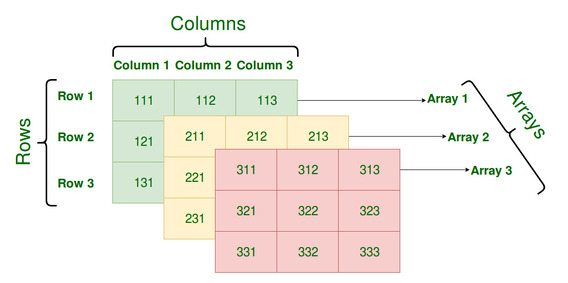

# <center><font face="黑体" font color=SeaGreen >PHP学习笔记</font></center>
<center><font face="楷体" size =5 >Jaren</font></center> 

[PHP参考手册](https://www.runoob.com/php/php-ref-array.html)
## 一、PHP 语法
PHP 脚本在服务器上执行，然后将纯 HTML 结果发送回浏览器。
### 基本的 PHP 语法
PHP 脚本可以放在文档中的任何位置。
PHP 脚本以 `<?php` 开始，以 `?>` 结束：
```
<?php
// PHP 代码
?>
```
PHP 文件的默认文件扩展名是 `.php`。
PHP 文件通常包含 HTML 标签和一些 PHP 脚本代码。
PHP 中的每个代码行都必须以分号`;`结束。分号是一种分隔符，用于把指令集区分开来。
通过 PHP，有两种在浏览器输出文本的基础指令：`echo` 和 `print`。

### PHP 中的注释
```
<!DOCTYPE html>
<html>
<body><?php
// 这是 PHP 单行注释
/*
这是 
PHP 多行
注释
*/
?>
</body>
</html>
```

## 二、PHP 变量
变量是用于存储信息的"容器"：
```
<?php
$x=5;
$y=6;
$z=$x+$y;
echo $z;
?>
```

与代数类似，可以给 PHP 变量赋予某个值（x=5）或者表达式（z=x+y）。

变量可以是很短的名称（如 x 和 y）或者更具描述性的名称（如 age、carname、totalvolume）。

PHP 变量规则：
- 变量以 `$` 符号开始，后面跟着变量的名称
- 变量名必须以字母或者下划线字符开始
- 变量名只能包含字母、数字以及下划线（A-z、0-9 和 _ ）
- 变量名不能包含空格
- 变量名是区分大小写的（`$y` 和 `$Y` 是两个不同的变量）
（PHP 语句和 PHP 变量都是区分大小写的。）

### 创建（声明）PHP 变量
PHP**没有**声明变量的命令。

变量在您第一次赋值给它的时候被创建：
```
<?php
$txt="Hello world!";
$x=5;
$y=10.5;
?>
```
在上面的语句执行中，变量 txt 将保存值 Hello world!，且变量 x 将保存值 5。
注：当您赋一个文本值给变量时，请在文本值两侧加上"引号"。

### PHP 是一门弱类型语言
在上面的实例中，我们注意到，**不必向 PHP 声明该变量的数据类型。**

PHP 会根据变量的值，自动把变量转换为正确的数据类型。

在强类型的编程语言中，我们必须在使用变量前先声明（定义）变量的类型和名称。

### PHP 变量作用域
变量的作用域是脚本中变量可被引用/使用的部分。

PHP 有四种不同的变量作用域：
- local
- global
- static
- parameter

### 局部和全局作用域
在所有函数外部定义的变量，拥有全局作用域。除了函数外，全局变量可以被脚本中的任何部分访问，要在一个函数中访问一个全局变量，需要使用 global 关键字。

在 PHP 函数内部声明的变量是局部变量，仅能在函数内部访问：
```
<?php
$x=5; // 全局变量

function myTest()
{
    $y=10; // 局部变量
    echo "<p>测试函数内变量:<p>";
    echo "变量 x 为: $x";
    echo "<br>";
    echo "变量 y 为: $y";
} 

myTest();

echo "<p>测试函数外变量:<p>";
echo "变量 x 为: $x";
echo "<br>";
echo "变量 y 为: $y";
?>
```

在以上实例中 myTest() 函数定义了 `$x` 和 `$y` 变量。 `$x` 变量在函数外声明，所以它是全局变量 ， `$y` 变量在函数内声明所以它是局部变量。

当我们调用myTest()函数并输出两个变量的值, 函数将会输出局部变量 `$y` 的值，但是不能输出 `$x` 的值，**因为 `$x` 变量在函数外定义，无法在函数内使用**，如果要在一个函数中访问一个全局变量，需要使用 global 关键字。

然后我们在myTest()函数外输出两个变量的值，函数将会输出全局变量 `$x` 的值，但是不能输出 `$y` 的值，因为 `$y` 变量在函数中定义，属于局部变量。

### PHP global 关键字
global 关键字用于函数内访问全局变量。

**在函数内调用函数外定义的全局变量**，我们需要在函数中的变量前加上 **global** 关键字：
```
<?php
$x=5;
$y=10;
 
function myTest()
{
    global $x,$y;
    $y=$x+$y;
}
 
myTest();
echo $y; // 输出 15
?>
```
PHP 将所有全局变量存储在一个名为 `$GLOBALS[index]` 的数组中。 `index` 保存变量的名称。这个数组可以在函数内部访问，也可以直接用来更新全局变量。
上面的实例可以写成这样：
```
<?php
$x=5;
$y=10;
 
function myTest()
{
    $GLOBALS['y']=$GLOBALS['x']+$GLOBALS['y'];
} 
 
myTest();
echo $y;
?>
```
### Static 作用域
当一个函数完成时，它的所有变量通常都会被删除。然而，有时候您希望某个局部变量不要被删除。

要做到这一点，请在您第一次声明变量时使用 `static` 关键字：
```
<?php
function myTest()
{
    static $x=0;
    echo $x;
    $x++;
    echo PHP_EOL;    // 换行符
}
 
myTest();
myTest();
myTest();
?>
```
然后，每次调用该函数时，该变量将会保留着函数前一次被调用时的值。

注释：该变量仍然是函数的局部变量。


### 参数作用域
参数是通过调用代码将值传递给函数的局部变量。

参数是在参数列表中声明的，作为函数声明的一部分：
```
<?php
function myTest($x)
{
    echo $x;
}
myTest(5);
?>
```

## 三、PHP echo 和 print 语句
在 PHP 中有两个基本的输出方式： echo 和 print。
### echo 和 print 区别:
- **echo** - 可以输出一个或多个字符串
- **print** - 只允许输出一个字符串，返回值总为 1
提示：echo 输出的速度比 print 快， echo 没有返回值，print有返回值1。
### PHP echo 语句
echo 是一个语言结构，使用的时候可以不用加括号，也可以加上括号： `echo` 或 `echo()`。

#### 显示字符串
下面的实例演示了如何使用 echo 命令输出字符串（字符串可以包含 HTML 标签）：
```
<?php
echo "<h2>PHP 很有趣!</h2>";
echo "Hello world!<br>";
echo "我要学 PHP!<br>";
echo "这是一个", "字符串，", "使用了", "多个", "参数。";
?>
```

#### 显示变量

下面的实例演示了如何使用 echo 命令输出变量和字符串：
```
<?php
$txt1="学习 PHP";
$txt2="RUNOOB.COM";
$cars=array("Volvo","BMW","Toyota");
 
echo $txt1;
echo "<br>";
echo "在 $txt2 学习 PHP ";
echo "<br>";
echo "我车的品牌是 {$cars[0]}";
?>
```


### PHP print 语句
print 同样是一个语言结构，可以使用括号，也可以不使用括号： `print` 或 `print()`。
#### 显示字符串

下面的实例演示了如何使用 print 命令输出字符串（字符串可以包含 HTML 标签）：
```
<?php
print "<h2>PHP 很有趣!</h2>";
print "Hello world!<br>";
print "我要学习 PHP!";
?>
```

#### 显示变量

下面的实例演示了如何使用 print 命令输出变量和字符串：
```
<?php
$txt1="学习 PHP";
$txt2="RUNOOB.COM";
$cars=array("Volvo","BMW","Toyota");
 
print $txt1;
print "<br>";
print "在 $txt2 学习 PHP ";
print "<br>";
print "我车的品牌是 {$cars[0]}";
?>
```


## 四、PHP 定界符EOF(heredoc)
PHP EOF(heredoc)是一种在命令行shell（如sh、csh、ksh、bash、PowerShell和zsh）和程序语言（像Perl、PHP、Python和Ruby）里定义一个字符串的方法。

PHP 定界符 EOF 的作用就是按照原样，包括换行格式什么的，输出在其内部的东西

在 PHP 定界符 EOF 中的任何特殊字符都不需要转义；

使用概述：
1. 必须后接分号，否则编译通不过。
2. EOF 可以用任意其它字符代替，只需保证结束标识与开始标识一致。
3. **结束标识必须顶格独自占一行(即必须从行首开始，前后不能衔接任何空白和字符)。**
4. 开始标识可以不带引号或带单双引号，不带引号与带双引号效果一致，解释内嵌的变量和转义符号，带单引号则不解释内嵌的变量和转义符号。
5. 当内容需要内嵌引号（单引号或双引号）时，不需要加转义符，本身对单双引号转义，此处相当与q和qq的用法。
```
<?php
echo <<<EOF
        <h1>我的第一个标题</h1>
        <p>我的第一个段落。</p>
EOF;
// 结束需要独立一行且前后不能空格
?>
```
注意：
1. 以 `<<<EOF` 开始标记开始，以 `EOF `结束标记结束，结束标记必须**顶头**写，**不能有缩进和空格**，且在结束标记**末尾要有分号** 。

2. 开始标记和结束标记相同，比如常用大写的 `EOT、EOD、EOF` 来表示，但是不只限于那几个(也可以用：JSON、HTML等)，只要保证开始标记和结束标记不在正文中出现即可。

3. 位于开始标记和结束标记之间的变量可以被正常解析，但是函数则不可以。在 heredoc 中，变量不需要用连接符 `.` 或 `,` 来拼接，如下：
```
<?php
$name="runoob";
$a= <<<EOF
        "abc"$name
        "123"
EOF;
// 结束需要独立一行且前后不能空格
echo $a;
?>
```
运行结果：


## 五、PHP 数据类型
PHP 变量存储不同的类型的数据，不同的数据类型可以做不一样的事情。

PHP 支持以下几种数据类型:
- String（字符串）
- Integer（整型）
- Float（浮点型）
- Boolean（布尔型）
- Array（数组）
- Object（对象）
- NULL（空值）
- Resource（资源类型）


### PHP 字符串
一个字符串是一串字符的序列，就像 "Hello world!"。

你可以将任何文本放在单引号和双引号中：
```
<?php 
$x = "Hello world!";
echo $x;
echo "<br>"; 
$x = 'Hello world!';
echo $x;
?>
```

### PHP 整型
整数是一个没有小数的数字。

整数规则:
- 整数必须至少有一个数字 (0-9)
- 整数不能包含逗号或空格
- 整数是没有小数点的
- 整数可以是正数或负数
- 整型可以用三种格式来指定：十进制， 十六进制（ 以 0x 为前缀）或八进制（前缀为 0）。

在以下实例中我们将测试不同的数字。
(PHP `var_dump()` 函数返回变量的数据类型和值：)
```
<?php 
$x = 5985;
var_dump($x);
echo "<br>"; 
$x = -345; // 负数 
var_dump($x);
echo "<br>"; 
$x = 0x8C; // 十六进制数
var_dump($x);
echo "<br>";
$x = 047; // 八进制数
var_dump($x);
?>
```
### PHP 浮点型
浮点数是带小数部分的数字，或是指数形式。
```
<?php 
$x = 10.365;
var_dump($x);
echo "<br>"; 
$x = 2.4e3;
var_dump($x);
echo "<br>"; 
$x = 8E-5;
var_dump($x);
?>
```
### PHP 布尔型
布尔型可以是 TRUE 或 FALSE。
```
$x=true;
$y=false;
```
布尔型通常用于条件判断。

### PHP 数组
数组可以在一个变量中存储多个值。

在以下实例中创建了一个数组， 然后使用 PHP `var_dump()` 函数返回数组的数据类型和值：
```
<?php 
$cars=array("Volvo","BMW","Toyota");
var_dump($cars);
?>
```

### PHP 对象
对象数据类型也可以用于存储数据。

在 PHP 中，对象必须声明。

首先，你必须使用`class`关键字声明类对象。类是可以包含属性和方法的结构。

然后我们在类中定义数据类型，然后在实例化的类中使用数据类型：
```
<?php
class Car
{
  var $color;
  function __construct($color="green") {
    $this->color = $color;
  }
  function what_color() {
    return $this->color;
  }
}
?>
```

以上实例中PHP关键字this就是指向当前对象实例的指针，不指向任何其他对象或类。

### PHP NULL 值
NULL 值表示变量没有值。NULL 是数据类型为 NULL 的值。

NULL 值指明一个变量是否为空值。 同样可用于数据空值和NULL值的区别。

可以通过设置变量值为 NULL 来清空变量数据：
```
<?php
$x="Hello world!";
$x=null;
var_dump($x);
?>
```
### PHP 资源类型
PHP 资源 resource 是一种特殊变量，保存了到外部资源的一个引用。

常见资源数据类型有打开文件、数据库连接、图形画布区域等。

由于资源类型变量保存有为打开文件、数据库连接、图形画布区域等的特殊句柄，因此将其它类型的值转换为资源没有意义。

使用 `get_resource_type()` 函数可以返回资源（resource）类型：
`get_resource_type(resource $handle): string`
此函数返回一个字符串，用于表示传递给它的 resource 的类型。如果参数不是合法的 resource，将产生错误。
如下实例：
```
<?php
$c = mysql_connect();
echo get_resource_type($c)."\n";
// 打印：mysql link

$fp = fopen("foo","w");
echo get_resource_type($fp)."\n";
// 打印：file

$doc = new_xmldoc("1.0");
echo get_resource_type($doc->doc)."\n";
// 打印：domxml document
?>
```

## 六、PHP 类型比较
虽然 PHP 是弱类型语言，但也需要明白变量类型及它们的意义，因为我们经常需要对 PHP 变量进行比较，包含松散和严格比较。
- 松散比较：使用两个等号 `==` 比较，只比较值，不比较类型。
- 严格比较：用三个等号 `===` 比较，除了比较值，也比较类型。

例如:`"42"` 是一个字符串而 `42` 是一个整数。`FALSE` 是一个布尔值而 `"FALSE"` 是一个字符串。
```
<?php
if(42 == "42") {
    echo '1、值相等';
}
 
echo PHP_EOL; // 换行符
 
if(42 === "42") {
    echo '2、类型相等';
} else {
    echo '3、类型不相等';
}
?>
```
以上实例输出结果为：
```
1、值相等
3、类型不相等
```
#### PHP中 比较 0、false、null
测试代码:
```
<?php
echo '0 == false: ';
var_dump(0 == false);
echo '0 === false: ';
var_dump(0 === false);
echo PHP_EOL;
echo '0 == null: ';
var_dump(0 == null);
echo '0 === null: ';
var_dump(0 === null);
echo PHP_EOL;
echo 'false == null: ';
var_dump(false == null);
echo 'false === null: ';
var_dump(false === null);
echo PHP_EOL;
echo '"0" == false: ';
var_dump("0" == false);
echo '"0" === false: ';
var_dump("0" === false);
echo PHP_EOL;
echo '"0" == null: ';
var_dump("0" == null);
echo '"0" === null: ';
var_dump("0" === null);
echo PHP_EOL;
echo '"" == false: ';
var_dump("" == false);
echo '"" === false: ';
var_dump("" === false);
echo PHP_EOL;
echo '"" == null: ';
var_dump("" == null);
echo '"" === null: ';
var_dump("" === null);
```
以上实例输出结果为：
```
0 == false: bool(true)
0 === false: bool(false)

0 == null: bool(true)
0 === null: bool(false)

false == null: bool(true)
false === null: bool(false)

"0" == false: bool(true)
"0" === false: bool(false)

"0" == null: bool(false)
"0" === null: bool(false)

"" == false: bool(true)
"" === false: bool(false)

"" == null: bool(true)
"" === null: bool(false)
```


## 七、PHP 常量

常量是一个简单值的标识符。常量值被定义后，在脚本的其他任何地方都不能被改变。

一个常量由英文字母、下划线、和数字组成,但数字不能作为首字母出现。 (常量名不需要加 `$` 修饰符)。

注意： 常量在整个脚本中都可以使用。

### 设置 PHP 常量
设置常量，使用` define() `函数，函数语法如下：
`bool define ( string $name , mixed $value [, bool $case_insensitive = false ] )`
该函数有三个参数:
- name：必选参数，常量名称，即标志符。
- value：必选参数，常量的值。
- case_insensitive ：可选参数，如果设置为 TRUE，该常量则大小写不敏感，默认是大小写敏感的。(<small>注：自 PHP 7.3.0 开始，定义不区分大小写的常量已被弃用。从 PHP 8.0.0 开始，只有 false 是可接受的值，传递 true 将产生一个警告。</small>)
以下实例我们创建一个 不区分大小写的常量, 常量值为 "菜鸟的学习笔记"：
```
<?php
// 不区分大小写的常量名
define("JAREN", "菜鸟的学习笔记", true);
echo jaren;  // 输出 "菜鸟的学习笔记"
?>
```

使用常量时，不能在常量名前添加`$` 符号，不然会将常量转换成新的未定义变量使用，会导致报错。
```
<?php
define('LOG','OPEN');//定义常量，常量使用不能添加$
echo $LOG;
?>
```
### 常量是全局的
常量在定义后，默认是全局变量，可以在整个运行的脚本的任何地方使用。

## 八、PHP 字符串变量
字符串变量用于存储并处理文本。
### PHP 中的字符串变量
字符串变量用于包含有字符的值。

在创建字符串之后，我们就可以对它进行操作了。您可以直接在函数中使用字符串，或者把它存储在变量中。

在下面的实例中，我们创建一个名为 txt 的字符串变量，并赋值为 "Hello world!" 。然后我们输出 txt 变量的值：
```
<?php
$txt="Hello world!";
echo $txt;
?>
```
注释：当您赋一个文本值给变量时，请记得给文本值加上单引号或者双引号。

### 常用的操作字符串的函数和运算符
#### PHP 并置运算符
在 PHP 中，只有一个字符串运算符。

并置运算符 (`.`) 用于把两个字符串值连接起来。

下面的实例演示了如何将两个字符串变量连接在一起：
```
<?php
$txt1="Hello world!";
$txt2="What a nice day!";
echo $txt1 . " " . $txt2;
?>
```
上面的代码将输出：Hello world! What a nice day!
我们已经使用了两次并置运算符。这是由于我们需要在两个字符串之间插入一个空格。
#### PHP strlen() 函数
有时知道字符串值的长度是很有用的。

`strlen()` 函数返回字符串的长度（字节数）。

下面的实例返回字符串 "Hello world!" 的长度：
```
<?php
echo strlen("Hello world!");
?>
```
上面的代码将输出：12

提示：`strlen()` 常常用在循环和其他函数中，因为那时确定字符串何时结束是很重要的。（例如，在循环中，我们需要在字符串中的最后一个字符之后结束循环。）
#### PHP strpos() 函数
`strpos()` 函数用于在字符串内查找一个字符或一段指定的文本。

如果在字符串中找到匹配，该函数会返回第一个匹配的字符位置。如果未找到匹配，则返回 FALSE。

下面的实例在字符串 "Hello world!" 中查找文本 "world"：
```
<?php
echo strpos("Hello world!","world");
?>
```
上面的代码将输出：6

提示：在上面的实例中，字符串 "world" 的位置是 6。之所以是 6 而不是 7 的原因是，字符串中第一个字符的位置是 0，而不是 1

#### 完整的 PHP String 参考手册
[PHP String 参考手册](https://www.runoob.com/php/php-ref-string.html)

## 九、PHP 运算符
本章节我们将讨论 PHP 中不同运算符的应用。
在 PHP 中，赋值运算符 `=` 用于给变量赋值。
在 PHP 中，算术运算符 `+` 用于把值加在一起。
### PHP 算术运算符

PHP7+ 版本新增整除运算符 `intdiv()`，该函数返回值为第一个参数除于第二个参数的值并取整（向下取整）
```
<?php
var_dump(intdiv(10, 3));
?>
```
以上实例会输出：
`int(3)`

### PHP 赋值运算符
在 PHP 中，基本的赋值运算符是 `=`。它意味着左操作数被设置为右侧表达式的值。也就是说，`$x = 5`的值是 5。
|运算符	|等同于|	描述|
|:-|:-|:-|
|x = y|	x = y|	左操作数被设置为右侧表达式的值|
|x += y|	x = x + y|	加|
|x -= y|	x = x - y|	减|
|x *= y|	x = x * y|	乘|
|x /= y|	x = x / y|	除|
|x %= y|	x = x % y|	模|
|a .= b|	a = a . b|	连接两个字符串|

### PHP 递增/递减运算符
|运算符|	名称|	描述|
|:-|:-|:-|
|++ x|	预递增|	x 加 1，然后返回 x|
|x ++|	后递增|	返回 x，然后 x 加 1|
|-- x|	预递减|	x 减 1，然后返回 x|
|x --|	后递减|	返回 x，然后 x 减 1|

### PHP 比较运算符
比较操作符可以让您比较两个值
|运算符	|名称|	描述|	实例|
|:-|:-|:-|:-|
|x == y|	等于|	如果 x 等于 y，则返回 true|	5==8 返回 false|
|x === y|	绝对等于|	如果 x 等于 y，且它们类型相同，则返回 true|	5==="5" 返回 false|
|x != y|	不等于|	如果 x 不等于 y，则返回 true	|5!=8 返回 true|
|x <> y|	不等于|	如果 x 不等于 y，则返回 true|	5<>8 返回 true|
|x !== y|	不绝对等于|	如果 x 不等于 y，或它们类型不相同，则返回 true|	5!=="5" 返回 true|
|x > y|	大于|	如果 x 大于 y，则返回 true|	5>8 返回 false|
|x < y|	小于|	如果 x 小于 y，则返回 true|	5<8 返回 true|
|x >= y|	大于等于|	如果 x 大于或者等于 y，则返回 true|	5>=8 返回 false|
|x <= y|	小于等于|	如果 x 小于或者等于 y，则返回 true|	5<=8 返回 true|

### PHP 逻辑运算符


### PHP 数组运算符
|运算符	|名称|	描述|
|:-|:-|:-|
|x + y|	集合|	x 和 y 的集合|
|x == y|	相等|	如果 x 和 y 具有相同的键/值对，则返回 true|
|x === y|	恒等|	如果 x 和 y 具有相同的键/值对，且顺序相同类型相同，则返回 true|
|x != y|	不相等|	如果 x 不等于 y，则返回 true|
|x <> y|	不相等|	如果 x 不等于 y，则返回 true|
|x !== y|	不恒等|	如果 x 不等于 y，则返回 true|


### 三元运算符
另一个条件运算符是"`  ?  :  `"（或三元）运算符 。
语法格式
`(expr1) ? (expr2) : (expr3) `
对 expr1 求值为 TRUE 时的值为 expr2，在 expr1 求值为 FALSE 时的值为 expr3。

自 PHP 5.3 起，可以省略三元运算符中间那部分。表达式 expr1 ?: expr3 在 expr1 求值为 TRUE 时返回 expr1，否则返回 expr3。

以下实例中通过判断 `$_GET` 请求中含有 user 值，如果有返回 `$_GET['user']`，否则返回 nobody：
```
<?php
// 普通写法
$username = isset($_GET['user']) ? $_GET['user'] : 'nobody';
echo $username, PHP_EOL;
 
// PHP 5.3+ 版本写法
$username = $_GET['user'] ?: 'nobody';
echo $username, PHP_EOL;
?>
```
注意：`PHP_EOL` 是一个换行符，兼容更大平台。

在 PHP7+ 版本多了一个 NULL 合并运算符 `??`，实例如下：
```
<?php
// 如果 $_GET['user'] 不存在返回 'nobody'，否则返回 $_GET['user'] 的值
$username = $_GET['user'] ?? 'nobody';
// 类似的三元运算符
$username = isset($_GET['user']) ? $_GET['user'] : 'nobody';
?>
```

### 组合比较符(PHP7+)
PHP7+ 支持组合比较符（combined comparison operator）也称之为太空船操作符，符号为 `<=>`。组合比较运算符可以轻松实现两个变量的比较，当然不仅限于数值类数据的比较。
语法格式如下：
`$c = $a <=> $b;`
解析如下：

- 如果 `$a > $b`, 则 `$c` 的值为 1。
- 如果 `$a == $b`, 则 `$c` 的值为 0。
- 如果 `$a < $b`, 则 `$c` 的值为 -1。
```
<?php
// 整型
echo 1 <=> 1; // 0
echo 1 <=> 2; // -1
echo 2 <=> 1; // 1
 
// 浮点型
echo 1.5 <=> 1.5; // 0
echo 1.5 <=> 2.5; // -1
echo 2.5 <=> 1.5; // 1
 
// 字符串
echo "a" <=> "a"; // 0
echo "a" <=> "b"; // -1
echo "b" <=> "a"; // 1
?>
```

### 运算符优先级
下表按照优先级从高到低列出了运算符。同一行中的运算符具有相同优先级，此时它们的结合方向决定求值顺序。

说明：左 ＝ 从左到右，右 ＝ 从右到左。

|结合方向|	运算符|	附加信息|
|:-|:-|:-|
|无|	clone new|	clone 和 new|
|左|	\[|	array()|
|右|	++ -- ~ (int) (float) (string) (array) (object) (bool) @|	类型和递增／递减|
|无|	instanceof	|类型|
|右|	!	|逻辑运算符|
|左|	* / %	|算术运算符|
|左|	+ – .	|算术运算符和字符串运算符|
|左|	<< >>	|位运算符|
|无|	== != === !== <>	|比较运算符|
|左|	&	|位运算符和引用|
|左|	^	|位运算符|
|左|	\|	|位运算符|
|左|	&&	|逻辑运算符|
|左|	\|\|	|逻辑运算符|
|左|	? :	|三元运算符|
|右|	= += -= *= /= .= %= &= |= ^= <<= >>= =>	|赋值运算符|
|左|	and	|逻辑运算符|
|左|	xor	|逻辑运算符|
|左|	or	|逻辑运算符|
|左|	,	|多处用到|

运算符优先级中，or 和 ||，&& 和 and 都是逻辑运算符，效果一样，但是其优先级却不一样。
```
<?php
// 优先级： &&  >  =  >  and
// 优先级： ||  >  =  >  or
 
$a = 3;
$b = false;
$c = $a or $b;
var_dump($c);          // 这里的 $c 为 int 值3，而不是 boolean 值 true
$d = $a || $b;
var_dump($d);          //这里的 $d 就是 boolean 值 true 
?>
```
以上实例输出结果为：
```
int(3)
bool(true)
```
#### 括号的使用
我们通过括号的配对来明确标明运算顺序，而非靠运算符优先级和结合性来决定，通常能够增加代码的可读性。
```
<?php
// 括号优先运算
 
$a = 1;
$b = 2;
$c = 3;
$d = $a + $b * $c;
echo $d;
echo "\n";
$e = ($a + $b) * $c;  // 使用括号
echo $e;
echo "\n";
?>
```
以上实例输出结果为：
`7  9`

## 十、PHP If...Else 语句
条件语句用于根据不同条件执行不同动作。
### PHP 条件语句
当您编写代码时，您常常需要为不同的判断执行不同的动作。您可以在代码中使用条件语句来完成此任务。
在 PHP 中，提供了下列条件语句：

- if 语句 - 在条件成立时执行代码
- if...else 语句 - 在条件成立时执行一块代码，条件不成立时执行另一块代码
- if...elseif....else 语句 - 在若干条件之一成立时执行一个代码块
- switch 语句 - 在若干条件之一成立时执行一个代码块
### PHP - if 语句
if 语句用于**仅当指定条件成立时执行代码。**
语法
```
if (条件)
{
    条件成立时要执行的代码;
}

```
### PHP - if...else 语句
在条件成立时执行一块代码，条件不成立时执行另一块代码，请使用 if....else 语句。

语法
```
if (条件)
{
条件成立时执行的代码;
}
else
{
条件不成立时执行的代码;
}
```
### PHP - if...elseif....else 语句
在若干条件之一成立时执行一个代码块，请使用 if....elseif...else 语句。.

语法
```
if (条件)
{
    if 条件成立时执行的代码;
}
elseif (条件)
{
    elseif 条件成立时执行的代码;
}
else
{
    条件不成立时执行的代码;
}
```
### PHP Switch 语句
如果您希望**有选择地执行若干代码块之一**，请使用 switch 语句。
```
<?php
switch (expression) {
    case value1:
        // 代码块1
        break;
    case value2:
        // 代码块2
        break;
    // 更多的 case 语句
    default:
        // 如果没有匹配的值
}
?>
```
参数说明：

- expression 是要被比较的表达式。
- case value: 是可能的值，如果 - expression 的值等于某个 case 的值，就执行相应的代码块。
- break; 用于终止 switch 语句，防止继续执行下一个 case。
- default: 是可选的，用于指定当没有匹配的 case 时执行的代码块。

## 十一、PHP 数组
数组能够在单个变量中存储多个值：
```
<?php
$cars=array("Volvo","BMW","Toyota");
echo "I like " . $cars[0] . ", " . $cars[1] . " and " . $cars[2] . ".";
?>
```
### 在 PHP 中创建数组
在 PHP 中，`array()` 函数用于创建数组：
在 PHP 中，有三种类型的数组：

- 数值数组 - 带有数字 ID 键的数组
- 关联数组 - 带有指定的键的数组，每个键关联一个值
- 多维数组 - 包含一个或多个数组的数组

### PHP 数值数组
这里有两种创建数值数组的方法：

自动分配 ID 键（ID 键总是从 0 开始）：
`$cars=array("Volvo","BMW","Toyota");`
人工分配 ID 键：
```
$cars[0]="Volvo";
$cars[1]="BMW";
$cars[2]="Toyota";
```
下面的实例创建一个名为 `$cars` 的数值数组，并给数组分配三个元素,然后打印一段包含数组值的文本：
```
<?php
$cars=array("Volvo","BMW","Toyota");
echo "I like " . $cars[0] . ", " . $cars[1] . " and " . $cars[2] . ".";
?>
```

### 获取数组的长度 -  count() 函数
`count()` 函数用于返回数组的长度（元素的数量）：
```
<?php
$cars=array("Volvo","BMW","Toyota");
echo count($cars);
?>
```
### 遍历数值数组
遍历并打印数值数组中的所有值，您可以使用 for 循环，如下所示：
```
<?php
$cars=array("Volvo","BMW","Toyota");
$arrlength=count($cars);
 
for($x=0;$x<$arrlength;$x++)
{
    echo $cars[$x];
    echo "<br>";
}
?>
```
### PHP 关联数组
关联数组是使用您分配给数组的指定的**键**的数组。

这里有两种创建关联数组的方法：
`$age=array("Peter"=>"35","Ben"=>"37","Joe"=>"43");`
or:
```
$age['Peter']="35";
$age['Ben']="37";
$age['Joe']="43";
```
随后可以在脚本中使用指定的**键**：
```
<?php
$age=array("Peter"=>"35","Ben"=>"37","Joe"=>"43");
echo "Peter is " . $age['Peter'] . " years old.";
?>
```
### 遍历关联数组
遍历并打印关联数组中的所有值，您可以使用 `foreach` 循环，如下所示
```
<?php
$age=array("Peter"=>"35","Ben"=>"37","Joe"=>"43");
 
foreach($age as $x=>$x_value)
{
    echo "Key=" . $x . ", Value=" . $x_value;
    echo "<br>";
}
?>
```
### 多维数组

多维数组是包含一个或多个数组的数组。

在多维数组中，主数组中的每一个元素也可以是一个数组，子数组中的每一个元素也可以是一个数组。

一个数组中的值可以是另一个数组，另一个数组的值也可以是一个数组，依照这种方式，我们可以创建二维或者三维数组。
#### 二维数组
二维数组语法格式：
```
array (
    array (elements...),
    array (elements...),
    ...
)
```

以上数组的元素会自动分配键值，从 0 开始：
```
<?php
// 二维数组:
$cars = array
(
    array("Volvo",100,96),
    array("BMW",60,59),
    array("Toyota",110,100)
);
?>
```
以下实例，我们创建了指定键（关联数组）的二维数组：
```
<?php
$sites = array
(
    "runoob"=>array
    (
        "菜鸟教程",
        "http://www.runoob.com"
    ),
    "google"=>array
    (
        "Google 搜索",
        "http://www.google.com"
    ),
    "taobao"=>array
    (
        "淘宝",
        "http://www.taobao.com"
    )
);
print("<pre>"); // 格式化输出数组
print_r($sites);
print("</pre>");
?>
```
上面的数组将输出如下：

让我们试着显示上面数组中的某个值：

`echo $sites['runoob'][0] . '地址为：' . $sites['runoob'][1];`
上面的代码将输出：

#### 三维数组
三维数组是在二维数组的基础上再嵌套一层数组，格式如下：
```
array (
    array (
        array (elements...),
        array (elements...),
        ...
    ),
    array (
        array (elements...),
        array (elements...),
        ...
    ),
    ...
)
```

```
<?php
// 创建三维数组
$myarray = array(
    array(
        array(1, 2),
        array(3, 4),
    ),
    array(
        array(5, 6),
        array(7, 8),
    ),
);
      
// 输出数组信息
print_r($myarray);
?>
```
上面的数组将输出如下：
```
Array
(
    [0] => Array
        (
            [0] => Array
                (
                    [0] => 1
                    [1] => 2
                )

            [1] => Array
                (
                    [0] => 3
                    [1] => 4
                )

        )

    [1] => Array
        (
            [0] => Array
                (
                    [0] => 5
                    [1] => 6
                )

            [1] => Array
                (
                    [0] => 7
                    [1] => 8
                )

        )

)
```
### 完整的 PHP Array 参考手册
[PHP Array 参考手册](https://runoob.com/php/php-ref-array.html)

## 十二、PHP 数组排序
数组中的元素可以按字母或数字顺序进行降序或升序排列。
### PHP - 数组排序函数
- sort() - 对数组进行升序排列
- rsort() - 对数组进行降序排列
- asort() - 根据关联数组的值，对数组进行升序排列
- ksort() - 根据关联数组的键，对数组进行升序排列
- arsort() - 根据关联数组的值，对数组进行降序排列
- krsort() - 根据关联数组的键，对数组进行降序排列

#### sort() - 对数组进行升序排列
下面的实例将 $cars 数组中的元素按照字母升序排列：
```
<?php
$numbers=array(4,6,2,22,11);
sort($numbers);
?>
```
#### rsort() - 对数组进行降序排列
下面的实例将 $cars 数组中的元素按照字母降序排列：
```
<?php
$cars=array("Volvo","BMW","Toyota");
rsort($cars);
?>
```
下面的实例将 $numbers 数组中的元素按照数字降序排列：
```
<?php
$numbers=array(4,6,2,22,11);
rsort($numbers);
?>
```
#### asort() - 根据数组的值，对数组进行升序排列
下面的实例根据数组的值，对关联数组进行升序排列：
```
<?php
$age=array("Peter"=>"66","Ben"=>"37","Joe"=>"43");
asort($age);
?>
```
#### ksort() - 根据数组的键，对数组进行升序排列
下面的实例根据数组的键，对关联数组进行升序排列：
```
<?php
$age=array("C"=>"35","B"=>"37","A"=>"43");
ksort($age);
?>
```
#### arsort() - 根据数组的值，对数组进行降序排列
下面的实例根据数组的值，对关联数组进行降序排列：
```
<?php
$age=array("Peter"=>"35","Ben"=>"37","Joe"=>"43");
arsort($age);
?>
```
#### krsort() - 根据数组的键，对数组进行降序排列
下面的实例根据数组的键，对关联数组进行降序排列：
```
<?php
$age=array("Peter"=>"35","Ben"=>"37","Joe"=>"43");
krsort($age);
?>
```
## 十三、PHP 超级全局变量
超级全局变量在PHP 4.1.0之后被启用, 是PHP系统中自带的变量，在一个脚本的全部作用域中都可用。
### PHP 超级全局变量
PHP中预定义了几个超级全局变量（superglobals） ，这意味着它们在一个脚本的全部作用域中都可用。 你不需要特别说明，就可以在函数及类中使用。
PHP 超级全局变量列表:
- $GLOBALS
- $_SERVER
- $_REQUEST
- $_POST
- $_GET
- $_FILES
- $_ENV
- $_COOKIE
- $_SESSION

#### PHP $GLOBALS
$GLOBALS 是PHP的一个超级全局变量组，在一个PHP脚本的全部作用域中都可以访问。

$GLOBALS 是一个包含了全部变量的全局组合数组。变量的名字就是数组的键。

以下实例介绍了如何使用超级全局变量 $GLOBALS:
```
<?php 
$x = 75; 
$y = 25;
 
function addition() 
{ 
    $GLOBALS['z'] = $GLOBALS['x'] + $GLOBALS['y']; 
}
 
addition(); 
echo $z; 
?>
```
以上实例中 z 是一个$GLOBALS数组中的超级全局变量，该变量同样可以在函数外访问。

#### PHP $_SERVER
$_SERVER 是一个包含了诸如头信息(header)、路径(path)、以及脚本位置(script locations)等等信息的数组。这个数组中的项目由 Web 服务器创建。不能保证每个服务器都提供全部项目；服务器可能会忽略一些，或者提供一些没有在这里列举出来的项目。

以下实例中展示了如何使用$_SERVER中的元素:
```
<?php 
echo $_SERVER['PHP_SELF'];
echo "<br>";
echo $_SERVER['SERVER_NAME'];
echo "<br>";
echo $_SERVER['HTTP_HOST'];
echo "<br>";
echo $_SERVER['HTTP_REFERER'];
echo "<br>";
echo $_SERVER['HTTP_USER_AGENT'];
echo "<br>";
echo $_SERVER['SCRIPT_NAME'];
?>
```
下表列出了所有 $_SERVER 变量中的重要元素:
|元素/代码|	描述|
|:-|:-|
|$_SERVER['PHP_SELF']|	当前执行脚本的文件名，与 document root 有关。例如，在地址为 `http://example.com/test.php/foo.bar` 的脚本中使用 ` $_SERVER['PHP_SELF']` 将得到 `/test.php/foo.bar`。`__FILE__` 常量包含当前(例如包含)文件的完整路径和文件名。 从 PHP 4.3.0 版本开始，如果 PHP 以命令行模式运行，这个变量将包含脚本名。之前的版本该变量不可用。|
|$_SERVER['GATEWAY_INTERFACE']	|服务器使用的 CGI 规范的版本；例如，"CGI/1.1"。|
|$_SERVER['SERVER_ADDR']|	当前运行脚本所在的服务器的 IP 地址。|
|$_SERVER['SERVER_NAME']	|当前运行脚本所在的服务器的主机名。如果脚本运行于虚拟主机中，该名称是由那个虚拟主机所设置的值决定。(如: `www.google.com`)|
|$_SERVER['SERVER_SOFTWARE']|	服务器标识字符串，在响应请求时的头信息中给出。 (如：Apache/2.2.24)|
|$_SERVER['SERVER_PROTOCOL']|	请求页面时通信协议的名称和版本。例如，"HTTP/1.0"。|
|$_SERVER['REQUEST_METHOD']	|访问页面使用的请求方法；例如，"GET", "HEAD"，"POST"，"PUT"。|
|$_SERVER['REQUEST_TIME']	|请求开始时的时间戳。从 PHP 5.1.0 起可用。 (如：1377687496)|
|$_SERVER['QUERY_STRING']	|query string（查询字符串），如果有的话，通过它进行页面访问。|
|$_SERVER['HTTP_ACCEPT']|	当前请求头中 Accept: 项的内容，如果存在的话。|
|$_SERVER['HTTP_ACCEPT_CHARSET']|	当前请求头中 Accept-Charset: 项的内容，如果存在的话。例如："iso-8859-1,*,utf-8"。|
|$_SERVER['HTTP_HOST']	|当前请求头中 Host: 项的内容，如果存在的话。|
|$_SERVER['HTTP_REFERER']|	引导用户代理到当前页的前一页的地址（如果存在）。由 user agent 设置决定。并不是所有的用户代理都会设置该项，有的还提供了修改 HTTP_REFERER 的功能。简言之，该值并不可信。|
|$_SERVER['HTTPS']	|如果脚本是通过 HTTPS 协议被访问，则被设为一个非空的值。|
|$_SERVER['REMOTE_ADDR']|	浏览当前页面的用户的 IP 地址。|
|$_SERVER['REMOTE_HOST']|	浏览当前页面的用户的主机名。DNS 反向解析不依赖于用户的 REMOTE_ADDR。|
|$_SERVER['REMOTE_PORT']|	用户机器上连接到 Web 服务器所使用的端口号。|
|$_SERVER['SCRIPT_FILENAME']|	当前执行脚本的绝对路径。|
|$_SERVER['SERVER_ADMIN']|	该值指明了 Apache 服务器配置文件中的 SERVER_ADMIN 参数。如果脚本运行在一个虚拟主机上，则该值是那个虚拟主机的值。(如：someone@goole.com)|
|$_SERVER['SERVER_PORT']|	Web 服务器使用的端口。默认值为 "80"。如果使用 SSL 安全连接，则这个值为用户设置的 HTTP 端口。|
|$_SERVER['SERVER_SIGNATURE']|	包含了服务器版本和虚拟主机名的字符串。|
|$_SERVER['PATH_TRANSLATED']|	当前脚本所在文件系统（非文档根目录）的基本路径。这是在服务器进行虚拟到真实路径的映像后的结果。|
|$_SERVER['SCRIPT_NAME']|	包含当前脚本的路径。这在页面需要指向自己时非常有用。`__FILE__` 常量包含当前脚本(例如包含文件)的完整路径和文件名。|
|$_SERVER['SCRIPT_URI']|	URI 用来指定要访问的页面。例如 "/index.html"。|

#### PHP $_REQUEST
PHP $_REQUEST 用于收集HTML表单提交的数据。

以下实例显示了一个输入字段（input）及提交按钮(submit)的表单(form)。 当用户通过点击 "Submit" 按钮提交表单数据时, 表单数据将发送至`<form>`标签中 action 属性中指定的脚本文件。 在这个实例中，我们指定文件来处理表单数据。如果你希望其他的PHP文件来处理该数据，你可以修改该指定的脚本文件名。 然后，我们可以使用超级全局变量 $_REQUEST 来收集表单中的 input 字段数据:
```
<html>
<body>
 
<form method="post" action="<?php echo $_SERVER['PHP_SELF'];?>">
Name: <input type="text" name="fname">
<input type="submit">
</form>
 
<?php 
$name = $_REQUEST['fname']; 
echo $name; 
?>
 
</body>
</html>
```
#### PHP $_POST
PHP $_POST 被广泛应用于收集表单数据，在HTML form标签的指定该属性："method="post"。

以下实例显示了一个输入字段（input）及提交按钮(submit)的表单(form)。 当用户通过点击 "Submit" 按钮提交表单数据时, 表单数据将发送至`<form>`标签中 action 属性中指定的脚本文件。 在这个实例中，我们指定文件来处理表单数据。如果你希望其他的PHP文件来处理该数据，你可以修改该指定的脚本文件名。 然后，我们可以使用超级全局变量 `$_POST` 来收集表单中的 input 字段数据:
```
<html>
<body>
 
<form method="post" action="<?php echo $_SERVER['PHP_SELF'];?>">
Name: <input type="text" name="fname">
<input type="submit">
</form>
 
<?php 
$name = $_POST['fname']; 
echo $name; 
?>
 
</body>
</html>
```
#### PHP $_GET
PHP `$_GET` 同样被广泛应用于收集表单数据，在HTML form标签的指定该属性："method="get"。

`$_GET` 也可以收集URL中发送的数据。

假定我们有一个包含参数的超链接HTML页面：

```
<html>
<body>
<a href="test_get.php?subject=PHP&web=runoob.com">Test $GET</a>
</body>
</html>
```
当用户点击链接 "`Test $GET`", 参数 "subject" 和 "web" 将发送至"test_get.php",你可以在 "test_get.php" 文件中使用 `$_GET` 变量来获取这些数据。

以下实例显示了 "test_get.php" 文件的代码:
```
<html>
<body>
 
<?php 
echo "Study " . $_GET['subject'] . " @ " . $_GET['web'];
?>
 
</body>
</html>
```

## 十四、PHP 循环
循环执行代码块指定的次数，或者当指定的条件为真时循环执行代码块。
在您编写代码时，您经常需要让相同的代码块一次又一次地重复运行。我们可以在代码中使用循环语句来完成这个任务。

在 PHP 中，提供了下列循环语句：
- **while** - 只要指定的条件成立，则循环执行代码块
- **do...while** - 首先执行一次代码块，然后在指定的条件成立时重复这个循环
- **for** - 循环执行代码块指定的次数
- **foreach** - 根据数组中每个元素来循环代码块
### While 循环
while 循环将重复执行代码块，直到指定的条件不成立。
语法
```
while (条件)
{
    要执行的代码;
}
```
下面的实例首先设置变量 i 的值为 1 ($i=1;)。

然后，只要 i 小于或者等于 5，while 循环将继续运行。循环每运行一次，i 就会递增 1：
```
<html>
<body>

<?php
$i=1;
while($i<=5)
{
    echo "The number is " . $i . "<br>";
    $i++;
}
?>

</body>
</html>
```
输出：
```
The number is 1
The number is 2
The number is 3
The number is 4
The number is 5
```

### do...while 循环
do...while 语句会至少执行一次代码，然后检查条件，只要条件成立，就会重复进行循环。
语法
```
do
{
    要执行的代码;
}
while (条件);
```
下面的实例首先设置变量 i 的值为 1 ($i=1;)。

然后，开始 do...while 循环。循环将变量 i 的值递增 1，然后输出。先检查条件（i 小于或者等于 5），只要 i 小于或者等于 5，循环将继续运行：
```
<html>
<body>

<?php
$i=1;
do
{
    $i++;
    echo "The number is " . $i . "<br>";
}
while ($i<=5);
?>

</body>
</html>
```
输出：
```
The number is 2
The number is 3
The number is 4
The number is 5
The number is 6
```
### for 循环
for 循环用于您预先知道脚本需要运行的次数的情况。
语法
```
for (初始值; 条件; 增量)
{
    要执行的代码;
}
```
参数：

- 初始值：主要是初始化一个变量值，用于设置一个计数器（但可以是任何在循环的开始被执行一次的代码）。
- 条件：循环执行的限制条件。如果为 TRUE，则循环继续。如果为 FALSE，则循环结束。
- 增量：主要用于递增计数器（但可以是任何在循环的结束被执行的代码）。

注释：上面的初始值和增量参数可为空，或者有多个表达式（用逗号分隔）。

下面的实例定义一个初始值为 i=1 的循环。只要变量 i 小于或者等于 5，循环将继续运行。循环每运行一次，变量 i 就会递增 1：
```
<?php
for ($i=1; $i<=5; $i++)
{
    echo "数字为 " . $i . PHP_EOL;
}
?>
```
输出：
```
数字为 1
数字为 2
数字为 3
数字为 4
数字为 5
```

### foreach 循环
foreach 循环用于遍历数组。
语法
```
foreach ($array as $value)
{
    要执行代码;
}
```
每进行一次循环，当前数组元素的值就会被赋值给 $value 变量（数组指针会逐一地移动），在进行下一次循环时，您将看到数组中的下一个值。
```
foreach ($array as $key => $value)
{
    要执行代码;
}
```
每一次循环，当前数组元素的键与值就都会被赋值给 `$key` 和 `$value` 变量（数字指针会逐一地移动），在进行下一次循环时，你将看到数组中的下一个键与值。

下面的实例演示了一个输出给定数组的值的循环：
```
<?php
$x=array("Google","Runoob","Taobao");
foreach ($x as $value)
{
    echo $value . PHP_EOL;
}
?>
```
输出：
```
Google
Runoob
Taobao
```

## 十五、PHP 函数
### 创建 PHP 函数
函数是通过调用函数来执行的。
```
<?php
function functionName()
{
    // 要执行的代码
}
?>
```
PHP 函数准则：

- 函数的名称应该提示出它的功能
- 函数名称以字母或下划线开头（不能以数字开头）

一个简单的函数，在其被调用时能输出我的名称：
```
<?php
function writeName()
{
    echo "Jaren";
}
 
echo "My name is ";
writeName();
?>
```
输出：
`My name is Jaren`

### PHP 函数 - 添加参数
为了给函数添加更多的功能，我们可以添加参数，参数类似变量。

参数就在函数名称后面的一个括号内指定。

下面的实例将输出不同的名字，但姓是相同的：
```
<?php
function writeName($fname,$punctuation)
{
    echo $fname . " Refsnes" . $punctuation . "<br>";
}
 
echo "My name is ";
writeName("Kai Jim",".");
echo "My sister's name is ";
writeName("Hege","!");
echo "My brother's name is ";
writeName("Ståle","?");
?>
```
输出：
```
My name is Kai Jim Refsnes.
My sister's name is Hege Refsnes!
My brother's name is Ståle Refsnes?
```
### PHP 函数 - 返回值
如需让函数返回一个值，请使用 return 语句。
```
<?php
function add($x,$y)
{
    $total=$x+$y;
    return $total;
}
 
echo "1 + 16 = " . add(1,16);
?>
```
输出：
```
1 + 16 = 17
```

### PHP 变量函数
变量函数是指在 PHP 中，将一个变量作为函数名来调用的函数。

变量函数可以让我们在运行时动态地决定调用哪个函数。
```
<?php
function foo() {
    echo "In foo()<br />\n";
}

function bar($arg = '')
{
    echo "In bar(); argument was '$arg'.<br />\n";
}

// 使用 echo 的包装函数
function echoit($string)
{
    echo $string;
}

$func = 'foo';
$func();        // 调用 foo()

$func = 'bar';
$func('test');  // 调用 bar()

$func = 'echoit';
$func('test');  // 调用 echoit()
?>
```
运行结果：

也可以用变量函数的语法来调用一个对象的方法。
```
<?php
class Foo
{
    function Variable()
    {
        $name = 'Bar';
        $this->$name(); // 调用 Bar() 方法
    }

    function Bar()
    {
        echo "This is Bar";
    }
}

$foo = new Foo();
$funcname = "Variable";
$foo->$funcname();  // 调用 $foo->Variable()

?>
```
运行结果：


## 十六、PHP 魔术常量
PHP 向它运行的任何脚本提供了大量的预定义常量。

不过很多常量都是由不同的扩展库定义的，只有在加载了这些扩展库时才会出现，或者动态加载后，或者在编译时已经包括进去了。

有八个魔术常量它们的值随着它们在代码中的位置改变而改变。

例如`__LINE__` 的值就依赖于它在脚本中所处的行来决定。这些特殊的常量不区分大小写。

### LINE

文件中的当前行号。
```
<?php
echo '这是第 " '  . __LINE__ . ' " 行';
?>
```
输出：
`这是第 “ 2 ” 行`
### FILE
文件的完整路径和文件名。如果用在被包含文件中，则返回被包含的文件名。

自 PHP 4.0.2 起，`__FILE__ `总是包含一个绝对路径（如果是符号连接，则是解析后的绝对路径），而在此之前的版本有时会包含一个相对路径。
```
<?php
echo '该文件位于 " '  . __FILE__ . ' " ';
?>
```
输出
`该文件位于 “ E:\wamp\www\test\index.php ”`

### DIR
文件所在的目录。如果用在被包括文件中，则返回被包括的文件所在的目录。

它等价于 `dirname(__FILE__)`。除非是根目录，否则目录中名不包括末尾的斜杠。（PHP 5.3.0中新增）
```
<?php
echo '该文件位于 " '  . __DIR__ . ' " ';
?>
```
输出
`该文件位于 “ E:\wamp\www\test ”`

### FUNCTION
函数名称（PHP 4.3.0 新加）。自 PHP 5 起本常量返回该函数被定义时的名字（区分大小写）。在 PHP 4 中该值总是小写字母的。
```
<?php
function test() {
    echo  '函数名为：' . __FUNCTION__ ;
}
test();
?>
```
输出：
`函数名为：test`

### CLASS
类的名称（PHP 4.3.0 新加）。自 PHP 5 起本常量返回该类被定义时的名字（区分大小写）。

在 PHP 4 中该值总是小写字母的。类名包括其被声明的作用区域（例如 Foo\Bar）。注意自 PHP 5.4 起 `__CLASS__ `对 trait 也起作用。当用在 trait 方法中时，`__CLASS__` 是调用 trait 方法的类的名字。
```
<?php
class test {
    function _print() {
        echo '类名为：'  . __CLASS__ . "<br>";
        echo  '函数名为：' . __FUNCTION__ ;
    }
}
$t = new test();
$t->_print();
?>
```
输出
```
类名为：test
函数名为：_print
```
### TRAIT
Trait 的名字（PHP 5.4.0 新加）。自 PHP 5.4.0 起，PHP 实现了代码复用的一个方法，称为 traits。

Trait 名包括其被声明的作用区域（例如 Foo\Bar）。

从基类继承的成员被插入的 SayWorld Trait 中的 MyHelloWorld 方法所覆盖。其行为 MyHelloWorld 类中定义的方法一致。优先顺序是当前类中的方法会覆盖 trait 方法，而 trait 方法又覆盖了基类中的方法。
```
<?php
class Base {
    public function sayHello() {
        echo 'Hello ';
    }
}
 
trait SayWorld {
    public function sayHello() {
        parent::sayHello();
        echo 'World!';
    }
}
 
class MyHelloWorld extends Base {
    use SayWorld;
}
 
$o = new MyHelloWorld();
$o->sayHello();
?>
```
输出：
`Hello World!`

### METHOD
类的方法名（PHP 5.0.0 新加）。返回该方法被定义时的名字（区分大小写）。
```
<?php
function test() {
    echo  '函数名为：' . __METHOD__ ;
}
test();
?>
```
输出
`函数名为：test`

### NAMESPACE
当前命名空间的名称（区分大小写）。此常量是在编译时定义的（PHP 5.3.0 新增）。
```
<?php
namespace MyProject;
 
echo '命名空间为："', __NAMESPACE__, '"'; // 输出 "MyProject"
?>
```
输出
`命名空间为："MyProject"`

## 十七、PHP 命名空间(namespace)*
PHP 命名空间(namespace)是在 PHP 5.3 中加入的，目的是解决重名问题，PHP中不允许两个函数或者类出现相同的名字，否则会产生一个致命的错误。

PHP 命名空间可以解决以下两类问题：

1. 用户编写的代码与PHP内部的类/函数/常量或第三方类/函数/常量之间的名字冲突。
2. 为很长的标识符名称(通常是为了缓解第一类问题而定义的)创建一个别名（或简短）的名称，提高源代码的可读性。
### 定义命名空间
默认情况下，所有常量、类和函数名都放在全局空间下，就和PHP支持命名空间之前一样。

命名空间通过关键字namespace 来声明。如果一个文件中包含命名空间，它必须在其它所有代码之前声明命名空间。
语法格式如下:
```
<?php  
// 定义代码在 'MyProject' 命名空间中  
namespace MyProject;  
 
// ... 代码 ...  
```
你也可以在同一个文件中定义不同的命名空间代码，如：
```
<?php  
namespace MyProject;

const CONNECT_OK = 1;
class Connection { /* ... */ }
function connect() { /* ... */  }

namespace AnotherProject;

const CONNECT_OK = 1;
class Connection { /* ... */ }
function connect() { /* ... */  }
?>  
```
不建议使用这种语法在单个文件中定义多个命名空间。建议使用下面的大括号形式的语法。
```
<?php
namespace MyProject {
    const CONNECT_OK = 1;
    class Connection { /* ... */ }
    function connect() { /* ... */  }
}

namespace AnotherProject {
    const CONNECT_OK = 1;
    class Connection { /* ... */ }
    function connect() { /* ... */  }
}
?>
```
将全局的非命名空间中的代码与命名空间中的代码组合在一起，只能使用大括号形式的语法。全局代码必须用一个不带名称的 namespace 语句加上大括号括起来，例如：
```
<?php
namespace MyProject {

const CONNECT_OK = 1;
class Connection { /* ... */ }
function connect() { /* ... */  }
}

namespace { // 全局代码
session_start();
$a = MyProject\connect();
echo MyProject\Connection::start();
}
?>
```
在声明命名空间之前唯一合法的代码是用于定义源文件编码方式的 declare 语句。所有非 PHP 代码包括空白符都不能出现在命名空间的声明之前
```
<?php
declare(encoding='UTF-8'); //定义多个命名空间和不包含在命名空间中的代码
namespace MyProject {

const CONNECT_OK = 1;
class Connection { /* ... */ }
function connect() { /* ... */  }
}

namespace { // 全局代码
session_start();
$a = MyProject\connect();
echo MyProject\Connection::start();
}
?>
```
以下代码会出现语法错误：
```
<html>
<?php
namespace MyProject; // 命名空间前出现了“<html>” 会致命错误 -　命名空间必须是程序脚本的第一条语句
?>
```
### 子命名空间
与目录和文件的关系很像，PHP 命名空间也允许指定层次化的命名空间的名称。因此，命名空间的名字可以使用分层次的方式定义：
```
<?php
namespace MyProject\Sub\Level;  //声明分层次的单个命名空间

const CONNECT_OK = 1;
class Connection { /* ... */ }
function Connect() { /* ... */  }

?>
```
上面的例子创建了常量 MyProject\Sub\Level\CONNECT_OK，类 MyProject\Sub\Level\Connection 和函数 MyProject\Sub\Level\Connect。

### 命名空间使用
PHP 命名空间中的类名可以通过三种方式引用：
1. **非限定名称，或不包含前缀的类名称**，例如 $a=new foo(); 或 foo::staticmethod();。如果当前命名空间是 currentnamespace，foo 将被解析为 currentnamespace\foo。如果使用 foo 的代码是全局的，不包含在任何命名空间中的代码，则 foo 会被解析为foo。 警告：如果命名空间中的函数或常量未定义，则该非限定的函数名称或常量名称会被解析为全局函数名称或常量名称。

2. **限定名称,或包含前缀的名称**，例如 $a = new subnamespace\foo(); 或 subnamespace\foo::staticmethod();。如果当前的命名空间是 currentnamespace，则 foo 会被解析为 currentnamespace\subnamespace\foo。如果使用 foo 的代码是全局的，不包含在任何命名空间中的代码，foo 会被解析为subnamespace\foo。

3. **完全限定名称，或包含了全局前缀操作符的名称**，例如， $a = new \currentnamespace\foo(); 或 \currentnamespace\foo::staticmethod();。在这种情况下，foo 总是被解析为代码中的文字名(literal name)currentnamespace\foo。

下面是一个使用这三种方式的实例：

file1.php 文件代码
```
<?php
namespace Foo\Bar\subnamespace; 

const FOO = 1;
function foo() {}
class foo
{
    static function staticmethod() {}
}
?>

```
file2.php 文件代码
```
<?php
namespace Foo\Bar;
include 'file1.php';

const FOO = 2;
function foo() {}
class foo
{
    static function staticmethod() {}
}

/* 非限定名称 */
foo(); // 解析为函数 Foo\Bar\foo
foo::staticmethod(); // 解析为类 Foo\Bar\foo ，方法为 staticmethod
echo FOO; // 解析为常量 Foo\Bar\FOO

/* 限定名称 */
subnamespace\foo(); // 解析为函数 Foo\Bar\subnamespace\foo
subnamespace\foo::staticmethod(); // 解析为类 Foo\Bar\subnamespace\foo,
                                  // 以及类的方法 staticmethod
echo subnamespace\FOO; // 解析为常量 Foo\Bar\subnamespace\FOO
                                  
/* 完全限定名称 */
\Foo\Bar\foo(); // 解析为函数 Foo\Bar\foo
\Foo\Bar\foo::staticmethod(); // 解析为类 Foo\Bar\foo, 以及类的方法 staticmethod
echo \Foo\Bar\FOO; // 解析为常量 Foo\Bar\FOO
?>

```
注意访问任意全局类、函数或常量，都可以使用完全限定名称，例如 \strlen() 或 \Exception 或 \INI_ALL。

在命名空间内部访问全局类、函数和常量：
```
<?php
namespace Foo;

function strlen() {}
const INI_ALL = 3;
class Exception {}

$a = \strlen('hi'); // 调用全局函数strlen
$b = \INI_ALL; // 访问全局常量 INI_ALL
$c = new \Exception('error'); // 实例化全局类 Exception
?>
```
## 十八、PHP 面向对象
面向对象（Object-Oriented，简称 OO）是一种编程思想和方法，它将程序中的数据和操作数据的方法封装在一起，形成"对象"，并通过对象之间的交互和消息传递来完成程序的功能。面向对象编程强调数据的封装、继承、多态和动态绑定等特性，使得程序具有更好的可扩展性、可维护性和可重用性。

**对象的主要三个特性：**
- 对象的行为：对象可以执行的操作，比如：开灯，关灯就是行为。
- 对象的形态：对对象不同的行为是如何响应的，比如：颜色，尺寸，外型。
- 对象的表示：对象的表示就相当于身份证，具体区分在相同的行为与状态下有什么不同。

**面向对象编程的三个主要特性：**

- 封装（Encapsulation）：指将对象的属性和方法封装在一起，使得外部无法直接访问和修改对象的内部状态。通过使用访问控制修饰符（public、private、protected）来限制属性和方法的访问权限，从而实现封装。

- 继承（Inheritance）：指可以创建一个新的类，该类继承了父类的属性和方法，并且可以添加自己的属性和方法。通过继承，可以避免重复编写相似的代码，并且可以实现代码的重用。

- 多态（Polymorphism）：指可以使用一个父类类型的变量来引用不同子类类型的对象，从而实现对不同对象的统一操作。多态可以使得代码更加灵活，具有更好的可扩展性和可维护性。在 PHP 中，多态可以通过实现接口（interface）和使用抽象类（abstract class）来实现。

### 面向对象内容
- **类** − 定义了一件事物的抽象特点。类的定义包含了数据的形式以及对数据的操作。

- **对象** − 是类的实例。

- **成员变量** − 定义在类内部的变量。该变量的值对外是不可见的，但是可以通过成员函数访问，在类被实例化为对象后，该变量即可成为对象的属性。

- **成员函数** − 定义在类的内部，可用于访问对象的数据。

- **继承** − 继承性是子类自动共享父类数据结构和方法的机制，这是类之间的一种关系。在定义和实现一个类的时候，可以在一个已经存在的类的基础之上来进行，把这个已经存在的类所定义的内容作为自己的内容，并加入若干新的内容。

- **父类** − 一个类被其他类继承，可将该类称为父类，或基类，或超类。

- **子类** − 一个类继承其他类称为子类，也可称为派生类。

- **多态** − 多态性是指相同的函数或方法可作用于多种类型的对象上并获得不同的结果。不同的对象，收到同一消息可以产生不同的结果，这种现象称为多态性。

- **重载** − 简单说，就是函数或者方法有同样的名称，但是参数列表不相同的情形，这样的同名不同参数的函数或者方法之间，互相称之为重载函数或者方法。

- **抽象性** − 抽象性是指将具有一致的数据结构（属性）和行为（操作）的对象抽象成类。一个类就是这样一种抽象，它反映了与应用有关的重要性质，而忽略其他一些无关内容。任何类的划分都是主观的，但必须与具体的应用有关。

- **封装** − 封装是指将现实世界中存在的某个客体的属性与行为绑定在一起，并放置在一个逻辑单元内。

- **构造函数** − 主要用来在创建对象时初始化对象， 即为对象成员变量赋初始值，总与new运算符一起使用在创建对象的语句中。

- **析构函数** − 析构函数(destructor) 与构造函数相反，当对象结束其生命周期时（例如对象所在的函数已调用完毕），系统自动执行析构函数。析构函数往往用来做"清理善后" 的工作（例如在建立对象时用new开辟了一片内存空间，应在退出前在析构函数中用delete释放）。

### PHP 类定义
PHP 定义类通常语法格式如下：
```
<?php
class phpClass {
  var $var1;
  var $var2 = "constant string";
  
  function myfunc ($arg1, $arg2) {
     [..]
  }
  [..]
}
?>

```
解析如下：

- 类使用 class 关键字后加上类名定义。

- 类名后的一对大括号({})内可以定义变量和方法。

- 类的变量使用 `var` 来声明, 变量也可以初始化值。

- 函数定义类似 PHP 函数的定义，但函数只能通过该类及其实例化的对象访问。

实例
```
<?php
class Site {
  /* 成员变量 */
  var $url;
  var $title;
  
  /* 成员函数 */
  function setUrl($par){
     $this->url = $par;
  }
  
  function getUrl(){
     echo $this->url . PHP_EOL;
  }
  
  function setTitle($par){
     $this->title = $par;
  }
  
  function getTitle(){
     echo $this->title . PHP_EOL;
  }
}
?>

```
变量 `$this` 代表自身的对象。
`PHP_EOL` 为换行符。

### PHP 中创建对象
类创建后，我们可以使用 `new` 运算符来实例化该类的对象：
```
$runoob = new Site;
$taobao = new Site;
$google = new Site;
```
以上代码我们创建了三个对象，三个对象各自都是独立的
#### 调用成员方法
在实例化对象后，我们可以使用该对象调用成员方法，该对象的成员方法只能操作该对象的成员变量：
```
// 调用成员函数，设置标题和URL
$runoob->setTitle( "菜鸟教程" );
$taobao->setTitle( "淘宝" );
$google->setTitle( "Google 搜索" );

$runoob->setUrl( 'www.runoob.com' );
$taobao->setUrl( 'www.taobao.com' );
$google->setUrl( 'www.google.com' );

// 调用成员函数，获取标题和URL
$runoob->getTitle();
$taobao->getTitle();
$google->getTitle();

$runoob->getUrl();
$taobao->getUrl();
$google->getUrl();

```

<small> 完整代码见php practice </small>

执行以上代码，输出结果为：
```
菜鸟教程
淘宝
Google 搜索
www.runoob.com
www.taobao.com
www.google.com
```
### PHP 构造函数
构造函数是一种特殊的方法。主要用来在创建对象时初始化对象， 即为对象成员变量赋初始值，在创建对象的语句中与 `new` 运算符一起使用。

PHP 5 允许开发者在一个类中定义一个方法作为构造函数，语法格式如下：
`void __construct ([ mixed $args [, $... ]] )`
在上面的例子中我们就可以通过构造方法来初始化 `$url` 和 `$title`变量：
```
function __construct( $par1, $par2 ) {
   $this->url = $par1;
   $this->title = $par2;
}
```
现在我们就不需要再调用 setTitle 和 setUrl 方法了：
```
$runoob = new Site('www.runoob.com', '菜鸟教程');
$taobao = new Site('www.taobao.com', '淘宝');
$google = new Site('www.google.com', 'Google 搜索');

// 调用成员函数，获取标题和URL
$runoob->getTitle();
$taobao->getTitle();
$google->getTitle();

$runoob->getUrl();
$taobao->getUrl();
$google->getUrl();
```
### 析构函数
析构函数(destructor) 与构造函数相反，当对象结束其生命周期时（例如对象所在的函数已调用完毕），系统自动执行析构函数。

PHP 5 引入了析构函数的概念，这类似于其它面向对象的语言，其语法格式如下：
`void __destruct ( void )`
实例
```
<?php
class MyDestructableClass {
   function __construct() {
       print "构造函数\n";
       $this->name = "MyDestructableClass";
   }

   function __destruct() {
       print "销毁 " . $this->name . "\n";
   }
}

$obj = new MyDestructableClass();
?>
```
执行以上代码，输出结果为：
```
构造函数
销毁 MyDestructableClass
```
### 继承
PHP 使用关键字 `extends` 来继承一个类，PHP 不支持多继承，格式如下：
```
class Child extends Parent {
   // 代码部分
}
```
实例
实例中 Child_Site 类继承了 Site 类，并扩展了功能：
```
<?php 
// 子类扩展站点类别
class Child_Site extends Site {
   var $category;

    function setCate($par){
        $this->category = $par;
    }
  
    function getCate(){
        echo $this->category . PHP_EOL;
    }
}

```
#### 方法重写
如果从父类继承的方法不能满足子类的需求，可以对其进行改写，这个过程叫方法的覆盖（override），也称为方法的重写。

实例中重写了 getUrl 与 getTitle 方法：
```
function getUrl() {
   echo $this->url . PHP_EOL;
   return $this->url;
}
   
function getTitle(){
   echo $this->title . PHP_EOL;
   return $this->title;
}
```

### 访问控制
PHP 对属性或方法的访问控制，是通过在前面添加关键字 public（公有），protected（受保护）或 private（私有）来实现的。

- `public（公有）`：公有的类成员可以在任何地方被访问。
- `protected（受保护）`：受保护的类成员则可以被其自身以及其子类和父类访问。
- `private（私有）`：私有的类成员则只能被其定义所在的类访问。

#### 属性的访问控制
类属性必须定义为公有，受保护，私有之一。如果用 var 定义，则被视为公有。
```
<?php
/**
 * Define MyClass
 */
class MyClass
{
    public $public = 'Public';
    protected $protected = 'Protected';
    private $private = 'Private';

    function printHello()
    {
        echo $this->public;
        echo $this->protected;
        echo $this->private;
    }
}

$obj = new MyClass();
echo $obj->public; // 这行能被正常执行
echo $obj->protected; // 这行会产生一个致命错误
echo $obj->private; // 这行也会产生一个致命错误
$obj->printHello(); // 输出 Public、Protected 和 Private


/**
 * Define MyClass2
 */
class MyClass2 extends MyClass
{
    // 可以对 public 和 protected 进行重定义，但 private 而不能
    protected $protected = 'Protected2';

    function printHello()
    {
        echo $this->public;
        echo $this->protected;
        echo $this->private;
    }
}

$obj2 = new MyClass2();
echo $obj2->public; // 这行能被正常执行
echo $obj2->private; // 未定义 private
echo $obj2->protected; // 这行会产生一个致命错误
$obj2->printHello(); // 输出 Public、Protected2 和 Undefined

?>

```
#### 方法的访问控制
类中的方法可以被定义为公有，私有或受保护。如果没有设置这些关键字，则该方法**默认为公有**。
```
<?php
/**
 * Define MyClass
 */
class MyClass
{
    // 声明一个公有的构造函数
    public function __construct() { }

    // 声明一个公有的方法
    public function MyPublic() { }

    // 声明一个受保护的方法
    protected function MyProtected() { }

    // 声明一个私有的方法
    private function MyPrivate() { }

    // 此方法为公有
    function Foo()
    {
        $this->MyPublic();
        $this->MyProtected();
        $this->MyPrivate();
    }
}

$myclass = new MyClass;
$myclass->MyPublic(); // 这行能被正常执行
$myclass->MyProtected(); // 这行会产生一个致命错误
$myclass->MyPrivate(); // 这行会产生一个致命错误
$myclass->Foo(); // 公有，受保护，私有都可以执行


/**
 * Define MyClass2
 */
class MyClass2 extends MyClass
{
    // 此方法为公有
    function Foo2()
    {
        $this->MyPublic();
        $this->MyProtected();
        $this->MyPrivate(); // 这行会产生一个致命错误
    }
}

$myclass2 = new MyClass2;
$myclass2->MyPublic(); // 这行能被正常执行
$myclass2->Foo2(); // 公有的和受保护的都可执行，但私有的不行

class Bar 
{
    public function test() {
        $this->testPrivate();
        $this->testPublic();
    }

    public function testPublic() {
        echo "Bar::testPublic\n";
    }
    
    private function testPrivate() {
        echo "Bar::testPrivate\n";
    }
}

class Foo extends Bar 
{
    public function testPublic() {
        echo "Foo::testPublic\n";
    }
    
    private function testPrivate() {
        echo "Foo::testPrivate\n";
    }
}

$myFoo = new foo();
$myFoo->test(); // Bar::testPrivate 
                // Foo::testPublic
?>

```
### 接口
使用接口（interface），可以指定某个类必须实现哪些方法，但不需要定义这些方法的具体内容。

接口是通过 `interface` 关键字来定义的，就像定义一个标准的类一样，但其中定义所有的方法都是空的。

接口中定义的所有方法都必须是公有，这是接口的特性。

要实现一个接口，使用` implements `操作符。类中必须实现接口中定义的所有方法，否则会报一个致命错误。类可以实现多个接口，用逗号来分隔多个接口的名称。
```
<?php

// 声明一个'iTemplate'接口
interface iTemplate
{
    public function setVariable($name, $var);
    public function getHtml($template);
}


// 实现接口
class Template implements iTemplate
{
    private $vars = array();
  
    public function setVariable($name, $var)
    {
        $this->vars[$name] = $var;
    }
  
    public function getHtml($template)
    {
        foreach($this->vars as $name => $value) {
            $template = str_replace('{' . $name . '}', $value, $template);
        }
 
        return $template;
    }
}

```
### 常量
可以把在类中始终保持不变的值定义为常量。在定义和使用常量的时候不需要使用 $ 符号。

常量的值必须是一个定值，不能是变量，类属性，数学运算的结果或函数调用。

自 PHP 5.3.0 起，可以用一个变量来动态调用类。但该变量的值不能为关键字（如 self，parent 或 static）。
```
<?php
class MyClass
{
    const constant = '常量值';

    function showConstant() {
        echo  self::constant . PHP_EOL;
    }
}

echo MyClass::constant . PHP_EOL;

$classname = "MyClass";
echo $classname::constant . PHP_EOL; // 自 5.3.0 起

$class = new MyClass();
$class->showConstant();

echo $class::constant . PHP_EOL; // 自 PHP 5.3.0 起
?>

```
### 抽象类
任何一个类，如果它里面至少有一个方法是被声明为抽象的，那么这个类就必须被声明为抽象的。

定义为抽象的类不能被实例化。

被定义为抽象的方法只是声明了其调用方式（参数），不能定义其具体的功能实现。

继承一个抽象类的时候，子类必须定义父类中的所有抽象方法；另外，这些方法的访问控制必须和父类中一样（或者更为宽松）。例如某个抽象方法被声明为受保护的，那么子类中实现的方法就应该声明为受保护的或者公有的，而不能定义为私有的。
```
<?php
abstract class AbstractClass
{
 // 强制要求子类定义这些方法
    abstract protected function getValue();
    abstract protected function prefixValue($prefix);

    // 普通方法（非抽象方法）
    public function printOut() {
        print $this->getValue() . PHP_EOL;
    }
}

class ConcreteClass1 extends AbstractClass
{
    protected function getValue() {
        return "ConcreteClass1";
    }

    public function prefixValue($prefix) {
        return "{$prefix}ConcreteClass1";
    }
}

class ConcreteClass2 extends AbstractClass
{
    public function getValue() {
        return "ConcreteClass2";
    }

    public function prefixValue($prefix) {
        return "{$prefix}ConcreteClass2";
    }
}

$class1 = new ConcreteClass1;
$class1->printOut();
echo $class1->prefixValue('FOO_') . PHP_EOL;

$class2 = new ConcreteClass2;
$class2->printOut();
echo $class2->prefixValue('FOO_') . PHP_EOL;
?>

```
执行以上代码，输出结果为：
```
ConcreteClass1
FOO_ConcreteClass1
ConcreteClass2
FOO_ConcreteClass2
```
此外，子类方法可以包含父类抽象方法中不存在的可选参数。

例如，子类定义了一个可选参数，而父类抽象方法的声明里没有，则也是可以正常运行的。
```
<?php
abstract class AbstractClass
{
    // 我们的抽象方法仅需要定义需要的参数
    abstract protected function prefixName($name);

}

class ConcreteClass extends AbstractClass
{

    // 我们的子类可以定义父类签名中不存在的可选参数
    public function prefixName($name, $separator = ".") {
        if ($name == "Pacman") {
            $prefix = "Mr";
        } elseif ($name == "Pacwoman") {
            $prefix = "Mrs";
        } else {
            $prefix = "";
        }
        return "{$prefix}{$separator} {$name}";
    }
}

$class = new ConcreteClass;
echo $class->prefixName("Pacman"), "\n";
echo $class->prefixName("Pacwoman"), "\n";
?>
```
输出结果为：
```
Mr. Pacman
Mrs. Pacwoman
```
### Static 关键字
声明类属性或方法为 static(静态)，就可以不实例化类而直接访问。

静态属性不能通过一个类已实例化的对象来访问（但静态方法可以）。

由于静态方法不需要通过对象即可调用，所以伪变量 `$this` 在静态方法中不可用。

静态属性不可以由对象通过 -> 操作符来访问。

自 PHP 5.3.0 起，可以用一个变量来动态调用类。但该变量的值不能为关键字 self，parent 或 static。
```
<?php
class Foo {
  public static $my_static = 'foo';
  
  public function staticValue() {
     return self::$my_static;
  }
}

print Foo::$my_static . PHP_EOL;
$foo = new Foo();

print $foo->staticValue() . PHP_EOL;
?>    

```
执行以上程序，输出结果为：
```
foo
foo
```
### Final 关键字
PHP 5 新增了一个 `final` 关键字。如果父类中的**方法**被声明为 `final`，则**子类无法覆盖该方法**。如果一个**类**被声明为 `final`，则**不能被继承**。
以下代码执行会报错：
```
<?php
class BaseClass {
   public function test() {
       echo "BaseClass::test() called" . PHP_EOL;
   }
   
   final public function moreTesting() {
       echo "BaseClass::moreTesting() called"  . PHP_EOL;
   }
}

class ChildClass extends BaseClass {
   public function moreTesting() {
       echo "ChildClass::moreTesting() called"  . PHP_EOL;
   }
}
// 报错信息 Fatal error: Cannot override final method BaseClass::moreTesting()
?>

```
### 调用父类构造方法
PHP 不会在子类的构造方法中自动的调用父类的构造方法。要执行父类的构造方法，需要在子类的构造方法中调用 `parent::__construct()` 。
```
<?php
class BaseClass {
   function __construct() {
       print "BaseClass 类中构造方法" . PHP_EOL;
   }
}
class SubClass extends BaseClass {
   function __construct() {
       parent::__construct();  // 子类构造方法不能自动调用父类的构造方法
       print "SubClass 类中构造方法" . PHP_EOL;
   }
}
class OtherSubClass extends BaseClass {
    // 继承 BaseClass 的构造方法
}

// 调用 BaseClass 构造方法
$obj = new BaseClass();

// 调用 BaseClass、SubClass 构造方法
$obj = new SubClass();

// 调用 BaseClass 构造方法
$obj = new OtherSubClass();
?>

```
执行以上程序，输出结果为：
```
BaseClass 类中构造方法
BaseClass 类中构造方法
SubClass 类中构造方法
BaseClass 类中构造方法
```
## 十九、PHP 表单
### PHP 表单和用户输入
PHP 中的 $_GET 和 $_POST 变量用于检索表单中的信息，比如用户输入。
#### PHP 表单处理
有一点很重要的事情值得注意，当处理 HTML 表单时，PHP 能把来自 HTML 页面中的表单元素自动变成可供 PHP 脚本使用。
#### PHP 获取下拉菜单的数据
##### PHP 下拉菜单单选
以下实例我们设置了下拉菜单三个选项，表单使用 GET 方式获取数据，action 属性值为空表示提交到当前脚本，我们可以通过 select 的 name 属性获取下拉菜单的值：
```
<?php
$q = isset($_GET['q'])? htmlspecialchars($_GET['q']) : '';
if($q) {
        if($q =='RUNOOB') {
                echo '菜鸟教程<br>http://www.runoob.com';
        } else if($q =='GOOGLE') {
                echo 'Google 搜索<br>http://www.google.com';
        } else if($q =='TAOBAO') {
                echo '淘宝<br>http://www.taobao.com';
        }
} else {
?><form action="" method="get"> 
    <select name="q">
    <option value="">选择一个站点:</option>
    <option value="RUNOOB">Runoob</option>
    <option value="GOOGLE">Google</option>
    <option value="TAOBAO">Taobao</option>
    </select>
    <input type="submit" value="提交">
    </form><?php
}
?>
```
##### PHP 下拉菜单多选
如果下拉菜单是多选的（ multiple="multiple"），我们可以通过将设置 `select name="q[]`" 以数组的方式获取，以下使用 POST 方式提交，代码如下所示：
```
<?php
$q = isset($_POST['q'])? $_POST['q'] : '';
if(is_array($q)) {
    $sites = array(
            'RUNOOB' => '菜鸟教程: http://www.runoob.com',
            'GOOGLE' => 'Google 搜索: http://www.google.com',
            'TAOBAO' => '淘宝: http://www.taobao.com',
    );
    foreach($q as $val) {
        // PHP_EOL 为常量，用于换行
        echo $sites[$val] . PHP_EOL;
    }
      
} else {
?><form action="" method="post"> 
    <select multiple="multiple" name="q[]">
    <option value="">选择一个站点:</option>
    <option value="RUNOOB">Runoob</option>
    <option value="GOOGLE">Google</option>
    <option value="TAOBAO">Taobao</option>
    </select>
    <input type="submit" value="提交">
    </form><?php
}
?>
```
#### 单选按钮表单
PHP 单选按钮表单中 name 属性的值是一致的，value 值是不同的，代码如下所示：
```
<?php
$q = isset($_GET['q'])? htmlspecialchars($_GET['q']) : '';
if($q) {
        if($q =='RUNOOB') {
                echo '菜鸟教程<br>http://www.runoob.com';
        } else if($q =='GOOGLE') {
                echo 'Google 搜索<br>http://www.google.com';
        } else if($q =='TAOBAO') {
                echo '淘宝<br>http://www.taobao.com';
        }
} else {
?><form action="" method="get"> 
    <input type="radio" name="q" value="RUNOOB" />Runoob
    <input type="radio" name="q" value="GOOGLE" />Google
    <input type="radio" name="q" value="TAOBAO" />Taobao
    <input type="submit" value="提交">
</form><?php
}
?>
```
#### checkbox 复选框
PHP checkbox 复选框可以选择多个值：
```
<?php
$q = isset($_POST['q'])? $_POST['q'] : '';
if(is_array($q)) {
    $sites = array(
            'RUNOOB' => '菜鸟教程: http://www.runoob.com',
            'GOOGLE' => 'Google 搜索: http://www.google.com',
            'TAOBAO' => '淘宝: http://www.taobao.com',
    );
    foreach($q as $val) {
        // PHP_EOL 为常量，用于换行
        echo $sites[$val] . PHP_EOL;
    }
      
} else {?><form action="" method="post"> 
    <input type="checkbox" name="q[]" value="RUNOOB"> Runoob<br> 
    <input type="checkbox" name="q[]" value="GOOGLE"> Google<br> 
    <input type="checkbox" name="q[]" value="TAOBAO"> Taobao<br>
    <input type="submit" value="提交">
</form><?php
}
?>
```
### 表单验证
#### 实例：

上述表单验证规则如下：


##### 文本字段
"名字", "E-mail", 及"网址"字段为文本输入元素，"备注"字段是 textarea。HTML代码如下所示:
```
“名字”: <input type="text" name="name">
E-mail: <input type="text" name="email">
网址: <input type="text" name="website">
备注: <textarea name="comment" rows="5" cols="40"></textarea>
```
##### 单选按钮
"性别"字段是单选按钮，HTML代码如下所示：
```
性别:
<input type="radio" name="gender" value="female">女
<input type="radio" name="gender" value="male">男
```
###  表单元素
HTML 表单代码如下所示:
```
<form method="post" action="<?php echo htmlspecialchars($_SERVER["PHP_SELF"]);?>">
```
该表单使用 `method="post"` 方法来提交数据。所以，`$_SERVER["PHP_SELF"]` 会发送表单数据到当前页面，而不是跳转到不同的页面。

*注释*：
<small>`$_SERVER["PHP_SELF"]` 变量:
> `$_SERVER["PHP_SELF"]`是超级全局变量，返回当前正在执行脚本的文件名，与 document root相关。

`htmlspecialchars()`方法:

`htmlspecialchars()` 函数把一些预定义的字符转换为 HTML 实体。
预定义的字符是：

- `&` （和号） 成为 `&amp`;
- `" `（双引号） 成为 `&quot`;
- `' `（单引号） 成为 `&#039`;
- `<` （小于） 成为 `&lt`;
- `>` （大于） 成为 `&g`
</small>

### PHP表单中需引起注重的地方
`$_SERVER["PHP_SELF"]` 变量有可能会被黑客使用！

当黑客使用跨网站脚本的HTTP链接来攻击时，`$_SERVER["PHP_SELF"]`服务器变量也会被植入脚本。原因就是跨网站脚本是附在执行文件的路径后面的，因此`$_SERVER["PHP_SELF"]`的字符串就会包含HTTP链接后面的JavaScript程序代码。
<small>注：XSS又叫 CSS (Cross-Site Script) ,跨站脚本攻击。恶意攻击者往Web页面里插入恶意html代码，当用户浏览该页之时，嵌入其中Web里面的html代码会被执行，从而达到恶意用户的特殊目的。</small>

指定以下表单文件名为 "test_form.php":
`<form method="post" action="<?php echo $_SERVER["PHP_SELF"];?>">`
现在，我们使用URL来指定提交地址 "test_form.php",以上代码修改为如下所示:
`<form method="post" action="test_form.php">`
这样做就很好了。

但是，考虑到用户会在浏览器地址栏中输入以下地址:
`http://www.runoob.com/test_form.php/%22%3E%3Cscript%3Ealert('hacked')%3C/script%3E`
以上的 URL 中，将被解析为如下代码并执行：
`<form method="post" action="test_form.php/"><script>alert('hacked')</script>`
代码中添加了 `script` 标签，并添加了`alert`命令。 当页面载入时会执行该Javascript代码（用户会看到弹出框）。 这仅仅只是一个简单的实例来说明`PHP_SELF`变量会被黑客利用。

请注意， **任何JavaScript代码可以添加在`<script>`标签中**！ 黑客可以利用这点重定向页面到另外一台服务器的页面上，页面 代码文件中可以保护恶意代码，代码可以修改全局变量或者获取用户的表单数据。

### 如何避免 `$_SERVER["PHP_SELF"]` 被利用?
`$_SERVER["PHP_SELF"]` 可以通过 `htmlspecialchars()` 函数来避免被利用。
form 代码如下所示：
`<form method="post" action="<?php echo htmlspecialchars($_SERVER["PHP_SELF"]);?>">`
`htmlspecialchars()` 把一些预定义的字符转换为 HTML 实体。现在如果用户想利用 PHP_SELF 变量, 结果将输出如下所示：
```
<form method="post" action="test_form.php/&quot;&gt;&lt;script&gt;alert('hacked')&lt;/script&gt;">
```
尝试该漏洞失败！
### 使用 PHP 验证表单数据
首先我们对用户所有提交的数据都通过 PHP 的 `htmlspecialchars()` 函数处理。
当我们使用 `htmlspecialchars()` 函数时，在用户尝试提交以下文本域:
`<script>location.href('http://www.runoob.com')</script>`
该代码将不会被执行，因为它会被保存为HTML转义代码，如下所示：
`&lt;script&gt;location.href('http://www.runoob.com')&lt;/script&gt;`
以上代码是安全的，可以正常在页面显示或者插入邮件中。

当用户提交表单时，我们将做以下两件事情：

1. 使用 `PHP trim()` 函数去除用户输入数据中不必要的字符 (如：空格，tab，换行)。
2. 使用`PHP stripslashes()`函数去除用户输入数据中的反斜杠 `(\)`

接下来让我们将这些过滤的函数写在一个我们自己定义的函数中，这样可以大大提高代码的复用性。

将函数命名为 `test_input()`。

现在，我们可以通过`test_input()`函数来检测 `$_POST` 中的所有变量, 脚本代码如下所示：
```
<?php
// 定义变量并默认设置为空值
$name = $email = $gender = $comment = $website = "";
 
if ($_SERVER["REQUEST_METHOD"] == "POST")
{
  $name = test_input($_POST["name"]);
  $email = test_input($_POST["email"]);
  $website = test_input($_POST["website"]);
  $comment = test_input($_POST["comment"]);
  $gender = test_input($_POST["gender"]);
}
 
function test_input($data)
{
  $data = trim($data);
  $data = stripslashes($data);
  $data = htmlspecialchars($data);
  return $data;
}
?>
```
注意我们在执行以上脚本时，会通过`$_SERVER["REQUEST_METHOD"]`来检测表单是否被提交 。如果 REQUEST_METHOD 是 POST, 表单将被提交 - 数据将被验证。如果表单未提交将跳过验证并显示空白。

在以上实例中使用输入项都是可选的，即使用户不输入任何数据也可以正常显示。

### PHP $_GET 变量
在 PHP 中，预定义的` $_GET` 变量用于收集来自 method="get" 的表单中的值。
#### $_GET 变量
预定义的 `$_GET` 变量用于收集来自 `method="get"` 的表单中的值。

从带有 GET 方法的表单发送的信息，对任何人都是可见的（会显示在浏览器的地址栏），并且对发送信息的量也有限制。

form.html 文件代码如下：
```
<html>
<head>
<meta charset="utf-8">
<title>菜鸟教程(runoob.com)</title>
</head>
<body>

<form action="welcome.php" method="get">
名字: <input type="text" name="fname">
年龄: <input type="text" name="age">
<input type="submit" value="提交">
</form>

</body>
</html>

```
当用户点击 "Submit" 按钮时，发送到服务器的 URL 如下所示：
`http://www.runoob.com/welcome.php?fname=Runoob&age=3`
"welcome.php" 文件现在可以通过 $_GET 变量来收集表单数据了（请注意，表单域的名称会自动成为 $_GET 数组中的键）
#### 何时使用 method="get"？
在 HTML 表单中使用 `method="get"` 时，所有的变量名和值都会显示在 URL 中。

注释：所以在发送密码或其他敏感信息时，不应该使用这个方法！

然而，正因为变量显示在 URL 中，因此可以在收藏夹中收藏该页面。在某些情况下，这是很有用的。

注释：HTTP GET 方法不适合大型的变量值。它的值是不能超过 2000 个字符的。

### PHP $_POST 变量
在 PHP 中，预定义的 `$_POST` 变量用于收集来自 method="post" 的表单中的值。
#### $_POST 变量
预定义的 `$_POST` 变量`用于收集来自 method="post" 的表单中的值。

从带有 POST 方法的表单发送的信息，对任何人都是不可见的（不会显示在浏览器的地址栏），并且对发送信息的量也没有限制。

注释：然而，默认情况下，POST 方法的发送信息的量最大值为 8 MB（可通过设置 php.ini 文件中的 post_max_size 进行更改）。

form.html 文件代码如下：
```
<html>
<head>
<meta charset="utf-8">
<title>菜鸟教程(runoob.com)</title>
</head>
<body>

<form action="welcome.php" method="post">
名字: <input type="text" name="fname">
年龄: <input type="text" name="age">
<input type="submit" value="提交">
</form>

</body>
</html>
```
当用户点击 "提交" 按钮时，URL 类似如下所示：
`http://www.runoob.com/welcome.php`
"welcome.php" 文件现在可以通过 `$_POST` 变量来收集表单数据了（请注意，表单域的名称会自动成为 `$_POST` 数组中的键）：
```
欢迎 <?php echo $_POST["fname"]; ?>!<br>
你的年龄是 <?php echo $_POST["age"]; ?>  岁。
```
#### 何时使用 method="post"？
从带有 POST 方法的表单发送的信息，对任何人都是不可见的，并且对发送信息的量也没有限制。

然而，由于变量不显示在 URL 中，所以无法把页面加入书签。
#### PHP $_REQUEST 变量
预定义的 `$_REQUEST` 变量包含了 `$_GET`、`$_POST` 和 `$_COOKIE` 的内容。

`$_REQUEST` 变量可用来收集通过 GET 和 POST 方法发送的表单数据。

你可以将 "welcome.php" 文件修改为如下代码，它可以接受 `$_GET`、`$_POST`等数据。
```
欢迎 <?php echo $_REQUEST["fname"]; ?>!<br>
你的年龄是 <?php echo $_REQUEST["age"]; ?>  岁。
```