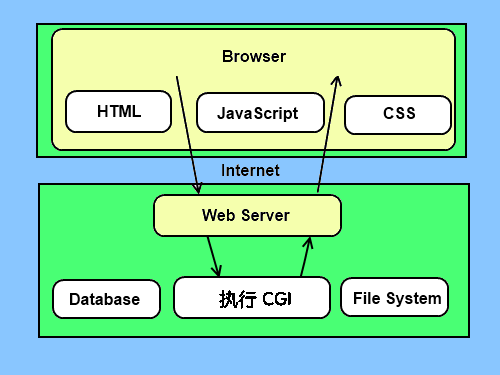

# <center><font face="黑体" font color=SeaGreen >Python学习笔记</font></center>
<center><font face="楷体" size =5 >Jaren</font></center>
</br>

[Python2.x 与 3​​.x 版本区别](https://www.runoob.com/python/python-2x-3x.html)
[Python 内置函数](https://www.runoob.com/python/python-built-in-functions.html)
</br>

## 一、Python 基础语法
### 交互式编程
交互式编程不需要创建脚本文件，是通过 Python 解释器的交互模式进来编写代码。

Linux 上你只需要在命令行中输入 Python 命令即可启动交互式编程,提示窗口如下：
```
$ python
Python 2.7.6 (default, Sep  9 2014, 15:04:36) 
[GCC 4.2.1 Compatible Apple LLVM 6.0 (clang-600.0.39)] on darwin
Type "help", "copyright", "credits" or "license" for more information.
>>>
```
Windows 上在安装 Python 时已经安装了交互式编程客户端，提示窗口如下：


在 Python 提示符中输入以下文本信息，然后按 Enter 键查看运行效果：


### 脚本式编程
通过脚本参数调用解释器开始执行脚本，直到脚本执行完毕。当脚本执行完成后，解释器不再有效。

让我们写一个简单的 Python 脚本程序。所有 Python 文件将以 .py 为扩展名。

### Python2.x 中使用 Python3.x 的 print 函数
如果 Python2.x 版本想使用 Python3.x 的 print 函数，可以导入 `__future__` 包，该包禁用 Python2.x 的 print 语句，采用 Python3.x 的 print 函数：
```
>>> list =["a", "b", "c"]
>>> print list    # python2.x 的 print 语句
['a', 'b', 'c']
>>> from __future__ import print_function  # 导入 __future__ 包
>>> print list     # Python2.x 的 print 语句被禁用，使用报错
  File "<stdin>", line 1
    print list
             ^
SyntaxError: invalid syntax
>>> print (list)   # 使用 Python3.x 的 print 函数
['a', 'b', 'c']
>>>
```
Python3.x 与 Python2.x 的许多兼容性设计的功能可以通过 `__future__` 这个包来导入。

### Python 标识符
在 Python 里，标识符由字母、数字、下划线组成。

在 Python 中，所有标识符可以包括英文、数字以及下划线(_)，但不能以数字开头。

Python 中的标识符是区分大小写的。
以下划线开头的标识符是有特殊意义的。以单下划线开头 _foo 的代表不能直接访问的类属性，需通过类提供的接口进行访问，不能用 from xxx import * 而导入。

以双下划线开头的` __foo `代表类的私有成员，以双下划线开头和结尾的 `__foo__ `代表 Python 里特殊方法专用的标识，如` __init__`() 代表类的构造函数。

Python 可以同一行显示多条语句，方法是用分号 `;` 分开，如：
```
>>> print ('hello');print ('Jaren');
hello
Jaren
```
### Python 保留字符
下面的列表显示了在Python中的保留字。这些保留字不能用作常数或变数，或任何其他标识符名称。

所有 Python 的关键字只包含小写字母。
||||
|:-|:-|:-|
|and|	exec|	not|
|assert|	finally	|or|
|break|	for|	pass|
|class|	from|	print|
|continue|	global|	raise|
|def|	if|	return|
|del|	import|	try|
|elif|	in|	while|
|else|	is|	with|
|except	|lambda	|yield|

### 行和缩进
学习 Python 与其他语言最大的区别就是，Python 的代码块不使用大括号 `{}` 来控制类，函数以及其他逻辑判断。**python 最具特色的就是用缩进来写模块**。

缩进的空白数量是可变的，但是**所有代码块语句必须包含相同的缩进空白数量**，这个必须严格执行。

以下实例缩进为四个空格:
```
if True:
    print ("True")
else:
    print ("False")
```
没有严格缩进，在执行时会报错

**IndentationError: unindent does not match any outer indentation level**错误表明，你使用的缩进方式不一致，有的是 tab 键缩进，有的是空格缩进，改为一致即可。

如果是 **IndentationError: unexpected indent** 错误, 则 python 编译器是在告诉你`"Hi，老兄，你的文件里格式不对了，可能是 tab 和空格没对齐的问题"`，所以 python 对格式要求非常严格。

因此，在 Python 的代码块中必须使用相同数目的行首缩进空格数。

建议你在每个缩进层次使用 **单个制表符** 或 **两个空格** 或 **四个空格** , **切记不能混用**

### 多行语句
Python语句中一般以新行作为语句的结束符。

但是我们可以使用斜杠（ `\`）将一行的语句分为多行显示，如下所示：
```
total = item_one + \
        item_two + \
        item_three
```
语句中包含 [], {} 或 () 括号就不需要使用多行连接符。如下实例：
```
days = ['Monday', 'Tuesday', 'Wednesday',
        'Thursday', 'Friday']
```

### Python 引号
Python 可以使用引号( `'` )、双引号( `"` )、三引号( `'''` 或 `"""` ) 来表示字符串，引号的开始与结束必须是相同类型的。

其中三引号可以由多行组成，编写多行文本的快捷语法，常用于文档字符串，在文件的特定地点，被当做注释。
```
word = 'word'
sentence = "这是一个句子。"
paragraph = """这是一个段落。
包含了多个语句"""
```

### Python注释
python中单行注释采用 `#` 开头。

python 中多行注释使用三个单引号 `'''` 或三个双引号 `"""`。
```
#!/usr/bin/python
# -*- coding: UTF-8 -*-
# 文件名：test.py


'''
这是多行注释，使用单引号。
这是多行注释，使用单引号。
这是多行注释，使用单引号。
'''

"""
这是多行注释，使用双引号。
这是多行注释，使用双引号。
这是多行注释，使用双引号。
"""
```
### Python空行
函数之间或类的方法之间用空行分隔，表示一段新的代码的开始。类和函数入口之间也用一行空行分隔，以突出函数入口的开始。

空行与代码缩进不同，空行并不是Python语法的一部分。书写时不插入空行，Python解释器运行也不会出错。但是空行的作用在于分隔两段不同功能或含义的代码，便于日后代码的维护或重构。

记住：**空行也是程序代码的一部分**。

### 等待用户输入
下面的程序执行后就会等待用户输入，按回车键后就会退出
```
#!/usr/bin/python
# -*- coding: UTF-8 -*-

raw_input("按下 enter 键退出，其他任意键显示...\n")
```
以上代码中 ，`\n `实现换行。一旦用户按下 enter(回车) 键退出，其它键显示。

### 同一行显示多条语句
Python可以在同一行中使用多条语句，语句之间使用分号(`;`)分割，以下是一个简单的实例：
```
#!/usr/bin/python

import sys; x = 'runoob'; sys.stdout.write(x + '\n')
```
执行以上代码，输出结果为：
```
$ python test.py
runoob
```

### print 输出
**print 默认输出是换行的，如果要实现不换行需要在变量末尾加上逗号 `,`**。
```
#!/usr/bin/python
# -*- coding: UTF-8 -*-

x="a"
y="b"
# 换行输出
print x
print y

print '---------'
# 不换行输出
print x,
print y,

# 不换行输出
print x,y
```
以上实例执行结果为：
```
a
b
---------
a b a b
```

### 多个语句构成代码组
缩进相同的一组语句构成一个代码块，我们称之代码组。

像if、while、def和class这样的复合语句，首行以关键字开始，以冒号( `:` )结束，该行之后的一行或多行代码构成代码组。

我们将首行及后面的代码组称为一个子句(clause)。

如下实例：
```
if expression : 
   suite 
elif expression :  
   suite  
else :  
   suite 
```

### 命令行参数
很多程序可以执行一些操作来查看一些基本信息，Python 可以使用 `-h` 参数查看各参数帮助信息：


我们在使用脚本形式执行 Python 时，可以接收命令行输入的参数

## 二、Python 变量类型
变量是存储在内存中的值，这就意味着在创建变量时会在内存中开辟一个空间。

基于变量的数据类型，解释器会分配指定内存，并决定什么数据可以被存储在内存中。

因此，变量可以指定不同的数据类型，这些变量可以存储整数，小数或字符。

### 变量赋值
Python 中的变量赋值不需要类型声明。

每个变量在内存中创建，都包括变量的标识，名称和数据这些信息。

**每个变量在使用前都必须赋值，变量赋值以后该变量才会被创建。**

等号 = 用来给变量赋值。

等号 = 运算符左边是一个变量名，等号 = 运算符右边是存储在变量中的值。
### 多个变量赋值
Python允许你同时为多个变量赋值。例如：
`a = b = c = 1`
以上实例，创建一个整型对象，值为1，**三个变量被分配到相同的内存空间上**。

您也可以为多个对象指定多个变量。例如：
`a, b, c = 1, 2, "john"`
以上实例，两个整型对象 1 和 2 分别分配给变量 a 和 b，字符串对象 "john" 分配给变量 c。
### 标准数据类型
在内存中存储的数据可以有多种类型。

例如，一个人的年龄可以用数字来存储，他的名字可以用字符来存储。

Python 定义了一些标准类型，用于存储各种类型的数据。

Python有五个标准的数据类型：
- Numbers（数字）
- String（字符串）
- List（列表）
- Tuple（元组）
- Dictionary（字典）

### Python 数字
数字数据类型用于存储数值。

他们是不可改变的数据类型，这意味着改变数字数据类型会分配一个新的对象。

当你指定一个值时，Number 对象就会被创建：
```
var1 = 1
var2 = 10
```
您也可以使用`del`语句删除一些对象的引用。

`del`语句的语法是：
`del var1[,var2[,var3[....,varN]]]`

您可以通过使用del语句删除单个或多个对象的引用。例如：
```
del var
del var_a, var_b
```
Python支持四种不同的数字类型：

- int（有符号整型）
- long（长整型，也可以代表八进制和十六进制）
- float（浮点型）
- complex（复数）

一些数值类型的实例：


- 长整型也可以使用小写 l，但是还是建议您使用大写 L，避免与数字 1 混淆。Python使用 L 来显示长整型。
- Python 还支持复数，复数由实数部分和虚数部分构成，可以用 `a + bj`,或者 `complex(a,b)` 表示， 复数的实部 a 和虚部 b 都是浮点型。

**注意：long 类型只存在于 Python2.X 版本中，在 2.2 以后的版本中，int 类型数据溢出后会自动转为long类型。在 Python3.X 版本中 long 类型被移除，使用 int 替代。**

#### Python Number 类型转换
```
int(x [,base ])         将x转换为一个整数  
long(x [,base ])        将x转换为一个长整数  
float(x )               将x转换到一个浮点数  
complex(real [,imag ])  创建一个复数  
str(x )                 将对象 x 转换为字符串  
repr(x )                将对象 x 转换为表达式字符串  
eval(str )              用来计算在字符串中的有效Python表达式,并返回一个对象  
tuple(s )               将序列 s 转换为一个元组  
list(s )                将序列 s 转换为一个列表  
chr(x )                 将一个整数转换为一个字符  
unichr(x )              将一个整数转换为Unicode字符  
ord(x )                 将一个字符转换为它的整数值  
hex(x )                 将一个整数转换为一个十六进制字符串  
oct(x )                 将一个整数转换为一个八进制字符串  
```
#### Python math 模块、cmath 模块
Python 中数学运算常用的函数基本都在 math 模块、cmath 模块中。

Python math 模块提供了许多对浮点数的数学运算函数。

Python cmath 模块包含了一些用于复数运算的函数。

cmath 模块的函数跟 math 模块函数基本一致，区别是 cmath 模块运算的是复数，math 模块运算的是数学运算。

要使用 math 或 cmath 函数必须先导入：
`import math`
查看 math 查看包中的内容:
```
>>> import math
>>> dir(math)
['__doc__', '__file__', '__loader__', '__name__', '__package__', '__spec__', 'acos', 'acosh', 'asin', 'asinh', 'atan', 'atan2', 'atanh', 'ceil', 'copysign', 'cos', 'cosh', 'degrees', 'e', 'erf', 'erfc', 'exp', 'expm1', 'fabs', 'factorial', 'floor', 'fmod', 'frexp', 'fsum', 'gamma', 'gcd', 'hypot', 'inf', 'isclose', 'isfinite', 'isinf', 'isnan', 'ldexp', 'lgamma', 'log', 'log10', 'log1p', 'log2', 'modf', 'nan', 'pi', 'pow', 'radians', 'sin', 'sinh', 'sqrt', 'tan', 'tanh', 'tau', 'trunc']
>>>
```
查看 cmath 查看包中的内容
```
>>> import cmath
>>> dir(cmath)
['__doc__', '__file__', '__loader__', '__name__', '__package__', '__spec__', 'acos', 'acosh', 'asin', 'asinh', 'atan', 'atanh', 'cos', 'cosh', 'e', 'exp', 'inf', 'infj', 'isclose', 'isfinite', 'isinf', 'isnan', 'log', 'log10', 'nan', 'nanj', 'phase', 'pi', 'polar', 'rect', 'sin', 'sinh', 'sqrt', 'tan', 'tanh', 'tau']
>>>
```
实例
```
>>> import cmath
>>> cmath.sqrt(-1)
1j
>>> cmath.sqrt(9)
(3+0j)
>>> cmath.sin(1)
(0.8414709848078965+0j)
>>> cmath.log10(100)
(2+0j)
>>>
```
#### Python数学函数
|函数|	返回值 ( 描述 ) |
|:-|:-|
|`abs(x)`|	返回数字的绝对值，如abs(-10) 返回 10|
|`ceil(x)`	|返回数字的上入整数，如math.ceil(4.1) 返回 5|
|`cmp(x, y)`|	如果 x < y 返回 -1, 如果 x == y 返回 0, 如果 x > y 返回 1|
|`exp(x)`|	返回e的x次幂(ex),如math.exp(1) 返回2.718281828459045|
|`fabs(x)`|	以浮点数形式返回数字的绝对值，如math.fabs(-10) 返回10.0|
|`floor(x)`|	返回数字的下舍整数，如math.floor(4.9)返回 4|
|`log(x)`|	如math.log(math.e)返回1.0,math.log(100,10)返回2.0|
|`log10(x)`|	返回以10为基数的x的对数，如math.log10(100)返回 2.0|
|`max(x1, x2,...)`|	返回给定参数的最大值，参数可以为序列。|
|`min(x1, x2,...)`|	返回给定参数的最小值，参数可以为序列。|
|`modf(x)`|	返回x的整数部分与小数部分，两部分的数值符号与x相同，整数部分以浮点型表示。|
|`pow(x, y)`|	x**y 运算后的值。|
|`round(x [,n])`|	返回浮点数x的四舍五入值，如给出n值，则代表舍入到小数点后的位数。|
|`sqrt(x)`	|返回数字x的平方根|

#### Python随机数函数
|函数	|描述|
|:-|:-|
|`choice(seq)`|	从序列的元素中随机挑选一个元素，比如random.choice(range(10))，从0到9中随机挑选一个整数。|
|`randrange ([start,] stop [,step])`|	从指定范围内，按指定基数递增的集合中获取一个随机数，基数默认值为 1|
|`random()`|	随机生成下一个实数，它在`[0,1)`范围内。|
|`seed([x])`|	改变随机数生成器的种子seed。如果你不了解其原理，你不必特别去设定seed，Python会帮你选择seed。|
|`shuffle(lst)`|	将序列的所有元素随机排序|
|`uniform(x, y)`|	随机生成下一个实数，它在`[x,y]`范围内。|

#### Python三角函数
|函数|	描述|
|:-|:-|
|`acos(x)`	|返回x的反余弦弧度值。|
|`asin(x)`	|返回x的反正弦弧度值。|
|`atan(x)`	|返回x的反正切弧度值。|
|`atan2(y, x)`	|返回给定的 X 及 Y 坐标值的反正切值。|
|`cos(x)`	|返回x的弧度的余弦值。|
|`hypot(x, y)`	|返回欧几里德范数 sqrt(x*x + y*y)。|
|`sin(x)`	|返回的x弧度的正弦值。|
|`tan(x)`	|返回x弧度的正切值。|
|`degrees(x)`	|将弧度转换为角度,如degrees(math.pi/2) ， 返回90.0|
|`radians(x)`	|将角度转换为弧度|

#### Python数学常量
|常量	|描述|
|:-|:-|
|`pi`|	数学常量 pi（圆周率，一般以π来表示）|
|`e`|	数学常量 e，e即自然常数（自然常数）|

### Python字符串
字符串是 Python 中最常用的数据类型。我们可以使用引号 ( `'` 或 `" `) 来创建字符串。

创建字符串很简单，只要为变量分配一个值即可。例如：
```
var1 = 'Hello World!'
var2 = "Python "
```
字符串或串(String)是由数字、字母、下划线组成的一串字符。
一般记为 :
`s = "a1a2···an"   # n>=0`
它是编程语言中表示文本的数据类型。

python的字串列表有2种取值顺序:

- 从左到右索引默认0开始的，最大范围是字符串长度少1
- 从右到左索引默认-1开始的，最大范围是字符串开头


如果你要实现从字符串中获取一段子字符串的话，可以使用 `[头下标:尾下标]`来截取相应的字符串，其中下标是从 0 开始算起，可以是正数或负数，下标可以为空表示取到头或尾。

**`[头下标:尾下标]` 获取的子字符串包含头下标的字符，但不包含尾下标的字符。**
比如:
```
>>> s = 'abcdef'
>>> s[1:5]
'bcde'
```
当使用以冒号分隔的字符串，python 返回一个新的对象，结果包含了以这对偏移标识的连续的内容，左边的开始是包含了下边界。

上面的结果包含了 `s[1]` 的值 b，而取到的最大范围不包括尾下标，就是 `s[5]` 的值 f。


#### Python 字符串连接
加号（`+`）是字符串连接运算符，星号（`*`）是重复操作。如下实例：
```
str = 'Hello World!'
print (str)  # 输出完整字符串
print (str[0])        # 输出字符串中的第一个字符
print (str[2:5])      # 输出字符串中第三个至第六个之间的字符串
print (str[2:])       # 输出从第三个字符开始的字符串
print (str * 2)       # 输出字符串两次
print (str + "TEST")  # 输出连接的字符串
print (str[1:8:2])    #在索引 1 到索引 8 的位置并设置为步长为 2（间隔一个位置）来截取字符串
```
以上实例输出结果：
```
Hello World!
H
llo
llo World!
Hello World!Hello World!
Hello World!TEST
el o
```
#### Python 转义字符
在需要在字符中使用特殊字符时，python 用反斜杠 `\` 转义字符。如下表：


#### Python字符串运算符
下表实例变量 a 值为字符串 "Hello"，b 变量值为 "Python"：


#### Python 字符串格式化
Python 支持格式化字符串的输出 。尽管这样可能会用到非常复杂的表达式，但最基本的用法是将一个值插入到一个有字符串格式符 `%s` 的字符串中。

在 Python 中，字符串格式化使用与 C 中 `sprintf` 函数一样的语法。
如下实例：
`print ("My name is %s and weight is %d kg!" % ('Zara', 21)) `
以上实例输出结果：
`My name is Zara and weight is 21 kg!`

python 字符串格式化符号:


格式化操作符辅助指令:


#### Python 三引号
Python 中三引号可以将复杂的字符串进行赋值。

Python **三引号允许一个字符串跨多行**，字符串中可以包含换行符、制表符以及其他特殊字符。

三引号的语法是一对连续的单引号或者双引号（通常都是成对的用）。
```
 >>> hi = '''hi 
there'''
>>> hi   # repr()
'hi\nthere'
>>> print hi  # str()
hi 
there  
```
三引号让程序员从引号和特殊字符串的泥潭里面解脱出来，自始至终保持一小块字符串的格式是所谓的WYSIWYG（所见即所得）格式的。

一个典型的用例是，当你需要一块HTML或者SQL时，这时当用三引号标记，使用传统的转义字符体系将十分费神。
```
 errHTML = '''
<HTML><HEAD><TITLE>
Friends CGI Demo</TITLE></HEAD>
<BODY><H3>ERROR</H3>
<B>%s</B><P>
<FORM><INPUT TYPE=button VALUE=Back
ONCLICK="window.history.back()"></FORM>
</BODY></HTML>
'''
cursor.execute('''
CREATE TABLE users (  
login VARCHAR(8), 
uid INTEGER,
prid INTEGER)
''')
```
#### Unicode 字符串
Python 中定义一个 Unicode 字符串和定义一个普通字符串一样简单：
```
>>> u'Hello World !'
u'Hello World !'
```
引号前小写的"u"表示这里创建的是一个 Unicode 字符串。如果你想加入一个特殊字符，可以使用 Python 的 Unicode-Escape 编码。如下例所示：
```
>>> u'Hello\u0020World !'
u'Hello World !'
```
被替换的 \u0020 标识表示在给定位置插入编码值为 0x0020 的 Unicode 字符（空格符）

### Python列表
List（列表） 是 Python 中使用最频繁的数据类型。序列中的每个元素都分配一个数字 - 它的位置，或索引，第一个索引是0，第二个索引是1，依此类推。

列表可以完成大多数集合类的数据结构实现。它支持字符，数字，字符串甚至可以包含列表（即嵌套）。

序列都可以进行的操作包括索引，切片，加，乘，检查成员。

列表用 `[ ]` 标识，是 python 最通用的复合数据类型。

#### 访问列表中的值
使用下标索引来访问列表中的值，同样你也可以使用方括号的形式截取字符，如下所示：
```
list1 = ['physics', 'chemistry', 1997, 2000]
list2 = [1, 2, 3, 4, 5, 6, 7 ]
 
print "list1[0]: ", list1[0]
print "list2[1:5]: ", list2[1:5]
```
以上实例输出结果：
```
list1[0]:  physics
list2[1:5]:  [2, 3, 4, 5]
```

#### 更新列表
你可以对列表的数据项进行修改或更新，你也可以使用`append()`方法来添加列表项，如下所示：
```
list = []          ## 空列表
list.append('Google')   ## 使用 append() 添加元素
list.append('Baidu')
print list
```
以上实例输出结果：
`['Google', 'Baidu']`

#### 删除列表元素
可以使用 del 语句来删除列表的元素，如下实例：
```
list1 = ['physics', 'chemistry', 1997, 2000]
 
print list1
del list1[2]
print "After deleting value at index 2 : "
print list1
```
以上实例输出结果：
```
['physics', 'chemistry', 1997, 2000]
After deleting value at index 2 :
['physics', 'chemistry', 2000]
```

#### Python列表脚本操作符
列表对 `+` 和 `*` 的操作符与字符串相似。`+` 号用于组合列表，`*` 号用于重复列表。


#### Python列表截取
列表中值的切割也可以用到变量 `[头下标:尾下标]` ，就可以截取相应的列表，从左到右索引默认 0 开始，从右到左索引默认 -1 开始，下标可以为空表示取到头或尾。


加号 `+` 是列表连接运算符，星号 `*` 是重复操作。如下实例
```
list = [ 'google', 786 , 2.23, 'john', 70.2 ]
tinylist = [123, 'john']
 
print (list)               # 输出完整列表
print (list[0])            # 输出列表的第一个元素
print (list[1:3])          # 输出第二个至第三个元素 
print (list[2:])           # 输出从第三个开始至列表末尾的所有元素
print (tinylist * 2)       # 输出列表两次
print (list + tinylist)    # 打印组合的列表
```
以上实例输出结果：
```
['google', 786, 2.23, 'john', 70.2]
google
[786, 2.23]
[2.23, 'john', 70.2]
[123, 'john', 123, 'john']
['google', 786, 2.23, 'john', 70.2, 123, 'john']
```
Python 列表截取可以接收第三个参数，参数作用是**截取的步长**，以下实例在索引 1 到索引 4 的位置并设置为步长为 2（间隔一个位置）来截取字符串：


Python 的列表截取实例如下：
```
>>>L = ['Google', 'Baidu', 'Taobao']
>>> L[2]
'Taobao'
>>> L[-2]
'Baidu'
>>> L[1:]
['Baidu', 'Taobao']
>>>
```
|Python 表达式|	结果|	描述|
|:-|:-|:-|
|L[2]|	'Taobao'|	读取列表中第三个元素|
|L[-2]|	'Baidu'	|读取列表中倒数第二个元素|
|L[1:]	|['Baidu', 'Taobao']	|从第二个元素开始截取列表|

#### Python列表函数&方法
Python包含以下函数:


Python包含以下方法:


### Python 元组
元组是另一个数据类型，类似于 List（列表）,不同之处在于元组的元素不能修改。

元组用 `()` 标识。内部元素用逗号隔开。但是**元组不能二次赋值，相当于只读列表**。

- 创建空元组
`tup1 = ()`
- 元组中只包含一个元素时，需要在元素后面添加逗号
`tup1 = (50,)`
- 访问元组可以使用下标索引来访问元组中的值
- 元组中的元素值是不允许修改的，但我们可以对元组进行连接组合
```
tuple = ( 'aaa', 786 , 2.23, 'john', 70.2 )
tinytuple = (123, 'john')
 
print (tuple)               # 输出完整元组
print (tuple[0])            # 输出元组的第一个元素
print (tuple[1:3] )         # 输出第二个至第四个（不包含）的元素 
print (tuple[2:])           # 输出从第三个开始至列表末尾的所有元素
print (tinytuple * 2)       # 输出元组两次
print (tuple + tinytuple)   # 打印组合的元组
```
以上实例输出结果：
```
('aaa', 786, 2.23, 'john', 70.2)
aaa
(786, 2.23)
(2.23, 'john', 70.2)
(123, 'john', 123, 'john')
('aaa', 786, 2.23, 'john', 70.2, 123, 'john')
```
以下对元组的操作是无效的，因为元组不允许更新，而列表是允许更新的：
```
tuple = ( 'aaa', 786 , 2.23, 'john', 70.2 )
list = [ 'aaa', 786 , 2.23, 'john', 70.2 ]
tuple[2] = 1000    # 元组中是非法应用
list[2] = 1000     # 列表中是合法应用
```
错误信息：**TypeError: 'tuple' object does not support item assignment**

#### 删除元组
元组中的元素值是不允许删除的，但我们可以使用del语句来删除整个元组
```
tup = ('physics', 'chemistry', 1997, 2000)
 
print tup
del tup
print "After deleting tup : "
print tup
```
以上实例元组被删除后，输出变量会有异常信息，输出如下所示：
```
('physics', 'chemistry', 1997, 2000)
After deleting tup :
Traceback (most recent call last):
  File "test.py", line 9, in <module>
    print tup
NameError: name 'tup' is not defined
```
#### 元组运算符
与字符串一样，元组之间可以使用 + 号和 * 号进行运算。这就意味着他们可以组合和复制，运算后会生成一个新的元组。


#### 元组索引，截取
因为元组也是一个序列，所以我们可以访问元组中的指定位置的元素，也可以截取索引中的一段元素，如下所示：

元组：
`L = ('spam', 'Spam', 'SPAM!')`


#### 无关闭分隔符
任意无符号的对象，以逗号隔开，默认为元组，如下实例：
```
print 'abc', -4.24e93, 18+6.6j, 'xyz'
x, y = 1, 2
print "Value of x , y : ", x,y
```
以上实例运行结果：
```
abc -4.24e+93 (18+6.6j) xyz
Value of x , y : 1 2
```
##### 元组内置函数
Python元组包含了以下内置函数


### Python 字典(Dictionary)
字典(dictionary)是除列表以外python之中最灵活的内置数据结构类型。列表是有序的对象集合，字典是无序的对象集合。可存储任意类型对象。

两者之间的区别在于：字典当中的元素是通过键来存取的，而不是通过偏移存取。

字典的每个键值 `key:value` 对用冒号 `:` 分割，每个键值对之间用逗号 `,`分割，整个字典包括在花括号 `{}` 中 ,格式如下所示：
`d = {key1 : value1, key2 : value2 }`

注意：`dict` 作为 Python 的关键字和内置函数，变量名不建议命名为 `dict`。

键一般是唯一的，如果重复最后的一个键值对会替换前面的，值不需要唯一
```
>>> tinydict = {'a': 1, 'b': 2, 'b': '3'}
>>> tinydict['b']
'3'
>>> tinydict
{'a': 1, 'b': '3'}
```
值可以取任何数据类型，但键必须是不可变的，如字符串，数字或元组。

一个简单的字典实例：
`tinydict = {'Alice': '2341', 'Beth': '9102', 'Cecil': '3258'}`
也可如此创建字典：
```
tinydict1 = { 'abc': 456 }
tinydict2 = { 'abc': 123, 98.6: 37 }
```

#### 访问字典里的值
把相应的键放入熟悉的方括弧，如下实例:
```
tinydict = {'Name': 'Zara', 'Age': 7, 'Class': 'First'}
 
print "tinydict['Name']: ", tinydict['Name']
print "tinydict['Age']: ", tinydict['Age']
```
以上实例输出结果：
```
tinydict['Name']:  Zara
tinydict['Age']:  7
```
如果用字典里没有的键访问数据，会输出错误

#### 修改字典
向字典添加新内容的方法是增加新的键/值对，修改或删除已有键/值对
如下实例:
```
tinydict = {'Name': 'Zara', 'Age': 7, 'Class': 'First'}
 
tinydict['Age'] = 8 # 更新
tinydict['School'] = "RUNOOB" # 添加
 
 
print "tinydict['Age']: ", tinydict['Age']
print "tinydict['School']: ", tinydict['School']
```
以上实例输出结果：
```
tinydict['Age']:  8
tinydict['School']:  RUNOOB
```
#### 删除字典元素
能删单一的元素也能清空字典，清空只需一项操作。

显示删除一个字典用del命令，如下实例：
```
tinydict = {'Name': 'Zara', 'Age': 7, 'Class': 'First'}
 
del tinydict['Name']  # 删除键是'Name'的条目
tinydict.clear()      # 清空字典所有条目
del tinydict          # 删除字典
 
print "tinydict['Age']: ", tinydict['Age'] 
print "tinydict['School']: ", tinydict['School']
```

#### 字典键的特性
字典值可以没有限制地取任何 python 对象，既可以是标准的对象，也可以是用户定义的，但键不行。

两个重要的点需要记住：

1. 不允许同一个键出现两次。创建时如果同一个键被赋值两次，后一个值会被记住
2. 键必须不可变，所以可以用数字，字符串或元组充当，所以用列表就不行

#### 字典内置函数&方法
Python字典包含了以下内置函数：


Python字典包含了以下内置方法：


### Python数据类型转换
有时候，我们需要对数据内置的类型进行转换，数据类型的转换，你只需要将数据类型作为函数名即可。

以下几个内置的函数可以执行数据类型之间的转换。这些函数返回一个新的对象，表示转换的值。

|函数|	描述|
|:-|:-|
|int(x [,base])|将x转换为一个整数|
|long(x [,base] )|将x转换为一个长整数|
|float(x)|将x转换到一个浮点数|
|complex(real [,imag])|创建一个复数|
|str(x)|将对象 x 转换为字符串|
|repr(x)|将对象 x 转换为表达式字符串|
|eval(str)|用来计算在字符串中的有效Python表达式,并返回一个对象|
|tuple(s)|将序列 s 转换为一个元组|
|list(s)|将序列 s 转换为一个列表|
|set(s)|转换为可变集合|
|dict(d)|创建一个字典。d 必须是一个序列 (key,value)元组。|
|frozenset(s)|转换为不可变集合|
|chr(x)|将一个整数转换为一个字符|
|unichr(x)|将一个整数转换为Unicode字符|
|ord(x)|将一个字符转换为它的整数值|
|hex(x)|将一个整数转换为一个十六进制字符串|
|oct(x)|将一个整数转换为一个八进制字符串|

## 三、Python 运算符
Python语言支持以下类型的运算符:

- 算术运算符
- 比较（关系）运算符
- 赋值运算符
- 逻辑运算符
- 位运算符
- 成员运算符
- 身份运算符
- 运算符优先级

### Python算术运算符
以下假设变量： a=10，b=20：


注意：Python2.x 里，整数除整数，只能得出整数。如果要得到小数部分，把其中一个数改成浮点数即可。

### Python比较运算符
以下假设变量a为10，变量b为20：


### Python赋值运算符
以下假设变量a为10，变量b为20：


### Python位运算符
按位运算符是把数字看作二进制来进行计算的。Python中的按位运算法则如下：

下表中变量 a 为 60，b 为 13，二进制格式如下：
```
a = 0011 1100

b = 0000 1101

-----------------

a&b = 0000 1100

a|b = 0011 1101

a^b = 0011 0001

~a  = 1100 0011
```


以下实例演示了Python所有位运算符的操作：
```
a = 60            # 60 = 0011 1100 
b = 13            # 13 = 0000 1101 
c = 0
 
c = a & b;        # 12 = 0000 1100
print ("1 - c 的值为：", c)
 
c = a | b;        # 61 = 0011 1101 
print ("2 - c 的值为：", c)
 
c = a ^ b;        # 49 = 0011 0001
print ("3 - c 的值为：", c)
 
c = ~a;           # -61 = 1100 0011
print ("4 - c 的值为：", c)
 
c = a << 2;       # 240 = 1111 0000
print ("5 - c 的值为：", c)
 
c = a >> 2;       # 15 = 0000 1111
print ("6 - c 的值为：", c)
```
以上实例输出结果：
```
1 - c 的值为： 12
2 - c 的值为： 61
3 - c 的值为： 49
4 - c 的值为： -61
5 - c 的值为： 240
6 - c 的值为： 15
```
### Python逻辑运算符
Python语言支持逻辑运算符，以下假设变量 a 为 10, b为 20:


### Python成员运算符
除了以上的一些运算符之外，Python还支持成员运算符，测试实例中包含了一系列的成员，包括字符串，列表或元组。


以下实例演示了Python所有成员运算符的操作：
```
a = 10
b = 20
list = [1, 2, 3, 4, 5 ];
 
if ( a in list ):
   print ("1 - 变量 a 在给定的列表中 list 中")
else:
   print ("1 - 变量 a 不在给定的列表中 list 中")
 
if ( b not in list ):
   print ("2 - 变量 b 不在给定的列表中 list 中")
else:
   print ("2 - 变量 b 在给定的列表中 list 中")
 
# 修改变量 a 的值
a = 2
if ( a in list ):
   print ("3 - 变量 a 在给定的列表中 list 中")
else:
   print ("3 - 变量 a 不在给定的列表中 list 中")
```
以上实例输出结果：
```
1 - 变量 a 不在给定的列表中 list 中
2 - 变量 b 不在给定的列表中 list 中
3 - 变量 a 在给定的列表中 list 中
```
### Python身份运算符
身份运算符用于比较两个对象的存储单元


注： `id()` 函数用于获取对象内存地址。
以下实例演示了Python所有身份运算符的操作：
```
a = 20
b = 20
 
if ( a is b ):
   print ("1 - a 和 b 有相同的标识")
else:
   print ("1 - a 和 b 没有相同的标识")
 
if ( a is not b ):
   print ("2 - a 和 b 没有相同的标识")
else:
   print ("2 - a 和 b 有相同的标识")
 
# 修改变量 b 的值
b = 30
if ( a is b ):
   print ("3 - a 和 b 有相同的标识")
else:
   print ("3 - a 和 b 没有相同的标识")
 
if ( a is not b ):
   print ("4 - a 和 b 没有相同的标识")
else:
   print ("4 - a 和 b 有相同的标识")
```
以上实例输出结果：
```
1 - a 和 b 有相同的标识
2 - a 和 b 有相同的标识
3 - a 和 b 没有相同的标识
4 - a 和 b 没有相同的标识
```
#####  is 与 == 区别：

`is` 用于判断两个变量引用对象是否为同一个(同一块内存空间)，` == `用于判断引用变量的值是否相等。
### Python运算符优先级
以下表格列出了从最高到最低优先级的所有运算符：


## 四、Python 条件语句
Python条件语句是通过一条或多条语句的执行结果（True或者False）来决定执行的代码块。

Python程序语言指定任何非0和非空（null）值为true，0 或者 null为false。

Python 编程中 if 语句用于控制程序的执行，基本形式为：
```
if 判断条件：
    执行语句……
else：
    执行语句……
```
其中"判断条件"成立时（非零），则执行后面的语句，而执行内容可以多行，**以缩进来区分表示同一范围**。

else 为可选语句，当需要在条件不成立时执行内容则可以执行相关语句。

if 语句的判断条件可以用>（大于）、<(小于)、==（等于）、>=（大于等于）、<=（小于等于）来表示其关系。

当判断条件为多个值时，可以使用以下形式：
```
if 判断条件1:
    执行语句1……
elif 判断条件2:
    执行语句2……
elif 判断条件3:
    执行语句3……
else:
    执行语句4……
```
由于 python 并**不支持** `switch` 语句，所以多个条件判断，只能用 `elif` 来实现，如果判断需要多个条件需同时判断时，可以使用 `or` （或），表示两个条件有一个成立时判断条件成功；使用 `and` （与）时，表示只有两个条件同时成立的情况下，判断条件才成功。

当if有多个条件时可使用括号来区分判断的先后顺序，括号中的判断优先执行，此外 and 和 or 的优先级低于>（大于）、<（小于）等判断符号，即大于和小于在没有括号的情况下会比与或要优先判断。


### 简单的语句组
你也可以在同一行的位置上使用if条件判断语句，如下实例：
```
var = 100 
if ( var  == 100 ) : print ("变量 var 的值为100") 
print ("Good bye!")
```
以上代码执行输出结果如下：
```
变量 var 的值为100
Good bye!
```

## 五、Python 循环语句
Python 提供了 `for` 循环和 `while` 循环（在 Python 中没有 `do..while` 循环）:


### While 循环语句
Python 编程中 while 语句用于循环执行程序，即在某条件下，循环执行某段程序，以处理需要重复处理的相同任务。其基本形式为：
```
while 判断条件(condition)：
    执行语句(statements)……
```
执行语句可以是单个语句或语句块。判断条件可以是任何表达式，任何非零、或非空（null）的值均为true。

当判断条件假 false 时，循环结束。

while 语句时还有另外两个重要的命令 `continue`，`break` 来跳过循环，`continue` 用于跳过该次循环，`break` 则是用于退出循环，此外"判断条件"还可以是个常值，表示循环必定成立。

#### 无限循环
如果条件判断语句永远为 true，循环将会无限的执行下去
```
var = 1
while var == 1 :  # 该条件永远为true，循环将无限执行下去
   num = raw_input("Enter a number  :")
   print ("You entered: ", num)
 
print ("Good bye!")
```
注意：以上的无限循环你可以使用 CTRL+C 来中断循环。

#### 循环使用 else 语句
在 python 中，`while … else` 在循环条件为 false 时执行 `else` 语句块：
```
count = 0
while count < 5:
   print (count, " is  less than 5")
   count = count + 1
else:
   print (count, " is not less than 5")
```
以上实例输出结果为：
```
0 is less than 5
1 is less than 5
2 is less than 5
3 is less than 5
4 is less than 5
5 is not less than 5
```
#### 简单语句组
类似 if 语句的语法，如果你的 while 循环体中只有一条语句，你可以将该语句与while写在同一行中， 如下所示：
```
flag = 1
 
while (flag): print ('Given flag is really true!')
 
print ("Good bye!")
```
注意：以上的无限循环你可以使用 `CTRL+C` 来中断循环。
### for 循环语句
Python for循环可以遍历任何序列的项目，如一个列表或者一个字符串。

for循环的语法格式如下：
```
for iterating_var in sequence:
   statements(s)
```
实例：
```
for letter in 'Python':     # 第一个实例
   print("当前字母: %s" % letter)
 
fruits = ['banana', 'apple',  'mango']
for fruit in fruits:        # 第二个实例
   print ('当前水果: %s'% fruit)
 
print ("Good bye!")
```
以上实例输出结果:
```
当前字母: P
当前字母: y
当前字母: t
当前字母: h
当前字母: o
当前字母: n
当前水果: banana
当前水果: apple
当前水果: mango
Good bye!
```

#### 通过序列索引迭代
另外一种执行循环的遍历方式是通过索引，如下实例：
```
fruits = ['banana', 'apple',  'mango']
for index in range(len(fruits)):
   print ('当前水果 : %s' % fruits[index])
 
print ("Good bye!")
```
以上实例输出结果：
```
当前水果 : banana
当前水果 : apple
当前水果 : mango
Good bye!
```
以上实例我们使用了内置函数 `len()` 和 `range()`,函数 `len()` 返回列表的长度，即元素的个数。 `range()`返回一个序列的数。
循环使用 else 语句
在 python 中，`for … else` 表示这样的意思，`for` 中的语句和普通的没有区别，`else` 中的语句会在循环正常执行完（即 `for` 不是通过 `break` 跳出而中断的）的情况下执行，`while … else` 也是一样。
```
for num in range(10,20):  # 迭代 10 到 20 (不包含) 之间的数字
   for i in range(2,num): # 根据因子迭代
      if num%i == 0:      # 确定第一个因子
         j=num/i          # 计算第二个因子
         print ('%d 等于 %d * %d' % (num,i,j))
         break            # 跳出当前循环
   else:                  # 循环的 else 部分
      print ('%d 是一个质数' % num)
```
以上实例输出结果：
```
10 等于 2 * 5
11 是一个质数
12 等于 2 * 6
13 是一个质数
14 等于 2 * 7
15 等于 3 * 5
16 等于 2 * 8
17 是一个质数
18 等于 2 * 9
19 是一个质数
```
### 循环嵌套
Python 语言允许在一个循环体里面嵌入另一个循环。
Python for 循环嵌套语法：
```
for iterating_var in sequence:
   for iterating_var in sequence:
      statements(s)
   statements(s)
```
Python while 循环嵌套语法：
```
while expression:
   while expression:
      statement(s)
   statement(s)
```
你可以在循环体内嵌入其他的循环体，如在`while`循环中可以嵌入`for`循环， 反之，你也可以在`for`循环中嵌入`while`循环。

以下实例使用了嵌套循环输出2~100之间的素数：
```
i = 2
while(i < 100):
   j = 2
   while(j <= (i/j)):
      if not(i%j): break
      j = j + 1
   if (j > i/j) : print (i, "是素数")
   i = i + 1
 
print ("Good bye!")
```
输出结果:
```
2 是素数
3 是素数
5 是素数
7 是素数
11 是素数
13 是素数
17 是素数
19 是素数
23 是素数
29 是素数
31 是素数
37 是素数
41 是素数
43 是素数
47 是素数
53 是素数
59 是素数
61 是素数
67 是素数
71 是素数
73 是素数
79 是素数
83 是素数
89 是素数
97 是素数
Good bye!
```
## 六、Python 循环控制语句
循环控制语句可以更改语句执行的顺序。Python支持以下循环控制语句：


### break 语句
Python `break`语句，就像在C语言中，打破了最小封闭for或while循环。

`break`语句用来终止循环语句，即循环条件没有False条件或者序列还没被完全递归完，也会停止执行循环语句。

`break`语句用在`while`和`for`循环中。

如果您使用嵌套循环，`break`语句将停止执行最深层的循环，并开始执行下一行代码。
Python语言 break 语句语法：
`break`
```
for letter in 'Python':     # 第一个实例
   if letter == 'h':
      break
   print ('当前字母 :', letter)

var = 10                    # 第二个实例
while var > 0:              
   print ('当前变量值 :', var)
   var = var -1
   if var == 5:   # 当变量 var 等于 5 时退出循环
      break
 
print ("Good bye!")
```
以上实例执行结果：
```
当前字母 : P
当前字母 : y
当前字母 : t
当前变量值 : 10
当前变量值 : 9
当前变量值 : 8
当前变量值 : 7
当前变量值 : 6
Good bye!
```
### continue 语句
Python `continue` 语句跳出本次循环，而`break`跳出整个循环。

`continue` 语句用来告诉Python跳过当前循环的剩余语句，然后继续进行下一轮循环。

`continue`语句用在`while`和`for`循环中。

Python 语言 `continue` 语句语法格式如下：
`continue`

```
for letter in 'Python':     # 第一个实例
   if letter == 'h':
      continue
   print ('当前字母 :', letter
 )
var = 10                    # 第二个实例
while var > 0:              
   var = var -1
   if var == 5:
      continue
   print ('当前变量值 :', var)
print ("Good bye!")
```
以上实例执行结果：
```
当前字母 : P
当前字母 : y
当前字母 : t
当前字母 : o
当前字母 : n
当前变量值 : 9
当前变量值 : 8
当前变量值 : 7
当前变量值 : 6
当前变量值 : 4
当前变量值 : 3
当前变量值 : 2
当前变量值 : 1
当前变量值 : 0
Good bye!
```
### pass 语句
Python pass 是空语句，是为了保持程序结构的完整性。

pass 不做任何事情，一般用做占位语句。

Python 语言 `pass` 语句语法格式如下：
`pass`

实例：
```
# 输出 Python 的每个字母
for letter in 'Python':
   if letter == 'h':
      pass
      print ('这是 pass 块')
   print ('当前字母 :', letter)
 
print ("Good bye!")
```
以上实例执行结果：
```
当前字母 : P
当前字母 : y
当前字母 : t
这是 pass 块
当前字母 : h
当前字母 : o
当前字母 : n
Good bye!
```

## 七、Python 函数
### 定义一个函数
你可以定义一个由自己想要功能的函数，以下是简单的规则：

函数代码块以 `def` 关键词开头，后接**函数标识符名称**和**圆括号()**。
任何传入参数和自变量必须放在圆括号中间。圆括号之间可以用于定义参数。
函数的第一行语句可以选择性地使用文档字符串——用于存放函数说明。
函数内容以**冒号起始，并且缩进**。
`return [表达式]` 结束函数，选择性地返回一个值给调用方。不带表达式的`return`相当于返回 None。
```
def functionname( parameters ):
   "函数_文档字符串"
   function_suite
   return [expression]
```
默认情况下，参数值和参数名称是按函数声明中定义的顺序匹配起来的。
### 函数调用
定义一个函数只给了函数一个名称，指定了函数里包含的参数，和代码块结构。

这个函数的基本结构完成以后，你可以通过另一个函数调用执行，也可以直接从Python提示符执行。
### 参数传递
在 python 中，类型属于对象，变量是没有类型的：
```
a=[1,2,3]
 
a="google"
```
以上代码中，**`[1,2,3]`** 是 List 类型，**"google"** 是 String 类型，而变量 a 是没有类型，它仅仅是**一个对象的引用（一个指针）**，可以是 List 类型对象，也可以指向 String 类型对象。
#### 可更改(mutable)与不可更改(immutable)对象
在 python 中，strings, tuples, 和 numbers 是不可更改的对象，而 list,dict 等则是可以修改的对象。

- 不可变类型：变量赋值 `a=5` 后再赋值 `a=10`，这里实际是新生成一个 `int` 值对象 10，再让 `a` 指向它，而 5 被丢弃，不是改变`a`的值，相当于新生成了`a`。

- 可变类型：变量赋值 `la=[1,2,3,4]` 后再赋值 `la[2]=5` 则是将 `list la` 的第三个元素值更改，本身`la`没有动，只是其内部的一部分值被修改了。

**python 函数的参数传递：**

- 不可变类型：类似 c++ 的值传递，如 **整数、字符串、元组**。如`fun（a）`，传递的只是`a`的值，没有影响`a`对象本身。比如在 `fun（a）`内部修改 `a` 的值，只是修改另一个复制的对象，不会影响 `a` 本身。

- 可变类型：类似 c++ 的引用传递，如 **列表，字典**。如 `fun（la）`，则是将 `la` 真正的传过去，修改后`fun`外部的`la`也会受影响

python 中一切都是对象，严格意义我们不能说值传递还是引用传递，我们应该说传不可变对象和传可变对象。

##### python 传不可变对象实例
```
def ChangeInt( a ):
    a = 10
 
b = 2
ChangeInt(b)
print b # 结果是 2
```
实例中有 int 对象 2，指向它的变量是 b，在传递给 ChangeInt 函数时，按传值的方式复制了变量 b，a 和 b 都指向了同一个 Int 对象，在 a=10 时，则新生成一个 int 值对象 10，并让 a 指向它。

##### 传可变对象实例
```
# 可写函数说明
def changeme( mylist ):
   "修改传入的列表"
   mylist.append([1,2,3,4])
   print "函数内取值: ", mylist
   return
 
# 调用changeme函数
mylist = [10,20,30]
changeme( mylist )
print "函数外取值: ", mylist
```
实例中传入函数的和在末尾添加新内容的对象用的是同一个引用，故输出结果如下：
```
函数内取值:  [10, 20, 30, [1, 2, 3, 4]]
函数外取值:  [10, 20, 30, [1, 2, 3, 4]]
```
### 参数
以下是调用函数时可使用的正式参数类型：

- 必备参数
- 关键字参数
- 默认参数
- 不定长参数

#### 必备参数
必备参数须以正确的顺序传入函数。调用时的数量必须和声明时的一样。
#### 关键字参数
关键字参数和函数调用关系紧密，函数调用使用关键字参数来确定传入的参数值。

使用关键字参数允许函数调用时参数的顺序与声明时不一致，因为 Python 解释器能够用参数名匹配参数值。

以下实例在函数 `printme()` 调用时使用参数名：
```
#可写函数说明
def printinfo( name, age ):
   "打印任何传入的字符串"
   print "Name: ", name
   print "Age ", age
   return
 
#调用printinfo函数
printinfo( age=50, name="miki" )
```
以上实例输出结果：
```
Name:  miki
Age  50
```
#### 默认参数
调用函数时，默认参数的值如果没有传入，则被认为是默认值。下例会打印默认的`age`，如果`age`没有被传入：
```
#可写函数说明
def printinfo( name, age = 35 ):
   "打印任何传入的字符串"
   print "Name: ", name
   print "Age ", age
   return
 
#调用printinfo函数
printinfo( age=50, name="miki" )
printinfo( name="miki" )
```
以上实例输出结果：
```
Name:  miki
Age  50
Name:  miki
Age  35
```
#### 不定长参数
你可能需要一个函数能处理比当初声明时更多的参数。这些参数叫做不定长参数，和上述2种参数不同，声明时不会命名。基本语法如下：
```
def functionname([formal_args,] *var_args_tuple ):
   "函数_文档字符串"
   function_suite
   return [expression]
```
加了星号（`*`）的变量名会存放所有未命名的变量参数。不定长参数实例如下：
```
#!/usr/bin/python
# -*- coding: UTF-8 -*-
 
# 可写函数说明
def printinfo( arg1, *vartuple ):
   "打印任何传入的参数"
   print "输出: "
   print arg1
   for var in vartuple:
      print var
   return
 
# 调用printinfo 函数
printinfo( 10 )
printinfo( 70, 60, 50 )
```
以上实例输出结果：
```
输出:
10
输出:
70
60
50
```
### 匿名函数
python 使用 `lambda` 来创建匿名函数。

- `lambda`只是一个表达式，函数体比def简单很多。
- `lambda`的主体是一个表达式，而不是一个代码块。仅仅能在`lambda`表达式中封装有限的逻辑进去。
- `lambda`函数拥有自己的命名空间，且不能访问自有参数列表之外或全局命名空间里的参数。
- 虽然`lambda`函数看起来只能写一行，却不等同于C或C++的内联函数，后者的目的是调用小函数时不占用栈内存从而增加运行效率。

`lambda`函数的语法只包含一个语句，如下：
`lambda [arg1 [,arg2,.....argn]]:expression`

如下实例：
```
# 可写函数说明
sum = lambda arg1, arg2: arg1 + arg2
 
# 调用sum函数
print "相加后的值为 : ", sum( 10, 20 )
print "相加后的值为 : ", sum( 20, 20 )
```
以上实例输出结果：
```
相加后的值为 :  30
相加后的值为 :  40
```
### return 语句
`return[表达式]`退出函数，选择性地向调用方返回一个表达式。不带参数值的return语句返回None。

### 变量作用域
一个程序的所有的变量并不是在哪个位置都可以访问的。访问权限决定于这个变量是在哪里赋值的。

变量的作用域决定了在哪一部分程序你可以访问哪个特定的变量名称。两种最基本的变量作用域如下：
- 全局变量
- 局部变量
#### 全局变量和局部变量
定义在函数内部的变量拥有一个局部作用域，定义在函数外的拥有全局作用域。

局部变量只能在其被声明的函数内部访问

全局变量可以在整个程序范围内访问。

调用函数时，所有在函数内声明的变量名称都将被加入到作用域中。
如下实例：
```
total = 0 # 这是一个全局变量
# 可写函数说明
def sum( arg1, arg2 ):
   #返回2个参数的和."
   total = arg1 + arg2 # total在这里是局部变量.
   print "函数内是局部变量 : ", total
   return total
 
#调用sum函数
sum( 10, 20 )
print "函数外是全局变量 : ", total
```
以上实例输出结果：
```
函数内是局部变量 :  30
函数外是全局变量 :  0
```

## 八、Python 模块
Python 模块(Module)，是一个 Python 文件，以 .py 结尾，包含了 Python 对象定义和Python语句。

模块让你能够有逻辑地组织你的 Python 代码段。

把相关的代码分配到一个模块里能让你的代码更好用，更易懂。

模块能定义函数，类和变量，模块里也能包含可执行的代码。

### import 语句
模块的引入
模块定义好后，我们可以使用 `import` 语句来引入模块，语法如下：
`import module1[, module2[,... moduleN]]`
比如要引用模块 `math`，就可以在文件最开始的地方用 `import math` 来引入。在调用 `math` 模块中的函数时，必须这样引用：
`模块名.函数名`
当解释器遇到 `import` 语句，如果模块在当前的搜索路径就会被导入。

搜索路径是一个解释器会先进行搜索的所有目录的列表。如想要导入模块 `support.py`，需要把命令放在脚本的顶端：
下例是个简单的模块 `support.py`：
```
support.py 模块：
def print_func( par ):
   print "Hello : ", par
   return
```

```
#!/usr/bin/python
# -*- coding: UTF-8 -*-
 
# 导入模块
import support
 
# 现在可以调用模块里包含的函数了
support.print_func("Runoob")
```
以上实例输出结果：
`Hello : Runoob`
一个模块只会被导入一次，不管你执行了多少次`import`。这样可以防止导入模块被一遍又一遍地执行。

### from…import 语句
Python 的 `from` 语句让你从模块中导入一个指定的部分到当前命名空间中。语法如下：
`from modname import name1[, name2[, ... nameN]]`
例如，要导入模块 `fib` 的 `fibonacci` 函数，使用如下语句：
`from fib import fibonacci`
这个声明不会把整个 `fib` 模块导入到当前的命名空间中，它只会将 `fib` 里的 `fibonacci` 单个引入到执行这个声明的模块的全局符号表。

### from…import* 语句
把一个模块的所有内容全都导入到当前的命名空间也是可行的，只需使用如下声明：
`from modname import *`
这提供了一个简单的方法来导入一个模块中的所有项目。然而这种声明不该被过多地使用。

例如我们想一次性引入 `math` 模块中所有的东西，语句如下：
`from math import *`

### 搜索路径
当你导入一个模块，Python 解析器对模块位置的搜索顺序是：
1. 当前目录
2. 如果不在当前目录，Python 则搜索在 shell 变量 PYTHONPATH 下的每个目录。
3. 如果都找不到，Python会察看默认路径。UNIX下，默认路径一般为/usr/local/lib/python/。

模块搜索路径存储在 system 模块的 sys.path 变量中。变量里包含当前目录，PYTHONPATH和由安装过程决定的默认目录。

### PYTHONPATH 变量
作为环境变量，`PYTHONPATH` 由装在一个列表里的许多目录组成。`PYTHONPATH` 的语法和 `shell` 变量 `PATH` 的一样。

在 Windows 系统，典型的 `PYTHONPATH` 如下：
`set PYTHONPATH=c:\python27\lib;`
在 UNIX 系统，典型的 `PYTHONPATH` 如下：
`set PYTHONPATH=/usr/local/lib/python`

### 命名空间和作用域
变量是拥有匹配对象的名字（标识符）。命名空间是一个包含了变量名称们（键）和它们各自相应的对象们（值）的字典。

一个 Python 表达式可以访问局部命名空间和全局命名空间里的变量。如果一个局部变量和一个全局变量重名，则局部变量会覆盖全局变量。

每个函数都有自己的命名空间。类的方法的作用域规则和通常函数的一样。

Python 会智能地猜测一个变量是局部的还是全局的，它假设任何在函数内赋值的变量都是局部的。

因此，如果要给函数内的全局变量赋值，必须使用 `global` 语句。

`global VarName` 的表达式会告诉 Python， `VarName` 是一个全局变量，这样 Python 就不会在局部命名空间里寻找这个变量了。

例如，我们在全局命名空间里定义一个变量 `Money`。我们再在函数内给变量 `Money` 赋值，然后 Python 会假定 `Money` 是一个局部变量。然而，我们并没有在访问前声明一个局部变量 `Money`，结果就是会出现一个 `UnboundLocalError` 的错误。取消 `global` 语句前的注释符就能解决这个问题。

```
#!/usr/bin/python
# -*- coding: UTF-8 -*-
 
Money = 2000
def AddMoney():
   # 想改正代码就取消以下注释:
   # global Money
   Money = Money + 1
 
print Money
AddMoney()
print Money
```

### dir()函数
`dir()` 函数一个排好序的字符串列表，内容是一个模块里定义过的名字。
返回的列表容纳了在一个模块里定义的所有模块，变量和函数。如下一个简单的实例：
```
#!/usr/bin/python
# -*- coding: UTF-8 -*-
 
# 导入内置math模块
import math
 
content = dir(math)
 
print content;
```
以上实例输出结果：
```
['__doc__', '__file__', '__name__', 'acos', 'asin', 'atan', 
'atan2', 'ceil', 'cos', 'cosh', 'degrees', 'e', 'exp', 
'fabs', 'floor', 'fmod', 'frexp', 'hypot', 'ldexp', 'log',
'log10', 'modf', 'pi', 'pow', 'radians', 'sin', 'sinh', 
'sqrt', 'tan', 'tanh']
```
在这里，特殊字符串变量`__name__`指向模块的名字，`__file__`指向该模块的导入文件名。

### globals() 和 locals() 函数
根据调用地方的不同，`globals()` 和 `locals()` 函数可被用来返回全局和局部命名空间里的名字。

如果在函数内部调用 `locals()`，返回的是所有能在该函数里访问的命名。

如果在函数内部调用 `globals()`，返回的是所有在该函数里能访问的全局名字。

两个函数的返回类型都是字典。所以名字们能用 `keys()` 函数摘取。

### reload() 函数
当一个模块被导入到一个脚本，模块顶层部分的代码只会被执行一次。

因此，如果你想重新执行模块里顶层部分的代码，可以用 `reload()` 函数。该函数会重新导入之前导入过的模块。语法如下：
`reload(module_name)`
在这里，`module_name`要直接放模块的名字，而不是一个字符串形式。比如想重载 hello 模块，如下：
`reload(hello)`

### Python中的包
包是一个分层次的文件目录结构，它定义了一个由模块及子包，和子包下的子包等组成的 Python 的应用环境。

简单来说，包就是文件夹，但该文件夹下必须存在 `__init__.py` 文件, 该文件的内容可以为空。`__init__.py` 用于标识当前文件夹是一个包。

考虑一个在 **package_runoob** 目录下的 **`runoob1.py`**、**`runoob2.py`**、**`__init__.py`** 文件，`test.py` 为测试调用包的代码，目录结构如下：
```
test.py
package_runoob
|-- __init__.py
|-- runoob1.py
|-- runoob2.py
```
源代码如下：
package_runoob/runoob1.py
```
#!/usr/bin/python
# -*- coding: UTF-8 -*-
 
def runoob1():
   print "I'm in runoob1"
```
package_runoob/runoob2.py
```
#!/usr/bin/python
# -*- coding: UTF-8 -*-
 
def runoob2():
   print "I'm in runoob2"
```
现在，在 **package_runoob** 目录下创建 **`__init__.py`**：

**`package_runoob/__init__.py`**
```
#!/usr/bin/python
# -*- coding: UTF-8 -*-
 
if __name__ == '__main__':
    print '作为主程序运行'
else:
    print 'package_runoob 初始化'
```

然后我们在 `package_runoob` 同级目录下创建 `test.py` 来调用 `package_runoob` 包

`test.py`
```
#!/usr/bin/python
# -*- coding: UTF-8 -*-
 
# 导入 Phone 包
from package_runoob.runoob1 import runoob1
from package_runoob.runoob2 import runoob2
 
runoob1()
runoob2()
```
以上实例输出结果：
```
package_runoob 初始化
I'm in runoob1
I'm in runoob2
```
如上，为了举例，我们只在每个文件里放置了一个函数，但其实你可以放置许多函数。你也可以在这些文件里定义Python的类，然后为这些类建一个包。

## 九、Python 文件I/O
### 打印到屏幕
最简单的输出方法是用print语句，你可以给它传递零个或多个用逗号隔开的表达式。此函数把你传递的表达式转换成一个字符串表达式，并将结果写到标准输出如下：
`print "Python 是一个非常棒的语言，不是吗？"`

### 读取键盘输入
Python提供了两个内置函数从标准输入读入一行文本，默认的标准输入是键盘。如下：
- `raw_input`
- `input`

#### raw_input函数
`raw_input([prompt])` 函数从标准输入读取**一个行**，并**返回一个字符串（去掉结尾的换行符）**：
```
str = raw_input("请输入：")
print "你输入的内容是: ", str
```
这将提示你输入任意字符串，然后在屏幕上显示相同的字符串。当我输入"Hello Python！"，它的输出如下：
```
请输入：Hello Python！
你输入的内容是:  Hello Python！
```
#### input函数
`input([prompt])` 函数和 `raw_input([prompt])` 函数基本类似，但是 `input` 可以**接收一个Python表达式作为输入**，并**将运算结果返回**。
```
str = input("请输入：")
print "你输入的内容是: ", str
```
这会产生如下的对应着输入的结果：
```
请输入：[x*5 for x in range(2,10,2)]
你输入的内容是:  [10, 20, 30, 40]
```
### 打开和关闭文件
现在，您已经可以向标准输入和输出进行读写。现在，来看看怎么读写实际的数据文件。

Python 提供了必要的函数和方法进行默认情况下的文件基本操作。你可以用 `file` 对象做大部分的文件操作。
#### open 函数
你必须先用Python内置的open()函数打开一个文件，创建一个file对象，相关的方法才可以调用它进行读写。

语法：
`file object = open(file_name [, access_mode][, buffering])`

各个参数的细节如下：

- `file_name`：`file_name`变量是一个包含了你要访问的文件名称的字符串值。
- `access_mode`：`access_mode`决定了打开文件的模式：只读，写入，追加等。所有可取值见如下的完全列表。这个参数是非强制的，默认文件访问模式为只读`(r)`。
- `buffering`:如果`buffering`的值被设为0，就不会有寄存。如果`buffering`的值取1，访问文件时会寄存行。如果将`buffering`的值设为大于1的整数，表明了这就是的寄存区的缓冲大小。如果取负值，寄存区的缓冲大小则为系统默认。

不同模式打开文件的完全列表：
|模式|	描述|
|:-|:-|
|t|	文本模式 (默认)。|
|x	|写模式，新建一个文件，如果该文件已存在则会报错。|
|b|	二进制模式。|
|+	|打开一个文件进行更新(可读可写)。|
|U|	通用换行模式（不推荐）。|
|r|	以只读方式打开文件。文件的指针将会放在文件的开头。这是默认模式。|
|rb|	以二进制格式打开一个文件用于只读。文件指针将会放在文件的开头。这是默认模式。一般用于非文本文件如图片等。|
|r+|	打开一个文件用于读写。文件指针将会放在文件的开头。|
|rb+	|以二进制格式打开一个文件用于读写。文件指针将会放在文件的开头。一般用于非文本文件如图片等。|
|w	|打开一个文件只用于写入。如果该文件已存在则打开文件，并从开头开始编辑，即原有内容会被删除。如果该文件不存在，创建新文件。|
|wb|	以二进制格式打开一个文件只用于写入。如果该文件已存在则打开文件，并从开头开始编辑，即原有内容会被删除。如果该文件不存在，创建新文件。一般用于非文本文件如图片等。|
|w+	|打开一个文件用于读写。如果该文件已存在则打开文件，并从开头开始编辑，即原有内容会被删除。如果该文件不存在，创建新文件。|
|wb+	|以二进制格式打开一个文件用于读写。如果该文件已存在则打开文件，并从开头开始编辑，即原有内容会被删除。如果该文件不存在，创建新文件。一般用于非文本文件如图片等。|
|a|	打开一个文件用于追加。如果该文件已存在，文件指针将会放在文件的结尾。也就是说，新的内容将会被写入到已有内容之后。如果该文件不存在，创建新文件进行写入。|
|ab|	以二进制格式打开一个文件用于追加。如果该文件已存在，文件指针将会放在文件的结尾。也就是说，新的内容将会被写入到已有内容之后。如果该文件不存在，创建新文件进行写入。|
|a+|	打开一个文件用于读写。如果该文件已存在，文件指针将会放在文件的结尾。文件打开时会是追加模式。如果该文件不存在，创建新文件用于读写。|
|ab+|	以二进制格式打开一个文件用于追加。如果该文件已存在，文件指针将会放在文件的结尾。如果该文件不存在，创建新文件用于读写。|

下图很好的总结了这几种模式：


|模式|	r	|r+|	w	|w+	|a	|a+|
|:-|:-|:-|:-|:-|:-|:-|
|读|	+|	+|		|+	|	|+|
|写|	|	+|	+|	+	|+|	+|
|创建	|	|	|+	|+|	+|	+|
|覆盖	|	|	|+	|+	|	||
|指针在开始|	+	|+	|+	|+	|	||
|指针在结尾|	|	|	|	|	+	|+|


### File对象的属性
一个文件被打开后，你有一个file对象，你可以得到有关该文件的各种信息。

以下是和file对象相关的所有属性的列表：
|属性|	描述|
|:-|:-|
|`file.closed`|	返回true如果文件已被关闭，否则返回false。|
|`file.mode`|	返回被打开文件的访问模式。|
|`file.name`	|返回文件的名称。|
|`file.softspace`|	如果用`print`输出后，必须跟一个空格符，则返回false。否则返回true。|

如下实例：
```
fo = open("foo.txt", "w")
print "文件名: ", fo.name
print "是否已关闭 : ", fo.closed
print "访问模式 : ", fo.mode
print "末尾是否强制加空格 : ", fo.softspace
```
以上实例输出结果：
```
文件名:  foo.txt
是否已关闭 :  False
访问模式 :  w
末尾是否强制加空格 :  0
```
#### close()方法
File 对象的 `close（）`方法刷新缓冲区里任何还没写入的信息，并关闭该文件，这之后便不能再进行写入。

当一个文件对象的引用被重新指定给另一个文件时，Python 会关闭之前的文件。用 `close（）`方法关闭文件是一个很好的习惯。
语法：
`fileObject.close()`
例子：
```
# 打开一个文件
fo = open("foo.txt", "w")
print "文件名: ", fo.name
 
# 关闭打开的文件
fo.close()
```

#### write()方法
`write()`方法可将任何字符串写入一个打开的文件。需要重点注意的是，Python字符串可以是二进制数据，而不是仅仅是文字。

`write()`方法不会在字符串的结尾添加换行符(`'\n'`)：

语法：
`fileObject.write(string)`
在这里，被传递的参数是要写入到已打开文件的内容。
例子：
```
# 打开一个文件
fo = open("foo.txt", "w")
fo.write( "www.google.com!\nVery good site!\n")
 
# 关闭打开的文件
fo.close()
```
上述方法会创建foo.txt文件，并将收到的内容写入该文件，并最终关闭文件。如果你打开这个文件，将看到以下内容:
```
$ cat foo.txt 
www.google.com!
Very good site!
```
#### read()方法
`read（）`方法从一个打开的文件中读取一个字符串。需要重点注意的是，Python字符串可以是二进制数据，而不是仅仅是文字。

语法：
`fileObject.read([count])`
在这里，被传递的参数是要从已打开文件中读取的字节计数。该方法从文件的开头开始读入，如果没有传入count，它会尝试尽可能多地读取更多的内容，很可能是直到文件的末尾。

例子：
这里我们用到以上创建的 foo.txt 文件。
```
# 打开一个文件
fo = open("foo.txt", "r+")
str = fo.read(10)
print "读取的字符串是 : ", str
# 关闭打开的文件
fo.close()
```
以上实例输出结果：
`读取的字符串是 :  www.google`

### 文件定位
`tell()`方法告诉你文件内的当前位置, 换句话说，下一次的读写会发生在文件开头这么多字节之后。

`seek（offset [,from]）`方法改变当前文件的位置。`Offset`变量表示要移动的字节数。`From`变量指定开始移动字节的参考位置。

如果`from`被设为0，这意味着将文件的开头作为移动字节的参考位置。
如果设为1，则使用当前的位置作为参考位置。
如果设为2，那么该文件的末尾将作为参考位置。

例子：

就用我们上面创建的文件foo.txt。
```
# 打开一个文件
fo = open("foo.txt", "r+")
str = fo.read(10)
print "读取的字符串是 : ", str
 
# 查找当前位置
position = fo.tell()
print "当前文件位置 : ", position
 
# 把指针再次重新定位到文件开头
position = fo.seek(0, 0)
str = fo.read(10)
print "重新读取字符串 : ", str
# 关闭打开的文件
fo.close()
```
以上实例输出结果：
```
读取的字符串是 :  www.runoob
当前文件位置 :  10
重新读取字符串 :  www.runoob
```
### 重命名和删除文件
Python的`os`模块提供了帮你执行文件处理操作的方法，比如重命名和删除文件。

要使用这个模块，你必须先导入它，然后才可以调用相关的各种功能。
#### rename() 方法
`rename()` 方法需要两个参数，当前的文件名和新文件名。
语法：
`os.rename(current_file_name, new_file_name)`
例子：

下例将重命名一个已经存在的文件test1.txt。
```
import os
 
# 重命名文件test1.txt到test2.txt。
os.rename( "test1.txt", "test2.txt" )
```
#### remove()方法
你可以用`remove()`方法删除文件，需要提供要删除的文件名作为参数。

语法：
`os.remove(file_name)`

下例将删除一个已经存在的文件test2.txt。
```
import os
 
# 删除一个已经存在的文件test2.txt
os.remove("test2.txt")
```

### Python里的目录：
所有文件都包含在各个不同的目录下，不过Python也能轻松处理。os模块有许多方法能帮你创建，删除和更改目录。
#### mkdir()方法
可以使用`os`模块的`mkdir()`方法在当前目录下创建新的目录们。你需要提供一个包含了要创建的目录名称的参数。

语法：
`os.mkdir("newdir")`
例子：

下例将在当前目录下创建一个新目录test。
```
import os
 
# 创建目录test
os.mkdir("test")
```
#### chdir()方法
可以用`chdir()`方法来改变当前的目录。`chdir()`方法需要的一个参数是你想设成当前目录的目录名称。

语法：
`os.chdir("newdir")`
例子：

下例将进入"/home/newdir"目录。
```
import os
 
# 将当前目录改为"/home/newdir"
os.chdir("/home/newdir")
```
#### getcwd() 方法
`getcwd()`方法显示当前的工作目录。
语法：
`os.getcwd()`
例子：

下例给出当前目录：
```
import os
 
# 给出当前的目录
print os.getcwd()
```
#### rmdir()方法
`rmdir()`方法删除目录，目录名称以参数传递。

在删除这个目录之前，它的所有内容应该先被清除。
语法：
`os.rmdir('dirname')`
例子：

以下是删除" /tmp/test"目录的例子。目录的完全合规的名称必须被给出，否则会在当前目录下搜索该目录。
```
import os
 
# 删除”/tmp/test”目录
os.rmdir( "/tmp/test"  )
```
### 文件、目录相关的方法
`File` 对象和 `OS` 对象提供了很多文件与目录的操作方法
- File 对象方法: file 对象提供了操作文件的一系列方法。
- OS 对象方法: 提供了处理文件及目录的一系列方法。

#### Python File(文件) 方法
##### open() 方法
Python `open()` 方法用于打开一个文件，并返回文件对象，在对文件进行处理过程都需要使用到这个函数，如果该文件无法被打开，会抛出 `OSError`。

注意：使用 `open()` 方法一定要保证关闭文件对象，即调用 `close()` 方法。

`open()` 函数常用形式是接收两个参数：文件名(file)和模式(mode)。
`open(file, mode='r')`
完整的语法格式为：
`open(file, mode='r', buffering=-1, encoding=None, errors=None, newline=None, closefd=True, opener=None)`

参数说明:
- file: 必需，文件路径（相对或者绝对路径）。
- mode: 可选，文件打开模式
- buffering: 设置缓冲
- encoding: 一般使用utf8
- errors: 报错级别
- newline: 区分换行符
- closefd: 传入的file参数类型
- opener: 设置自定义开启器，开启器的返回值必须是一个打开的文件描述符。

mode 参数有：
|模式|	描述|
|:-|:-|
|t|	文本模式 (默认)。|
|x	|写模式，新建一个文件，如果该文件已存在则会报错。|
|b|	二进制模式。|
|+	|打开一个文件进行更新(可读可写)。|
|U|	通用换行模式（不推荐）。|
|r|	以只读方式打开文件。文件的指针将会放在文件的开头。这是默认模式。|
|rb|	以二进制格式打开一个文件用于只读。文件指针将会放在文件的开头。这是默认模式。一般用于非文本文件如图片等。|
|r+|	打开一个文件用于读写。文件指针将会放在文件的开头。|
|rb+	|以二进制格式打开一个文件用于读写。文件指针将会放在文件的开头。一般用于非文本文件如图片等。|
|w	|打开一个文件只用于写入。如果该文件已存在则打开文件，并从开头开始编辑，即原有内容会被删除。如果该文件不存在，创建新文件。|
|wb|	以二进制格式打开一个文件只用于写入。如果该文件已存在则打开文件，并从开头开始编辑，即原有内容会被删除。如果该文件不存在，创建新文件。一般用于非文本文件如图片等。|
|w+	|打开一个文件用于读写。如果该文件已存在则打开文件，并从开头开始编辑，即原有内容会被删除。如果该文件不存在，创建新文件。|
|wb+	|以二进制格式打开一个文件用于读写。如果该文件已存在则打开文件，并从开头开始编辑，即原有内容会被删除。如果该文件不存在，创建新文件。一般用于非文本文件如图片等。|
|a|	打开一个文件用于追加。如果该文件已存在，文件指针将会放在文件的结尾。也就是说，新的内容将会被写入到已有内容之后。如果该文件不存在，创建新文件进行写入。|
|ab|	以二进制格式打开一个文件用于追加。如果该文件已存在，文件指针将会放在文件的结尾。也就是说，新的内容将会被写入到已有内容之后。如果该文件不存在，创建新文件进行写入。|
|a+|	打开一个文件用于读写。如果该文件已存在，文件指针将会放在文件的结尾。文件打开时会是追加模式。如果该文件不存在，创建新文件用于读写。|
|ab+|	以二进制格式打开一个文件用于追加。如果该文件已存在，文件指针将会放在文件的结尾。如果该文件不存在，创建新文件用于读写。|

默认为文本模式，如果要以二进制模式打开，加上 `b` 。

##### file 对象
file 对象使用 `open` 函数来创建，下表列出了 file 对象常用的函数：
|序号|	方法及描述|
|:-|:-|
|1|	[file.close()](https://www.runoob.com/python/file-close.html)   关闭文件。关闭后文件不能再进行读写操作。|
|2|	[file.flush()](https://runoob.com/python/file-flush.html)   刷新文件内部缓冲，直接把内部缓冲区的数据立刻写入文件, 而不是被动的等待输出缓冲区写入。|
|3|	[file.fileno()](https://www.runoob.com/python/file-fileno.html)   返回一个整型的文件描述符(file descriptor FD 整型), 可以用在如os模块的read方法等一些底层操作上。|
|4|	[file.isatty()](https://www.runoob.com/python/file-isatty.html)   如果文件连接到一个终端设备返回 True，否则返回 False。|
|5	|[file.next()](https://www.runoob.com/python/file-next.html)   返回文件下一行。|
|6	|[file.read([size])](https://www.runoob.com/python/python-file-read.html)   从文件读取指定的字节数，如果未给定或为负则读取所有。|
|7|	[file.readline([size])](https://runoob.com/python/file-readline.html)   读取整行，包括 "\n" 字符。|
|8|	[file.readlines([sizeint])](https://www.runoob.com/python/file-readlines.html)   读取所有行并返回列表，若给定sizeint>0，则是设置一次读多少字节，这是为了减轻读取压力。|
|9|	[file.seek(offset[, whence])](https://www.runoob.com/python/file-seek.html)   设置文件当前位置|
|10|	[file.tell()](https://www.runoob.com/python/file-tell.html)   返回文件当前位置。|
|11 |[file.truncate([size])](https://www.runoob.com/python/file-truncate.html)   截取文件，截取的字节通过size指定，默认为当前文件位置。|
|12	|[file.write(str)](https://www.runoob.com/python/python-file-write.html)   将字符串写入文件，返回的是写入的字符长度。|
|13	|[file.writelines(sequence)](https://www.runoob.com/python/file-writelines.html)   向文件写入一个序列字符串列表，如果需要换行则要自己加入每行的换行符。|

#### Python OS 文件/目录方法
参考菜鸟教程内容：https://www.runoob.com/python/os-file-methods.html

## 十、Python 异常处理
python提供了两个非常重要的功能来处理python程序在运行中出现的异常和错误。你可以使用该功能来调试python程序。
- 异常处理
- 断言(Assertions)

### 什么是异常？
异常即是一个事件，该事件会在程序执行过程中发生，影响了程序的正常执行。

一般情况下，在Python无法正常处理程序时就会发生一个异常。

异常是Python对象，表示一个错误。

当Python脚本发生异常时我们需要捕获处理它，否则程序会终止执行。

### 异常处理
捕捉异常可以使用`try/except`语句。

`try/except`语句用来检测`try`语句块中的错误，从而让`except`语句捕获异常信息并处理。

如果你不想在异常发生时结束你的程序，只需在`try`里捕获它。

语法：
以下为简单的`try....except...else`的语法
```
try:
<语句>        #运行别的代码
except <名字>：
<语句>        #如果在try部份引发了'name'异常
except <名字>，<数据>:
<语句>        #如果引发了'name'异常，获得附加的数据
else:
<语句>        #如果没有异常发生
```
`try`的工作原理是，当开始一个`try`语句后，python就在当前程序的上下文中作标记，这样当异常出现时就可以回到这里，`try`子句先执行，接下来会发生什么依赖于执行时是否出现异常。

如果当`try`后的语句执行时发生异常，python就跳回到`try`并执行第一个匹配该异常的`except`子句，异常处理完毕，控制流就通过整个`try`语句（除非在处理异常时又引发新的异常）。
如果在`try`后的语句里发生了异常，却没有匹配的`except`子句，异常将被递交到上层的`try`，或者到程序的最上层（这样将结束程序，并打印默认的出错信息）。
如果在`try`子句执行时没有发生异常，python将执行`else`语句后的语句（如果有`else`的话），然后控制流通过整个`try`语句。

下面是简单的例子，它打开一个文件，在该文件中的内容写入内容，且并未发生异常：
```
try:
    fh = open("testfile", "w")
    fh.write("这是一个测试文件，用于测试异常!!")
except IOError:
    print "Error: 没有找到文件或读取文件失败"
else:
    print "内容写入文件成功"
    fh.close()
```
以上程序输出结果：
```
$ python test.py 
内容写入文件成功
$ cat testfile       # 查看写入的内容
这是一个测试文件，用于测试异常!!
```

下面是简单的例子，它打开一个文件，在该文件中的内容写入内容，但文件没有写入权限，发生了异常：
```
try:
    fh = open("testfile", "w")
    fh.write("这是一个测试文件，用于测试异常!!")
except IOError:
    print "Error: 没有找到文件或读取文件失败"
else:
    print "内容写入文件成功"
    fh.close()
```
在执行代码前为了测试方便，我们可以先去掉 testfile 文件的写权限，命令如下：
`chmod -w testfile`
再执行以上代码：
```
$ python test.py 
Error: 没有找到文件或读取文件失败
```

### 使用except而不带任何异常类型
你可以不带任何异常类型使用except，如下实例：
```
try:
    正常的操作
   ......................
except:
    发生异常，执行这块代码
   ......................
else:
    如果没有异常执行这块代码
```
**以上方式try-except语句捕获所有发生的异常。但这不是一个很好的方式，我们不能通过该程序识别出具体的异常信息。因为它捕获所有的异常。**

### 使用except而带多种异常类型
你也可以使用相同的except语句来处理多个异常信息，如下所示：
```
try:
    正常的操作
   ......................
except(Exception1[, Exception2[,...ExceptionN]]):
   发生以上多个异常中的一个，执行这块代码
   ......................
else:
    如果没有异常执行这块代码
```
#### try-finally 语句
try-finally 语句无论是否发生异常都将执行最后的代码。
```
try:
<语句>
finally:
<语句>    #退出try时总会执行
raise
```
实例
```
try:
    fh = open("testfile", "w")
    fh.write("这是一个测试文件，用于测试异常!!")
finally:
    print "Error: 没有找到文件或读取文件失败"
```
如果打开的文件没有可写权限，输出如下所示：
```
$ python test.py 
Error: 没有找到文件或读取文件失败
```
同样的例子也可以写成如下方式：
```
try:
    fh = open("testfile", "w")
    try:
        fh.write("这是一个测试文件，用于测试异常!!")
    finally:
        print "关闭文件"
        fh.close()
except IOError:
    print "Error: 没有找到文件或读取文件失败"
```
当在`try`块中抛出一个异常，立即执行`finally`块代码。

`finally`块中的所有语句执行后，异常被再次触发，并执行`except`块代码。

参数的内容不同于异常。

#### 异常的参数
一个异常可以带上参数，可作为输出的异常信息参数。

你可以通过`except`语句来捕获异常的参数，如下所示：
```
try:
    正常的操作
   ......................
except ExceptionType, Argument:
    你可以在这输出 Argument 的值...
```
变量接收的异常值通常包含在异常的语句中。在元组的表单中变量可以接收一个或者多个值。

元组通常包含错误字符串，错误数字，错误位置。

以下为单个异常的实例：
```
# 定义函数
def temp_convert(var):
    try:
        return int(var)
    except ValueError, Argument:
        print "参数没有包含数字\n", Argument

# 调用函数
temp_convert("xyz")
```
以上程序执行结果如下：
```
$ python test.py 
参数没有包含数字
invalid literal for int() with base 10: 'xyz'
```
##### 触发异常
我们可以使用`raise`语句自己触发异常

`raise`语法格式如下：
`raise [Exception [, args [, traceback]]]`
语句中 `Exception` 是异常的类型（例如，`NameError`）参数标准异常中任一种，`args` 是自已提供的异常参数。

最后一个参数是可选的（在实践中很少使用），如果存在，是跟踪异常对象。

一个异常可以是一个字符串，类或对象。 Python的内核提供的异常，大多数都是实例化的类，这是一个类的实例的参数。

定义一个异常非常简单，如下所示：
```
def functionName( level ):
    if level < 1:
        raise Exception("Invalid level!", level)
        # 触发异常后，后面的代码就不会再执行
```
注意：为了能够捕获异常，"except"语句必须有用相同的异常来抛出类对象或者字符串。

例如我们捕获以上异常，"except"语句如下所示：
```
try:
    正常逻辑
except Exception,err:
    触发自定义异常    
else:
    其余代码
```
实例
```
# 定义函数
def mye( level ):
    if level < 1:
        raise Exception,"Invalid level!"
        # 触发异常后，后面的代码就不会再执行
try:
    mye(0)            # 触发异常
except Exception,err:
    print 1,err
else:
    print 2
```
执行以上代码，输出结果为：
```
$ python test.py 
1 Invalid level!
```
###  用户自定义异常
通过创建一个新的异常类，程序可以命名它们自己的异常。异常应该是典型的继承自Exception类，通过直接或间接的方式。

以下为与`RuntimeError`相关的实例,实例中创建了一个类，基类为`RuntimeError`，用于在异常触发时输出更多的信息。

在`try`语句块中，用户自定义的异常后执行`except`块语句，变量 e 是用于创建`Networkerror`类的实例。
```
class Networkerror(RuntimeError):
    def __init__(self, arg):
        self.args = arg
```
在你定义以上类后，你可以触发该异常，如下所示：
```
try:
    raise Networkerror("Bad hostname")
except Networkerror,e:
    print e.args
```

## 十一、Python 面向对象
Python从设计之初就已经是一门面向对象的语言，正因为如此，在Python中创建一个类和对象是很容易的。
### 面向对象技术简介
- **类(Class)**: 用来描述具有相同的属性和方法的对象的集合。它定义了该集合中每个对象所共有的属性和方法。对象是类的实例。
- **类变量**：类变量在整个实例化的对象中是公用的。类变量定义在类中且在函数体之外。类变量通常不作为实例变量使用。
- **数据成员**：类变量或者实例变量, 用于处理类及其实例对象的相关的数据。
- **方法重写**：如果从父类继承的方法不能满足子类的需求，可以对其进行改写，这个过程叫方法的覆盖（override），也称为方法的重写。
- **局部变量**：定义在方法中的变量，只作用于当前实例的类。
- **实例变量**：在类的声明中，属性是用变量来表示的。这种变量就称为实例变量，是在类声明的内部但是在类的其他成员方法之外声明的。
- **继承**：即一个派生类（derived class）继承基类（base class）的字段和方法。继承也允许把一个派生类的对象作为一个基类对象对待。例如，有这样一个设计：一个Dog类型的对象派生自Animal类，这是模拟"是一个（is-a）"关系（例图，Dog是一个Animal）。
- **实例化**：创建一个类的实例，类的具体对象。
- **方法**：类中定义的函数。
- **对象**：通过类定义的数据结构实例。对象包括两个数据成员（类变量和实例变量）和方法。

### 创建类
使用 `class` 语句来创建一个新类，`class` 之后为类的名称并以冒号结尾:
```
class ClassName:
   '类的帮助信息'   #类文档字符串
   class_suite  #类体
```
类的帮助信息可以通过`ClassName.__doc__`查看。
`class_suite` 由类成员，方法，数据属性组成。

以下是一个简单的 Python 类的例子:
```
class Employee:
   '所有员工的基类'
   empCount = 0
 
   def __init__(self, name, salary):
      self.name = name
      self.salary = salary
      Employee.empCount += 1
   
   def displayCount(self):
     print ("Total Employee %d" % Employee.empCount)
 
   def displayEmployee(self):
      print( "Name : ", self.name,  ", Salary: ", self.salary)
```
- `empCount` 变量是一个类变量，它的值将在这个类的所有实例之间共享。你可以在内部类或外部类使用 `Employee.empCount` 访问。
- 第一种方法`__init__()`方法是一种特殊的方法，被称为类的构造函数或初始化方法，当创建了这个类的实例时就会调用该方法
- `self` 代表类的实例，`self` 在定义类的方法时是必须有的，虽然在调用时不必传入相应的参数。

#### self代表类的实例，而非类
类的方法与普通的函数只有一个特别的区别——它们必须有一个额外的第一个参数名称, 按照惯例它的名称是 self。
```
class Test:
    def prt(self):
        print(self)
        print(self.__class__)
 
t = Test()
t.prt()
```
以上实例执行结果为：
```
<__main__.Test instance at 0x10d066878>
__main__.Test
```
从执行结果可以很明显的看出，`self` 代表的是类的实例，代表当前对象的地址，而 `self.__class__` 则指向类。

`self` 不是 python 关键字，我们把他换成 abc 也是可以正常执行的:
```
class Test:
    def prt(abc):
        print(abc)
        print(abc.__class__)
 
t = Test()
t.prt()
```
以上实例执行结果为：
```
<__main__.Test instance at 0x10d066878>
__main__.Test
```
### 创建实例对象
实例化类其他编程语言中一般用关键字 new，但是在 Python 中并没有这个关键字，类的实例化类似函数调用方式。

以下使用类的名称 Employee 来实例化，并通过 `__init__` 方法接收参数。
```
"创建 Employee 类的第一个对象"
emp1 = Employee("Zara", 2000)
"创建 Employee 类的第二个对象"
emp2 = Employee("Manni", 5000)
```
### 访问属性
您可以使用点号 . 来访问对象的属性。使用如下类的名称访问类变量:
```
emp1.displayEmployee()
emp2.displayEmployee()
print "Total Employee %d" % Employee.empCount
```
完整实例：
```
#!/usr/bin/python
# -*- coding: UTF-8 -*-
 
class Employee:
   '所有员工的基类'
   empCount = 0
 
   def __init__(self, name, salary):
      self.name = name
      self.salary = salary
      Employee.empCount += 1
   
   def displayCount(self):
     print "Total Employee %d" % Employee.empCount
 
   def displayEmployee(self):
      print "Name : ", self.name,  ", Salary: ", self.salary
 
"创建 Employee 类的第一个对象"
emp1 = Employee("Zara", 2000)
"创建 Employee 类的第二个对象"
emp2 = Employee("Manni", 5000)
emp1.displayEmployee()
emp2.displayEmployee()
print "Total Employee %d" % Employee.empCount
```
执行以上代码输出结果如下：
```
Name :  Zara ,Salary:  2000
Name :  Manni ,Salary:  5000
Total Employee 2
```
你可以添加，删除，修改类的属性，如下所示：
```
emp1.age = 7  # 添加一个 'age' 属性
emp1.age = 8  # 修改 'age' 属性
del emp1.age  # 删除 'age' 属性
```
你也可以使用以下函数的方式来访问属性：
- `getattr(obj, name[, default])` : 访问对象的属性。
- `hasattr(obj,name)` : 检查是否存在一个属性。
- `setattr(obj,name,value)` : 设置一个属性。如果属性不存在，会创建一个新属性。
- `delattr(obj, name)` : 删除属性。
```
hasattr(emp1, 'age')    # 如果存在 'age' 属性返回 True。
getattr(emp1, 'age')    # 返回 'age' 属性的值
setattr(emp1, 'age', 8) # 添加属性 'age' 值为 8
delattr(emp1, 'age')    # 删除属性 'age'
```
### Python内置类属性
- `__dict__` : 类的属性（包含一个字典，由类的数据属性组成）
- `__doc__` :类的文档字符串
- `__name__`: 类名
- `__module__`: 类定义所在的模块（类的全名是'`__main__.className`'，如果类位于一个导入模块mymod中，那么`className.__module__` 等于 mymod）
- `__bases__` : 类的所有父类构成元素（包含了一个由所有父类组成的元组）

Python内置类属性调用实例如下：
```
class Employee:
   '所有员工的基类'
   empCount = 0
 
   def __init__(self, name, salary):
      self.name = name
      self.salary = salary
      Employee.empCount += 1
   
   def displayCount(self):
     print "Total Employee %d" % Employee.empCount
 
   def displayEmployee(self):
      print "Name : ", self.name,  ", Salary: ", self.salary
 
print "Employee.__doc__:", Employee.__doc__
print "Employee.__name__:", Employee.__name__
print "Employee.__module__:", Employee.__module__
print "Employee.__bases__:", Employee.__bases__
print "Employee.__dict__:", Employee.__dict__
```
执行以上代码输出结果如下：
```
Employee.__doc__: 所有员工的基类
Employee.__name__: Employee
Employee.__module__: __main__
Employee.__bases__: ()
Employee.__dict__: {'__module__': '__main__', 'displayCount': <function displayCount at 0x10a939c80>, 'empCount': 0, 'displayEmployee': <function displayEmployee at 0x10a93caa0>, '__doc__': '\xe6\x89\x80\xe6\x9c\x89\xe5\x91\x98\xe5\xb7\xa5\xe7\x9a\x84\xe5\x9f\xba\xe7\xb1\xbb', '__init__': <function __init__ at 0x10a939578>}
```
### python对象销毁(垃圾回收)
Python 使用了引用计数这一简单技术来跟踪和回收垃圾。

在 Python 内部记录着所有使用中的对象各有多少引用。
一个内部跟踪变量，称为一个引用计数器。

当对象被创建时， 就创建了一个引用计数， 当这个对象不再需要时， 也就是说， 这个对象的引用计数变为0 时， 它被垃圾回收。但是回收不是"立即"的， 由解释器在适当的时机，将垃圾对象占用的内存空间回收。
```
a = 40      # 创建对象  <40>
b = a       # 增加引用， <40> 的计数
c = [b]     # 增加引用.  <40> 的计数

del a       # 减少引用 <40> 的计数
b = 100     # 减少引用 <40> 的计数
c[0] = -1   # 减少引用 <40> 的计数
```
垃圾回收机制不仅针对引用计数为0的对象，同样也可以处理循环引用的情况。循环引用指的是，两个对象相互引用，但是没有其他变量引用他们。这种情况下，仅使用引用计数是不够的。Python 的垃圾收集器实际上是一个引用计数器和一个循环垃圾收集器。作为引用计数的补充， 垃圾收集器也会留心被分配的总量很大（即未通过引用计数销毁的那些）的对象。 在这种情况下， 解释器会暂停下来， 试图清理所有未引用的循环。

实例
析构函数 `__del__ `，`__del__`在对象销毁的时候被调用，当对象不再被使用时，`__del__`方法运行：
```
class Point:
   def __init__( self, x=0, y=0):
      self.x = x
      self.y = y
   def __del__(self):
      class_name = self.__class__.__name__
      print class_name, "销毁"
 
pt1 = Point()
pt2 = pt1
pt3 = pt1
print id(pt1), id(pt2), id(pt3) # 打印对象的id
del pt1
del pt2
del pt3
```
以上实例运行结果如下：
```
3083401324 3083401324 3083401324
Point 销毁
```
注意：通常你需要在单独的文件中定义一个类，
### 类的继承
面向对象的编程带来的主要好处之一是代码的重用，实现这种重用的方法之一是通过继承机制。

通过继承创建的新类称为**子类**或**派生类**，被继承的类称为**基类**、**父类**或**超类**。

继承语法
```
class 派生类名(基类名)
    ...
```
在python中继承中的一些特点：
- 1、如果在子类中需要父类的构造方法就需要显式的调用父类的构造方法，或者不重写父类的构造方法。详细说明可查看： [python 子类继承父类构造函数说明](https://www.runoob.com/w3cnote/python-extends-init.html)。
- 2、在调用基类的方法时，需要加上基类的类名前缀，且需要带上 self 参数变量。区别在于类中调用普通函数时并不需要带上 self 参数
- 3、Python 总是首先查找对应类型的方法，如果它不能在派生类中找到对应的方法，它才开始到基类中逐个查找。（先在本类中查找调用的方法，找不到才去基类中找）。

如果在继承元组中列了一个以上的类，那么它就被称作"多重继承" 。

语法：
派生类的声明，与他们的父类类似，继承的基类列表跟在类名之后，如下所示：
```
class SubClassName (ParentClass1[, ParentClass2, ...]):
    ...
```
实例
```
class Parent:        # 定义父类
   parentAttr = 100
   def __init__(self):
      print "调用父类构造函数"
 
   def parentMethod(self):
      print '调用父类方法'
 
   def setAttr(self, attr):
      Parent.parentAttr = attr
 
   def getAttr(self):
      print "父类属性 :", Parent.parentAttr
 
class Child(Parent): # 定义子类
   def __init__(self):
      print "调用子类构造方法"
 
   def childMethod(self):
      print '调用子类方法'
 
c = Child()          # 实例化子类
c.childMethod()      # 调用子类的方法
c.parentMethod()     # 调用父类方法
c.setAttr(200)       # 再次调用父类的方法 - 设置属性值
c.getAttr()          # 再次调用父类的方法 - 获取属性值
```
以上代码执行结果如下：
```
调用子类构造方法
调用子类方法
调用父类方法
父类属性 : 200
```
你可以继承多个类
```
class A:        # 定义类 A
.....

class B:         # 定义类 B
.....

class C(A, B):   # 继承类 A 和 B
.....
```
你可以使用`issubclass()`或者`isinstance()`方法来检测。

`issubclass()` - 布尔函数判断一个类是另一个类的子类或者子孙类，语法：`issubclass(sub,sup)`
`isinstance(obj, Class)` 布尔函数如果obj是Class类的实例对象或者是一个Class子类的实例对象则返回true。
### 方法重写
如果你的父类方法的功能不能满足你的需求，你可以在子类重写你父类的方法：

实例
```
class Parent:        # 定义父类
   def myMethod(self):
      print '调用父类方法'
 
class Child(Parent): # 定义子类
   def myMethod(self):
      print '调用子类方法'
 
c = Child()          # 子类实例
c.myMethod()         # 子类调用重写方法
```
执行以上代码输出结果如下：
```
调用子类方法
```

### 基础重载方法
下表列出了一些通用的功能，你可以在自己的类重写：
1. **`__init__ ( self [,args...] )`**
   构造函数
   简单的调用方法: `obj = className(args)`
2.	**`__del__( self )`**
   析构方法, 删除一个对象
   简单的调用方法 : `del obj`
3.	**`__repr__( self )`**
   转化为供解释器读取的形式
   简单的调用方法 : `repr(obj)`
4.	**`__str__( self )`**
   用于将值转化为适于人阅读的形式
   简单的调用方法 : `str(obj)`
5.	**`__cmp__ ( self, x )`**
   对象比较
   简单的调用方法 : `cmp(obj, x)`

### 运算符重载
Python同样支持运算符重载，实例如下：
```
class Vector:
   def __init__(self, a, b):
      self.a = a
      self.b = b
 
   def __str__(self):
      return 'Vector (%d, %d)' % (self.a, self.b)
   
   def __add__(self,other):
      return Vector(self.a + other.a, self.b + other.b)
 
v1 = Vector(2,10)
v2 = Vector(5,-2)
print v1 + v2
```
以上代码执行结果如下所示:
`Vector(7,8)`

### 类属性与方法
**类的私有属性**
**`__private_attrs`**：两个下划线开头，声明该属性为私有，不能在类的外部被使用或直接访问。在类内部的方法中使用时 **`self.__private_attrs`**

**类的方法**
在类的内部，使用 `def` 关键字可以为类定义一个方法，与一般函数定义不同，类方法必须包含参数 `self`,且为第一个参数

**类的私有方法**
**`__private_method`**：两个下划线开头，声明该方法为私有方法，不能在类的外部调用。在类的内部调用 **`self.__private_methods`**

实例
```
class JustCounter:
    __secretCount = 0  # 私有变量
    publicCount = 0    # 公开变量
 
    def count(self):
        self.__secretCount += 1
        self.publicCount += 1
        print self.__secretCount
 
counter = JustCounter()
counter.count()
counter.count()
print counter.publicCount
print counter.__secretCount  # 报错，实例不能访问私有变量
```
Python 通过改变名称来包含类名:
```
1
2
2
Traceback (most recent call last):
  File "test.py", line 17, in <module>
    print counter.__secretCount  # 报错，实例不能访问私有变量
AttributeError: JustCounter instance has no attribute '__secretCount'
```
Python不允许实例化的类访问私有数据，但你可以使用 **`object._className__attrName`（ 对象名._类名__私有属性名 ）** 访问属性，参考以下实例：
```
class Runoob:
    __site = "www.runoob.com"

runoob = Runoob()
print runoob._Runoob__site
```
执行以上代码，执行结果如下：
`www.runoob.com`

### 单下划线、双下划线、头尾双下划线说明：
- **`__foo__`**: 定义的是特殊方法，一般是系统定义名字 ，类似 **`__init__() `** 之类的。
- **`_foo`**: 以单下划线开头的表示的是 protected 类型的变量，即保护类型只能允许其本身与子类进行访问，不能用于 **`from module import *`**
- **`__foo`**: 双下划线的表示的是私有类型(private)的变量, 只能是允许这个类本身进行访问了。

## 十二、Python 网络编程
Python 提供了两个级别访问的网络服务：
- 低级别的网络服务支持基本的 Socket，它提供了标准的 BSD Sockets API，可以访问底层操作系统 Socket 接口的全部方法。
- 高级别的网络服务模块 SocketServer， 它提供了服务器中心类，可以简化网络服务器的开发。
### 什么是 Socket?
Socket又称"套接字"，应用程序通常通过"套接字"向网络发出请求或者应答网络请求，使主机间或者一台计算机上的进程间可以通讯。
### socket()函数
Python 中，我们用 `socket（）`函数来创建套接字，语法格式如下：
`socket.socket([family[, type[, proto]]])`
参数
- family: 套接字家族可以使 AF_UNIX 或者 AF_INET。
- type: 套接字类型可以根据是面向连接的还是非连接分为  SOCK_STREAM 或 SOCK_DGRAM。
- protocol: 一般不填默认为 0。

#### Socket 对象(内建)方法


### 简单实例
####  服务端
我们使用 socket 模块的 **socket** 函数来创建一个 socket 对象。socket 对象可以通过调用其他函数来设置一个 socket 服务。

现在我们可以通过调用 **bind(hostname, port)** 函数来指定服务的 port(端口)。

接着，我们调用 socket 对象的 accept 方法。该方法等待客户端的连接，并返回 connection 对象，表示已连接到客户端。

完整代码如下：
```
import socket               # 导入 socket 模块
 
s = socket.socket()         # 创建 socket 对象
host = socket.gethostname() # 获取本地主机名
port = 12345                # 设置端口
s.bind((host, port))        # 绑定端口
 
s.listen(5)                 # 等待客户端连接
while True:
    c,addr = s.accept()     # 建立客户端连接
    print '连接地址：', addr
    c.send('欢迎访问XXXX！')
    c.close()                # 关闭连接
```
#### 客户端
接下来我们写一个简单的客户端实例连接到以上创建的服务。端口号为 12345。

**socket.connect(hostname, port )** 方法打开一个 TCP 连接到主机为 hostname 端口为 port 的服务商。连接后我们就可以从服务端获取数据，记住，操作完成后需要关闭连接。

完整代码如下：
```
import socket               # 导入 socket 模块
 
s = socket.socket()         # 创建 socket 对象
host = socket.gethostname() # 获取本地主机名
port = 12345                # 设置端口号
 
s.connect((host, port))
print s.recv(1024)
s.close()
```
现在我们打开两个终端，第一个终端执行 `server.py` 文件：
`$ python server.py`
第二个终端执行 client.py 文件：
```
$ python client.py 
欢迎访问XXXX！
```
这时我们再打开第一个终端，就会看到有以下信息输出：
`连接地址： ('192.168.0.118', 62461)`

### Python Internet 模块
以下列出了 Python 网络编程的一些重要模块：
|协议	|功能用处|	端口号|	Python 模块|
|:-|:-|:-|:-|
|HTTP	|网页访问|	80|	httplib, urllib, xmlrpclib|
|NNTP|	阅读和张贴新闻文章，俗称为"帖子"|	119|	nntplib|
|FTP|	文件传输|	20|	ftplib, urllib|
|SMTP	|发送邮件|	25|	smtplib|
|POP3	|接收邮件|	110|	poplib|
|IMAP4	|获取邮件|	143	|imaplib|
|Telnet|	命令行|	23	|telnetlib|
|Gopher	|信息查找	|70	|gopherlib, urllib|

## 十三、Python 多线程
多线程类似于同时执行多个不同程序，多线程运行有如下优点：

- 使用线程可以把占据长时间的程序中的任务放到后台去处理。
- 用户界面可以更加吸引人，这样比如用户点击了一个按钮去触发某些事件的处理，可以弹出一个进度条来显示处理的进度
- 程序的运行速度可能加快
- 在一些等待的任务实现上如用户输入、文件读写和网络收发数据等，线程就比较有用了。在这种情况下我们可以释放一些珍贵的资源如内存占用等等。

线程在执行过程中与进程还是有区别的。每个独立的进程有一个程序运行的入口、顺序执行序列和程序的出口。但是线程不能够独立执行，必须依存在应用程序中，由应用程序提供多个线程执行控制。

每个线程都有他自己的一组CPU寄存器，称为线程的上下文，该上下文反映了线程上次运行该线程的CPU寄存器的状态。

指令指针和堆栈指针寄存器是线程上下文中两个最重要的寄存器，线程总是在进程得到上下文中运行的，这些地址都用于标志拥有线程的进程地址空间中的内存。
- 线程可以被抢占（中断）。
- 在其他线程正在运行时，线程可以暂时搁置（也称为睡眠） -- 这就是线程的退让。

### Python线程
Python中使用线程有两种方式：函数或者用类来包装线程对象。

函数式：调用thread模块中的start_new_thread()函数来产生新线程。语法如下:
`thread.start_new_thread ( function, args[, kwargs] )`

参数说明:
- function - 线程函数。
- args - 传递给线程函数的参数,他必须是个tuple类型。
- kwargs - 可选参数。

实例(Python 2.0+)
```
import thread
import time
 
# 为线程定义一个函数
def print_time( threadName, delay):
   count = 0
   while count < 5:
      time.sleep(delay)
      count += 1
      print "%s: %s" % ( threadName, time.ctime(time.time()) )
 
# 创建两个线程
try:
   thread.start_new_thread( print_time, ("Thread-1", 2, ) )
   thread.start_new_thread( print_time, ("Thread-2", 4, ) )
except:
   print "Error: unable to start thread"
 
while 1:
   pass
```
执行以上程序输出结果如下：
```
Thread-1: Thu Jan 22 15:42:17 2009
Thread-1: Thu Jan 22 15:42:19 2009
Thread-2: Thu Jan 22 15:42:19 2009
Thread-1: Thu Jan 22 15:42:21 2009
Thread-2: Thu Jan 22 15:42:23 2009
Thread-1: Thu Jan 22 15:42:23 2009
Thread-1: Thu Jan 22 15:42:25 2009
Thread-2: Thu Jan 22 15:42:27 2009
Thread-2: Thu Jan 22 15:42:31 2009
Thread-2: Thu Jan 22 15:42:35 2009
```
线程的结束一般依靠线程函数的自然结束；也可以在线程函数中调用`thread.exit()`，他抛出SystemExit exception，达到退出线程的目的。

### 线程模块
Python通过两个标准库thread和threading提供对线程的支持。thread提供了低级别的、原始的线程以及一个简单的锁。

threading 模块提供的其他方法：
- `threading.currentThread()`: 返回当前的线程变量。
- `threading.enumerate()`: 返回一个包含正在运行的线程的list。正在运行指线程启动后、结束前，不包括启动前和终止后的线程。
- `threading.activeCount()`: 返回正在运行的线程数量，与`len(threading.enumerate())`有相同的结果。

除了使用方法外，线程模块同样提供了Thread类来处理线程，Thread类提供了以下方法:
- **`run()`**: 用以表示线程活动的方法。
- **`start()`**:启动线程活动。
- **`join([time])`**: 等待至线程中止。这阻塞调用线程直至线程的`join()` 方法被调用中止-正常退出或者抛出未处理的异常-或者是可选的超时发生。
- **`isAlive()`**: 返回线程是否活动的。
- **`getName()`**: 返回线程名。
- **`setName()`**: 设置线程名。

#### 使用Threading模块创建线程
使用Threading模块创建线程，直接从threading.Thread继承，然后重写__init__方法和run方法：

实例(Python 2.0+)
```
import threading
import time
 
exitFlag = 0
 
class myThread (threading.Thread):   #继承父类threading.Thread
    def __init__(self, threadID, name, counter):
        threading.Thread.__init__(self)
        self.threadID = threadID
        self.name = name
        self.counter = counter
    def run(self):                   #把要执行的代码写到run函数里面 线程在创建后会直接运行run函数 
        print "Starting " + self.name
        print_time(self.name, self.counter, 5)
        print "Exiting " + self.name
 
def print_time(threadName, delay, counter):
    while counter:
        if exitFlag:
            (threading.Thread).exit()
        time.sleep(delay)
        print "%s: %s" % (threadName, time.ctime(time.time()))
        counter -= 1
 
# 创建新线程
thread1 = myThread(1, "Thread-1", 1)
thread2 = myThread(2, "Thread-2", 2)
 
# 开启线程
thread1.start()
thread2.start()
 
print "Exiting Main Thread"
```
以上程序执行结果如下；
```
Starting Thread-1
Starting Thread-2
Exiting Main Thread
Thread-1: Thu Mar 21 09:10:03 2013
Thread-1: Thu Mar 21 09:10:04 2013
Thread-2: Thu Mar 21 09:10:04 2013
Thread-1: Thu Mar 21 09:10:05 2013
Thread-1: Thu Mar 21 09:10:06 2013
Thread-2: Thu Mar 21 09:10:06 2013
Thread-1: Thu Mar 21 09:10:07 2013
Exiting Thread-1
Thread-2: Thu Mar 21 09:10:08 2013
Thread-2: Thu Mar 21 09:10:10 2013
Thread-2: Thu Mar 21 09:10:12 2013
Exiting Thread-2
```

### 线程同步
如果多个线程共同对某个数据修改，则可能出现不可预料的结果，为了保证数据的正确性，需要对多个线程进行同步。

使用Thread对象的Lock和Rlock可以实现简单的线程同步，这两个对象都有acquire方法和release方法，对于那些需要每次只允许一个线程操作的数据，可以将其操作放到acquire和release方法之间。如下：

多线程的优势在于可以同时运行多个任务（至少感觉起来是这样）。但是当线程需要共享数据时，可能存在数据不同步的问题。

考虑这样一种情况：一个列表里所有元素都是0，线程"set"从后向前把所有元素改成1，而线程"print"负责从前往后读取列表并打印。

那么，可能线程"set"开始改的时候，线程"print"便来打印列表了，输出就成了一半0一半1，这就是数据的不同步。为了避免这种情况，引入了锁的概念。

锁有两种状态——锁定和未锁定。每当一个线程比如"set"要访问共享数据时，必须先获得锁定；如果已经有别的线程比如"print"获得锁定了，那么就让线程"set"暂停，也就是同步阻塞；等到线程"print"访问完毕，释放锁以后，再让线程"set"继续。

经过这样的处理，打印列表时要么全部输出0，要么全部输出1，不会再出现一半0一半1的尴尬场面。

实例(Python 2.0+)
```
import threading
import time
 
class myThread (threading.Thread):
    def __init__(self, threadID, name, counter):
        threading.Thread.__init__(self)
        self.threadID = threadID
        self.name = name
        self.counter = counter
    def run(self):
        print "Starting " + self.name
       # 获得锁，成功获得锁定后返回True
       # 可选的timeout参数不填时将一直阻塞直到获得锁定
       # 否则超时后将返回False
        threadLock.acquire()
        print_time(self.name, self.counter, 3)
        # 释放锁
        threadLock.release()
 
def print_time(threadName, delay, counter):
    while counter:
        time.sleep(delay)
        print "%s: %s" % (threadName, time.ctime(time.time()))
        counter -= 1
 
threadLock = threading.Lock()
threads = []
 
# 创建新线程
thread1 = myThread(1, "Thread-1", 1)
thread2 = myThread(2, "Thread-2", 2)
 
# 开启新线程
thread1.start()
thread2.start()
 
# 添加线程到线程列表
threads.append(thread1)
threads.append(thread2)
 
# 等待所有线程完成
for t in threads:
    t.join()
print "Exiting Main Thread"
```

### 线程优先级队列（ Queue）
Python的Queue模块中提供了同步的、线程安全的队列类，包括FIFO（先入先出)队列Queue，LIFO（后入先出）队列LifoQueue，和优先级队列PriorityQueue。这些队列都实现了锁原语，能够在多线程中直接使用。可以使用队列来实现线程间的同步。

Queue模块中的常用方法:

- Queue.qsize() 返回队列的大小
- Queue.empty() 如果队列为空，返回True,反之False
- Queue.full() 如果队列满了，返回True,反之False
- Queue.full 与 maxsize 大小对应
- Queue.get([block[, timeout]])获取队列，timeout等待时间
- Queue.get_nowait() 相当Queue.get(False)
- Queue.put(item, block=True, timeout=None) 写入队列，timeout等待时间
- Queue.put_nowait(item) 相当 Queue.put(item, False)
- Queue.task_done() 在完成一项工作之后，Queue.task_done()函数向任务已经完成的队列发送一个信号
- Queue.join() 实际上意味着等到队列为空，再执行别的操作

实例(Python 2.0+)
```
import Queue
import threading
import time
 
exitFlag = 0
 
class myThread (threading.Thread):
    def __init__(self, threadID, name, q):
        threading.Thread.__init__(self)
        self.threadID = threadID
        self.name = name
        self.q = q
    def run(self):
        print "Starting " + self.name
        process_data(self.name, self.q)
        print "Exiting " + self.name
 
def process_data(threadName, q):
    while not exitFlag:
        queueLock.acquire()
        if not workQueue.empty():
            data = q.get()
            queueLock.release()
            print "%s processing %s" % (threadName, data)
        else:
            queueLock.release()
        time.sleep(1)
 
threadList = ["Thread-1", "Thread-2", "Thread-3"]
nameList = ["One", "Two", "Three", "Four", "Five"]
queueLock = threading.Lock()
workQueue = Queue.Queue(10)
threads = []
threadID = 1
 
# 创建新线程
for tName in threadList:
    thread = myThread(threadID, tName, workQueue)
    thread.start()
    threads.append(thread)
    threadID += 1
 
# 填充队列
queueLock.acquire()
for word in nameList:
    workQueue.put(word)
queueLock.release()
 
# 等待队列清空
while not workQueue.empty():
    pass
 
# 通知线程是时候退出
exitFlag = 1
 
# 等待所有线程完成
for t in threads:
    t.join()
print "Exiting Main Thread"
```
以上程序执行结果：
```
Starting Thread-1
Starting Thread-2
Starting Thread-3
Thread-1 processing One
Thread-2 processing Two
Thread-3 processing Three
Thread-1 processing Four
Thread-2 processing Five
Exiting Thread-3
Exiting Thread-1
Exiting Thread-2
Exiting Main Thread
```

## 十四、Python CGI编程
### 什么是 CGI
CGI 目前由 NCSA 维护，NCSA 定义 CGI 如下：

CGI(Common Gateway Interface)，通用网关接口，它是一段程序，运行在服务器上如：HTTP 服务器，提供同客户端 HTML 页面的接口。
### 
网页浏览
为了更好的了解 CGI 是如何工作的，我们可以从在网页上点击一个链接或 URL 的流程：

1. 使用你的浏览器访问 URL 并连接到 HTTP web 服务器。
2. Web 服务器接收到请求信息后会解析 URL，并查找访问的文件在服务器上是否存在，如果存在返回文件的内容，否则返回错误信息。
3. 浏览器从服务器上接收信息，并显示接收的文件或者错误信息。

CGI 程序可以是 Python 脚本，PERL 脚本，SHELL 脚本，C 或者 C++ 程序等。

### CGI架构图



###### 正文内容见菜鸟教程原文
[Python CGI编程](https://www.runoob.com/python/python-cgi.html)

## 十五、Python 操作 MySQL 数据库

###### 正文内容见菜鸟教程原文
[Python 操作 MySQL 数据库](https://www.runoob.com/python/python-mysql.html)

