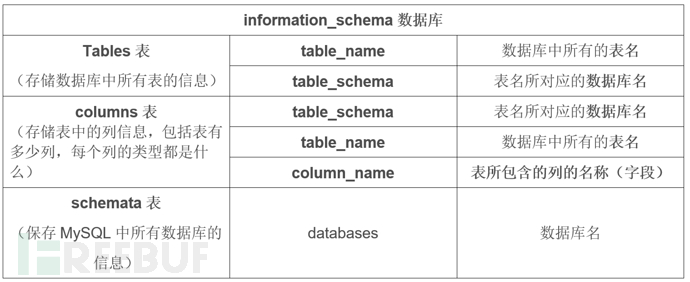

# 
SQL注入实验讲解（自建环境）

Jaren
 

 
本次实验难度：简单

## 实验描述
- 首先设计一个登录网页，将用户名和经CMD5加密后的密码储存到MySQL数据库中，但是该网页存在漏洞。从而形成了一个易于注入的环境。
- 接着利用漏洞实现无密码登录并获取所有用户的账号密码，并且解密。
- 最后利用预处理语句将漏洞修复，再次重复SQL注入操作时，无法成功注入。

## 实验代码
- 实验所需数据库——创建：[创建数据库](code/create.php)
- 实验所需数据库——销毁:[销毁数据库](code/drop.php)
- 不安全登录网页：[网页HTML文件](code/login_vul.html)、[网页PHP脚本](code/authenticate_vul.php)
- 较安全登陆网页：[网页HTML文件](code/login.html)、[网页PHP脚本](code/authenticate.php)

##  实验操作
### 一、SQL注入
#### 1、获取基本信息，寻找注点
1）首先进入登录页面随意输入用户名和密码，查看报错信息是否详细

如图所示，并未显示过多的报错信息

2）接着输入已知密码的账户，成功登录，发现登录后会显示username和realname，这两条信息有可能来自储存用户密码的数据表，后续或可利用此处的返回实现SQL注入。

3）推测登录验证脚本中使用`select`语句比对用户名和密码是否匹配，其中用户名的输入为字符型，则尝试：补全引号并注释掉后续内容:
- username输入 `liu’#`  
- password随意输入。

成功实现免密登录，也说明了推测基本正确，此处漏洞可利用。

4）接着尝试更改`select`的条件，以获取更多信息
- 输入 `liu’ OR id IS NOT NULL#`

通过登录页面需要输入的username、password和登录后返回的username、realname我们猜测`select`语句中最有可能选择了3列进行访问，因为`union` 操作符具有每个 `select`语句的列数和对应位置的数据类型必须相同的特点，所以接下来使用`union`注入时应设计`select`选择 3列。

想要获取更多的信息就要先获取数据库名等信息
- 输入` liu’union select database(),user(),database() #`

根据第二组返回的数据，我们知晓了数据库名为“vuldb”，并且使用管理员权限的数据库连接。

5）接下来就可以尝试获取数据表名。MySQL数据库中自带一个信息数据库——**information_schema**数据库，这个数据库主要是用来保存了MySQL服务器所有的数据库的信息，其中**tables**表中包含字段**table_name** 和 **table_schema**，分别记录了表名与所在库

- 利用此表便可设计语句`liu' union select table_name,table_schema，table_schema from information_schema.tables where table_schema ='vuldb'#`

通过返回数据可以知晓数据库中有两个表：users和log，根据名称，猜测users会存储敏感信息（如：密码）

6）那么我们就可以继续在users表中尝试获取表的字段名（列名）。再继续借助MySQL中的**information_schema**数据库，其中还有一个**columns**表，其包含三个字段“**table_schema**”、“**table_name**”、 “**column_name**”，分别记录了库名、表名、列名

- 所以可以构造语句：`liu' union select table_name ,column_name,table_name from information_schema.columns where table_schema ='vuldb' and table_name='users'#`

这样我们便得知users表中有字段：id、**password**、realname、username

7）根据以上所得到的数据，我们便可以直接构造SQL语句，获取所有用户的密码了
- 输入：`liu'union select username,password,username from users#`

不难发现用户密码是经过加密后储存的

8）将密码发送到**cmd5.com**平台上解密，便可得到每个用户名对应的密码（这里选择用户hong为例）

所以用户hong的密码为111111。
利用该密码，我们便可以hong的身份登录

### 二、SQL注入防御
在登录网页的php文件中，增加SQL语句预处理代码

再次尝试用上述操作注入——>失败，防御成功

---
到这里实验就结束啦~~~

---

>这算是我第一次做一个完整的实验设计吧
原本学习了SQL注入想要练习一下
在DVWA等平台上做了些练习后突然心血来潮就自己写了个简单的漏洞环境
如果有错误或者描述不清楚的地方欢迎指正，欢迎交流！

